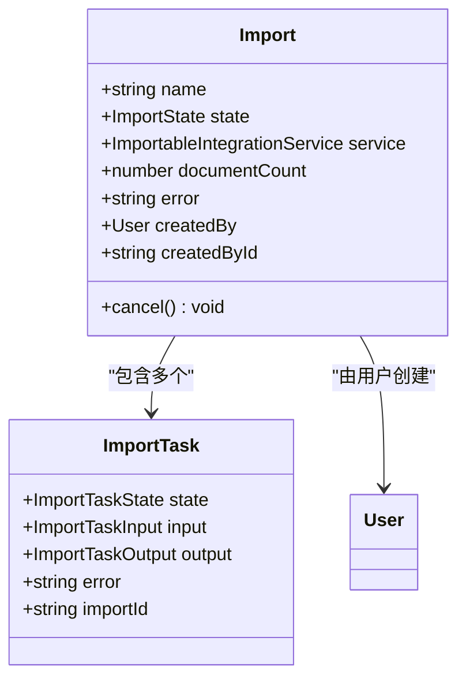
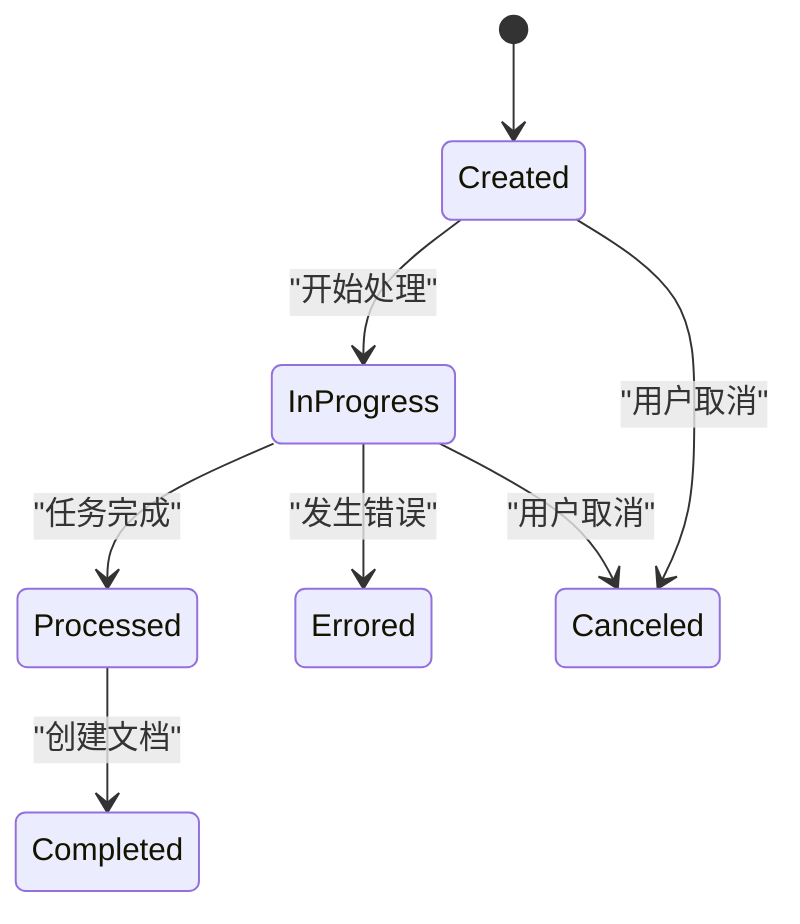
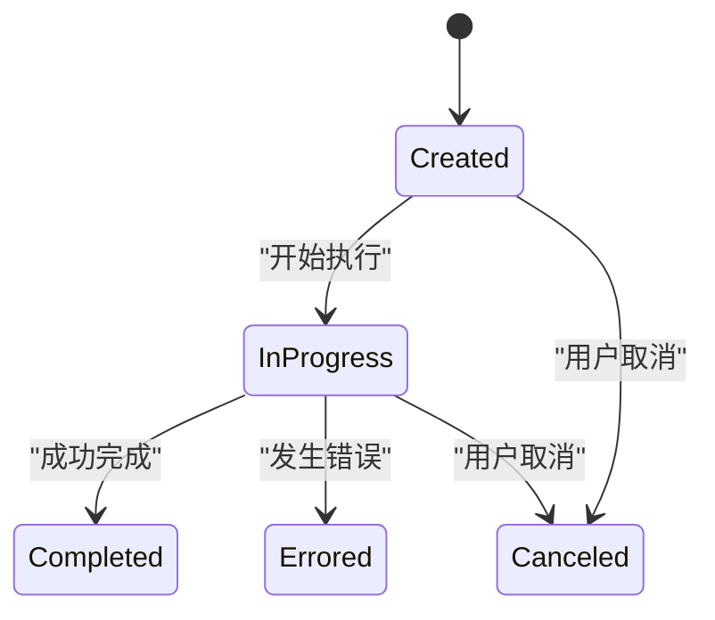
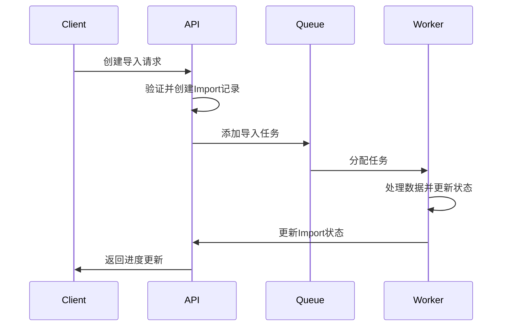
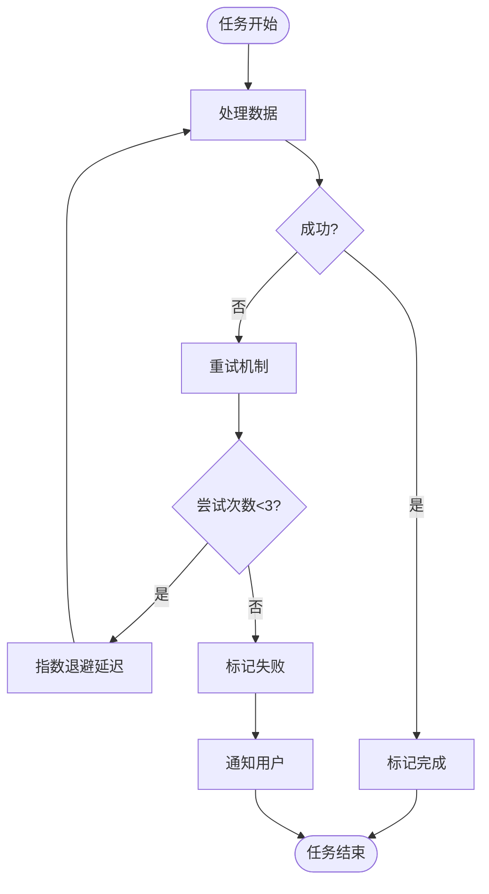
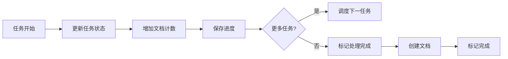
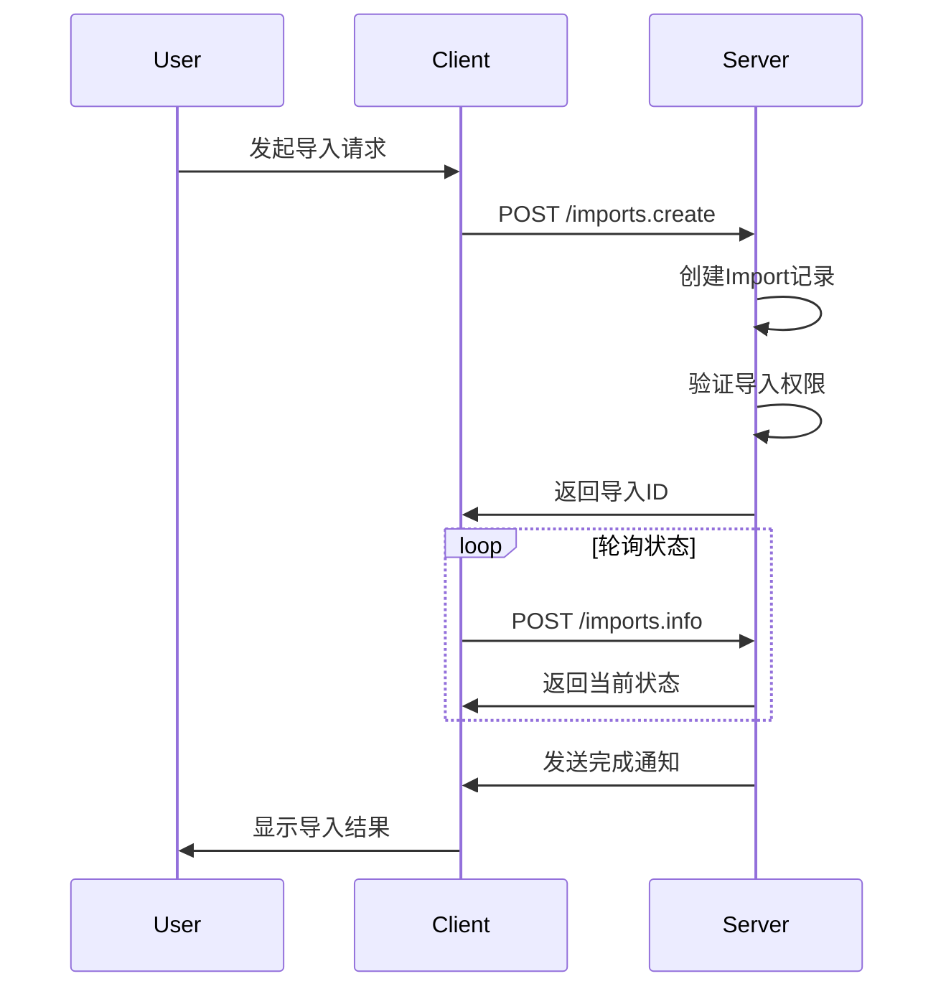
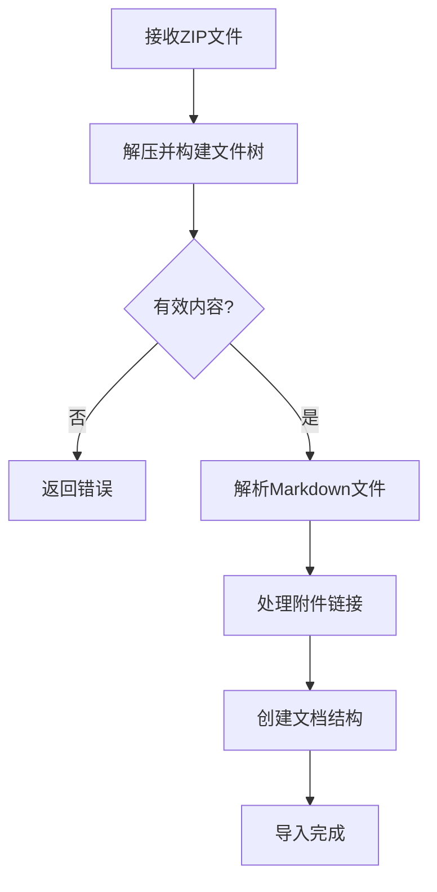

# 导入模型

<cite>
**本文档中引用的文件**  
- [Import.ts](file://app/models/Import.ts)
- [ImportTask.ts](file://server/models/ImportTask.ts)
- [ImportsProcessor.ts](file://server/queues/processors/ImportsProcessor.ts)
- [APIImportTask.ts](file://server/queues/tasks/APIImportTask.ts)
- [ImportMarkdownZipTask.ts](file://server/queues/tasks/ImportMarkdownZipTask.ts)
- [ImportJSONTask.ts](file://server/queues/tasks/ImportJSONTask.ts)
- [imports.ts](file://server/routes/api/imports/imports.ts)
- [types.ts](file://shared/types.ts)
- [schema.ts](file://shared/schema.ts)
</cite>

## 目录
1. [简介](#简介)
2. [数据模型](#数据模型)
3. [状态管理](#状态管理)
4. [任务队列机制](#任务队列机制)
5. [错误恢复策略](#错误恢复策略)
6. [进度报告与结果通知](#进度报告与结果通知)
7. [完整示例](#完整示例)
8. [结论](#结论)

## 简介
本文档详细描述了批量数据迁移的处理流程，重点介绍Import模型和ImportTask模型的设计与实现。系统支持从Notion或Markdown文件导入数据，通过任务队列机制实现异步处理，提供完整的错误恢复、进度跟踪和结果通知功能。文档涵盖数据模型定义、状态转换、任务调度和API接口使用。

**Section sources**
- [Import.ts](file://app/models/Import.ts#L9-L54)
- [ImportTask.ts](file://server/models/ImportTask.ts#L30-L58)

## 数据模型
导入系统由两个核心模型组成：Import和ImportTask。Import模型管理导入会话的全局状态，而ImportTask模型跟踪单个任务的执行进度。

### Import模型
Import模型代表一次完整的导入会话，包含以下关键属性：
- **name**: 导入名称
- **state**: 当前状态（pending、processing、complete、failed）
- **service**: 来源服务（如Notion）
- **documentCount**: 已创建文档数量
- **createdBy**: 创建用户
- **error**: 错误信息（如果存在）



**Diagram sources**
- [Import.ts](file://app/models/Import.ts#L9-L54)
- [ImportTask.ts](file://server/models/ImportTask.ts#L30-L58)

### ImportTask模型
ImportTask模型代表导入过程中的单个任务单元，包含：
- **state**: 任务状态
- **input**: 输入数据
- **output**: 输出结果
- **error**: 任务错误信息
- **importId**: 关联的导入会话ID

**Section sources**
- [ImportTask.ts](file://server/models/ImportTask.ts#L30-L58)
- [types.ts](file://shared/types.ts#L73-L79)

## 状态管理
导入系统通过明确定义的状态机来管理导入会话和任务的生命周期。

### Import状态


**Diagram sources**
- [types.ts](file://shared/types.ts#L73-L79)
- [imports.ts](file://server/routes/api/imports/imports.ts#L45-L49)

### ImportTask状态


**Diagram sources**
- [types.ts](file://shared/types.ts#L73-L79)
- [APIImportTask.ts](file://server/queues/tasks/APIImportTask.ts#L48-L57)

## 任务队列机制
系统采用基于Bull的任务队列实现异步处理，确保导入操作不会阻塞主应用。

### 任务处理流程


**Diagram sources**
- [ImportsProcessor.ts](file://server/queues/processors/ImportsProcessor.ts#L86-L89)
- [APIImportTask.ts](file://server/queues/tasks/APIImportTask.ts#L138-L186)

### 任务分片处理
为提高处理效率，系统将大型导入任务分片处理：
1. 主导入任务创建后，系统将其分解为多个子任务
2. 每个子任务处理固定数量的页面（默认3页/任务）
3. 任务完成后自动调度下一个任务
4. 所有任务完成后触发文档创建流程

**Section sources**
- [ImportsProcessor.ts](file://server/queues/processors/ImportsProcessor.ts#L129-L142)
- [APIImportTask.ts](file://server/queues/tasks/APIImportTask.ts#L195-L224)

## 错误恢复策略
系统实现了多层次的错误恢复机制，确保导入过程的可靠性和容错性。

### 错误处理流程


**Diagram sources**
- [APIImportTask.ts](file://server/queues/tasks/APIImportTask.ts#L154-L163)
- [ErrorTimedOutImportsTask.ts](file://server/queues/tasks/ErrorTimedOutImportsTask.ts#L18-L82)

### 错误类型处理
系统区分不同类型的错误并采取相应措施：
- **临时错误**: 自动重试（网络超时、服务不可用）
- **永久错误**: 终止任务并记录错误信息（数据格式错误、权限不足）
- **用户取消**: 标记为已取消状态，清理相关资源

**Section sources**
- [APIImportTask.ts](file://server/queues/tasks/APIImportTask.ts#L233-L235)
- [imports.ts](file://server/routes/api/imports/imports.ts#L142-L146)

## 进度报告与结果通知
系统提供实时的进度报告和结果通知功能，确保用户能够及时了解导入状态。

### 进度更新机制


**Diagram sources**
- [ImportsProcessor.ts](file://server/queues/processors/ImportsProcessor.ts#L121-L151)
- [APIImportTask.ts](file://server/queues/tasks/APIImportTask.ts#L196-L199)

### 结果通知
导入完成后，系统通过以下方式通知用户：
1. API返回最终结果
2. WebSocket实时推送状态更新
3. 可选的电子邮件通知
4. 应用内通知

**Section sources**
- [ImportsProcessor.ts](file://server/queues/processors/ImportsProcessor.ts#L228-L260)
- [WebsocketProvider.tsx](file://app/components/WebsocketProvider.tsx#L654-L669)

## 完整示例
以下是从Notion导入数据的完整示例，包括API调用、状态查询和错误处理。

### API调用示例


**Diagram sources**
- [imports.ts](file://server/routes/api/imports/imports.ts#L30-L39)
- [schema.ts](file://shared/schema.ts#L26-L30)

### Markdown文件导入
对于Markdown文件导入，系统使用专门的处理流程：



**Diagram sources**
- [ImportMarkdownZipTask.ts](file://server/queues/tasks/ImportMarkdownZipTask.ts#L14-L209)
- [ImportHelper.ts](file://server/utils/ImportHelper.ts#L15-L67)

### 错误处理代码
```typescript
try {
  const response = await client.post('/imports.create', {
    integrationId: 'notion-123',
    service: 'notion',
    input: [{ externalId: 'page-1', permission: 'read_write' }]
  });
  
  const importId = response.data.id;
  
  // 轮询状态
  while (true) {
    const status = await client.post('/imports.info', { id: importId });
    if (status.data.state === 'completed') {
      console.log('导入成功');
      break;
    } else if (status.data.state === 'errored') {
      throw new Error(status.data.error);
    }
    await new Promise(resolve => setTimeout(resolve, 1000));
  }
} catch (error) {
  console.error('导入失败:', error.message);
}
```

**Section sources**
- [imports.ts](file://server/routes/api/imports/imports.ts#L77-L109)
- [ImportJSONTask.ts](file://server/queues/tasks/ImportJSONTask.ts#L19-L231)

## 结论
本文档详细介绍了导入系统的数据模型和处理流程。Import模型通过状态机管理导入会话的生命周期，ImportTask模型跟踪单个任务的执行进度。系统采用任务队列机制实现异步处理，具备完善的错误恢复策略和进度报告功能。通过合理的分片处理和重试机制，系统能够可靠地处理大规模数据迁移任务，为用户提供流畅的导入体验。