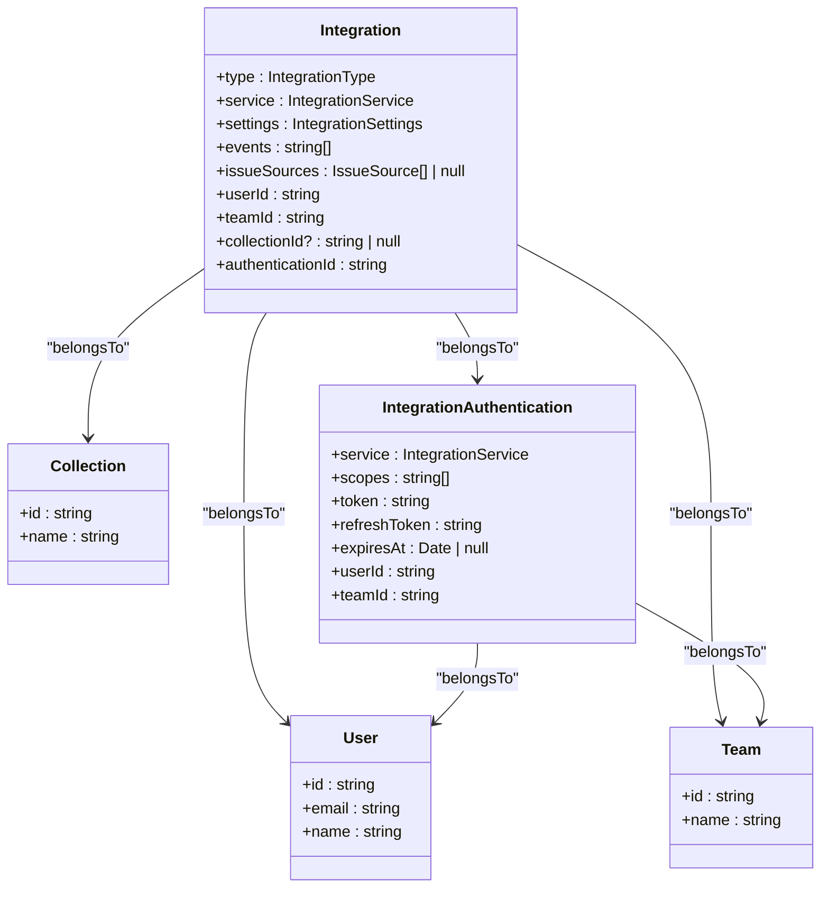
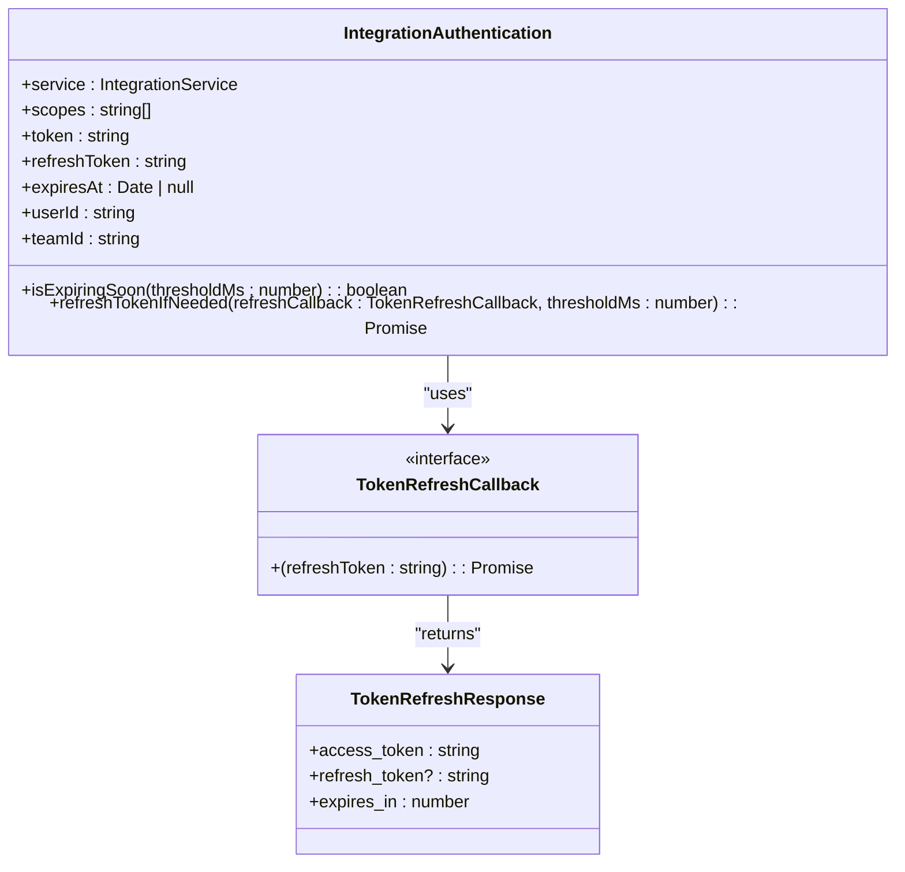
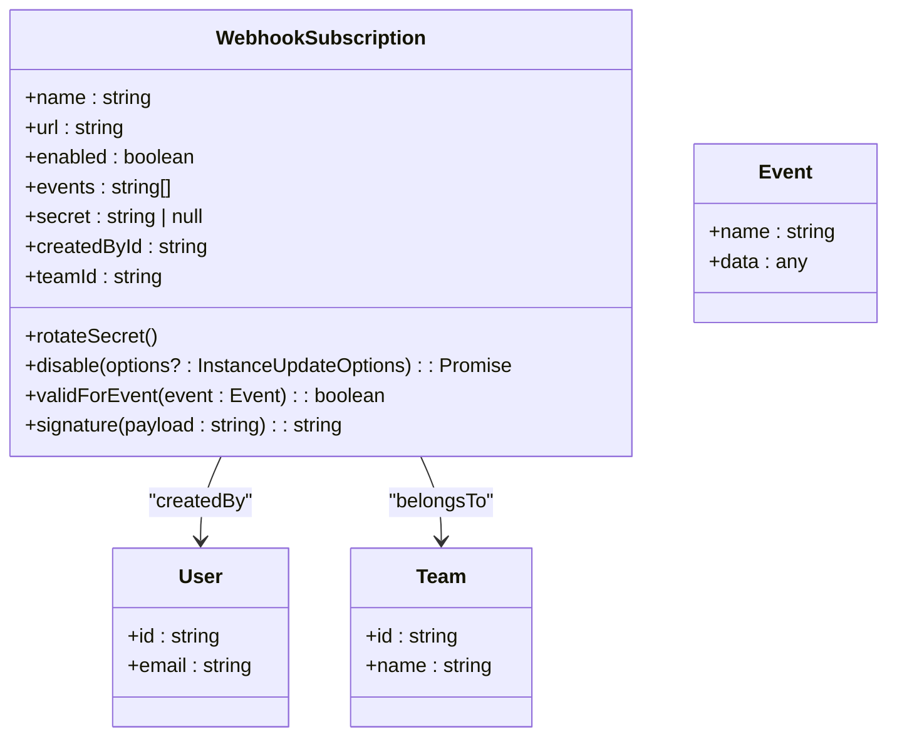
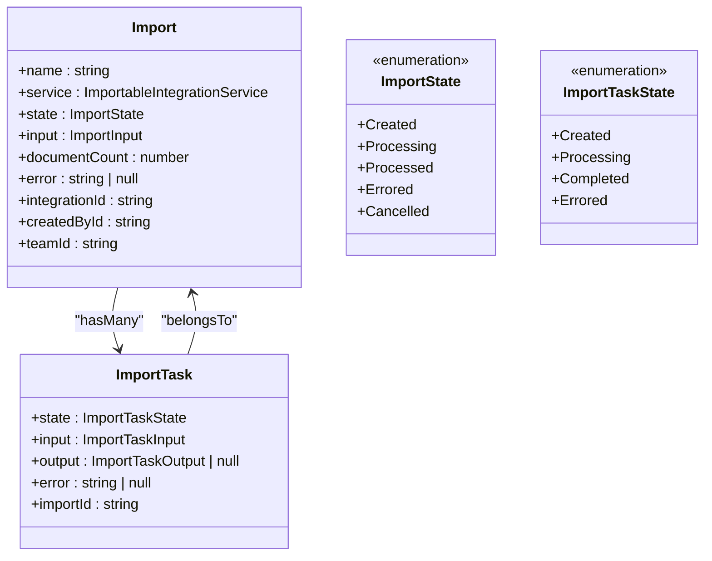
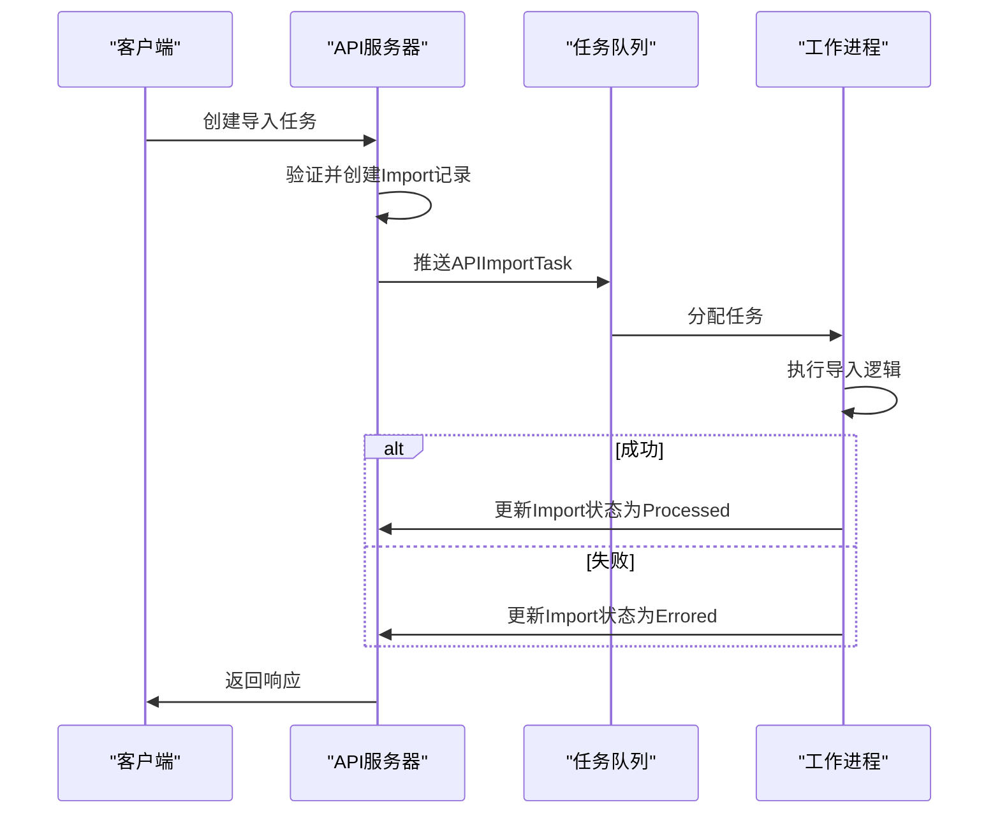
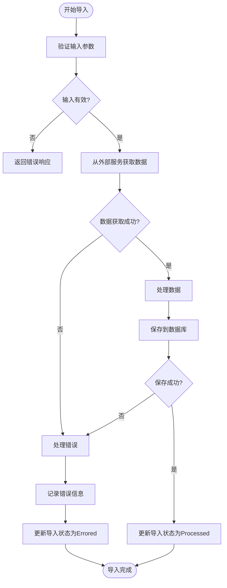

# 集成与扩展模型

<cite>
**本文档引用的文件**
- [Integration.ts](file://server/models/Integration.ts)
- [IntegrationAuthentication.ts](file://server/models/IntegrationAuthentication.ts)
- [WebhookSubscription.ts](file://server/models/WebhookSubscription.ts)
- [Import.ts](file://server/models/Import.ts)
- [ImportTask.ts](file://server/models/ImportTask.ts)
- [APIImportTask.ts](file://server/queues/tasks/APIImportTask.ts)
- [IntegrationCreatedProcessor.ts](file://server/queues/processors/IntegrationCreatedProcessor.ts)
- [IntegrationDeletedProcessor.ts](file://server/queues/processors/IntegrationDeletedProcessor.ts)
</cite>

## 目录
1. [简介](#简介)
2. [集成模型](#集成模型)
3. [认证配置](#认证配置)
4. [Webhook订阅](#webhook订阅)
5. [导入任务](#导入任务)
6. [任务队列与状态管理](#任务队列与状态管理)
7. [错误处理机制](#错误处理机制)
8. [代码示例](#代码示例)

## 简介
本文档详细介绍了系统中用于实现第三方服务集成与数据同步的核心数据模型。重点涵盖集成（Integration）、认证配置（IntegrationAuthentication）、Webhook订阅（WebhookSubscription）以及导入任务（Import、ImportTask）的设计与实现。通过这些模型，系统能够与外部服务如Slack、GitHub等建立连接，实现数据的双向同步与自动化工作流。

**Section sources**
- [Integration.ts](file://server/models/Integration.ts#L25-L105)
- [IntegrationAuthentication.ts](file://server/models/IntegrationAuthentication.ts#L32-L161)
- [WebhookSubscription.ts](file://server/models/WebhookSubscription.ts#L30-L164)
- [Import.ts](file://server/models/Import.ts#L23-L87)
- [ImportTask.ts](file://server/models/ImportTask.ts#L30-L58)

## 集成模型
集成模型（Integration）是系统与外部服务连接的核心实体。它定义了集成的类型、服务、事件监听以及与用户、团队和集合的关联关系。



**Diagram sources**
- [Integration.ts](file://server/models/Integration.ts#L25-L105)
- [IntegrationAuthentication.ts](file://server/models/IntegrationAuthentication.ts#L32-L161)

**Section sources**
- [Integration.ts](file://server/models/Integration.ts#L25-L105)
- [IntegrationAuthentication.ts](file://server/models/IntegrationAuthentication.ts#L32-L161)

## 认证配置
认证配置模型（IntegrationAuthentication）负责管理与外部服务的OAuth认证信息，包括访问令牌、刷新令牌和过期时间。它实现了自动刷新令牌的机制，确保集成的长期有效性。



**Diagram sources**
- [IntegrationAuthentication.ts](file://server/models/IntegrationAuthentication.ts#L32-L161)

**Section sources**
- [IntegrationAuthentication.ts](file://server/models/IntegrationAuthentication.ts#L32-L161)

## Webhook订阅
Webhook订阅模型（WebhookSubscription）允许外部服务在特定事件发生时向系统发送通知。它支持事件过滤、签名验证和订阅限制。



**Diagram sources**
- [WebhookSubscription.ts](file://server/models/WebhookSubscription.ts#L30-L164)

**Section sources**
- [WebhookSubscription.ts](file://server/models/WebhookSubscription.ts#L30-L164)

## 导入任务
导入任务模型（Import和ImportTask）用于管理从外部服务导入数据的异步任务。它支持分页处理、状态跟踪和错误恢复。



**Diagram sources**
- [Import.ts](file://server/models/Import.ts#L23-L87)
- [ImportTask.ts](file://server/models/ImportTask.ts#L30-L58)

**Section sources**
- [Import.ts](file://server/models/Import.ts#L23-L87)
- [ImportTask.ts](file://server/models/ImportTask.ts#L30-L58)

## 任务队列与状态管理
系统使用任务队列（如Bull）来管理异步任务的执行。导入任务通过APIImportTask等处理器进行调度和执行，确保任务的可靠性和可扩展性。



**Diagram sources**
- [APIImportTask.ts](file://server/queues/tasks/APIImportTask.ts#L38-L408)
- [Import.ts](file://server/models/Import.ts#L23-L87)

**Section sources**
- [APIImportTask.ts](file://server/queues/tasks/APIImportTask.ts#L38-L408)
- [Import.ts](file://server/models/Import.ts#L23-L87)

## 错误处理机制
系统实现了全面的错误处理机制，包括任务重试、错误记录和用户通知。当任务失败时，系统会捕获错误信息并更新任务状态，同时提供取消任务的功能。



**Diagram sources**
- [APIImportTask.ts](file://server/queues/tasks/APIImportTask.ts#L38-L408)
- [Import.ts](file://server/models/Import.ts#L23-L87)

**Section sources**
- [APIImportTask.ts](file://server/queues/tasks/APIImportTask.ts#L38-L408)
- [Import.ts](file://server/models/Import.ts#L23-L87)

## 代码示例
以下代码示例展示了如何配置OAuth集成、设置Webhook和执行数据导入。

### 配置OAuth集成
```typescript
// 创建集成记录
const integration = await Integration.create({
  type: IntegrationType.OAuth,
  service: IntegrationService.Slack,
  userId: currentUser.id,
  teamId: currentTeam.id,
  settings: {
    // OAuth配置
  },
  events: ['*']
});

// 获取认证URL
const authUrl = await getOAuthUrl(integration.service);
```

### 设置Webhook
```typescript
// 创建Webhook订阅
const webhook = await WebhookSubscription.create({
  name: 'Slack通知',
  url: 'https://hooks.slack.com/services/xxx',
  enabled: true,
  events: ['document.create', 'document.update'],
  teamId: currentTeam.id,
  createdById: currentUser.id
});

// 旋转密钥
webhook.rotateSecret();
await webhook.save();
```

### 执行数据导入
```typescript
// 创建导入任务
const importTask = await Import.create({
  name: '从Notion导入',
  service: ImportableIntegrationService.Notion,
  state: ImportState.Created,
  input: {
    // 导入配置
  },
  teamId: currentTeam.id,
  createdById: currentUser.id
});

// 调度导入任务
await new APIImportTask().schedule({
  importTaskId: importTask.id
});
```

**Section sources**
- [Integration.ts](file://server/models/Integration.ts#L25-L105)
- [WebhookSubscription.ts](file://server/models/WebhookSubscription.ts#L30-L164)
- [Import.ts](file://server/models/Import.ts#L23-L87)
- [APIImportTask.ts](file://server/queues/tasks/APIImportTask.ts#L38-L408)