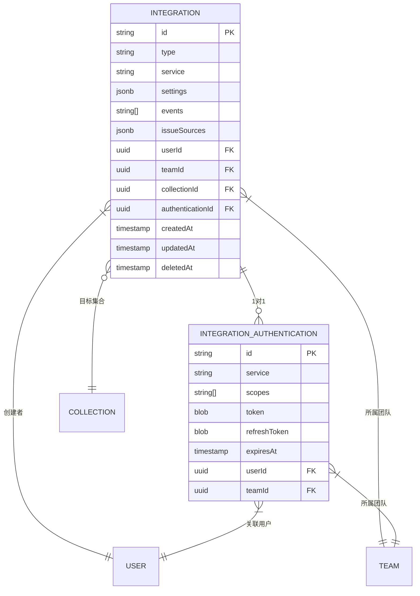
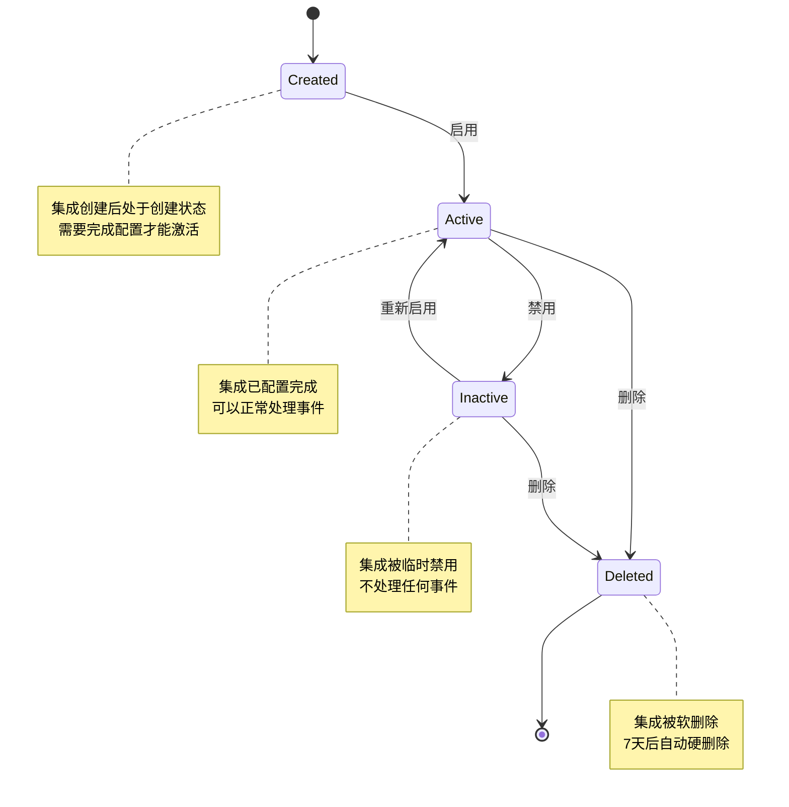
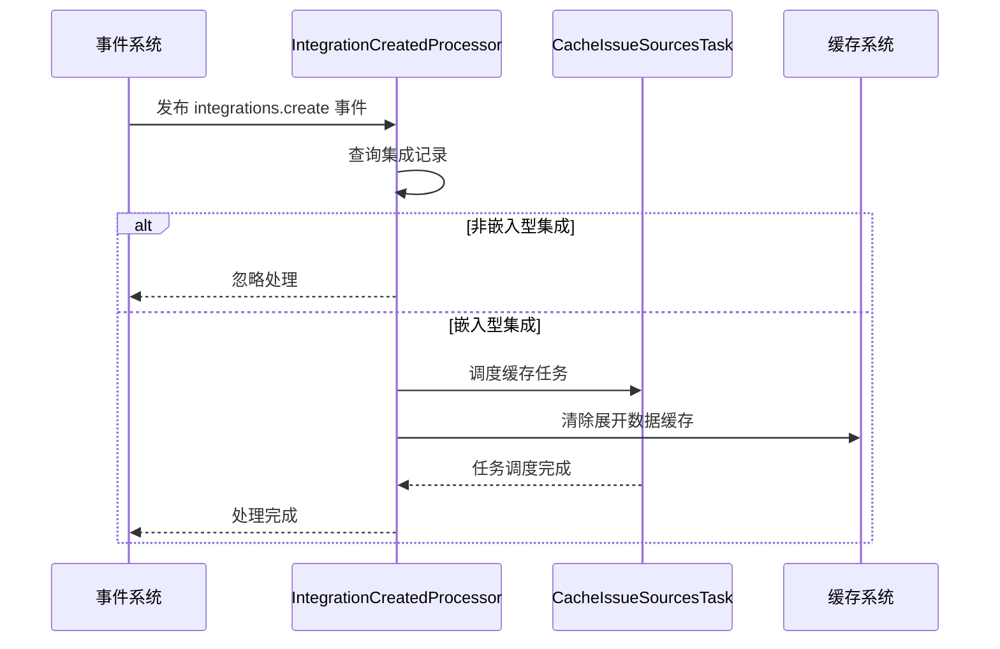
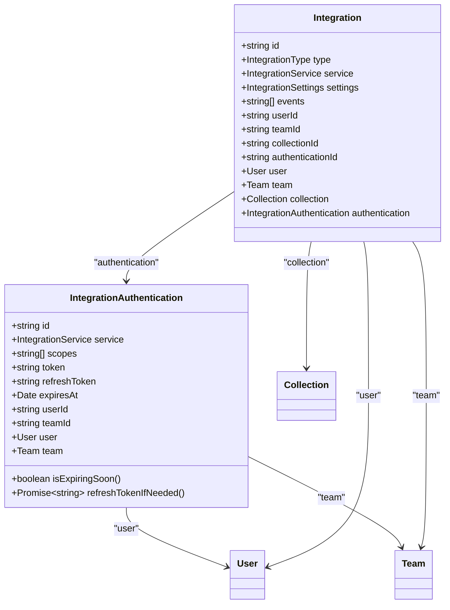
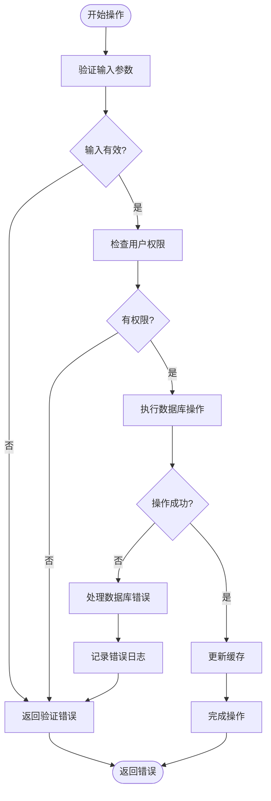

# 集成模型

<cite>
**本文档引用的文件**   
- [Integration.ts](file://app/models/Integration.ts)
- [Integration.ts](file://server/models/Integration.ts)
- [IntegrationAuthentication.ts](file://server/models/IntegrationAuthentication.ts)
- [types.ts](file://shared/types.ts)
- [IntegrationCreatedProcessor.ts](file://server/queues/processors/IntegrationCreatedProcessor.ts)
- [IntegrationDeletedProcessor.ts](file://server/queues/processors/IntegrationDeletedProcessor.ts)
</cite>

## 目录
1. [简介](#简介)
2. [实体关系图](#实体关系图)
3. [字段定义](#字段定义)
4. [索引与约束](#索引与约束)
5. [生命周期管理](#生命周期管理)
6. [认证配置关系](#认证配置关系)
7. [代码示例](#代码示例)
8. [错误处理与安全验证](#错误处理与安全验证)
9. [总结](#总结)

## 简介
集成（Integration）模型是系统中用于管理与外部服务（如Slack、GitHub、Notion）连接的核心数据结构。该模型允许用户配置和管理与第三方服务的集成，实现数据同步、通知推送、内容嵌入等功能。集成模型通过统一的架构支持多种集成类型，包括发布（Post）、命令（Command）、嵌入（Embed）、分析（Analytics）等，并为每种服务提供特定的配置选项。

**Section sources**
- [Integration.ts](file://app/models/Integration.ts#L11-L31)
- [types.ts](file://shared/types.ts#L106-L131)

## 实体关系图


**Diagram sources**
- [Integration.ts](file://server/models/Integration.ts#L25-L105)
- [IntegrationAuthentication.ts](file://server/models/IntegrationAuthentication.ts#L32-L161)

## 字段定义
集成模型包含以下核心字段，用于定义集成的类型、服务、配置和状态。

### 基础字段
| 字段名 | 数据类型 | 必填 | 说明 |
|-------|--------|-----|------|
| **id** | UUID | 是 | 集成的唯一标识符 |
| **type** | 枚举 | 是 | 集成类型：Post、Command、Embed、Analytics、LinkedAccount、Import |
| **service** | 枚举 | 是 | 集成服务：Slack、GitHub、Notion、Linear、GoogleAnalytics等 |
| **createdAt** | 时间戳 | 是 | 创建时间 |
| **updatedAt** | 时间戳 | 是 | 更新时间 |
| **deletedAt** | 时间戳 | 否 | 软删除时间 |

### 配置字段
| 字段名 | 数据类型 | 必填 | 说明 |
|-------|--------|-----|------|
| **settings** | JSONB | 是 | 服务特定的配置参数，结构根据集成类型和服务动态变化 |
| **events** | 字符串数组 | 是 | 订阅的事件列表，用于触发集成操作 |
| **issueSources** | JSONB | 否 | 问题源配置，用于嵌入型集成（如GitHub、Linear） |

### 关联字段
| 字段名 | 数据类型 | 必填 | 说明 |
|-------|--------|-----|------|
| **userId** | UUID | 是 | 创建集成的用户ID，外键关联User表 |
| **teamId** | UUID | 是 | 所属团队ID，外键关联Team表 |
| **collectionId** | UUID | 否 | 目标集合ID，外键关联Collection表 |
| **authenticationId** | UUID | 是 | 认证记录ID，外键关联IntegrationAuthentication表 |

### settings字段结构
根据集成类型和服务的不同，settings字段的结构动态变化：

- **Embed类型**：
  - GitHub：包含安装ID、账户信息
  - Linear：包含工作区信息
- **Analytics类型**：
  - Google Analytics：包含measurementId
  - Matomo：包含instanceUrl
  - Umami：包含measurementId
- **Post类型**：
  - Slack：包含webhook URL、频道信息
- **Import类型**：
  - Notion：包含外部工作区信息

**Section sources**
- [Integration.ts](file://server/models/Integration.ts#L25-L105)
- [types.ts](file://shared/types.ts#L186-L227)

## 索引与约束
集成模型通过数据库索引和约束确保数据的完整性和查询性能。

### 索引
| 索引名 | 字段 | 类型 | 说明 |
|-------|------|------|------|
| idx_integrations_team_id | teamId | B树 | 按团队ID快速查询集成 |
| idx_integrations_user_id | userId | B树 | 按用户ID快速查询集成 |
| idx_integrations_service | service | B树 | 按服务类型快速查询集成 |
| idx_integrations_type | type | B树 | 按集成类型快速查询 |
| idx_integrations_deleted_at | deletedAt | B树 | 支持软删除查询 |

### 约束
| 约束类型 | 字段 | 规则 | 说明 |
|--------|------|------|------|
| 主键约束 | id | 唯一 | 确保集成ID的唯一性 |
| 外键约束 | userId | 引用User(id) | 确保用户存在 |
| 外键约束 | teamId | 引用Team(id) | 确保团队存在 |
| 外键约束 | collectionId | 引用Collection(id) | 确保集合存在 |
| 外键约束 | authenticationId | 引用IntegrationAuthentication(id) | 确保认证记录存在 |
| 非空约束 | type, service | NOT NULL | 确保核心字段不为空 |
| 枚举约束 | type, service | IN (枚举值) | 限制字段值范围 |

**Section sources**
- [Integration.ts](file://server/models/Integration.ts#L25-L105)

## 生命周期管理
集成模型的生命周期通过事件处理器和钩子函数进行管理，确保在创建、更新和删除时执行相应的业务逻辑。

### 状态转换机制


**Diagram sources**
- [Integration.ts](file://server/models/Integration.ts#L25-L105)

### 事件处理器
系统通过队列处理器监听集成事件，执行相应的业务逻辑：

- **IntegrationCreatedProcessor**：
  - 监听`integrations.create`事件
  - 对于嵌入型集成，调度`CacheIssueSourcesTask`任务
  - 清除团队的展开数据缓存

- **IntegrationDeletedProcessor**：
  - 监听`integrations.delete`事件
  - 执行插件卸载钩子
  - 清除团队的展开数据缓存
  - 强制删除集成记录



**Diagram sources**
- [IntegrationCreatedProcessor.ts](file://server/queues/processors/IntegrationCreatedProcessor.ts#L7-L29)
- [IntegrationDeletedProcessor.ts](file://server/queues/processors/IntegrationDeletedProcessor.ts#L7-L33)

**Section sources**
- [IntegrationCreatedProcessor.ts](file://server/queues/processors/IntegrationCreatedProcessor.ts#L7-L29)
- [IntegrationDeletedProcessor.ts](file://server/queues/processors/IntegrationDeletedProcessor.ts#L7-L33)

## 认证配置关系
集成模型与认证配置模型（IntegrationAuthentication）通过一对一关系关联，实现安全的认证信息管理。

### 关系结构


**Diagram sources**
- [Integration.ts](file://server/models/Integration.ts#L25-L105)
- [IntegrationAuthentication.ts](file://server/models/IntegrationAuthentication.ts#L32-L161)

### 认证刷新机制
认证配置模型提供了自动令牌刷新功能，确保集成的持续可用性：

1. **过期检查**：`isExpiringSoon()`方法检查访问令牌是否即将过期（默认5分钟内）
2. **刷新流程**：`refreshTokenIfNeeded()`方法在令牌即将过期时自动刷新
3. **并发控制**：使用数据库行级锁防止多个进程同时刷新
4. **错误处理**：刷新失败时继续使用现有令牌，不影响集成功能

**Section sources**
- [IntegrationAuthentication.ts](file://server/models/IntegrationAuthentication.ts#L32-L161)

## 代码示例
以下是创建、更新和删除集成的代码示例。

### 创建集成
```typescript
// 创建Slack通知集成
const integration = await Integration.create({
  type: IntegrationType.Post,
  service: IntegrationService.Slack,
  settings: {
    url: "https://hooks.slack.com/services/xxx",
    channel: "#general",
    channelId: "C012AB3CD"
  },
  events: ["documents.create", "documents.update"],
  userId: currentUser.id,
  teamId: currentTeam.id,
  collectionId: targetCollection.id
});
```

### 更新集成
```typescript
// 更新GitHub嵌入集成配置
await integration.update({
  settings: {
    ...integration.settings,
    github: {
      installation: {
        id: 12345,
        account: {
          id: 67890,
          name: "my-org",
          avatarUrl: "https://avatars.githubusercontent.com/u/67890"
        }
      }
    }
  },
  events: ["documents.create", "documents.update", "comments.create"]
});
```

### 删除集成
```typescript
// 删除集成（软删除）
await integration.destroy();

// 强制删除（硬删除）
await integration.destroy({ force: true });
```

**Section sources**
- [Integration.ts](file://server/models/Integration.ts#L25-L105)

## 错误处理与安全验证
系统通过多层次的验证和错误处理机制确保集成的安全性和稳定性。

### 安全验证策略
1. **输入验证**：
   - 使用`@IsIn`装饰器验证枚举值
   - 使用`@Length`、`@IsUrl`等装饰器验证字段格式
   - JSONB字段的结构验证在应用层进行

2. **认证安全**：
   - 访问令牌和刷新令牌使用`@Encrypted`装饰器加密存储
   - 令牌刷新使用数据库事务和行级锁防止并发问题
   - 提供5分钟的过期缓冲期，避免服务中断

3. **权限控制**：
   - 集成操作需要相应的团队权限
   - 用户只能管理自己创建的集成
   - 敏感操作（如删除）需要二次确认

### 错误处理机制


**Diagram sources**
- [Integration.ts](file://server/models/Integration.ts#L25-L105)
- [IntegrationAuthentication.ts](file://server/models/IntegrationAuthentication.ts#L32-L161)

**Section sources**
- [Integration.ts](file://server/models/Integration.ts#L25-L105)
- [IntegrationAuthentication.ts](file://server/models/IntegrationAuthentication.ts#L32-L161)

## 总结
集成模型是系统与外部服务交互的核心组件，通过灵活的数据结构和严谨的安全机制，支持多种集成类型和服务。模型设计考虑了可扩展性、安全性和易用性，为用户提供了一致的集成管理体验。通过事件驱动的架构和缓存优化，确保了系统的高性能和可靠性。

**Section sources**
- [Integration.ts](file://server/models/Integration.ts#L25-L105)
- [IntegrationAuthentication.ts](file://server/models/IntegrationAuthentication.ts#L32-L161)