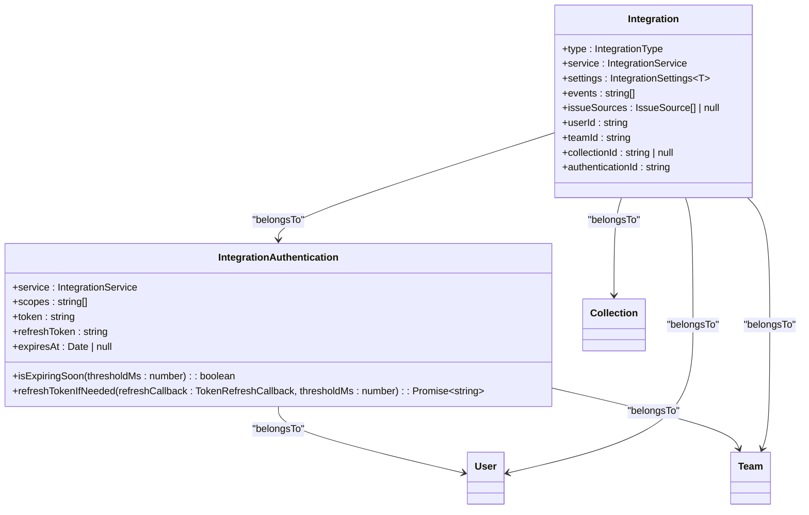
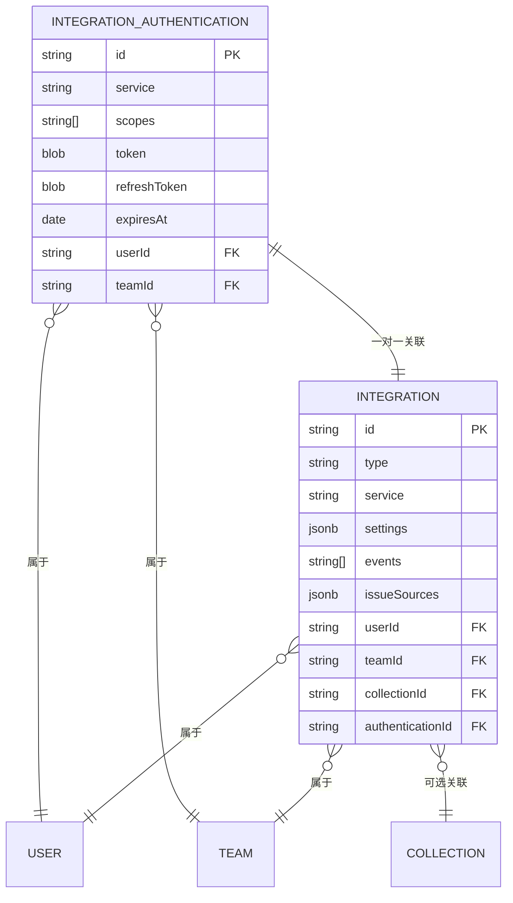
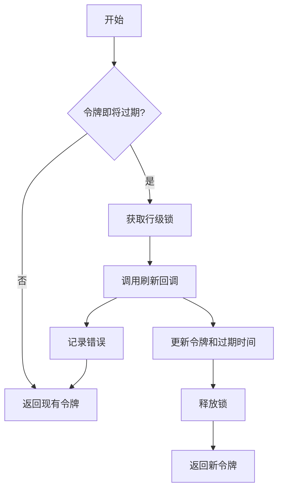
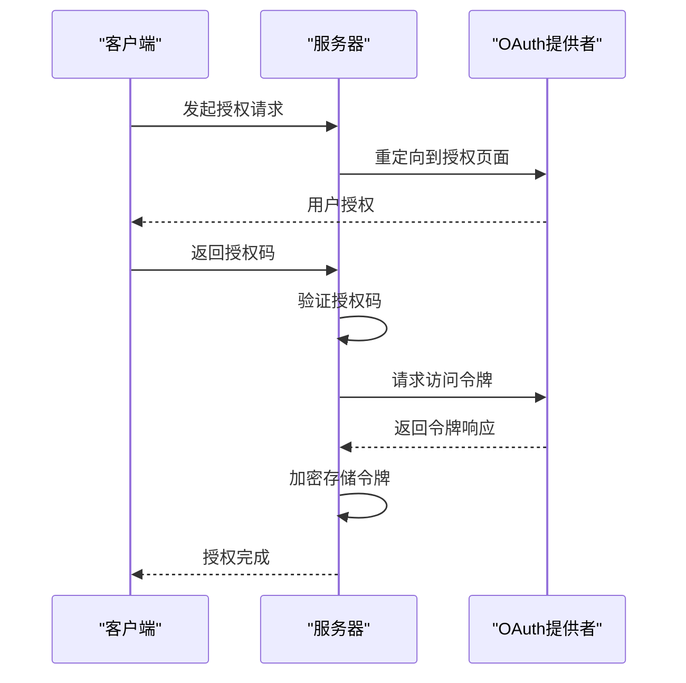
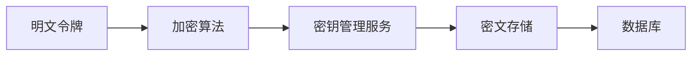

# 集成认证模型

<cite>
**本文档引用的文件**  
- [IntegrationAuthentication.ts](file://server/models/IntegrationAuthentication.ts)
- [Integration.ts](file://server/models/Integration.ts)
- [oauth.ts](file://server/utils/oauth.ts)
</cite>

## 目录
1. [简介](#简介)
2. [数据模型定义](#数据模型定义)
3. [字段说明](#字段说明)
4. [与Integration模型的关联关系](#与integration模型的关联关系)
5. [令牌刷新策略](#令牌刷新策略)
6. [过期处理机制](#过期处理机制)
7. [认证流程序列图](#认证流程序列图)
8. [安全最佳实践](#安全最佳实践)
9. [数据加密方案](#数据加密方案)

## 简介
集成认证模型（IntegrationAuthentication）用于安全地存储和管理外部服务的OAuth认证凭证。该模型支持多种集成服务，通过加密方式保存访问令牌、刷新令牌及其他认证信息，确保敏感数据的安全性。模型还实现了自动令牌刷新机制，以维持与外部服务的持续连接。

## 数据模型定义

**图表来源**  
- [IntegrationAuthentication.ts](file://server/models/IntegrationAuthentication.ts#L32-L161)
- [Integration.ts](file://server/models/Integration.ts#L25-L105)

**节来源**  
- [IntegrationAuthentication.ts](file://server/models/IntegrationAuthentication.ts#L32-L161)
- [Integration.ts](file://server/models/Integration.ts#L25-L105)

## 字段说明

| 字段名 | 类型 | 描述 |
|-------|------|------|
| service | IntegrationService | 集成服务的标识符，如GitHub、Slack等 |
| scopes | string[] | OAuth授权范围列表 |
| token | string | 加密存储的访问令牌 |
| refreshToken | string | 加密存储的刷新令牌 |
| expiresAt | Date \| null | 访问令牌的过期时间 |

**节来源**  
- [IntegrationAuthentication.ts](file://server/models/IntegrationAuthentication.ts#L32-L161)

## 与Integration模型的关联关系
`IntegrationAuthentication` 模型与 `Integration` 模型之间存在一对一的关联关系。每个集成配置都关联一个认证记录，通过 `authenticationId` 外键进行连接。当集成被删除时，相关的认证记录也会被级联删除。

**图表来源**  
- [IntegrationAuthentication.ts](file://server/models/IntegrationAuthentication.ts#L32-L161)
- [Integration.ts](file://server/models/Integration.ts#L25-L105)

**节来源**  
- [Integration.ts](file://server/models/Integration.ts#L25-L105)

## 令牌刷新策略
系统在访问令牌即将过期时自动触发刷新流程。通过 `refreshTokenIfNeeded` 方法实现，该方法接受一个提供者特定的刷新回调函数，并在令牌过期前5分钟内尝试刷新。

**图表来源**  
- [IntegrationAuthentication.ts](file://server/models/IntegrationAuthentication.ts#L102-L161)

**节来源**  
- [IntegrationAuthentication.ts](file://server/models/IntegrationAuthentication.ts#L102-L161)

## 过期处理机制
`isExpiringSoon` 方法用于判断访问令牌是否将在指定阈值内过期（默认为5分钟）。该方法检查 `expiresAt` 字段，并与当前时间加上阈值进行比较，返回布尔值结果。

**节来源**  
- [IntegrationAuthentication.ts](file://server/models/IntegrationAuthentication.ts#L85-L100)

## 认证流程序列图

**图表来源**  
- [IntegrationAuthentication.ts](file://server/models/IntegrationAuthentication.ts#L32-L161)
- [oauth.ts](file://server/utils/oauth.ts#L0-L95)

## 安全最佳实践
- 使用行级锁定防止并发刷新冲突
- 通过事务确保数据一致性
- 记录刷新操作日志以便审计
- 在刷新失败时继续使用现有令牌以保证服务可用性
- 定期监控令牌状态和刷新成功率

**节来源**  
- [IntegrationAuthentication.ts](file://server/models/IntegrationAuthentication.ts#L102-L161)

## 数据加密方案
认证数据中的 `token` 和 `refreshToken` 字段使用 `@Encrypted` 装饰器进行加密存储。该装饰器确保敏感信息在数据库中以密文形式存在，即使数据库被非法访问也无法直接读取令牌内容。加密密钥由系统安全管理，遵循最小权限原则。

**图表来源**  
- [IntegrationAuthentication.ts](file://server/models/IntegrationAuthentication.ts#L32-L161)

**节来源**  
- [IntegrationAuthentication.ts](file://server/models/IntegrationAuthentication.ts#L32-L161)