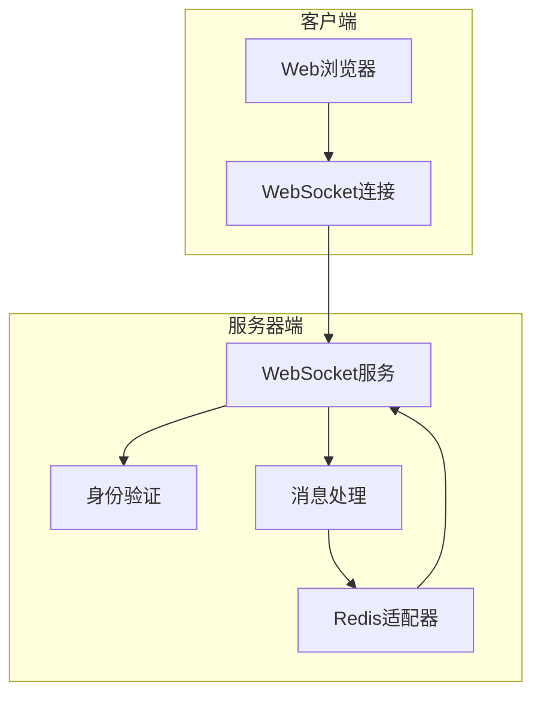
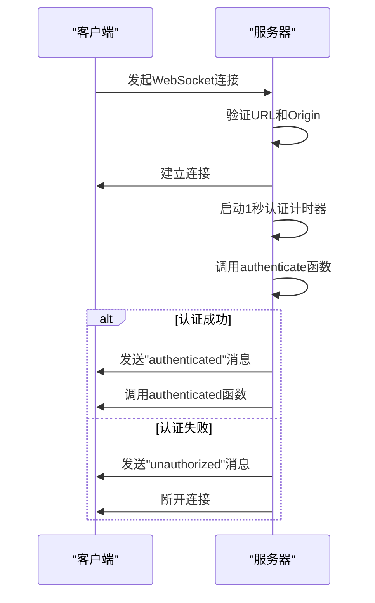
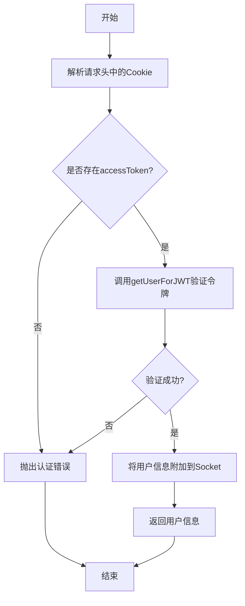
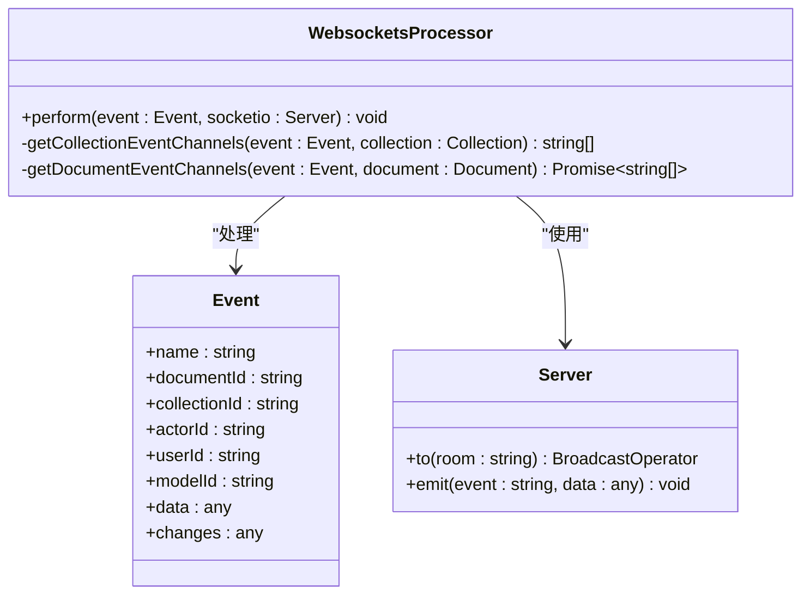
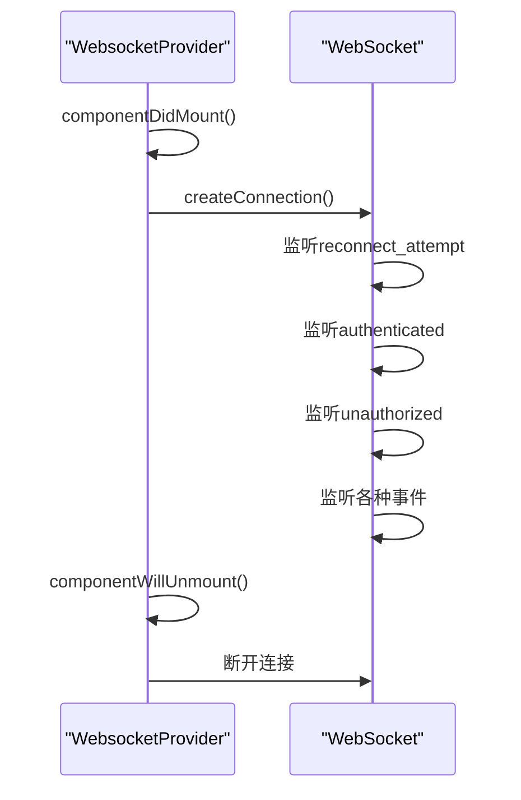
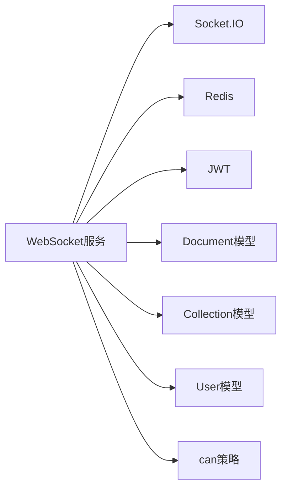

# WebSocket服务

<cite>
**Referenced Files in This Document**   
- [websockets.ts](file://server/services/websockets.ts)
- [WebsocketsProcessor.ts](file://server/queues/processors/WebsocketsProcessor.ts)
- [WebsocketProvider.tsx](file://app/components/WebsocketProvider.tsx)
</cite>

## 目录
1. [引言](#引言)
2. [项目结构](#项目结构)
3. [核心组件](#核心组件)
4. [架构概述](#架构概述)
5. [详细组件分析](#详细组件分析)
6. [依赖分析](#依赖分析)
7. [性能考虑](#性能考虑)
8. [故障排除指南](#故障排除指南)
9. [结论](#结论)

## 引言
baozi项目的WebSocket服务为实时通信功能提供了核心支持，实现了客户端与服务器之间的双向实时数据传输。该服务不仅处理基本的连接管理，还与协作服务等后端服务深度集成，确保了实时协作功能的稳定运行。通过身份验证中间件，服务确保了连接的安全性，同时利用消息队列（如WebsocketsProcessor）实现跨服务通信，提高了系统的可扩展性和可靠性。

## 项目结构
baozi项目的WebSocket服务主要分布在服务器端和客户端两个部分。服务器端的WebSocket服务实现在`server/services/websockets.ts`文件中，负责处理WebSocket连接的建立、认证和管理。消息处理逻辑则由`server/queues/processors/WebsocketsProcessor.ts`文件中的WebsocketsProcessor类负责，该类处理来自事件队列的各种事件，并将它们广播给相应的客户端。客户端的WebSocket连接管理则在`app/components/WebsocketProvider.tsx`文件中实现，该组件负责创建和维护与服务器的WebSocket连接，并处理接收到的实时消息。

**Section sources**
- [websockets.ts](file://server/services/websockets.ts#L1-L245)
- [WebsocketsProcessor.ts](file://server/queues/processors/WebsocketsProcessor.ts#L1-L945)
- [WebsocketProvider.tsx](file://app/components/WebsocketProvider.tsx#L1-L731)

## 核心组件
WebSocket服务的核心组件包括连接管理、身份验证、消息处理和客户端集成。连接管理负责处理WebSocket连接的建立和断开，确保连接的稳定性和可靠性。身份验证组件通过检查访问令牌来验证客户端的身份，确保只有授权用户才能建立连接。消息处理组件负责处理来自事件队列的各种事件，并将它们广播给相应的客户端。客户端集成组件则负责在前端应用中创建和维护WebSocket连接，并处理接收到的实时消息。

**Section sources**
- [websockets.ts](file://server/services/websockets.ts#L1-L245)
- [WebsocketsProcessor.ts](file://server/queues/processors/WebsocketsProcessor.ts#L1-L945)
- [WebsocketProvider.tsx](file://app/components/WebsocketProvider.tsx#L1-L731)

## 架构概述
WebSocket服务的架构设计旨在实现高效、可靠的实时通信。服务通过Socket.IO库建立WebSocket连接，并使用Redis作为适配器来支持集群环境下的消息广播。连接建立后，客户端会发送包含访问令牌的Cookie，服务器端通过`authenticate`函数验证令牌的有效性，并将用户信息附加到Socket对象上。一旦认证成功，客户端可以加入特定的房间（如团队、用户、集合等），以便接收相关的实时消息。消息处理由WebsocketsProcessor类负责，该类监听事件队列，并根据事件类型将消息广播给相应的房间。

**Diagram sources **
- [websockets.ts](file://server/services/websockets.ts#L1-L245)
- [WebsocketsProcessor.ts](file://server/queues/processors/WebsocketsProcessor.ts#L1-L945)

## 详细组件分析

### WebSocket连接管理
WebSocket连接管理是服务的核心功能之一，负责处理连接的建立、认证和断开。当客户端尝试建立连接时，服务器会检查请求的URL是否以`/realtime`开头，并验证Origin头以确保连接的安全性。连接建立后，服务器会在1秒后检查客户端是否已通过身份验证，如果未认证则断开连接。

**Diagram sources **
- [websockets.ts](file://server/services/websockets.ts#L83-L175)

### 身份验证机制
身份验证机制通过检查客户端发送的Cookie中的访问令牌来验证用户身份。`authenticate`函数从请求头中解析Cookie，提取访问令牌，并调用`getUserForJWT`函数验证令牌的有效性。如果验证成功，用户信息将被附加到Socket对象上，以便后续操作使用。

**Diagram sources **
- [websockets.ts](file://server/services/websockets.ts#L222-L243)

### 消息处理与广播
消息处理与广播由WebsocketsProcessor类负责，该类监听事件队列并根据事件类型将消息广播给相应的客户端。例如，当文档创建或更新时，处理器会找到相关的频道（如团队、用户、集合等），并将消息发送给这些频道的所有订阅者。

**Diagram sources **
- [WebsocketsProcessor.ts](file://server/queues/processors/WebsocketsProcessor.ts#L41-L943)

### 客户端集成
客户端集成通过WebsocketProvider组件实现，该组件负责在前端应用中创建和维护WebSocket连接。组件在挂载时创建连接，并在卸载时断开连接。它还监听各种WebSocket事件，如"authenticated"、"unauthorized"等，并根据事件类型更新应用状态。

**Diagram sources **
- [WebsocketProvider.tsx](file://app/components/WebsocketProvider.tsx#L42-L89)

## 依赖分析
WebSocket服务依赖于多个外部库和内部模块。主要依赖包括Socket.IO用于WebSocket通信，Redis用于集群环境下的消息广播，以及JWT用于身份验证。内部依赖包括各种数据模型（如Document、Collection、User等）和策略类（如can函数），这些依赖确保了服务能够正确处理各种业务逻辑。

**Diagram sources **
- [websockets.ts](file://server/services/websockets.ts#L1-L245)
- [WebsocketsProcessor.ts](file://server/queues/processors/WebsocketsProcessor.ts#L1-L945)

## 性能考虑
WebSocket服务在设计时充分考虑了性能因素。通过使用Redis作为适配器，服务能够在集群环境下高效地广播消息。连接管理中的1秒认证计时器确保了未认证连接不会长时间占用资源。此外，消息处理采用异步方式，避免了阻塞主线程，提高了服务的响应速度。

## 故障排除指南
在使用WebSocket服务时，可能会遇到一些常见问题。例如，连接被拒绝可能是由于Origin头不匹配或访问令牌无效。消息接收延迟可能是由于Redis连接问题或网络延迟。在遇到问题时，应首先检查服务器日志，查看是否有相关错误信息。此外，可以使用浏览器的开发者工具检查WebSocket连接状态和消息收发情况。

**Section sources**
- [websockets.ts](file://server/services/websockets.ts#L1-L245)
- [WebsocketsProcessor.ts](file://server/queues/processors/WebsocketsProcessor.ts#L1-L945)
- [WebsocketProvider.tsx](file://app/components/WebsocketProvider.tsx#L1-L731)

## 结论
baozi项目的WebSocket服务为实时通信功能提供了强大而可靠的支持。通过精心设计的架构和高效的实现，服务能够处理大量的实时消息，并确保连接的安全性和稳定性。对于初学者来说，理解WebSocket协议在实时应用中的作用是掌握该服务的关键。对于经验丰富的开发者，深入研究连接管理、心跳机制和性能调优将有助于进一步优化服务性能。