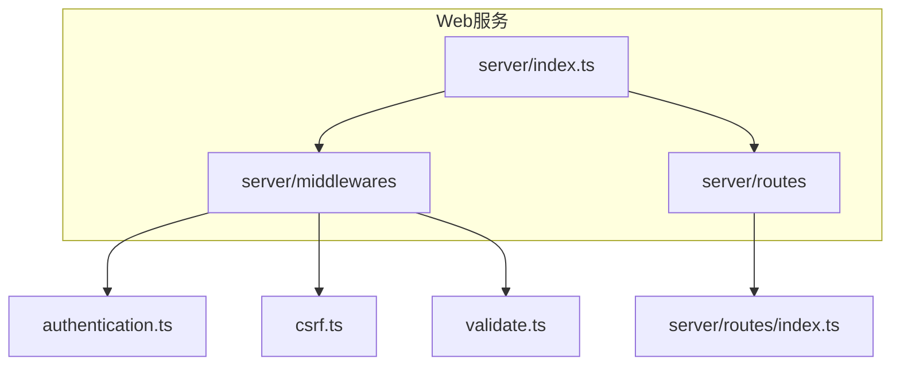
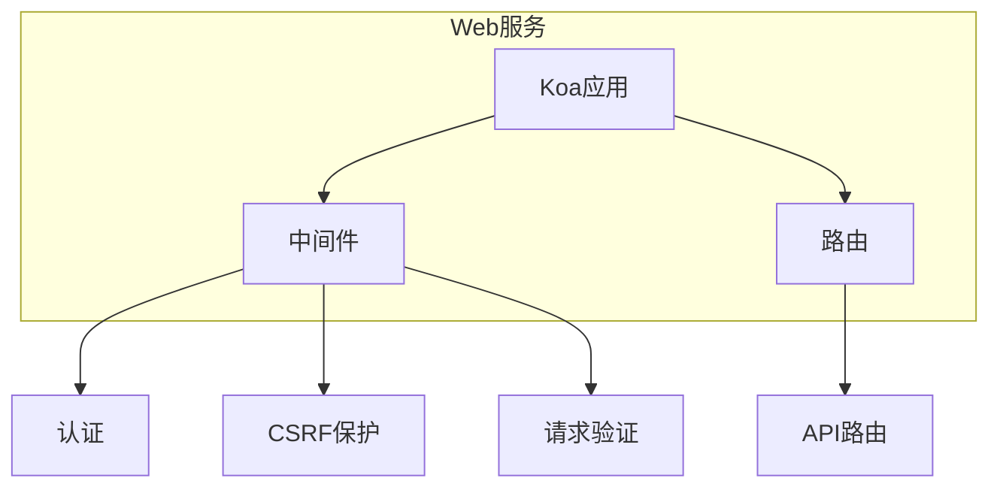
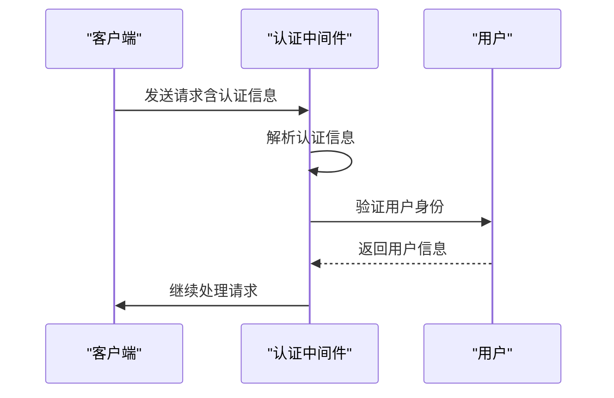
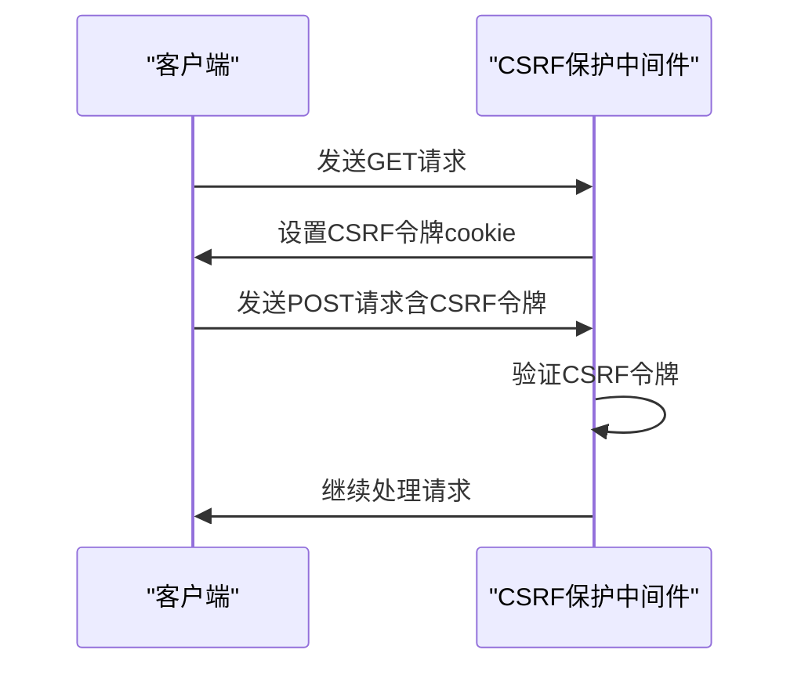
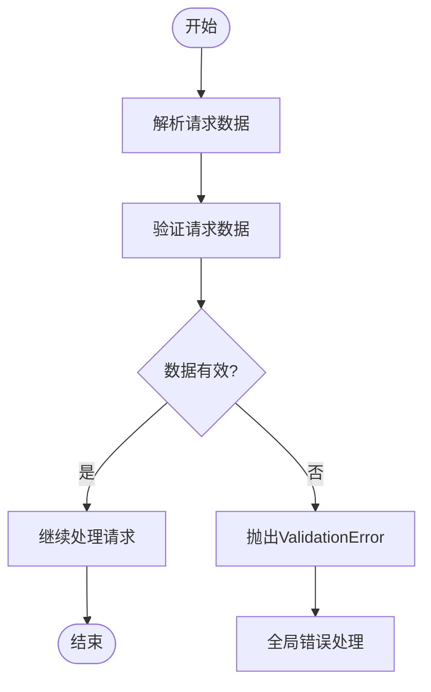

# Web服务

<cite>
**本文档中引用的文件**  
- [index.ts](file://server/index.ts)
- [authentication.ts](file://server/middlewares/authentication.ts)
- [csrf.ts](file://server/middlewares/csrf.ts)
- [validate.ts](file://server/middlewares/validate.ts)
- [routes/index.ts](file://server/routes/index.ts)
</cite>

## 目录
1. [简介](#简介)
2. [项目结构](#项目结构)
3. [核心组件](#核心组件)
4. [架构概述](#架构概述)
5. [详细组件分析](#详细组件分析)
6. [依赖分析](#依赖分析)
7. [性能考虑](#性能考虑)
8. [故障排除指南](#故障排除指南)
9. [结论](#结论)
10. [附录](#附录)（如有必要）

## 简介
本文档详细介绍了baozi项目中的Web服务，重点阐述其作为HTTP请求入口的角色。文档将深入解析Koa应用的初始化过程、中间件的注册（如认证、CSRF保护）以及API路由的挂载机制。同时，将解释服务如何处理常规HTTP请求，包括身份验证流程、请求验证和错误处理机制。通过实际代码示例展示Web服务与API路由层的集成方式，以及如何将请求委派给适当的控制器或服务。为初学者提供Web服务在请求处理管道中的位置说明，同时为经验丰富的开发者提供性能优化和安全加固的建议。

## 项目结构
baozi项目的Web服务主要位于`server`目录下，其核心文件包括`index.ts`、`middlewares`目录下的各种中间件以及`routes`目录下的路由定义。`index.ts`文件负责初始化Koa应用并注册所有中间件和路由。`middlewares`目录包含了认证、CSRF保护、请求验证等关键中间件。`routes`目录则定义了所有API路由，通过Koa-Router进行管理。



**Diagram sources**
- [index.ts](file://server/index.ts)
- [authentication.ts](file://server/middlewares/authentication.ts)
- [csrf.ts](file://server/middlewares/csrf.ts)
- [validate.ts](file://server/middlewares/validate.ts)
- [routes/index.ts](file://server/routes/index.ts)

**Section sources**
- [index.ts](file://server/index.ts)
- [authentication.ts](file://server/middlewares/authentication.ts)
- [csrf.ts](file://server/middlewares/csrf.ts)
- [validate.ts](file://server/middlewares/validate.ts)
- [routes/index.ts](file://server/routes/index.ts)

## 核心组件
Web服务的核心组件包括Koa应用的初始化、中间件的注册和API路由的挂载。`index.ts`文件负责创建Koa应用实例，并通过`throng`库实现多进程管理。`middlewares`目录下的中间件负责处理认证、CSRF保护、请求验证等任务。`routes`目录下的路由定义通过Koa-Router进行管理，确保请求能够正确路由到相应的处理函数。

**Section sources**
- [index.ts](file://server/index.ts)
- [authentication.ts](file://server/middlewares/authentication.ts)
- [csrf.ts](file://server/middlewares/csrf.ts)
- [validate.ts](file://server/middlewares/validate.ts)
- [routes/index.ts](file://server/routes/index.ts)

## 架构概述
baozi项目的Web服务采用Koa框架作为HTTP服务器，通过中间件机制实现功能的模块化。Koa应用在`index.ts`文件中初始化，并注册了多个中间件，包括认证、CSRF保护、请求验证等。API路由通过Koa-Router进行管理，确保请求能够正确路由到相应的处理函数。整个架构设计遵循单一职责原则，每个中间件负责一个特定的功能，确保代码的可维护性和可扩展性。



**Diagram sources**
- [index.ts](file://server/index.ts)
- [authentication.ts](file://server/middlewares/authentication.ts)
- [csrf.ts](file://server/middlewares/csrf.ts)
- [validate.ts](file://server/middlewares/validate.ts)
- [routes/index.ts](file://server/routes/index.ts)

## 详细组件分析
### 认证中间件分析
认证中间件负责处理用户的身份验证，支持多种认证方式，包括OAuth、API密钥和JWT。中间件通过`parseAuthentication`函数解析请求中的认证信息，并根据认证类型调用相应的验证逻辑。验证成功后，用户信息将被附加到请求上下文中，供后续处理函数使用。



**Diagram sources**
- [authentication.ts](file://server/middlewares/authentication.ts)

**Section sources**
- [authentication.ts](file://server/middlewares/authentication.ts)

### CSRF保护中间件分析
CSRF保护中间件通过双重提交令牌（Double Submit Cookie）机制防止跨站请求伪造攻击。中间件在响应中设置CSRF令牌cookie，并在后续的请求中验证该令牌。对于使用cookie进行认证的请求，中间件会检查请求头或表单字段中的CSRF令牌是否与cookie中的令牌匹配。



**Diagram sources**
- [csrf.ts](file://server/middlewares/csrf.ts)

**Section sources**
- [csrf.ts](file://server/middlewares/csrf.ts)

### 请求验证中间件分析
请求验证中间件使用Zod库对请求数据进行验证。中间件通过`validate`函数接收一个Zod模式，并在请求处理过程中验证请求数据是否符合该模式。如果验证失败，中间件将抛出一个`ValidationError`异常，该异常将被全局错误处理中间件捕获并返回适当的错误响应。



**Diagram sources**
- [validate.ts](file://server/middlewares/validate.ts)

**Section sources**
- [validate.ts](file://server/middlewares/validate.ts)

## 依赖分析
Web服务依赖于多个外部库和内部模块。外部库包括Koa、Koa-Router、Lodash等，用于构建HTTP服务器和处理请求。内部模块包括`@server/models`、`@server/utils`等，用于访问数据库和执行业务逻辑。这些依赖关系通过`package.json`文件进行管理，确保项目的可维护性和可扩展性。

```mermaid
graph TB
subgraph "外部依赖"
Koa[Koa]
KoaRouter[Koa-Router]
Lodash[Lodash]
end
subgraph "内部模块"
Models[@server/models]
Utils[@server/utils]
end
Koa --> WebService
KoaRouter --> WebService
Lodash --> WebService
Models --> WebService
Utils --> WebService
```

**Diagram sources**
- [package.json](file://package.json)
- [index.ts](file://server/index.ts)

**Section sources**
- [package.json](file://package.json)
- [index.ts](file://server/index.ts)

## 性能考虑
为了提高Web服务的性能，项目采用了多进程管理、Redis缓存和数据库连接池等技术。多进程管理通过`throng`库实现，确保服务器能够充分利用多核CPU的性能。Redis缓存用于存储会话数据和速率限制信息，减少数据库的访问压力。数据库连接池通过Sequelize ORM实现，确保数据库连接的高效复用。

## 故障排除指南
在开发和部署过程中，可能会遇到各种问题。以下是一些常见的故障排除建议：
- **端口冲突**：检查`PORT`环境变量，确保端口未被其他进程占用。
- **数据库连接失败**：检查数据库配置，确保数据库服务正在运行。
- **Redis连接失败**：检查Redis配置，确保Redis服务正在运行。
- **认证失败**：检查认证信息，确保认证令牌有效且未过期。

**Section sources**
- [index.ts](file://server/index.ts)
- [onerror.ts](file://server/onerror.ts)

## 结论
baozi项目的Web服务通过Koa框架和中间件机制实现了高效、安全的HTTP请求处理。通过模块化的设计，服务能够轻松扩展和维护。本文档详细介绍了Web服务的架构、核心组件和实现细节，为开发者提供了全面的参考。通过遵循本文档中的建议，开发者可以更好地理解和优化Web服务的性能和安全性。

## 附录
如有必要，附录部分将包含额外的技术细节、配置示例或参考资料。