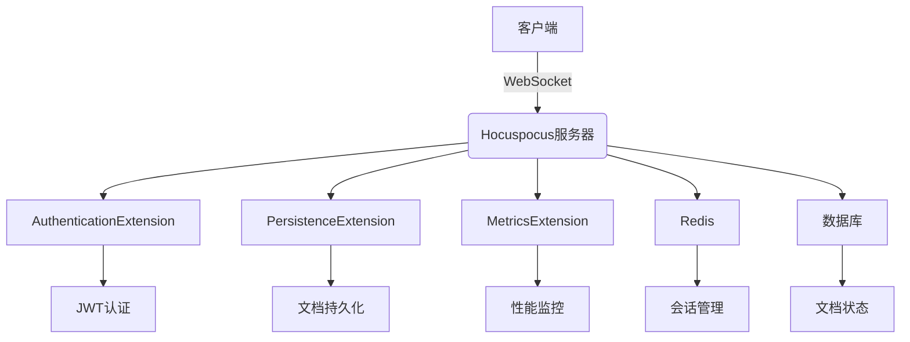
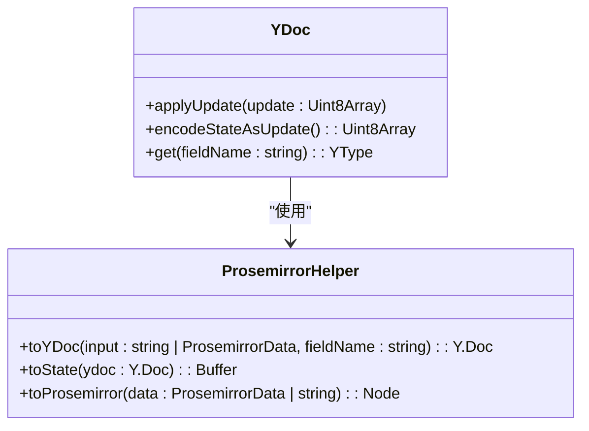
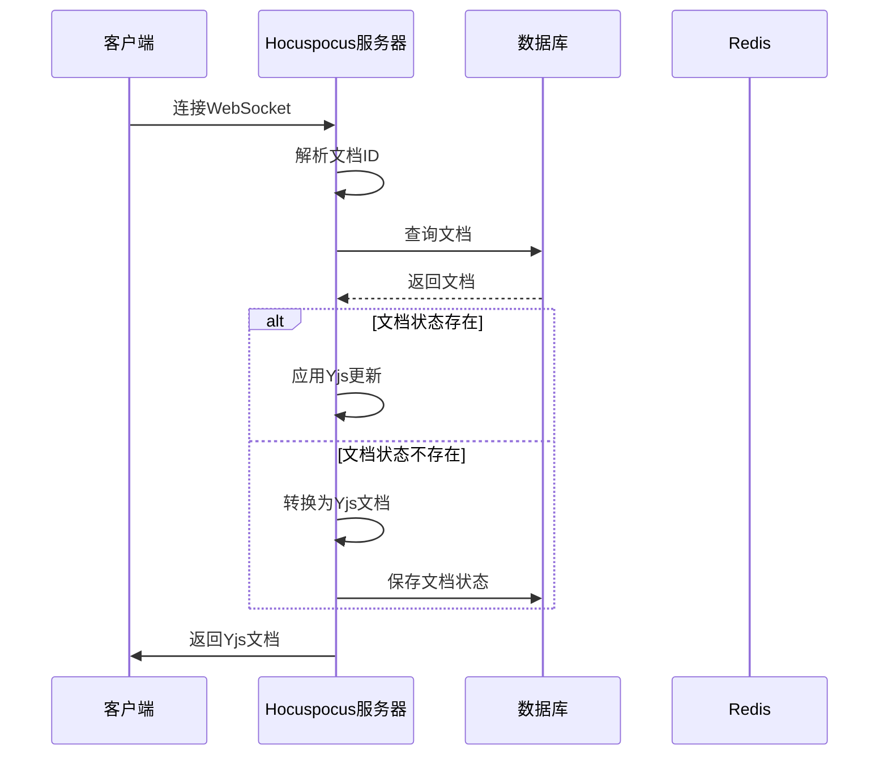
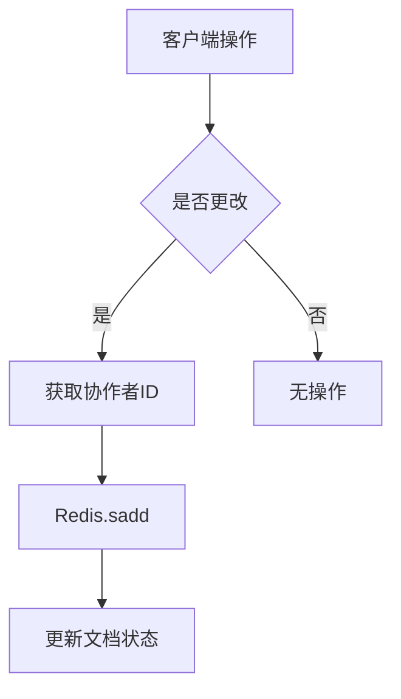

# 协作服务

<cite>
**本文档引用的文件**  
- [collaboration.ts](file://server/services/collaboration.ts)
- [AuthenticationExtension.ts](file://server/collaboration/AuthenticationExtension.ts)
- [PersistenceExtension.ts](file://server/collaboration/PersistenceExtension.ts)
- [MetricsExtension.ts](file://server/collaboration/MetricsExtension.ts)
- [Document.ts](file://server/models/Document.ts)
- [ProsemirrorHelper.tsx](file://server/models/helpers/ProsemirrorHelper.tsx)
- [documentCollaborativeUpdater.ts](file://server/commands/documentCollaborativeUpdater.ts)
</cite>

## 目录
1. [简介](#简介)
2. [实时协作编辑架构](#实时协作编辑架构)
3. [核心组件分析](#核心组件分析)
4. [文档状态同步机制](#文档状态同步机制)
5. [冲突解决与操作广播](#冲突解决与操作广播)
6. [WebSocket会话管理](#websocket会话管理)
7. [Redis状态持久化](#redis状态持久化)
8. [扩展点与性能监控](#扩展点与性能监控)
9. [CRDT概念简介](#crdt概念简介)
10. [扩展与优化指南](#扩展与优化指南)
11. [结论](#结论)

## 简介
baozi项目协作服务实现了基于Yjs和ProseMirror的实时协作编辑功能，允许多个用户同时编辑同一文档。该服务通过WebSocket连接管理客户端会话，并使用Redis进行状态持久化。协作服务的核心是Hocuspocus服务器，它处理Yjs文档的同步、冲突解决和操作广播。服务通过一系列扩展（如AuthenticationExtension、PersistenceExtension等）来实现认证、持久化、性能监控等功能。本文档详细介绍了协作服务的实现机制，包括文档状态同步、冲突解决、操作广播、WebSocket会话管理和Redis状态持久化。

**Section sources**
- [collaboration.ts](file://server/services/collaboration.ts#L1-L109)

## 实时协作编辑架构
协作服务的架构基于Hocuspocus服务器，它是一个基于WebSockets的Yjs协作服务器。Hocuspocus服务器通过WebSocket与客户端通信，处理Yjs文档的同步、冲突解决和操作广播。服务通过一系列扩展来实现认证、持久化、性能监控等功能。客户端通过ProseMirror编辑器与Yjs文档交互，ProseMirror将用户操作转换为Yjs操作，并通过WebSocket发送到服务器。服务器处理操作后，将更新广播给所有连接的客户端。



**Diagram sources**
- [collaboration.ts](file://server/services/collaboration.ts#L1-L109)
- [AuthenticationExtension.ts](file://server/collaboration/AuthenticationExtension.ts#L1-L47)
- [PersistenceExtension.ts](file://server/collaboration/PersistenceExtension.ts#L1-L125)
- [MetricsExtension.ts](file://server/collaboration/MetricsExtension.ts#L1-L73)

**Section sources**
- [collaboration.ts](file://server/services/collaboration.ts#L1-L109)

## 核心组件分析
协作服务的核心组件包括Hocuspocus服务器、Yjs文档、ProseMirror编辑器、WebSocket连接和Redis持久化。Hocuspocus服务器处理Yjs文档的同步、冲突解决和操作广播。Yjs文档是CRDT（无冲突复制数据类型）的一种实现，它允许多个用户同时编辑同一文档而不会产生冲突。ProseMirror编辑器将用户操作转换为Yjs操作，并通过WebSocket发送到服务器。WebSocket连接管理客户端会话，确保实时同步。Redis用于持久化文档状态和会话管理。

### Hocuspocus服务器
Hocuspocus服务器是协作服务的核心，它处理Yjs文档的同步、冲突解决和操作广播。服务器通过WebSocket与客户端通信，接收Yjs操作并广播更新。Hocuspocus服务器通过扩展机制实现认证、持久化、性能监控等功能。

**Section sources**
- [collaboration.ts](file://server/services/collaboration.ts#L1-L109)

### Yjs文档
Yjs文档是CRDT（无冲突复制数据类型）的一种实现，它允许多个用户同时编辑同一文档而不会产生冲突。Yjs文档通过操作转换（OT）算法解决冲突，确保所有客户端最终达到一致状态。Yjs文档的状态以二进制格式存储在数据库中，通过ProseMirrorHelper转换为ProseMirror文档。



**Diagram sources**
- [ProsemirrorHelper.tsx](file://server/models/helpers/ProsemirrorHelper.tsx#L50-L655)
- [Document.ts](file://server/models/Document.ts#L94-L1314)

### ProseMirror编辑器
ProseMirror编辑器是协作服务的前端组件，它将用户操作转换为Yjs操作，并通过WebSocket发送到服务器。ProseMirror编辑器通过y-prosemirror库与Yjs文档交互，确保用户操作的实时同步。编辑器支持丰富的文本格式和嵌入内容，如图片、视频、附件等。

**Section sources**
- [ProsemirrorHelper.tsx](file://server/models/helpers/ProsemirrorHelper.tsx#L50-L655)

### WebSocket连接
WebSocket连接管理客户端会话，确保实时同步。Hocuspocus服务器通过WebSocket与客户端通信，接收Yjs操作并广播更新。WebSocket连接通过upgrade事件处理，确保只有合法请求才能建立连接。连接错误通过日志记录，便于调试和监控。

**Section sources**
- [collaboration.ts](file://server/services/collaboration.ts#L1-L109)

### Redis持久化
Redis用于持久化文档状态和会话管理。PersistenceExtension通过Redis存储文档的协作者ID，确保文档状态的持久化。Redis还用于会话管理，存储用户的会话信息，确保实时同步。Redis的使用提高了服务的性能和可靠性。

**Section sources**
- [PersistenceExtension.ts](file://server/collaboration/PersistenceExtension.ts#L1-L125)

## 文档状态同步机制
文档状态同步是协作服务的核心功能，它确保所有客户端的文档状态保持一致。Hocuspocus服务器通过WebSocket接收Yjs操作，并广播更新到所有连接的客户端。Yjs文档通过操作转换（OT）算法解决冲突，确保所有客户端最终达到一致状态。文档状态以二进制格式存储在数据库中，通过ProseMirrorHelper转换为ProseMirror文档。

### 文档加载
当客户端连接到Hocuspocus服务器时，服务器通过onLoadDocument事件加载文档状态。如果文档状态已存在，则直接应用更新；否则，从数据库中加载文档内容并转换为Yjs文档。文档状态通过ProseMirrorHelper.toYDoc方法转换为Yjs文档，并通过Y.applyUpdate方法应用更新。



**Diagram sources**
- [PersistenceExtension.ts](file://server/collaboration/PersistenceExtension.ts#L16-L123)

### 文档保存
当客户端断开连接时，Hocuspocus服务器通过onStoreDocument事件保存文档状态。服务器从Redis中获取会话协作者ID，并调用documentCollaborativeUpdater更新文档状态。文档状态通过Y.encodeStateAsUpdate方法编码为二进制格式，并保存到数据库中。协作者ID通过Redis.sadd方法添加到文档的协作者集合中。

**Section sources**
- [PersistenceExtension.ts](file://server/collaboration/PersistenceExtension.ts#L1-L125)

## 冲突解决与操作广播
冲突解决是协作服务的关键功能，它确保多个用户同时编辑同一文档时不会产生冲突。Yjs文档通过操作转换（OT）算法解决冲突，确保所有客户端最终达到一致状态。操作广播是协作服务的另一核心功能，它确保所有客户端的文档状态保持一致。Hocuspocus服务器通过WebSocket广播Yjs操作，确保所有客户端实时同步。

### 操作转换
Yjs文档通过操作转换（OT）算法解决冲突。当多个用户同时编辑同一文档时，Yjs文档将操作转换为不冲突的操作序列，确保所有客户端最终达到一致状态。操作转换算法基于Yjs的CRDT实现，确保操作的原子性和一致性。

**Section sources**
- [documentCollaborativeUpdater.ts](file://server/commands/documentCollaborativeUpdater.ts#L24-L113)

### 操作广播
Hocuspocus服务器通过WebSocket广播Yjs操作，确保所有客户端实时同步。当客户端发送Yjs操作时，服务器接收操作并广播到所有连接的客户端。操作广播通过WebSocket的send方法实现，确保所有客户端实时接收更新。

**Section sources**
- [collaboration.ts](file://server/services/collaboration.ts#L1-L109)

## WebSocket会话管理
WebSocket会话管理是协作服务的重要组成部分，它确保客户端会话的实时同步。Hocuspocus服务器通过WebSocket与客户端通信，处理连接、断开和错误事件。会话管理通过Redis实现，存储用户的会话信息，确保实时同步。

### 连接管理
当客户端连接到Hocuspocus服务器时，服务器通过upgrade事件处理连接请求。服务器解析文档ID，并验证请求的合法性。如果文档ID存在，则建立WebSocket连接；否则，关闭连接。连接错误通过日志记录，便于调试和监控。

**Section sources**
- [collaboration.ts](file://server/services/collaboration.ts#L1-L109)

### 断开管理
当客户端断开连接时，Hocuspocus服务器通过onDisconnect事件处理断开请求。服务器从Redis中获取会话协作者ID，并更新文档的协作者集合。断开事件通过日志记录，便于调试和监控。

**Section sources**
- [MetricsExtension.ts](file://server/collaboration/MetricsExtension.ts#L1-L73)

## Redis状态持久化
Redis状态持久化是协作服务的关键功能，它确保文档状态的持久化和会话管理。PersistenceExtension通过Redis存储文档的协作者ID，确保文档状态的持久化。Redis还用于会话管理，存储用户的会话信息，确保实时同步。

### 协作者管理
PersistenceExtension通过Redis.sadd方法将协作者ID添加到文档的协作者集合中。协作者集合通过Document.getCollaboratorKey方法生成Redis键。协作者ID在文档保存时从Redis中获取，并更新文档的协作者列表。



**Diagram sources**
- [PersistenceExtension.ts](file://server/collaboration/PersistenceExtension.ts#L16-L123)

### 状态持久化
文档状态通过Y.encodeStateAsUpdate方法编码为二进制格式，并保存到数据库中。状态持久化通过documentCollaborativeUpdater实现，确保文档状态的实时更新。状态持久化还更新文档的最后修改者、协作者列表和编辑器版本。

**Section sources**
- [documentCollaborativeUpdater.ts](file://server/commands/documentCollaborativeUpdater.ts#L24-L113)

## 扩展点与性能监控
协作服务通过扩展机制实现认证、持久化、性能监控等功能。MetricsExtension是性能监控的核心组件，它通过Metrics.increment和Metrics.gaugePerInstance方法记录协作服务的性能指标。扩展点允许开发者自定义协作服务的功能，如认证、持久化、性能监控等。

### MetricsExtension
MetricsExtension通过onLoadDocument、onAuthenticationFailed、connected、onDisconnect、onStoreDocument和onDestroy事件记录协作服务的性能指标。性能指标包括文档加载、认证失败、连接、断开、更改和销毁等。性能指标通过Metrics.increment和Metrics.gaugePerInstance方法记录，便于监控和分析。

```mermaid
classDiagram
class MetricsExtension {
+onLoadDocument(payload : onLoadDocumentPayload)
+onAuthenticationFailed(payload : { documentName : string })
+connected(payload : connectedPayload)
+onDisconnect(payload : onDisconnectPayload)
+onStoreDocument(payload : onChangePayload)
+onDestroy()
}
class Metrics {
+increment(name : string, tags : Record<string, string>)
+gaugePerInstance(name : string, value : number)
}
MetricsExtension --> Metrics : "使用"
```

**Diagram sources**
- [MetricsExtension.ts](file://server/collaboration/MetricsExtension.ts#L1-L73)

### 扩展点
协作服务通过扩展机制实现认证、持久化、性能监控等功能。开发者可以通过实现Hocuspocus的Extension接口自定义协作服务的功能。扩展点包括onAuthenticate、onLoadDocument、onStoreDocument、onChange、onDisconnect和onDestroy等事件。

**Section sources**
- [AuthenticationExtension.ts](file://server/collaboration/AuthenticationExtension.ts#L1-L47)
- [PersistenceExtension.ts](file://server/collaboration/PersistenceExtension.ts#L1-L125)
- [MetricsExtension.ts](file://server/collaboration/MetricsExtension.ts#L1-L73)

## CRDT概念简介
CRDT（Conflict-Free Replicated Data Type，无冲突复制数据类型）是一种分布式数据结构，它允许多个副本在没有中央协调的情况下独立更新，并最终达到一致状态。CRDT通过数学算法确保操作的原子性和一致性，避免了传统分布式系统中的冲突问题。Yjs是CRDT的一种实现，它通过操作转换（OT）算法解决冲突，确保所有客户端最终达到一致状态。

### CRDT原理
CRDT基于数学算法确保操作的原子性和一致性。CRDT分为两种类型：基于状态的CRDT和基于操作的CRDT。基于状态的CRDT通过合并状态确保一致性，而基于操作的CRDT通过操作转换确保一致性。Yjs是基于操作的CRDT，它通过操作转换（OT）算法解决冲突。

### Yjs实现
Yjs通过操作转换（OT）算法解决冲突。当多个用户同时编辑同一文档时，Yjs将操作转换为不冲突的操作序列，确保所有客户端最终达到一致状态。Yjs还支持丰富的数据类型，如文本、数组、映射等，满足复杂的应用需求。

**Section sources**
- [documentCollaborativeUpdater.ts](file://server/commands/documentCollaborativeUpdater.ts#L24-L113)

## 扩展与优化指南
协作服务提供了丰富的扩展点和优化建议，帮助开发者自定义和优化协作功能。开发者可以通过实现Hocuspocus的Extension接口自定义认证、持久化、性能监控等功能。优化建议包括使用Redis提高性能、优化WebSocket连接、减少文档状态大小等。

### 扩展协作功能
开发者可以通过实现Hocuspocus的Extension接口自定义协作服务的功能。扩展点包括onAuthenticate、onLoadDocument、onStoreDocument、onChange、onDisconnect和onDestroy等事件。开发者可以自定义认证逻辑、持久化策略、性能监控等。

**Section sources**
- [AuthenticationExtension.ts](file://server/collaboration/AuthenticationExtension.ts#L1-L47)
- [PersistenceExtension.ts](file://server/collaboration/PersistenceExtension.ts#L1-L125)
- [MetricsExtension.ts](file://server/collaboration/MetricsExtension.ts#L1-L73)

### 优化同步性能
优化同步性能的建议包括使用Redis提高性能、优化WebSocket连接、减少文档状态大小等。使用Redis可以提高文档状态的读写性能，优化WebSocket连接可以减少网络延迟，减少文档状态大小可以降低带宽消耗。

**Section sources**
- [collaboration.ts](file://server/services/collaboration.ts#L1-L109)

## 结论
baozi项目协作服务通过Yjs和ProseMirror实现了高效的实时协作编辑功能。服务通过Hocuspocus服务器处理Yjs文档的同步、冲突解决和操作广播，确保多用户并发编辑的实时性和一致性。WebSocket连接管理客户端会话，Redis用于状态持久化和会话管理。协作服务通过扩展机制实现认证、持久化、性能监控等功能，提供了丰富的扩展点和优化建议。CRDT（无冲突复制数据类型）是协作服务的核心技术，它通过数学算法确保操作的原子性和一致性，避免了传统分布式系统中的冲突问题。开发者可以通过实现Hocuspocus的Extension接口自定义协作服务的功能，并通过优化建议提高同步性能。