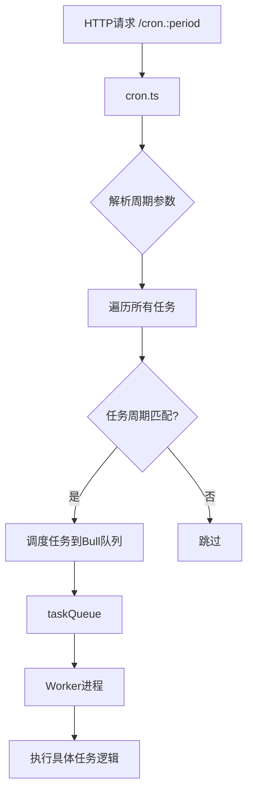
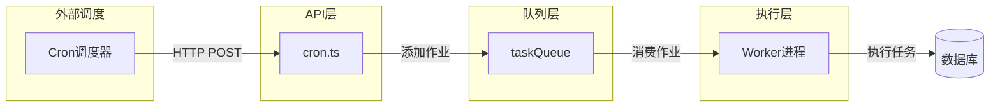
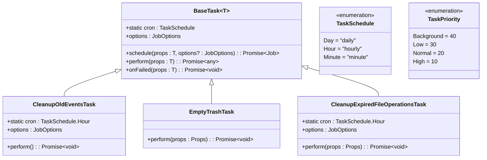
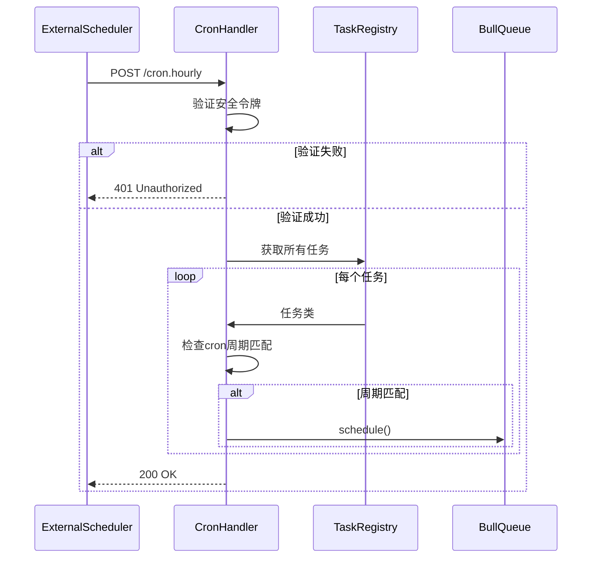
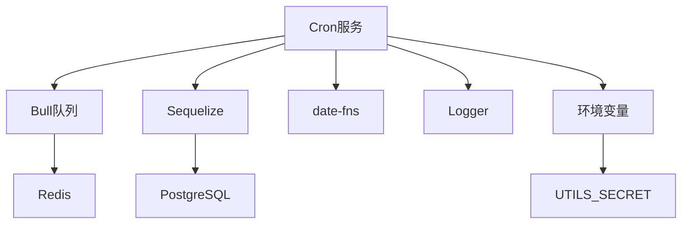

# 定时任务服务

<cite>
**本文档引用的文件**
- [cron.ts](file://server/routes/api/cron/cron.ts)
- [BaseTask.ts](file://server/queues/tasks/BaseTask.ts)
- [CleanupOldEventsTask.ts](file://server/queues/tasks/CleanupOldEventsTask.ts)
- [EmptyTrashTask.ts](file://server/queues/tasks/EmptyTrashTask.ts)
- [CleanupExpiredFileOperationsTask.ts](file://server/queues/tasks/CleanupExpiredFileOperationsTask.ts)
- [index.ts](file://server/queues/index.ts)
</cite>

## 目录
1. [简介](#简介)
2. [项目结构](#项目结构)
3. [核心组件](#核心组件)
4. [架构概述](#架构概述)
5. [详细组件分析](#详细组件分析)
6. [依赖分析](#依赖分析)
7. [性能考虑](#性能考虑)
8. [故障排除指南](#故障排除指南)
9. [结论](#结论)

## 简介
baozi项目的定时任务服务负责管理系统中的周期性后台任务，包括清理过期事件、删除临时文件和清空回收站等维护操作。该服务通过Node.js与Bull队列集成，将定时任务作为后台作业提交执行，确保系统稳定性和数据一致性。本文档详细说明了定时任务的调度机制、执行流程以及与Bull队列的集成方式，为初学者提供系统维护重要性的解释，同时为经验丰富的开发者提供优化配置策略。

## 项目结构
定时任务相关代码主要分布在`server/queues/tasks/`目录下，每个任务以独立的TypeScript文件实现，并继承自`BaseTask`抽象类。任务调度入口位于`server/routes/api/cron/cron.ts`，通过HTTP请求触发不同周期的任务执行。Bull队列实例在`server/queues/index.ts`中初始化，负责任务的异步处理和调度管理。

**图表来源**
- [cron.ts](file://server/routes/api/cron/cron.ts)
- [index.ts](file://server/queues/index.ts)

**章节来源**
- [cron.ts](file://server/routes/api/cron/cron.ts#L1-L66)
- [index.ts](file://server/queues/index.ts#L1-L30)

## 核心组件
定时任务服务的核心组件包括任务基类`BaseTask`、具体任务实现类（如`CleanupOldEventsTask`）和任务调度器`cron.ts`。`BaseTask`定义了任务的通用接口和默认行为，所有具体任务都必须继承此类并实现`perform`方法。任务调度器负责根据预设周期触发相应的任务执行。

**章节来源**
- [BaseTask.ts](file://server/queues/tasks/BaseTask.ts#L1-L72)
- [CleanupOldEventsTask.ts](file://server/queues/tasks/CleanupOldEventsTask.ts#L1-L60)

## 架构概述
定时任务服务采用基于HTTP触发的轻量级调度架构，结合Bull队列实现异步任务处理。系统通过`cron.ts`接收外部调度信号，根据请求中的周期参数（daily、hourly、minute）决定执行哪些任务。任务被封装为Bull队列中的作业，由独立的Worker进程异步执行，实现了任务调度与执行的解耦。

**图表来源**
- [cron.ts](file://server/routes/api/cron/cron.ts#L1-L66)
- [index.ts](file://server/queues/index.ts#L23-L29)

## 详细组件分析

### 任务基类分析
`BaseTask`是所有定时任务的抽象基类，定义了任务调度、执行和失败处理的统一接口。它通过静态属性`cron`指定任务执行周期，通过`schedule`方法将任务提交到Bull队列，并提供可重写的`options`属性来自定义任务优先级和重试策略。

**图表来源**
- [BaseTask.ts](file://server/queues/tasks/BaseTask.ts#L3-L72)
- [CleanupOldEventsTask.ts](file://server/queues/tasks/CleanupOldEventsTask.ts#L11-L59)
- [EmptyTrashTask.ts](file://server/queues/tasks/EmptyTrashTask.ts#L1-L29)
- [CleanupExpiredFileOperationsTask.ts](file://server/queues/tasks/CleanupExpiredFileOperationsTask.ts#L1-L40)

**章节来源**
- [BaseTask.ts](file://server/queues/tasks/BaseTask.ts#L1-L72)

### 任务调度流程分析
当系统接收到`/cron.:period`的HTTP请求时，`cron.ts`中的处理器会验证安全令牌，然后遍历所有注册的任务类。对于每个任务，如果其`cron`属性与请求周期匹配，则调用`schedule`方法将其加入任务队列。系统还实现了向后兼容机制，确保在未配置更细粒度周期时仍能正确执行任务。

**图表来源**
- [cron.ts](file://server/routes/api/cron/cron.ts#L1-L66)

**章节来源**
- [cron.ts](file://server/routes/api/cron/cron.ts#L1-L66)

### 具体任务实现分析

#### 清理过期事件任务
`CleanupOldEventsTask`每小时执行一次，负责清理超过365天的历史事件记录。任务采用分批处理模式，每次最多处理100,000条记录，避免对数据库造成过大压力。清理完成后会记录删除的事件数量，便于监控和审计。

**章节来源**
- [CleanupOldEventsTask.ts](file://server/queues/tasks/CleanupOldEventsTask.ts#L11-L59)

#### 清空回收站任务
`EmptyTrashTask`用于永久删除已软删除的文档。任务接收文档ID列表作为参数，在执行前会验证这些文档确实处于软删除状态，确保操作的安全性。实际删除操作委托给`documentPermanentDeleter`命令处理。

**章节来源**
- [EmptyTrashTask.ts](file://server/queues/tasks/EmptyTrashTask.ts#L1-L29)

#### 清理过期文件操作任务
`CleanupExpiredFileOperationsTask`每小时执行，清理创建超过15天的文件操作记录。任务会将这些记录的状态更新为"Expired"，并记录清理数量。该任务有助于保持文件操作表的整洁，防止数据无限增长。

**章节来源**
- [CleanupExpiredFileOperationsTask.ts](file://server/queues/tasks/CleanupExpiredFileOperationsTask.ts#L1-L40)

## 依赖分析
定时任务服务依赖于多个核心模块：Bull队列用于任务的异步执行和调度，Sequelize用于数据库操作，date-fns用于日期计算。任务之间通过`receivedPeriods`集合实现执行状态的共享，避免重复执行。系统通过环境变量`UTILS_SECRET`确保调度接口的安全性，防止未授权访问。

**图表来源**
- [cron.ts](file://server/routes/api/cron/cron.ts#L1-L66)
- [BaseTask.ts](file://server/queues/tasks/BaseTask.ts#L1-L72)

**章节来源**
- [cron.ts](file://server/routes/api/cron/cron.ts#L1-L66)
- [BaseTask.ts](file://server/queues/tasks/BaseTask.ts#L1-L72)

## 性能考虑
定时任务服务在设计时充分考虑了性能影响。所有数据清理操作都采用分批处理模式，通过`batchLimit`和`totalLimit`参数控制每次操作的数据量，避免长时间锁定数据库表。任务优先级设置为`Background`或`Normal`，确保不会影响系统的正常业务处理。对于可能耗时较长的任务，系统配置了指数退避重试策略，提高任务执行的可靠性。

## 故障排除指南
当定时任务未能正常执行时，应首先检查外部调度器是否按时发送请求到`/cron.:period`接口。确认HTTP响应状态码为200，且安全令牌配置正确。查看应用日志中是否有"Deleted old events"或"Expired file operations"等任务执行记录。如果任务频繁失败，检查Redis队列是否正常运行，以及Worker进程是否处于活动状态。对于数据库相关的清理任务，还需确认数据库连接和权限配置是否正确。

**章节来源**
- [cron.ts](file://server/routes/api/cron/cron.ts#L1-L66)
- [BaseTask.ts](file://server/queues/tasks/BaseTask.ts#L1-L72)
- [logging/Logger.ts](file://server/logging/Logger.ts#L1-L50)

## 结论
baozi项目的定时任务服务通过简洁而有效的架构实现了系统维护的自动化。基于HTTP触发的调度机制降低了部署复杂性，Bull队列的使用确保了任务执行的可靠性和可扩展性。通过继承`BaseTask`的模式，新任务的添加变得简单直观。该服务不仅保障了系统的长期稳定运行，也为未来的功能扩展提供了良好的基础。