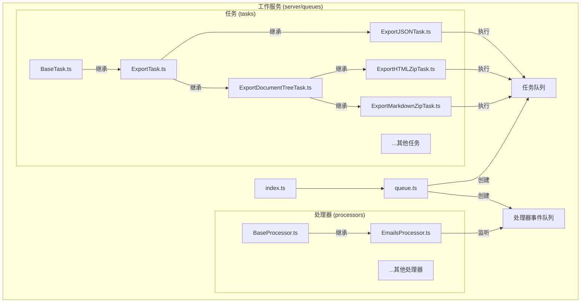
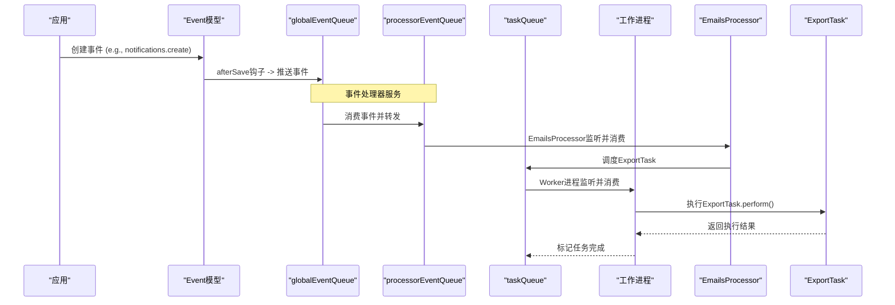
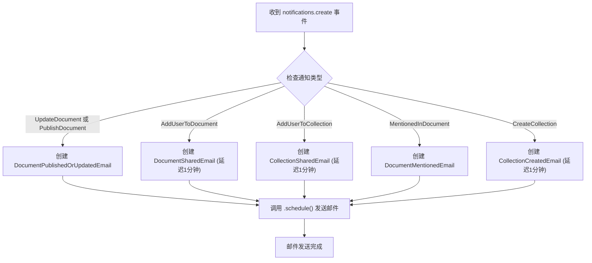
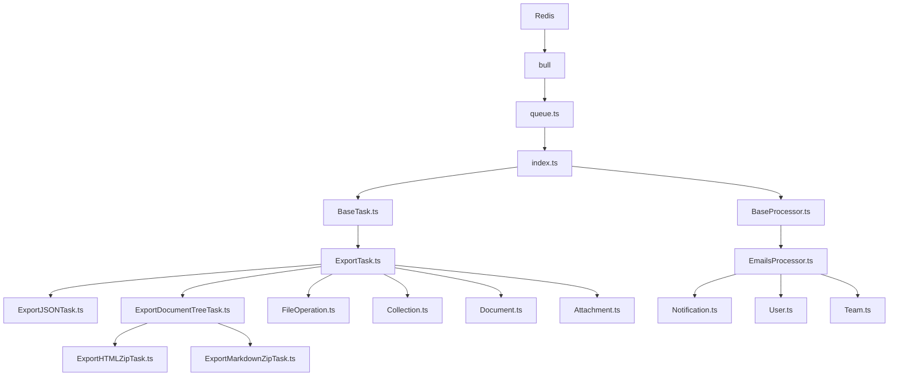

# 工作服务

<cite>
**本文档中引用的文件**  
- [worker.ts](file://server/services/worker.ts)
- [queue.ts](file://server/queues/queue.ts)
- [index.ts](file://server/queues/index.ts)
- [BaseProcessor.ts](file://server/queues/processors/BaseProcessor.ts)
- [EmailsProcessor.ts](file://server/queues/processors/EmailsProcessor.ts)
- [BaseTask.ts](file://server/queues/tasks/BaseTask.ts)
- [ExportTask.ts](file://server/queues/tasks/ExportTask.ts)
- [ExportJSONTask.ts](file://server/queues/tasks/ExportJSONTask.ts)
- [ExportHTMLZipTask.ts](file://server/queues/tasks/ExportHTMLZipTask.ts)
- [ExportMarkdownZipTask.ts](file://server/queues/tasks/ExportMarkdownZipTask.ts)
- [ExportDocumentTreeTask.ts](file://server/queues/tasks/ExportDocumentTreeTask.ts)
- [FileOperation.ts](file://server/models/FileOperation.ts)
- [Event.ts](file://server/models/Event.ts)
- [Notification.ts](file://server/models/Notification.ts)
- [Collection.ts](file://server/models/Collection.ts)
- [User.ts](file://server/models/User.ts)
- [Team.ts](file://server/models/Team.ts)
- [Attachment.ts](file://server/models/Attachment.ts)
- [Document.ts](file://server/models/Document.ts)
</cite>

## 目录
1. [简介](#简介)
2. [项目结构](#项目结构)
3. [核心组件](#核心组件)
4. [架构概述](#架构概述)
5. [详细组件分析](#详细组件分析)
6. [依赖分析](#依赖分析)
7. [性能考虑](#性能考虑)
8. [故障排除指南](#故障排除指南)
9. [结论](#结论)

## 简介
本文档详细介绍了baozi项目中的工作服务，重点阐述其后台任务处理架构。该服务基于Bull队列系统，利用Redis实现任务的可靠分发与持久化，确保长时间运行任务的稳定性。文档将深入解析`worker.ts`中Bull队列处理器的初始化过程，以及如何消费和执行异步任务（如文件导出、通知发送）。通过实际代码示例，展示任务创建（如`ExportTask`）和处理（如`EmailsProcessor`）的完整流程，并为开发者提供任务调度优化、错误重试策略和监控告警的配置指南。

## 项目结构
工作服务的核心逻辑位于`server/queues`目录下，该目录组织清晰，分为`processors`（处理器）和`tasks`（任务）两个主要子目录。这种分离体现了关注点分离的设计原则：`processors`负责响应系统事件并触发任务，而`tasks`则专注于执行具体的、耗时的后台操作。



**图表来源**
- [queue.ts](file://server/queues/queue.ts#L1-L69)
- [index.ts](file://server/queues/index.ts#L1-L31)
- [BaseProcessor.ts](file://server/queues/processors/BaseProcessor.ts#L1-L19)
- [EmailsProcessor.ts](file://server/queues/processors/EmailsProcessor.ts#L1-L204)
- [BaseTask.ts](file://server/queues/tasks/BaseTask.ts#L1-L73)
- [ExportTask.ts](file://server/queues/tasks/ExportTask.ts#L1-L204)
- [ExportJSONTask.ts](file://server/queues/tasks/ExportJSONTask.ts#L1-L178)
- [ExportHTMLZipTask.ts](file://server/queues/tasks/ExportHTMLZipTask.ts#L1-L18)
- [ExportMarkdownZipTask.ts](file://server/queues/tasks/ExportMarkdownZipTask.ts#L1-L18)
- [ExportDocumentTreeTask.ts](file://server/queues/tasks/ExportDocumentTreeTask.ts#L1-L231)

## 核心组件
工作服务的核心由Bull队列、任务（Task）和处理器（Processor）三大组件构成。`queue.ts`文件定义了`createQueue`函数，用于创建和配置Bull队列实例，它通过`Redis`连接池与Redis服务器交互，确保了连接的高效复用。`index.ts`文件则创建了多个全局队列实例，如`taskQueue`和`processorEventQueue`，它们是任务分发的中枢。`BaseTask`和`BaseProcessor`作为抽象基类，为所有具体任务和处理器提供了统一的接口和默认行为，如错误处理和重试策略。

**章节来源**
- [queue.ts](file://server/queues/queue.ts#L1-L69)
- [index.ts](file://server/queues/index.ts#L1-L31)
- [BaseTask.ts](file://server/queues/tasks/BaseTask.ts#L1-L73)
- [BaseProcessor.ts](file://server/queues/processors/BaseProcessor.ts#L1-L19)

## 架构概述
baozi工作服务采用事件驱动和任务队列相结合的架构。当系统发生特定事件（如“notifications.create”）时，`Event`模型的`afterSave`钩子会将事件推送到`globalEventQueue`。一个独立的事件处理器服务会消费这些事件，并根据事件类型，将其转发到`processorEventQueue`。`EmailsProcessor`等具体处理器监听`processorEventQueue`，一旦收到相关事件，便会创建并调度具体的任务（如`ExportTask`）到`taskQueue`。最后，由`worker.ts`启动的工作进程会从`taskQueue`中消费任务并执行。这种架构实现了高内聚、低耦合，确保了主应用的响应性。



**图表来源**
- [Event.ts](file://server/models/Event.ts#L29-L191)
- [index.ts](file://server/queues/index.ts#L1-L31)
- [EmailsProcessor.ts](file://server/queues/processors/EmailsProcessor.ts#L1-L204)
- [ExportTask.ts](file://server/queues/tasks/ExportTask.ts#L1-L204)
- [worker.ts](file://server/services/worker.ts)

## 详细组件分析

### 任务创建与执行流程分析
本节详细分析一个文件导出任务从创建到执行的完整生命周期。

#### 任务基类与调度
`BaseTask`是所有后台任务的基类。它定义了`schedule`方法，该方法接受任务参数`props`和Bull的`JobOptions`，并将一个包含任务名称和参数的作业（Job）添加到`taskQueue`中。`options`属性定义了默认的优先级（Normal）、重试次数（5次）和指数退避的重试延迟（60秒起）。`ExportTask`及其子类继承了此行为，但可以覆盖`options`以自定义其行为，例如`ExportTask`将其重试次数设置为1。

```mermaid
classDiagram
class BaseTask~T~ {
+static cron : TaskSchedule | undefined
+schedule(props : T, options? : JobOptions) : Promise~Job~
+abstract perform(props : T) : Promise~any~
+onFailed(props : T) : Promise~void~
+get options() : JobOptions
}
class ExportTask {
+perform(props : {fileOperationId : string}) : Promise~void~
+get options() : JobOptions
-export(collections : Collection[], fileOperation : FileOperation) : Promise~string~
-updateFileOperation(fileOperation : FileOperation, options : Partial~FileOperation~ & { error? : Error }) : Promise~void~
}
class ExportJSONTask {
+export(collections : Collection[], fileOperation : FileOperation) : Promise~string~
}
class ExportHTMLZipTask {
+export(collections : Collection[], fileOperation : FileOperation) : Promise~string~
}
class ExportMarkdownZipTask {
+export(collections : Collection[], fileOperation : FileOperation) : Promise~string~
}
BaseTask <|-- ExportTask
ExportTask <|-- ExportJSONTask
ExportTask <|-- ExportDocumentTreeTask
ExportDocumentTreeTask <|-- ExportHTMLZipTask
ExportDocumentTreeTask <|-- ExportMarkdownZipTask
```

**图表来源**
- [BaseTask.ts](file://server/queues/tasks/BaseTask.ts#L1-L73)
- [ExportTask.ts](file://server/queues/tasks/ExportTask.ts#L1-L204)
- [ExportJSONTask.ts](file://server/queues/tasks/ExportJSONTask.ts#L1-L178)
- [ExportHTMLZipTask.ts](file://server/queues/tasks/ExportHTMLZipTask.ts#L1-L18)
- [ExportMarkdownZipTask.ts](file://server/queues/tasks/ExportMarkdownZipTask.ts#L1-L18)
- [ExportDocumentTreeTask.ts](file://server/queues/tasks/ExportDocumentTreeTask.ts#L1-L231)

#### 文件导出任务实现
`ExportTask`是一个抽象基类，定义了文件导出任务的通用流程：获取`FileOperation`记录、验证权限和大小限制、更新任务状态、调用`export`方法生成文件、上传文件到存储、更新最终状态并发送通知。`export`方法是抽象的，由子类实现。`ExportJSONTask`将集合和文档导出为结构化的JSON文件，而`ExportHTMLZipTask`和`ExportMarkdownZipTask`则继承自`ExportDocumentTreeTask`，后者负责处理文档树的遍历和内部链接的转换，以生成包含HTML或Markdown文件的ZIP包。

**章节来源**
- [ExportTask.ts](file://server/queues/tasks/ExportTask.ts#L1-L204)
- [ExportJSONTask.ts](file://server/queues/tasks/ExportJSONTask.ts#L1-L178)
- [ExportHTMLZipTask.ts](file://server/queues/tasks/ExportHTMLZipTask.ts#L1-L18)
- [ExportMarkdownZipTask.ts](file://server/queues/tasks/ExportMarkdownZipTask.ts#L1-L18)
- [ExportDocumentTreeTask.ts](file://server/queues/tasks/ExportDocumentTreeTask.ts#L1-L231)
- [FileOperation.ts](file://server/models/FileOperation.ts#L34-L165)
- [Collection.ts](file://server/models/Collection.ts#L87-L1007)
- [Document.ts](file://server/models/Document.ts#L94-L1314)
- [Attachment.ts](file://server/models/Attachment.ts#L33-L236)

### 通知处理流程分析
本节分析通知事件如何触发邮件发送。

#### 事件处理器模式
`BaseProcessor`是所有事件处理器的基类，它定义了`applicableEvents`静态属性和`perform`抽象方法。`EmailsProcessor`继承自`BaseProcessor`，并声明它只处理`notifications.create`事件。当`processorEventQueue`中有匹配的事件时，`EmailsProcessor`的`perform`方法会被调用。该方法根据通知的具体类型（`event`字段），实例化相应的邮件模板（如`DocumentPublishedOrUpdatedEmail`），并调用其`schedule`方法来异步发送邮件。



**图表来源**
- [BaseProcessor.ts](file://server/queues/processors/BaseProcessor.ts#L1-L19)
- [EmailsProcessor.ts](file://server/queues/processors/EmailsProcessor.ts#L1-L204)
- [Notification.ts](file://server/models/Notification.ts#L37-L288)

#### 邮件通知实现
`EmailsProcessor`通过查询`Notification`模型获取完整的通知数据，包括用户、团队、文档等信息。它会检查用户状态（如是否被暂停），然后根据`notification.event`的值使用`switch`语句分发到不同的邮件处理逻辑。对于需要延迟发送的邮件（如分享通知），它会传递`{ delay: Minute.ms }`选项。邮件模板（如`ExportSuccessEmail`）负责构建邮件内容，而`EmailsProcessor`则负责调度发送。

**章节来源**
- [EmailsProcessor.ts](file://server/queues/processors/EmailsProcessor.ts#L1-L204)
- [Notification.ts](file://server/models/Notification.ts#L37-L288)
- [User.ts](file://server/models/User.ts#L81-L856)
- [Team.ts](file://server/models/Team.ts#L54-L473)

## 依赖分析
工作服务的依赖关系清晰且层次分明。最底层是`Redis`，作为Bull队列的后端存储，提供任务的持久化和分发能力。`bull`库是核心依赖，它封装了与Redis的交互。`server/queues/queue.ts`依赖`Redis`和`bull`来创建队列。`server/queues/index.ts`依赖`queue.ts`来创建全局队列实例。`BaseTask`和`BaseProcessor`依赖`index.ts`中的`taskQueue`和`processorEventQueue`。具体任务和处理器则依赖各自的基类以及业务模型（如`FileOperation`, `Notification`）。



**图表来源**
- [queue.ts](file://server/queues/queue.ts#L1-L69)
- [index.ts](file://server/queues/index.ts#L1-L31)
- [BaseTask.ts](file://server/queues/tasks/BaseTask.ts#L1-L73)
- [BaseProcessor.ts](file://server/queues/processors/BaseProcessor.ts#L1-L19)
- [ExportTask.ts](file://server/queues/tasks/ExportTask.ts#L1-L204)
- [ExportJSONTask.ts](file://server/queues/tasks/ExportJSONTask.ts#L1-L178)
- [ExportHTMLZipTask.ts](file://server/queues/tasks/ExportHTMLZipTask.ts#L1-L18)
- [ExportMarkdownZipTask.ts](file://server/queues/tasks/ExportMarkdownZipTask.ts#L1-L18)
- [ExportDocumentTreeTask.ts](file://server/queues/tasks/ExportDocumentTreeTask.ts#L1-L231)
- [EmailsProcessor.ts](file://server/queues/processors/EmailsProcessor.ts#L1-L204)
- [FileOperation.ts](file://server/models/FileOperation.ts#L34-L165)
- [Notification.ts](file://server/models/Notification.ts#L37-L288)
- [Collection.ts](file://server/models/Collection.ts#L87-L1007)
- [Document.ts](file://server/models/Document.ts#L94-L1314)
- [Attachment.ts](file://server/models/Attachment.ts#L33-L236)
- [User.ts](file://server/models/User.ts#L81-L856)
- [Team.ts](file://server/models/Team.ts#L54-L473)

## 性能考虑
工作服务的性能主要依赖于Redis的性能和任务的合理配置。`createQueue`函数中配置了对队列长度和延迟任务数量的监控，这有助于及时发现性能瓶颈。`ExportTask`在执行前会进行预检查，例如验证附件总大小是否超过`MAXIMUM_EXPORT_SIZE`，这可以避免启动一个注定会失败的、耗时很长的任务。任务的`priority`和`attempts`设置也影响性能，高优先级任务会更快得到处理，而合理的重试策略可以避免因瞬时故障导致的任务失败。对于大规模导出，建议优化数据库查询和文件I/O操作。

## 故障排除指南
当工作服务出现问题时，可按以下步骤排查：
1.  **检查Redis连接**：确保Redis服务器正常运行，且`worker.ts`进程能成功连接。
2.  **查看队列状态**：使用Bull的管理界面或Redis CLI检查`taskQueue`和`processorEventQueue`中是否有积压的任务。
3.  **检查日志**：`Logger`模块会记录任务的各个阶段（如“ExportTask fetching data”、“ExportTask uploading data”）和错误信息。重点关注`error`字段。
4.  **验证任务参数**：检查`FileOperation`或`Notification`记录的`props`是否正确。
5.  **检查外部依赖**：对于导出任务，确认文件存储（如S3）服务是否可用；对于邮件任务，确认邮件服务配置正确。
6.  **监控重试**：如果任务频繁重试，检查`onFailed`方法的实现和Bull的`backoff`策略。

**章节来源**
- [queue.ts](file://server/queues/queue.ts#L1-L69)
- [ExportTask.ts](file://server/queues/tasks/ExportTask.ts#L1-L204)
- [EmailsProcessor.ts](file://server/queues/processors/EmailsProcessor.ts#L1-L204)
- [Logger.ts](file://server/logging/Logger.ts)

## 结论
baozi项目的工作服务通过Bull队列和Redis构建了一个健壮、可靠的后台任务处理系统。其清晰的架构将事件处理与任务执行分离，保证了主应用的高性能。通过`BaseTask`和`BaseProcessor`的抽象，实现了代码的复用和一致的错误处理。`ExportTask`家族展示了如何通过继承和组合来处理复杂的、多步骤的后台作业。该服务为文件导出、邮件通知等异步操作提供了坚实的基础，是系统稳定性和用户体验的重要保障。