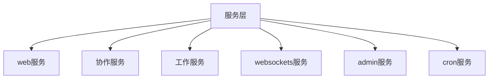
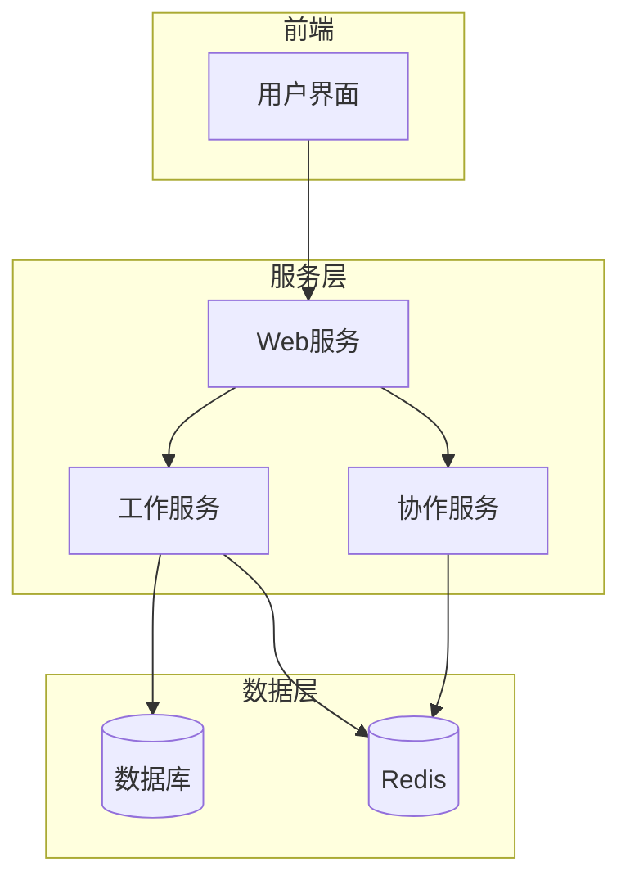
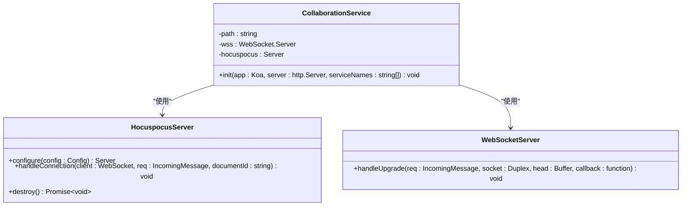
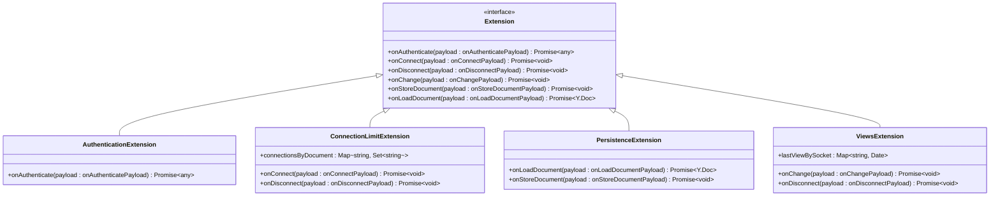
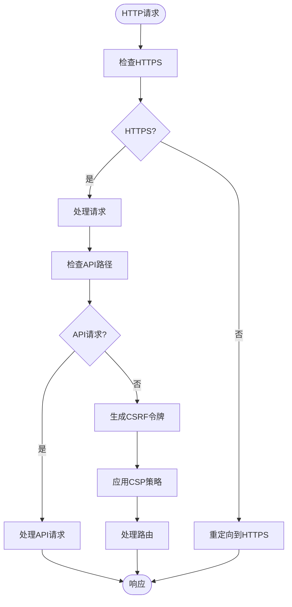
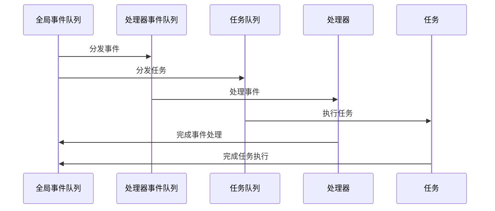
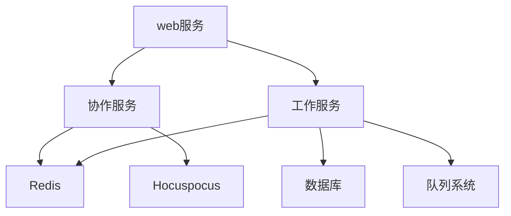

# 服务层

<cite>
**本文档中引用的文件**  
- [collaboration.ts](file://server/services/collaboration.ts)
- [web.ts](file://server/services/web.ts)
- [worker.ts](file://server/services/worker.ts)
- [AuthenticationExtension.ts](file://server/collaboration/AuthenticationExtension.ts)
- [ConnectionLimitExtension.ts](file://server/collaboration/ConnectionLimitExtension.ts)
- [PersistenceExtension.ts](file://server/collaboration/PersistenceExtension.ts)
- [ViewsExtension.ts](file://server/collaboration/ViewsExtension.ts)
- [index.ts](file://server/services/index.ts)
</cite>

## 目录
1. [介绍](#介绍)
2. [项目结构](#项目结构)
3. [核心组件](#核心组件)
4. [架构概述](#架构概述)
5. [详细组件分析](#详细组件分析)
6. [依赖分析](#依赖分析)
7. [性能考虑](#性能考虑)
8. [故障排除指南](#故障排除指南)
9. [结论](#结论)

## 介绍
本文档详细介绍了baozi项目的服务层，重点阐述了业务逻辑的组织与实现方式。文档将深入分析web服务、协作服务和工作服务的职责划分，以及它们如何协同处理应用的核心功能。通过实际代码示例（如collaboration.ts中的实时协作逻辑），展示服务间通信和任务分发的模式。同时为初学者解释服务层在MVC架构中的角色，并为经验丰富的开发者提供服务扩展和性能调优的指导。

## 项目结构
baozi项目的服务层主要位于`server/services`目录下，包含多个独立的服务模块，每个模块负责特定的业务功能。这些服务通过清晰的职责划分，实现了系统的模块化和可维护性。

**Diagram sources**
- [index.ts](file://server/services/index.ts#L1-L15)

**Section sources**
- [index.ts](file://server/services/index.ts#L1-L15)

## 核心组件
服务层的核心组件包括web服务、协作服务和工作服务。web服务负责处理HTTP请求和API路由；协作服务处理实时协作功能，基于Hocuspocus框架实现；工作服务负责异步任务处理和事件队列管理。这些组件通过清晰的接口定义和依赖管理，实现了松耦合的架构设计。

**Section sources**
- [web.ts](file://server/services/web.ts#L1-L96)
- [collaboration.ts](file://server/services/collaboration.ts#L1-L108)
- [worker.ts](file://server/services/worker.ts#L1-L179)

## 架构概述
baozi项目的服务层采用微服务架构模式，将不同的业务功能分离到独立的服务中。这种架构设计提高了系统的可扩展性和可维护性，同时降低了组件间的耦合度。

**Diagram sources**
- [collaboration.ts](file://server/services/collaboration.ts#L1-L108)
- [web.ts](file://server/services/web.ts#L1-L96)
- [worker.ts](file://server/services/worker.ts#L1-L179)

## 详细组件分析

### 协作服务分析
协作服务是baozi项目的核心组件之一，负责处理实时协作功能。它基于Hocuspocus框架实现，通过WebSocket协议提供实时文档同步能力。

#### 协作服务架构

**Diagram sources**
- [collaboration.ts](file://server/services/collaboration.ts#L1-L108)

#### 协作服务扩展机制
协作服务通过扩展机制实现了功能的模块化。每个扩展负责特定的功能，如认证、连接限制、持久化等。

**Diagram sources**
- [AuthenticationExtension.ts](file://server/collaboration/AuthenticationExtension.ts#L1-L46)
- [ConnectionLimitExtension.ts](file://server/collaboration/ConnectionLimitExtension.ts#L1-L101)
- [PersistenceExtension.ts](file://server/collaboration/PersistenceExtension.ts#L1-L124)
- [ViewsExtension.ts](file://server/collaboration/ViewsExtension.ts#L1-L71)

**Section sources**
- [collaboration.ts](file://server/services/collaboration.ts#L1-L108)
- [AuthenticationExtension.ts](file://server/collaboration/AuthenticationExtension.ts#L1-L46)
- [ConnectionLimitExtension.ts](file://server/collaboration/ConnectionLimitExtension.ts#L1-L101)
- [PersistenceExtension.ts](file://server/collaboration/PersistenceExtension.ts#L1-L124)
- [ViewsExtension.ts](file://server/collaboration/ViewsExtension.ts#L1-L71)

### Web服务分析
Web服务负责处理HTTP请求和API路由，为前端提供RESTful接口。

#### Web服务请求处理流程

**Diagram sources**
- [web.ts](file://server/services/web.ts#L1-L96)

**Section sources**
- [web.ts](file://server/services/web.ts#L1-L96)

### 工作服务分析
工作服务负责处理异步任务和事件队列，确保系统的高性能和响应性。

#### 工作服务任务处理流程

**Diagram sources**
- [worker.ts](file://server/services/worker.ts#L1-L179)

**Section sources**
- [worker.ts](file://server/services/worker.ts#L1-L179)

## 依赖分析
服务层的各个组件之间通过清晰的依赖关系进行交互，确保了系统的模块化和可维护性。

**Diagram sources**
- [collaboration.ts](file://server/services/collaboration.ts#L1-L108)
- [web.ts](file://server/services/web.ts#L1-L96)
- [worker.ts](file://server/services/worker.ts#L1-L179)

**Section sources**
- [collaboration.ts](file://server/services/collaboration.ts#L1-L108)
- [web.ts](file://server/services/web.ts#L1-L96)
- [worker.ts](file://server/services/worker.ts#L1-L179)

## 性能考虑
服务层在设计时充分考虑了性能因素，通过多种机制确保系统的高效运行。

1. **连接限制**：协作服务通过ConnectionLimitExtension限制每个文档的最大连接数，防止资源耗尽。
2. **速率限制**：使用Throttle扩展限制协作请求的频率，防止滥用。
3. **持久化优化**：PersistenceExtension在文档状态变化时才进行持久化，减少数据库写入次数。
4. **内存管理**：ViewsExtension在用户断开连接时清理内存中的视图记录，防止内存泄漏。

## 故障排除指南
当服务层出现问题时，可以按照以下步骤进行排查：

1. 检查服务日志，查找错误信息
2. 验证Redis和数据库连接是否正常
3. 检查环境变量配置是否正确
4. 确认服务间的网络通信是否畅通
5. 查看监控指标，分析性能瓶颈

**Section sources**
- [collaboration.ts](file://server/services/collaboration.ts#L1-L108)
- [web.ts](file://server/services/web.ts#L1-L96)
- [worker.ts](file://server/services/worker.ts#L1-L179)

## 结论
baozi项目的服务层通过清晰的职责划分和模块化设计，实现了高效、可扩展的业务逻辑处理。web服务、协作服务和工作服务各司其职，通过良好的接口定义和依赖管理，共同支撑了应用的核心功能。这种架构设计不仅提高了代码的可维护性，也为未来的功能扩展提供了坚实的基础。