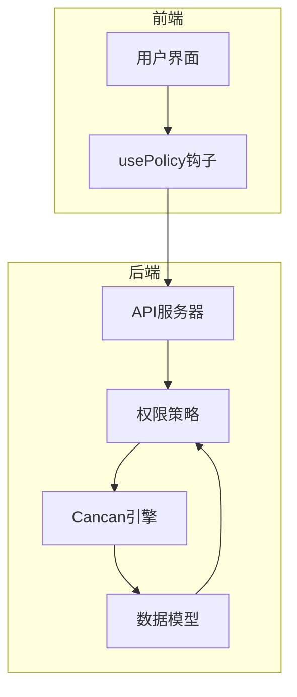
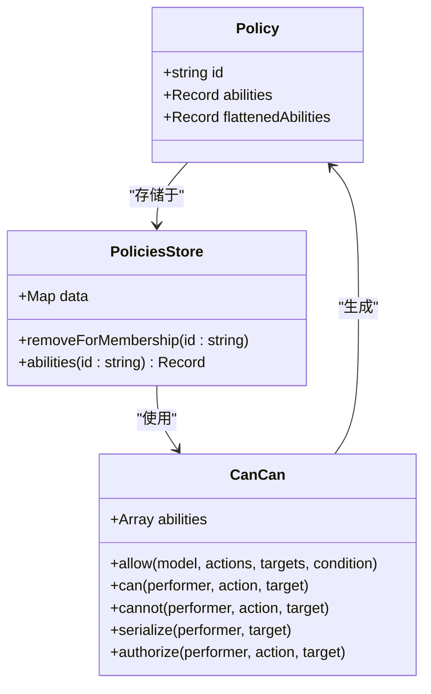
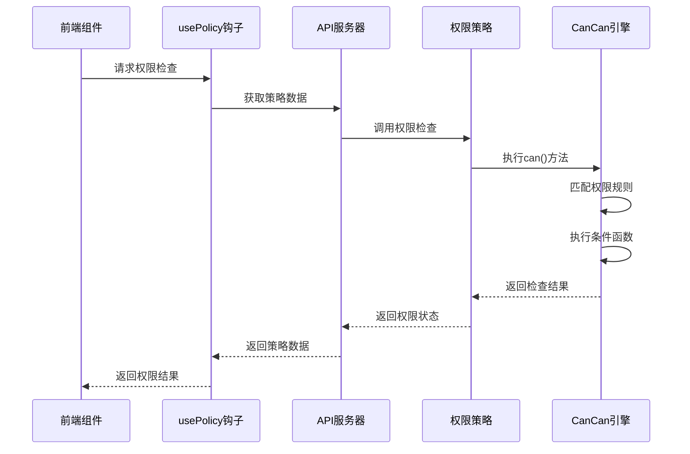
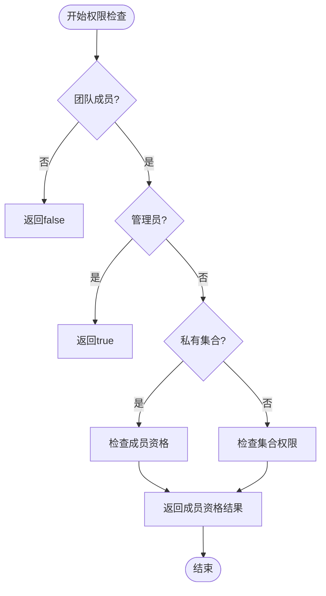
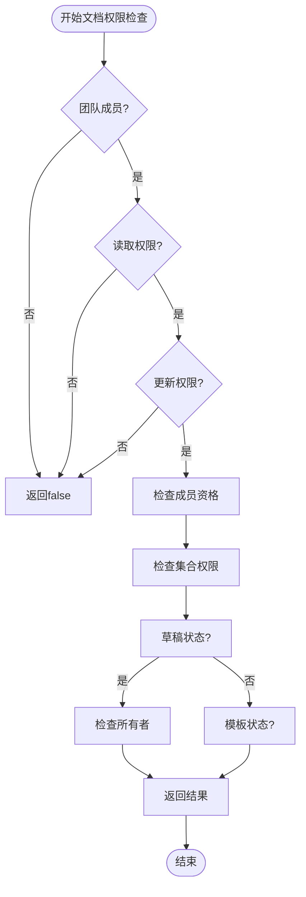
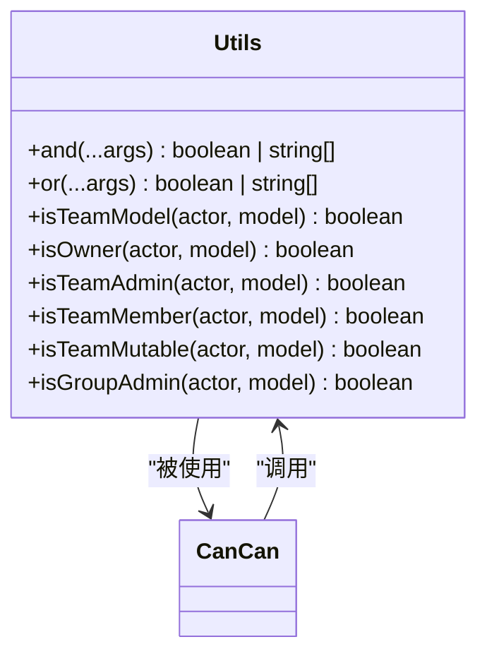
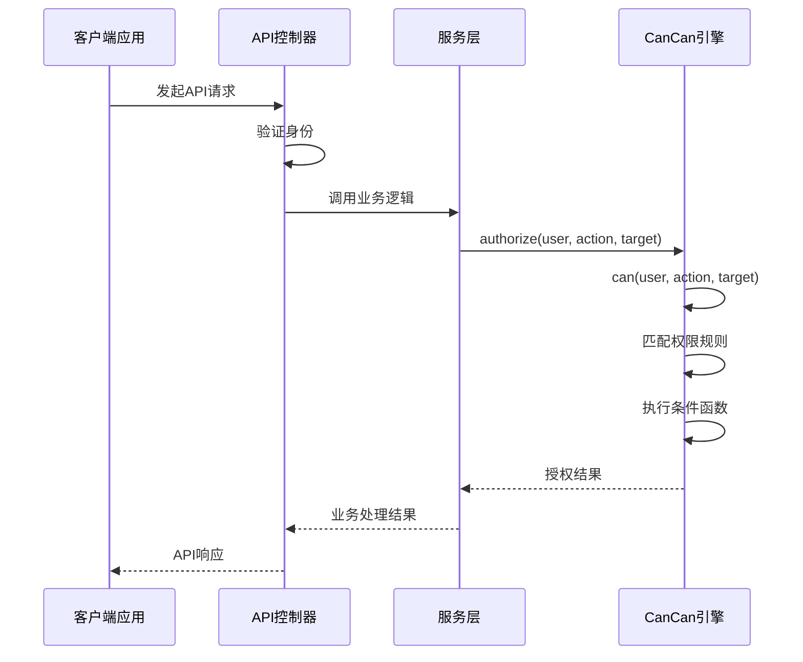

# 权限策略

<cite>
**本文档中引用的文件**  
- [collection.ts](file://server/policies/collection.ts)
- [document.ts](file://server/policies/document.ts)
- [utils.ts](file://server/policies/utils.ts)
- [cancan.ts](file://server/policies/cancan.ts)
- [Policy.ts](file://app/models/Policy.ts)
- [PoliciesStore.ts](file://app/stores/PoliciesStore.ts)
- [usePolicy.ts](file://app/hooks/usePolicy.ts)
</cite>

## 目录
1. [简介](#简介)
2. [权限系统架构](#权限系统架构)
3. [核心组件分析](#核心组件分析)
4. [权限策略实现](#权限策略实现)
5. [权限检查执行流程](#权限检查执行流程)
6. [基于能力的访问控制（CBAC）基础](#基于能力的访问控制（cbac）基础)
7. [扩展与性能优化建议](#扩展与性能优化建议)
8. [故障排除指南](#故障排除指南)

## 简介
本文档详细介绍了baozi项目中基于Cancan模式的访问控制实现。文档重点阐述了权限策略如何定义不同用户角色对资源的操作权限，以及权限检查在API调用中的执行时机。通过分析collection.ts和document.ts中的具体权限规则，以及utils.ts中辅助函数的实现，展示了权限检查的实现模式。为初学者提供基于能力的访问控制（CBAC）的基本概念，同时为经验丰富的开发者提供权限系统扩展和性能优化的建议。

## 权限系统架构

**图表来源**  
- [usePolicy.ts](file://app/hooks/usePolicy.ts#L12-L38)
- [cancan.ts](file://server/policies/cancan.ts#L28-L28)

## 核心组件分析

### 权限模型分析

**图表来源**  
- [Policy.ts](file://app/models/Policy.ts#L6-L61)
- [PoliciesStore.ts](file://app/stores/PoliciesStore.ts#L6-L61)
- [cancan.ts](file://server/policies/cancan.ts#L28-L28)

**章节来源**  
- [Policy.ts](file://app/models/Policy.ts#L6-L61)
- [PoliciesStore.ts](file://app/stores/PoliciesStore.ts#L6-L61)

### 权限检查流程分析

**图表来源**  
- [usePolicy.ts](file://app/hooks/usePolicy.ts#L12-L38)
- [cancan.ts](file://server/policies/cancan.ts#L159-L168)

## 权限策略实现

### 集合权限规则

**图表来源**  
- [collection.ts](file://server/policies/collection.ts#L20-L40)

**章节来源**  
- [collection.ts](file://server/policies/collection.ts#L1-L212)

### 文档权限规则

**图表来源**  
- [document.ts](file://server/policies/document.ts#L20-L40)

**章节来源**  
- [document.ts](file://server/policies/document.ts#L1-L332)

### 辅助函数实现

**图表来源**  
- [utils.ts](file://server/policies/utils.ts#L1-L138)

**章节来源**  
- [utils.ts](file://server/policies/utils.ts#L1-L138)

## 权限检查执行流程

**图表来源**  
- [cancan.ts](file://server/policies/cancan.ts#L221-L225)
- [document.ts](file://server/policies/document.ts#L20-L40)

## 基于能力的访问控制（CBAC）基础

基于能力的访问控制（Capability-Based Access Control, CBAC）是一种安全模型，其中权限被表示为"能力"——一种不可伪造的令牌，授予持有者对特定资源执行特定操作的权限。在baozi项目中，CBAC通过Cancan模式实现，具有以下特点：

1. **能力表示**：权限被定义为"动作-目标"对，如"read-Document"或"update-Collection"
2. **策略存储**：每个资源（集合、文档等）都有一个关联的策略对象，存储其权限规则
3. **条件检查**：权限检查不仅基于角色，还基于复杂的业务逻辑条件
4. **动态评估**：权限在运行时动态评估，而非静态分配

这种模式的优势在于其灵活性和可扩展性，能够处理复杂的权限场景，同时保持代码的清晰和可维护性。

**章节来源**  
- [cancan.ts](file://server/policies/cancan.ts#L28-L28)
- [Policy.ts](file://app/models/Policy.ts#L6-L61)

## 扩展与性能优化建议

### 权限系统扩展建议

1. **自定义权限类型**：通过扩展`utils.ts`中的辅助函数，可以创建更复杂的权限检查逻辑
2. **细粒度权限**：在现有基础上添加更细粒度的权限级别，如"comment-only"或"view-only"
3. **时间限制权限**：实现基于时间的权限控制，如临时访问权限
4. **上下文感知权限**：根据请求上下文（如IP地址、设备类型）动态调整权限

### 性能优化建议

1. **权限缓存**：对频繁访问的权限检查结果进行缓存，减少重复计算
2. **批量权限检查**：实现批量权限检查接口，减少网络往返次数
3. **预加载策略**：在关键路径上预加载相关资源的权限策略，避免延迟
4. **权限索引**：为权限相关的数据库查询创建适当的索引，提高查询效率

**章节来源**  
- [cancan.ts](file://server/policies/cancan.ts#L159-L168)
- [PoliciesStore.ts](file://app/stores/PoliciesStore.ts#L6-L61)

## 故障排除指南

### 常见权限问题及解决方案

1. **权限检查失败但预期成功**
   - 检查相关资源的`withMembership`作用域是否正确应用
   - 验证用户角色和团队成员资格
   - 确认集合或文档的私有状态设置

2. **权限策略未正确加载**
   - 确保在需要权限检查的组件中调用`loadRelations()`
   - 检查网络请求是否成功获取策略数据
   - 验证`usePolicy`钩子的使用是否正确

3. **性能问题**
   - 监控权限检查的响应时间
   - 检查是否存在重复的权限检查调用
   - 考虑实现权限结果缓存

**章节来源**  
- [usePolicy.ts](file://app/hooks/usePolicy.ts#L12-L38)
- [PoliciesStore.ts](file://app/stores/PoliciesStore.ts#L6-L61)
- [cancan.ts](file://server/policies/cancan.ts#L221-L225)