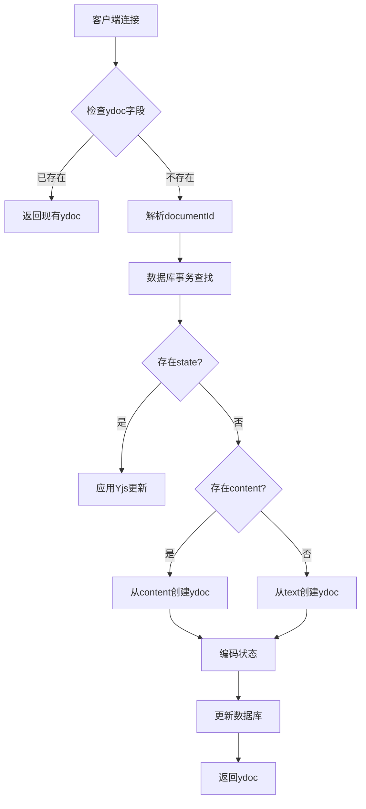
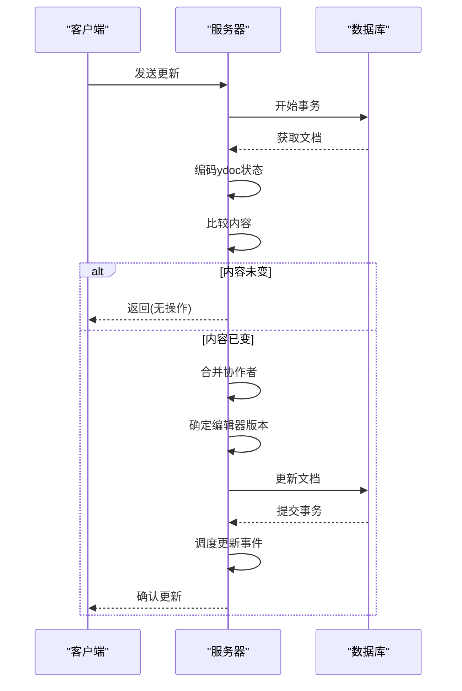
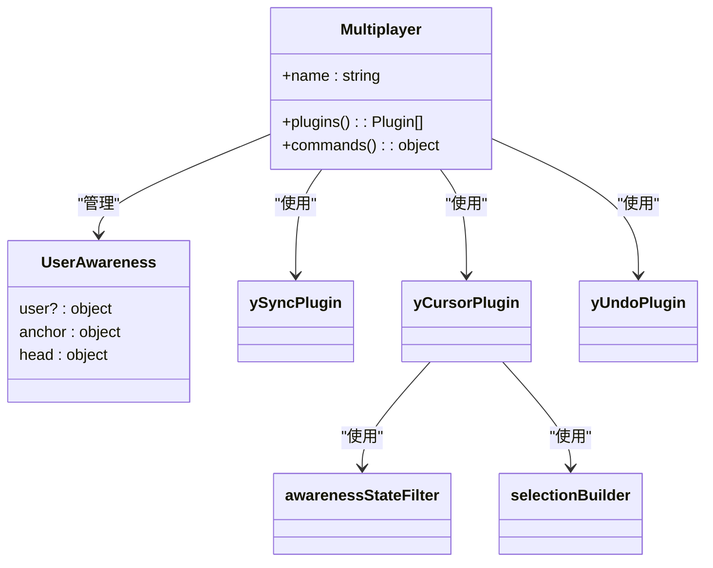
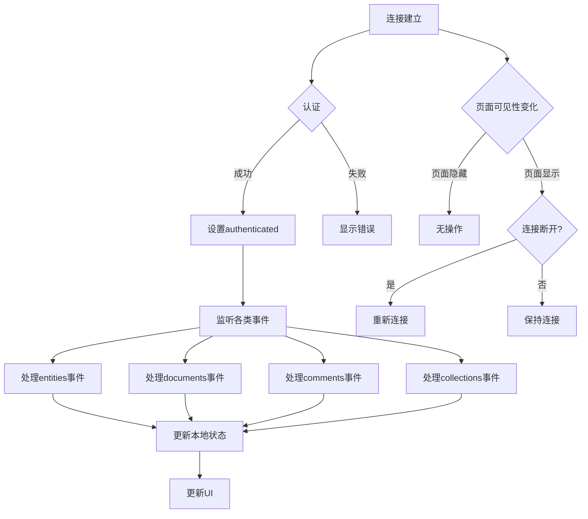

# 实时协作实现细节

<cite>
**本文档引用的文件**   
- [PersistenceExtension.ts](file://server/collaboration/PersistenceExtension.ts)
- [documentCollaborativeUpdater.ts](file://server/commands/documentCollaborativeUpdater.ts)
- [Multiplayer.ts](file://app/editor/extensions/Multiplayer.ts)
- [Document.ts](file://server/models/Document.ts)
- [WebsocketProvider.tsx](file://app/components/WebsocketProvider.tsx)
</cite>

## 目录
1. [引言](#引言)
2. [服务器端持久化实现](#服务器端持久化实现)
3. [并发更新处理机制](#并发更新处理机制)
4. [客户端协作扩展实现](#客户端协作扩展实现)
5. [WebSocket消息处理与错误恢复](#websocket消息处理与错误恢复)
6. [总结与最佳实践](#总结与最佳实践)

## 引言
baozi项目实现了基于Yjs的实时协作编辑功能，通过Hocuspocus服务器扩展和Prosemirror编辑器集成，为用户提供无缝的多人协作体验。本文档深入分析了系统的核心实现细节，重点关注PersistenceExtension和documentCollaborativeUpdater的实现机制，以及Multiplayer扩展在客户端的初始化过程。通过详细解析服务器端的文档加载、状态持久化、并发更新处理，以及客户端的同步插件、光标插件和撤销插件的集成，为开发者提供全面的技术指南和调试优化建议。

## 服务器端持久化实现

PersistenceExtension是Hocuspocus服务器的核心扩展，负责处理文档的加载和状态持久化。当客户端连接到文档时，onLoadDocument钩子被触发，系统首先检查ydoc中是否已存在指定字段，避免重复加载。通过documentName解析出documentId后，系统在数据库事务中查找文档，确保操作的原子性。

文档状态恢复遵循优先级策略：首先检查数据库中的state字段，如果存在则直接应用Yjs更新；否则尝试从content字段创建ydoc；最后作为备选方案，从遗留的text字段创建。这种分层恢复机制确保了向后兼容性和数据完整性。一旦ydoc创建完成，系统会将其状态编码并更新回数据库，实现状态的持久化。

**Diagram sources**
- [PersistenceExtension.ts](file://server/collaboration/PersistenceExtension.ts#L16-L123)

**Section sources**
- [PersistenceExtension.ts](file://server/collaboration/PersistenceExtension.ts#L16-L123)
- [Document.ts](file://server/models/Document.ts#L94-L1314)

## 并发更新处理机制

documentCollaborativeUpdater函数在事务中处理并发更新，确保数据一致性。当文档发生变化时，系统首先获取最新的文档状态，然后编码当前ydoc的状态并与数据库中的content进行比较。如果内容未改变，则跳过持久化操作，避免不必要的数据库写入。

在处理更新时，系统会合并多种来源的协作者信息：包括文档原有的协作者、会话中的协作者以及Yjs文档中的永久用户数据。这种多源合并策略确保了协作者列表的完整性。编辑器版本的处理采用"取新"原则，比较客户端和服务器端的版本号，选择较新的版本存储，确保版本信息的准确性。

**Diagram sources**
- [documentCollaborativeUpdater.ts](file://server/commands/documentCollaborativeUpdater.ts#L24-L113)

**Section sources**
- [documentCollaborativeUpdater.ts](file://server/commands/documentCollaborativeUpdater.ts#L24-L113)
- [PersistenceExtension.ts](file://server/collaboration/PersistenceExtension.ts#L100-L123)

## 客户端协作扩展实现

Multiplayer扩展在客户端初始化Yjs同步所需的各项功能。通过ySyncPlugin实现文档的实时同步，yCursorPlugin处理光标位置和选择范围的显示，yUndoPlugin提供撤销/重做功能。这些插件共同构成了协作编辑的基础。

awarenessStateFilter函数实现了用户在线状态的同步机制。它通过缓存用户的意识状态和最后变更时间，控制远程用户选择范围的显示。系统设置了10秒的选择超时，超过此时间后选择范围将自动隐藏，避免"幽灵选择"现象。选择构建器根据用户最近的活动状态动态调整选择范围的透明度，提供直观的协作反馈。

**Diagram sources**
- [Multiplayer.ts](file://app/editor/extensions/Multiplayer.ts#L0-L122)

**Section sources**
- [Multiplayer.ts](file://app/editor/extensions/Multiplayer.ts#L0-L122)
- [WebsocketProvider.tsx](file://app/components/WebsocketProvider.tsx#L0-L730)

## WebSocket消息处理与错误恢复

系统通过WebSocket实现客户端与服务器的实时通信。WebsocketProvider组件管理连接的生命周期，处理认证、重连和断开连接等事件。当连接关闭时，系统根据关闭代码判断是否应重新连接，并更新UI状态。例如，当文档过大或认证失败时，连接不应自动重试。

错误恢复机制包括连接状态监控和自动重连。系统监听页面可见性变化，在页面重新可见时检查连接状态并重新建立连接。对于编辑器版本不匹配的错误，系统会提示用户刷新页面以获取最新版本。日志记录功能在调试模式下启用，详细记录进出消息，便于问题排查。

**Diagram sources**
- [WebsocketProvider.tsx](file://app/components/WebsocketProvider.tsx#L0-L730)

**Section sources**
- [WebsocketProvider.tsx](file://app/components/WebsocketProvider.tsx#L0-L730)
- [PersistenceExtension.ts](file://server/collaboration/PersistenceExtension.ts#L80-L90)

## 总结与最佳实践
baozi项目的实时协作实现通过服务器端的PersistenceExtension和documentCollaborativeUpdater，以及客户端的Multiplayer扩展，构建了一个高效、可靠的合作编辑系统。服务器端采用事务性操作确保数据一致性，客户端通过Yjs插件提供丰富的协作功能。

开发者在调试时应重点关注：确保数据库事务的正确性，验证ydoc状态编码/解码的准确性，监控WebSocket连接状态，以及处理各种边界情况如文档过大、版本不匹配等。优化建议包括：合理设置连接超时，优化状态序列化性能，以及实现更精细的冲突解决策略。