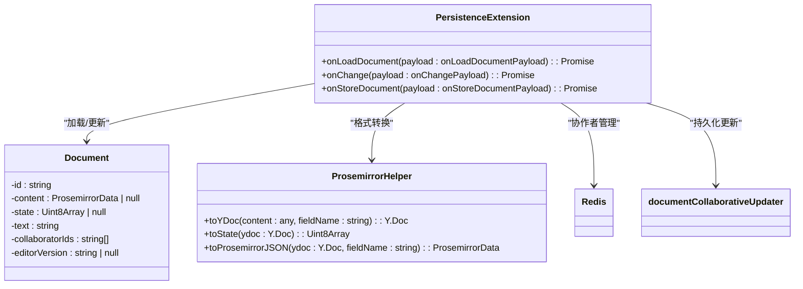
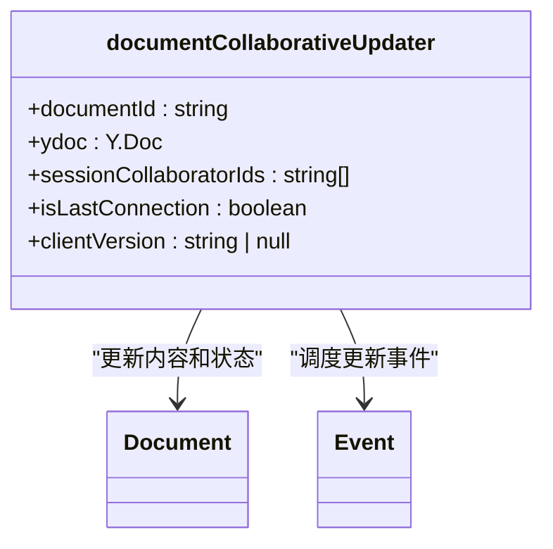
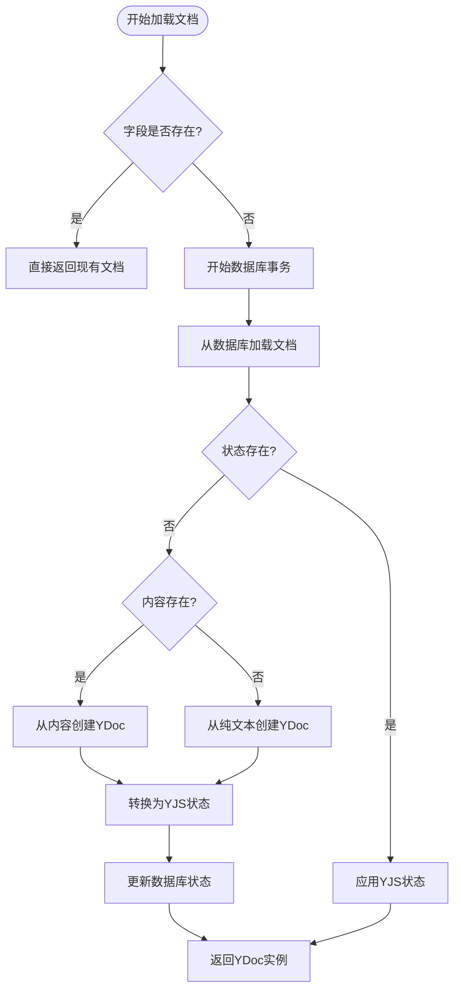
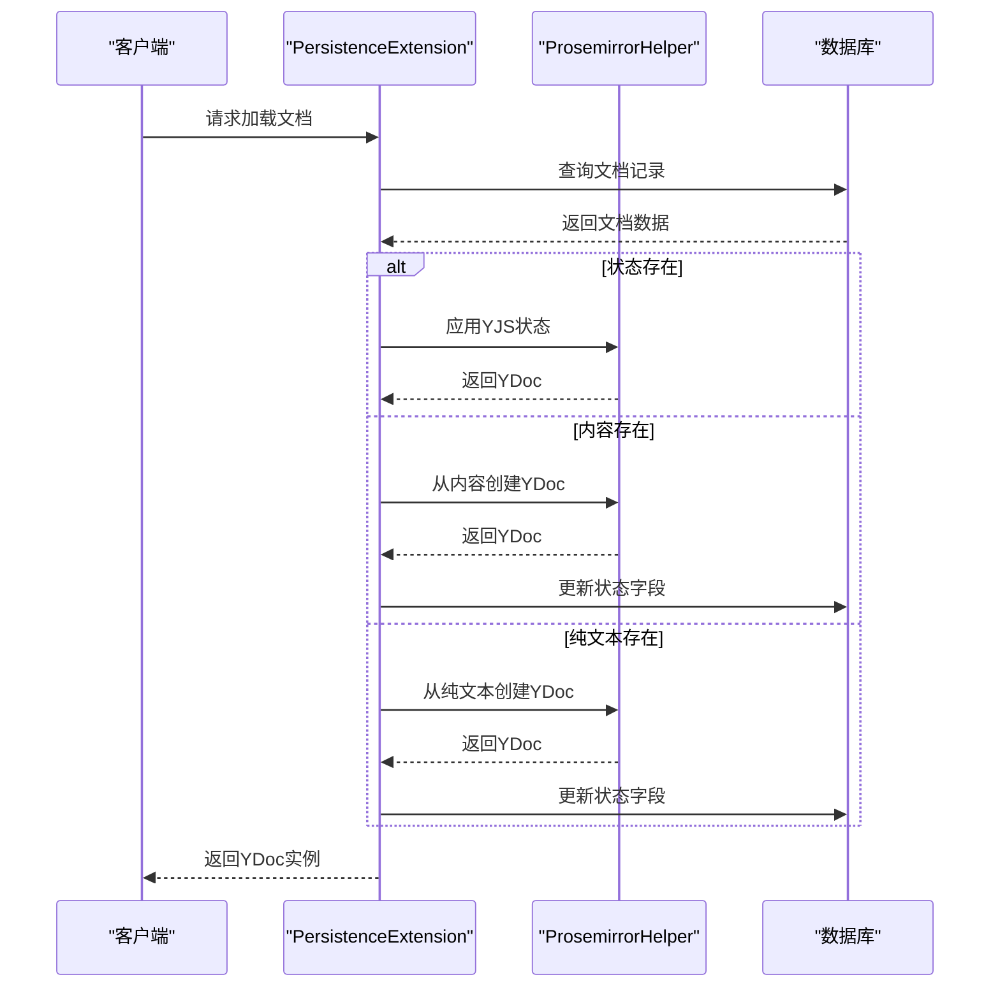
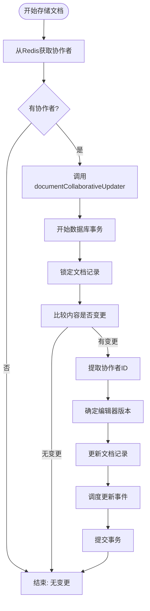
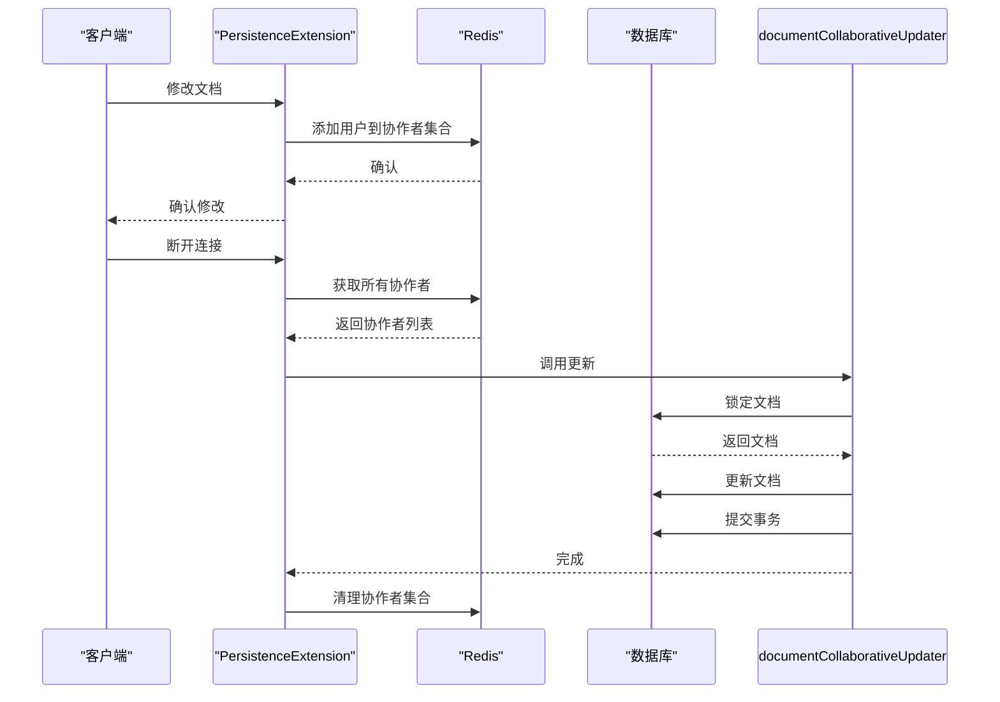
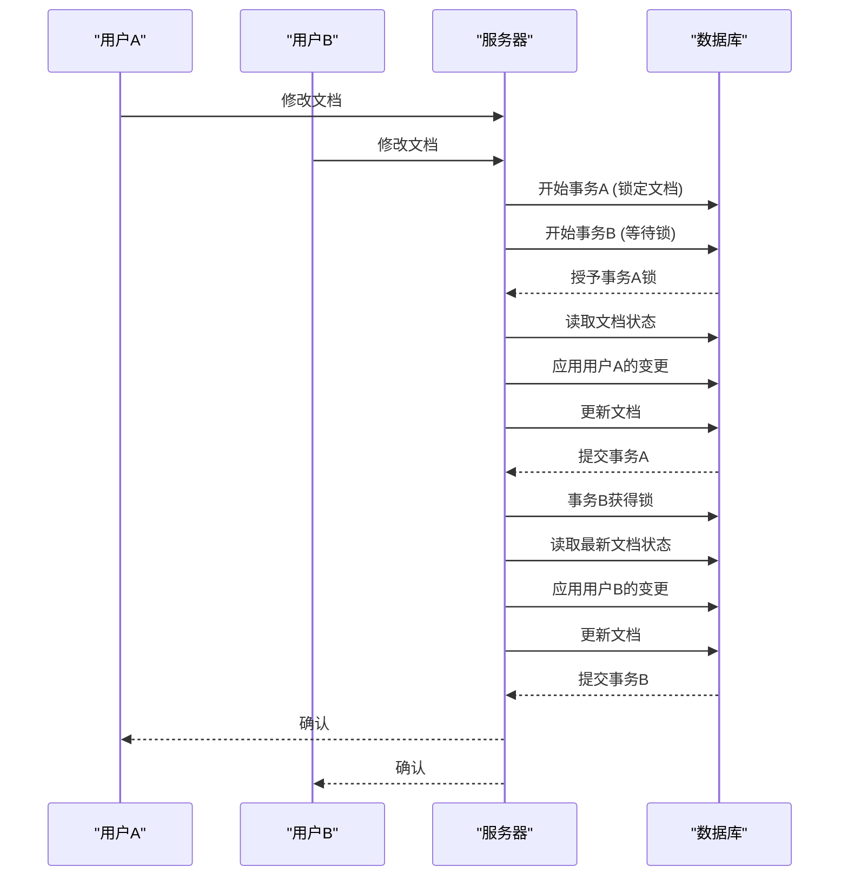
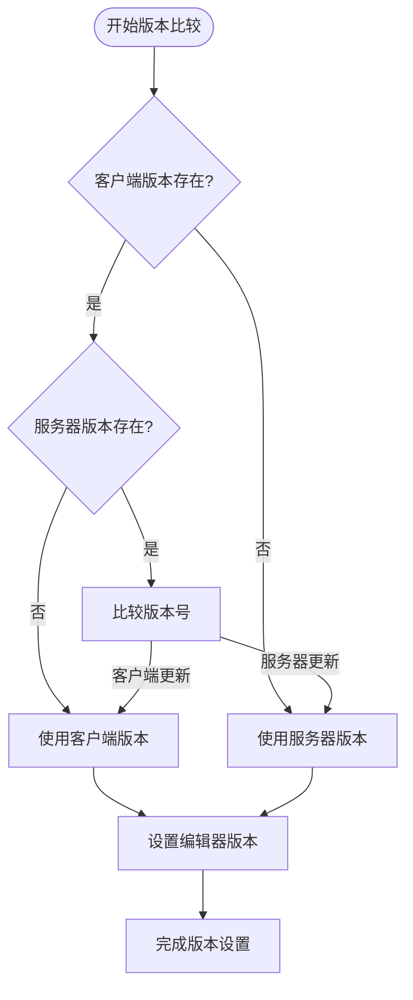
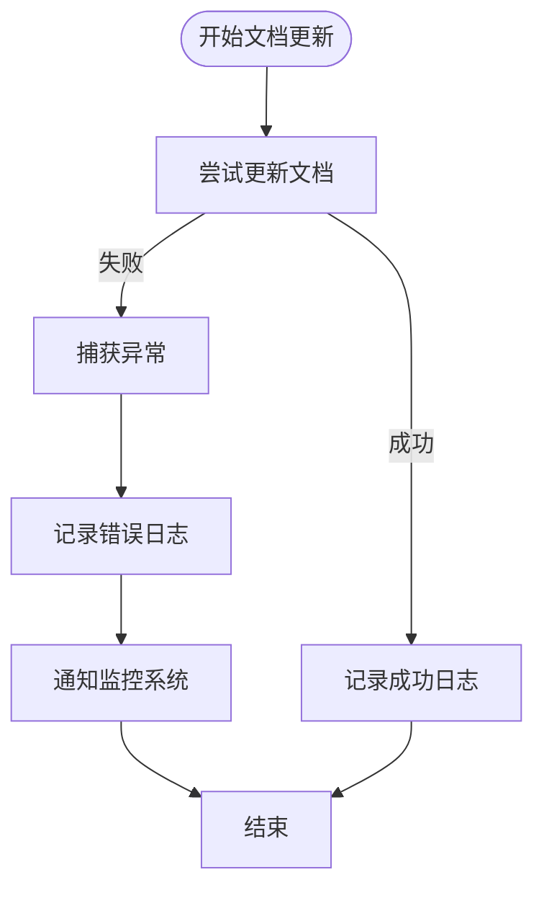

# 数据持久化

<cite>
**Referenced Files in This Document**   
- [PersistenceExtension.ts](file://server/collaboration/PersistenceExtension.ts)
- [documentCollaborativeUpdater.ts](file://server/commands/documentCollaborativeUpdater.ts)
- [ProsemirrorHelper.ts](file://shared/utils/ProsemirrorHelper.ts)
- [Document.ts](file://server/models/Document.ts)
</cite>

## 目录
1. [介绍](#介绍)
2. [核心组件分析](#核心组件分析)
3. [数据持久化机制](#数据持久化机制)
4. [并发更新处理](#并发更新处理)
5. [状态同步与锁机制](#状态同步与锁机制)
6. [错误处理与日志记录](#错误处理与日志记录)
7. [性能优化策略](#性能优化策略)
8. [结论](#结论)

## 介绍
本文档详细分析了baozi项目中实时协作的数据持久化机制，重点探讨了`PersistenceExtension`类的`onLoadDocument`和`onStoreDocument`方法。文档深入解析了服务器端如何通过`onLoadDocument`方法从数据库加载文档状态（state）、内容（content）或纯文本（text）并恢复ydoc，以及`documentCollaborativeUpdater`如何在事务中处理并发更新。同时，文档阐述了Redis如何临时存储会话协作者ID，以及状态更新时的锁机制和事务完整性保障。

## 核心组件分析

### PersistenceExtension
`PersistenceExtension`是Hocuspocus服务器扩展，负责处理文档的加载、存储和变更事件。该扩展实现了`onLoadDocument`、`onChange`和`onStoreDocument`三个核心方法，构成了实时协作数据持久化的基础框架。



**Diagram sources**
- [PersistenceExtension.ts](file://server/collaboration/PersistenceExtension.ts#L16-L123)

**Section sources**
- [PersistenceExtension.ts](file://server/collaboration/PersistenceExtension.ts#L16-L123)

### documentCollaborativeUpdater
`documentCollaborativeUpdater`是一个命令函数，负责在事务中处理文档的协同更新。它接收Y.Doc对象和会话协作者信息，将变更持久化到数据库，并确保数据一致性。



**Diagram sources**
- [documentCollaborativeUpdater.ts](file://server/commands/documentCollaborativeUpdater.ts#L11-L114)

**Section sources**
- [documentCollaborativeUpdater.ts](file://server/commands/documentCollaborativeUpdater.ts#L11-L114)

## 数据持久化机制

### 文档加载流程
`onLoadDocument`方法实现了文档的懒加载机制，优先级从高到低依次为：状态（state）> 内容（content）> 纯文本（text）。这种设计确保了数据的完整性和兼容性。



**Diagram sources**
- [PersistenceExtension.ts](file://server/collaboration/PersistenceExtension.ts#L20-L68)

**Section sources**
- [PersistenceExtension.ts](file://server/collaboration/PersistenceExtension.ts#L20-L68)
- [Document.ts](file://server/models/Document.ts#L351-L356)
- [ProsemirrorHelper.ts](file://shared/utils/ProsemirrorHelper.ts#L50-L655)

### 格式转换流程
`ProsemirrorHelper`提供了在YJS文档和Prosemirror数据格式之间的转换功能，确保了不同系统间的兼容性。



**Diagram sources**
- [PersistenceExtension.ts](file://server/collaboration/PersistenceExtension.ts#L20-L68)
- [ProsemirrorHelper.ts](file://shared/utils/ProsemirrorHelper.ts#L50-L655)

## 并发更新处理

### 文档存储流程
`onStoreDocument`方法处理文档的持久化存储，通过`documentCollaborativeUpdater`命令在事务中安全地更新文档。



**Diagram sources**
- [PersistenceExtension.ts](file://server/collaboration/PersistenceExtension.ts#L91-L122)
- [documentCollaborativeUpdater.ts](file://server/commands/documentCollaborativeUpdater.ts#L24-L113)

**Section sources**
- [PersistenceExtension.ts](file://server/collaboration/PersistenceExtension.ts#L91-L122)
- [documentCollaborativeUpdater.ts](file://server/commands/documentCollaborativeUpdater.ts#L24-L113)

### 协作者管理
系统使用Redis临时存储会话协作者ID，确保在文档更新时能够正确归因修改者。



**Diagram sources**
- [PersistenceExtension.ts](file://server/collaboration/PersistenceExtension.ts#L70-L90)
- [documentCollaborativeUpdater.ts](file://server/commands/documentCollaborativeUpdater.ts#L24-L113)

## 状态同步与锁机制

### 事务完整性保障
系统通过数据库事务和行级锁确保并发更新的数据一致性。



**Diagram sources**
- [documentCollaborativeUpdater.ts](file://server/commands/documentCollaborativeUpdater.ts#L24-L113)
- [Document.ts](file://server/models/Document.ts#L94-L1314)

### 版本管理
系统通过比较客户端和服务器端的编辑器版本，确保使用最新的版本信息。



**Diagram sources**
- [documentCollaborativeUpdater.ts](file://server/commands/documentCollaborativeUpdater.ts#L24-L113)

## 错误处理与日志记录

### 异常处理策略
系统实现了全面的错误处理机制，确保在持久化失败时能够正确记录和处理异常。



**Diagram sources**
- [PersistenceExtension.ts](file://server/collaboration/PersistenceExtension.ts#L100-L115)

### 日志级别与内容
系统使用不同级别的日志记录关键操作，便于故障排查和性能分析。

```mermaid
flowchart TD
Debug([调试日志]) --> |内容| "用户修改文档"
Debug --> |级别| "debug"
Info([信息日志]) --> |内容| "持久化文档变更"
Info --> |级别| "info"
Error([错误日志]) --> |内容| "文档持久化失败"
Error --> |级别| "error"
Error --> |包含| "文档ID"
Error --> |包含| "用户ID"
Error --> |包含| "错误详情"
```

**Diagram sources**
- [PersistenceExtension.ts](file://server/collaboration/PersistenceExtension.ts#L70-L115)
- [documentCollaborativeUpdater.ts](file://server/commands/documentCollaborativeUpdater.ts#L24-L113)

## 性能优化策略

### 数据库查询优化
系统通过合理的查询范围和字段选择，减少数据库负载。

```mermaid
flowchart TD
LoadDoc([加载文档]) --> SelectFields["选择必要字段"]
SelectFields --> |包含| "id"
SelectFields --> |包含| "content"
SelectFields --> |包含| "state"
SelectFields --> |包含| "collaboratorIds"
SelectFields --> |排除| "大文本字段"
SelectFields --> UseScope["使用预定义作用域"]
UseScope --> |withoutState| "排除状态字段"
UseScope --> |withState| "包含状态字段"
UseScope --> ExecuteQuery["执行查询"]
```

**Diagram sources**
- [PersistenceExtension.ts](file://server/collaboration/PersistenceExtension.ts#L20-L68)
- [Document.ts](file://server/models/Document.ts#L94-L1314)

### 缓存与临时存储
系统利用Redis作为临时存储，减少数据库访问频率。

```mermaid
flowchart TD
ModifyDoc([文档修改]) --> UpdateRedis["更新Redis协作者集合"]
UpdateRedis --> |SET| "collaborators:{documentId}"
UpdateRedis --> |MEMBER| "userId"
StoreDoc([存储文档]) --> ReadRedis["读取Redis协作者集合"]
ReadRedis --> |SMEMBERS| "collaborators:{documentId}"
ReadRedis --> ProcessUpdate["处理更新"]
Cleanup([清理]) --> DeleteRedis["删除Redis协作者集合"]
DeleteRedis --> |DEL| "collaborators:{documentId}"
```

**Diagram sources**
- [PersistenceExtension.ts](file://server/collaboration/PersistenceExtension.ts#L70-L90)

## 结论
baozi项目的数据持久化机制通过`PersistenceExtension`和`documentCollaborativeUpdater`的协同工作，实现了高效、可靠的实时协作功能。系统通过优先级加载策略确保了数据的完整性，利用数据库事务和行级锁保障了并发更新的一致性，并通过Redis临时存储优化了性能。该机制为开发者提供了数据一致性维护和故障排查的实用指南，是实时协作系统的核心组成部分。

**Section sources**
- [PersistenceExtension.ts](file://server/collaboration/PersistenceExtension.ts#L16-L123)
- [documentCollaborativeUpdater.ts](file://server/commands/documentCollaborativeUpdater.ts#L11-L114)
- [ProsemirrorHelper.ts](file://shared/utils/ProsemirrorHelper.ts#L50-L655)
- [Document.ts](file://server/models/Document.ts#L94-L1314)