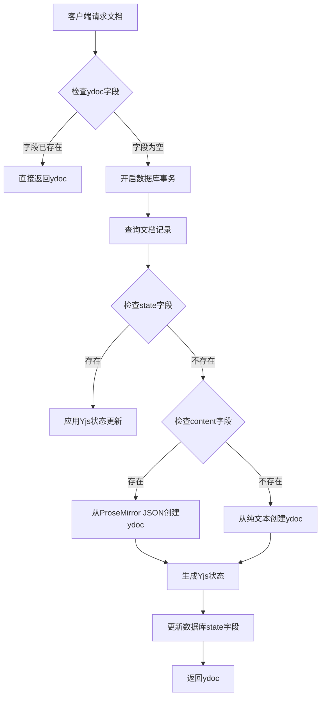
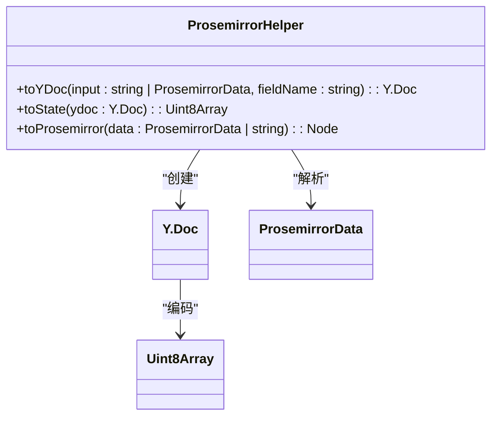
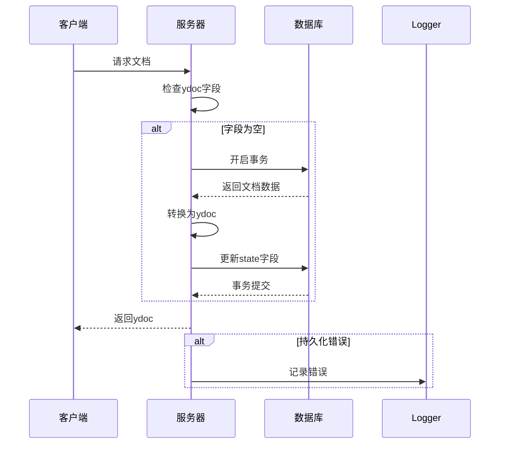
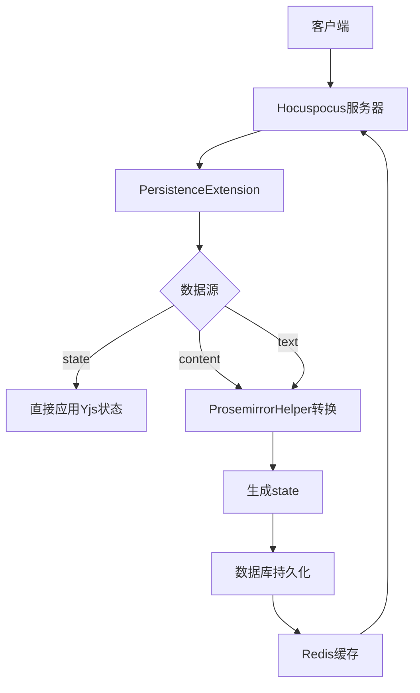

# 文档加载机制

<cite>
**本文档引用的文件**   
- [PersistenceExtension.ts](file://server/collaboration/PersistenceExtension.ts)
- [ProsemirrorHelper.tsx](file://server/models/helpers/ProsemirrorHelper.tsx)
- [Document.ts](file://server/models/Document.ts)
- [Logger.ts](file://server/logging/Logger.ts)
- [redis.ts](file://server/storage/redis.ts)
- [documentCollaborativeUpdater.ts](file://server/commands/documentCollaborativeUpdater.ts)
</cite>

## 目录
1. [引言](#引言)
2. [文档加载流程](#文档加载流程)
3. [ProsemirrorHelper格式转换](#prosemirrorhelper格式转换)
4. [错误处理与日志记录](#错误处理与日志记录)
5. [性能优化策略](#性能优化策略)
6. [大文档加载实践指南](#大文档加载实践指南)
7. [结论](#结论)

## 引言
本文档详细分析了baozi项目中文档加载机制的核心实现，重点解析`PersistenceExtension`类的`onLoadDocument`方法。该机制负责从数据库加载文档状态（state）、内容（content）或纯文本（text），并将其恢复到Yjs协同编辑系统中。文档将深入探讨服务器端如何处理不同数据源的加载、ProsemirrorHelper在格式转换中的关键作用、错误处理机制以及性能优化措施，为开发者提供高效加载大文档的实践指南。

## 文档加载流程

### 核心加载逻辑
文档加载的核心逻辑实现在`PersistenceExtension`类的`onLoadDocument`方法中。该方法作为Hocuspocus协作服务器的扩展，负责在客户端请求文档时从数据库加载数据并初始化Yjs文档。

**Diagram sources**
- [PersistenceExtension.ts](file://server/collaboration/PersistenceExtension.ts#L16-L123)

### 数据源优先级
服务器端遵循明确的数据源优先级策略来恢复文档状态：

1. **Yjs状态（state）**：优先级最高。如果数据库中的`state`字段存在，直接应用Yjs状态更新，这是最高效的恢复方式。
2. **ProseMirror内容（content）**：次优先级。如果`state`不存在但`content`存在，则将ProseMirror JSON结构转换为Yjs文档。
3. **纯文本（text）**：最低优先级。仅当前两者都不存在时，才从纯文本字段创建文档。

这种分层策略确保了数据恢复的效率和完整性。

**Section sources**
- [PersistenceExtension.ts](file://server/collaboration/PersistenceExtension.ts#L16-L123)
- [Document.ts](file://server/models/Document.ts#L338-L339)

## ProsemirrorHelper格式转换

### 核心转换方法
`ProsemirrorHelper`类是格式转换的核心，提供了将不同数据格式转换为Yjs文档的关键方法。

**Diagram sources**
- [ProsemirrorHelper.tsx](file://server/models/helpers/ProsemirrorHelper.tsx#L50-L655)

### 转换过程详解
1. **toYDoc方法**：该方法是转换的入口点。它接受ProseMirror JSON或纯文本输入，使用`prosemirrorToYDoc`库将其转换为Yjs文档。
2. **toState方法**：将Yjs文档编码为二进制状态更新，以便存储到数据库的`state`字段。
3. **toProsemirror方法**：将JSON数据解析为ProseMirror节点，作为`toYDoc`的前置步骤。

当文档首次从`content`或`text`加载时，系统会自动生成`state`并持久化到数据库，从而优化后续的加载性能。

**Section sources**
- [ProsemirrorHelper.tsx](file://server/models/helpers/ProsemirrorHelper.tsx#L58-L68)
- [PersistenceExtension.ts](file://server/collaboration/PersistenceExtension.ts#L16-L123)

## 错误处理与日志记录

### 错误处理机制
系统实现了稳健的错误处理机制，主要体现在：

1. **数据库事务**：整个加载过程在数据库事务中执行，确保数据一致性。
2. **空值检查**：在加载前检查`ydoc`字段是否已存在，避免重复加载。
3. **异常捕获**：在`onStoreDocument`方法中使用try-catch捕获持久化过程中的错误。

**Diagram sources**
- [PersistenceExtension.ts](file://server/collaboration/PersistenceExtension.ts#L16-L123)

### 日志记录策略
系统使用`Logger`类进行详细的日志记录，便于监控和调试：

- **信息日志**：记录文档加载的来源（数据库状态、内容或文本）。
- **调试日志**：记录用户对文档的修改操作。
- **错误日志**：捕获并记录持久化过程中的异常。

**Section sources**
- [Logger.ts](file://server/logging/Logger.ts#L86-L88)
- [PersistenceExtension.ts](file://server/collaboration/PersistenceExtension.ts#L16-L123)

## 性能优化策略

### 数据库优化
1. **作用域查询**：使用`withState`作用域精确查询所需字段，减少数据传输。
2. **行级锁**：在事务中使用行级锁，防止并发修改冲突。

### 缓存机制
系统利用Redis存储文档协作者信息，通过`Document.getCollaboratorKey`方法生成键名，提高协作者状态的读取效率。

**Diagram sources**
- [redis.ts](file://server/storage/redis.ts#L88-L95)
- [PersistenceExtension.ts](file://server/collaboration/PersistenceExtension.ts#L16-L123)

## 大文档加载实践指南

### 最佳实践
1. **确保state字段存在**：对于大文档，确保`state`字段已生成，避免每次加载都进行格式转换。
2. **监控加载时间**：使用日志监控`onLoadDocument`的执行时间，识别性能瓶颈。
3. **优化数据库索引**：确保文档ID等查询字段有适当的数据库索引。

### 潜在问题与解决方案
- **问题**：大文档的格式转换耗时过长。
- **解决方案**：定期触发`documentCollaborativeUpdater`确保`state`字段是最新的。

## 结论
baozi项目的文档加载机制通过分层数据源策略、高效的格式转换和稳健的错误处理，实现了可靠且高性能的文档恢复。`PersistenceExtension`作为核心组件，协调数据库、Yjs和Prosemirror之间的数据流动，而`ProsemirrorHelper`则确保了不同格式间的无缝转换。通过遵循本文档的实践指南，开发者可以有效优化大文档的加载性能，提升用户体验。