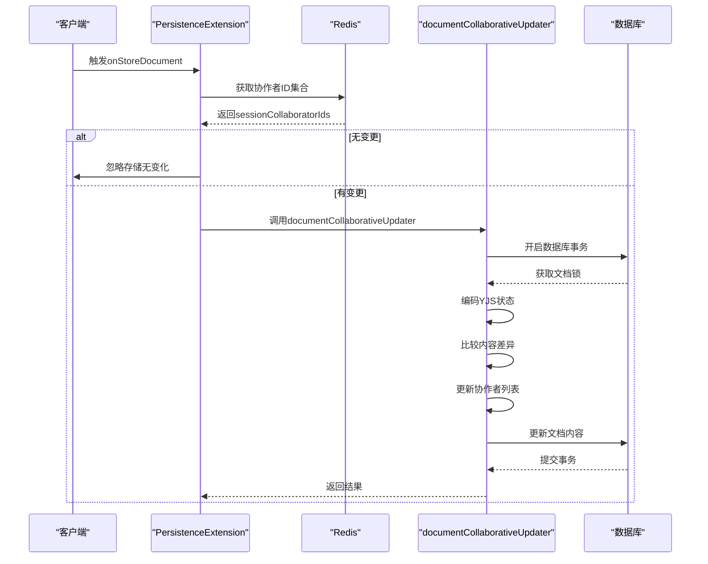
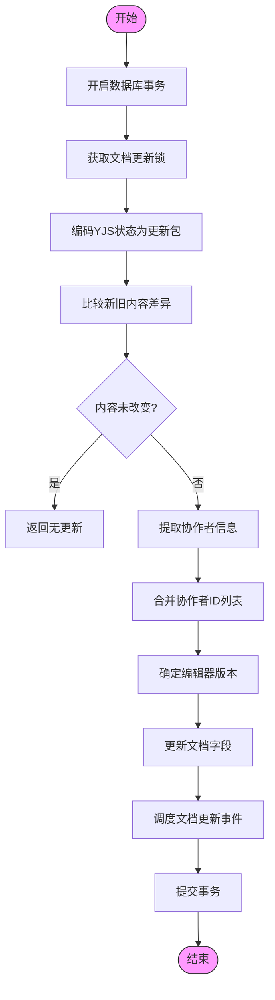
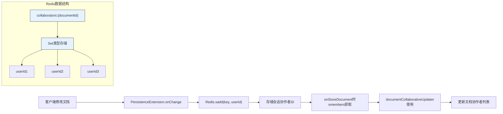
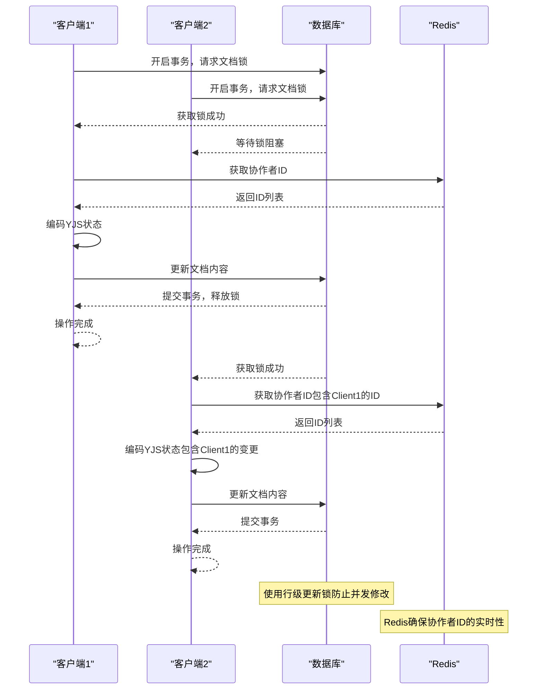
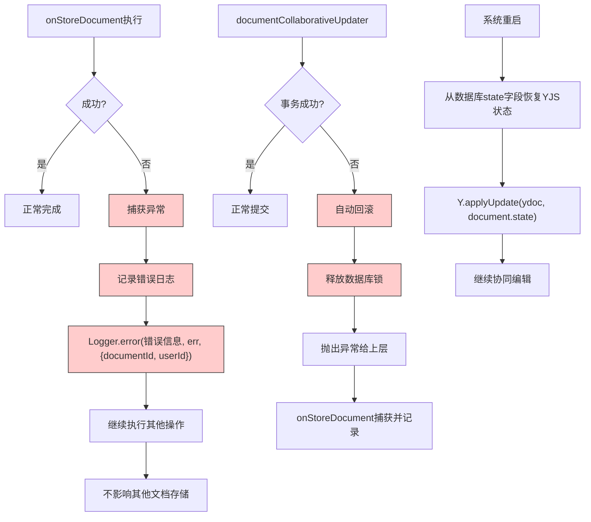
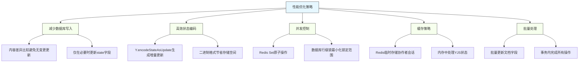
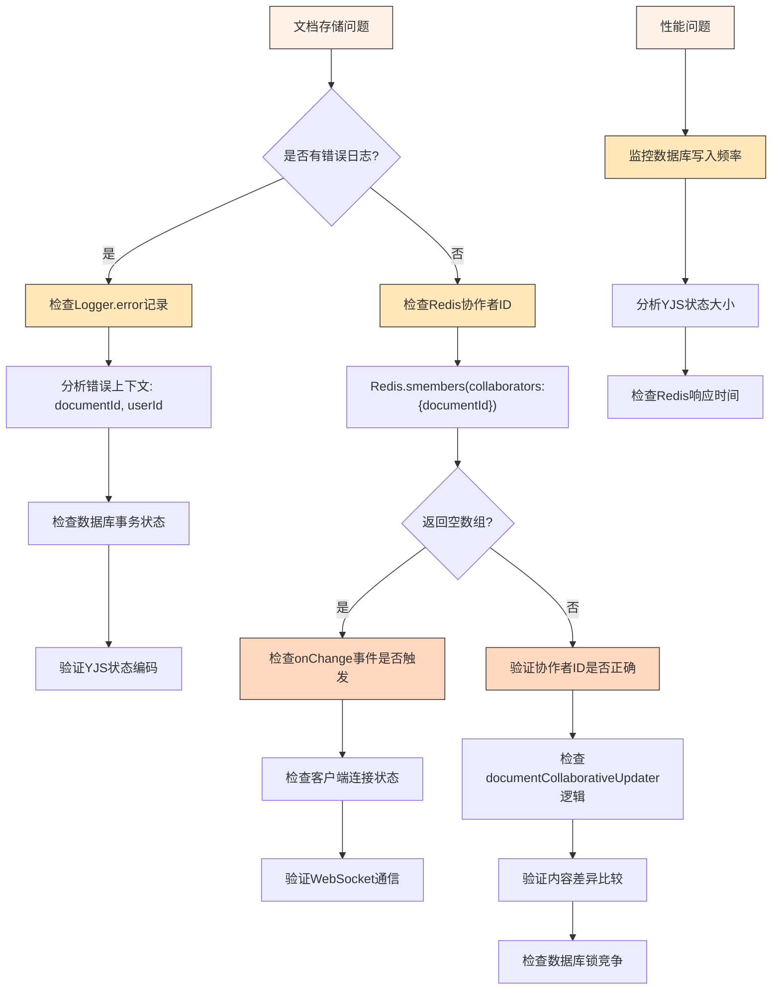

# 文档存储机制

<cite>
**本文档中引用的文件**   
- [PersistenceExtension.ts](file://server/collaboration/PersistenceExtension.ts)
- [documentCollaborativeUpdater.ts](file://server/commands/documentCollaborativeUpdater.ts)
- [Document.ts](file://server/models/Document.ts)
- [ProsemirrorHelper.tsx](file://server/models/helpers/ProsemirrorHelper.tsx)
- [redis.ts](file://server/storage/redis.ts)
</cite>

## 目录
1. [引言](#引言)
2. [核心组件分析](#核心组件分析)
3. [onStoreDocument方法详解](#onstoredocument方法详解)
4. [documentCollaborativeUpdater命令分析](#documentcollaborativeupdater命令分析)
5. [YJS状态编码与数据库事务](#yjs状态编码与数据库事务)
6. [Redis协作者ID存储机制](#redis协作者id存储机制)
7. [并发控制与锁机制](#并发控制与锁机制)
8. [错误恢复机制](#错误恢复机制)
9. [性能优化方案](#性能优化方案)
10. [故障排查指南](#故障排查指南)

## 引言
本文档深入分析baozi项目的文档存储机制，重点解析PersistenceExtension的onStoreDocument方法和documentCollaborativeUpdater命令。文档详细说明服务器端如何通过Y.encodeStateAsUpdate编码ydoc状态，并在数据库事务中安全更新文档内容。同时解释Redis如何临时存储会话协作者ID，以及在状态更新时的锁机制和事务完整性保障策略。阐述存储过程中的并发控制、错误恢复机制和性能优化方案，为开发者提供数据一致性维护和高并发场景下的故障排查指南。

## 核心组件分析

**文档存储机制的核心组件包括：**
- **PersistenceExtension**: 负责文档加载和存储的扩展类
- **documentCollaborativeUpdater**: 处理文档协同更新的命令
- **Document模型**: 定义文档数据结构和业务逻辑
- **Redis存储**: 临时存储协作者会话信息
- **YJS协同编辑**: 实现实时协同编辑的核心技术

**Section sources**
- [PersistenceExtension.ts](file://server/collaboration/PersistenceExtension.ts#L1-L123)
- [documentCollaborativeUpdater.ts](file://server/commands/documentCollaborativeUpdater.ts#L1-L114)
- [Document.ts](file://server/models/Document.ts#L94-L1314)

## onStoreDocument方法详解



**Diagram sources **
- [PersistenceExtension.ts](file://server/collaboration/PersistenceExtension.ts#L91-L122)
- [documentCollaborativeUpdater.ts](file://server/commands/documentCollaborativeUpdater.ts#L24-L113)

**onStoreDocument方法的主要功能：**
1. 从documentName中提取documentId
2. 从请求参数中获取客户端编辑器版本
3. 通过Redis获取当前会话的协作者ID集合
4. 如果没有协作者ID，则跳过存储操作
5. 调用documentCollaborativeUpdater命令处理实际的文档更新

该方法通过Redis临时存储协作者ID，确保只有真正修改过文档的用户才会触发存储操作，避免了不必要的数据库写入。

**Section sources**
- [PersistenceExtension.ts](file://server/collaboration/PersistenceExtension.ts#L91-L122)

## documentCollaborativeUpdater命令分析



**Diagram sources **
- [documentCollaborativeUpdater.ts](file://server/commands/documentCollaborativeUpdater.ts#L24-L113)

**documentCollaborativeUpdater命令的核心逻辑：**
1. 在数据库事务中执行所有操作，确保数据一致性
2. 使用行级锁锁定目标文档，防止并发修改
3. 使用Y.encodeStateAsUpdate将ydoc状态编码为更新包
4. 将YJS文档转换为Prosemirror JSON格式进行内容比较
5. 合并多种来源的协作者ID（包括会话协作者和YJS文档中的永久用户数据）
6. 智能选择最新的编辑器版本号
7. 原子性地更新文档内容、状态、最后修改者、协作者列表和编辑器版本
8. 调度文档更新事件以通知其他系统组件

**Section sources**
- [documentCollaborativeUpdater.ts](file://server/commands/documentCollaborativeUpdater.ts#L24-L113)

## YJS状态编码与数据库事务

```mermaid
classDiagram
class YJS {
+encodeStateAsUpdate(ydoc) Uint8Array
+applyUpdate(ydoc, update) void
+Doc class
+PermanentUserData class
}
class Document {
+content ProsemirrorData
+state Uint8Array
+lastModifiedById string
+collaboratorIds string[]
+editorVersion string
}
class ProsemirrorHelper {
+toYDoc(input, fieldName) Y.Doc
+toState(ydoc) Buffer
+toProsemirror(data) Node
}
YJS --> ProsemirrorHelper : "使用"
ProsemirrorHelper --> Document : "更新"
Document --> YJS : "存储状态"
note right of YJS
YJS库提供高效的协同编辑状态管理
encodeStateAsUpdate生成增量更新包
比存储完整状态更节省空间
end note
note left of Document
文档模型包含两个关键字段：
- content : Prosemirror JSON快照
- state : YJS二进制状态用于协同编辑
end note
```

**Diagram sources **
- [documentCollaborativeUpdater.ts](file://server/commands/documentCollaborativeUpdater.ts#L47-L83)
- [ProsemirrorHelper.tsx](file://server/models/helpers/ProsemirrorHelper.tsx#L25-L35)

**YJS状态编码与存储流程：**
1. **状态编码**: 使用Y.encodeStateAsUpdate将YJS文档状态编码为二进制更新包
2. **内容转换**: 使用yDocToProsemirrorJSON将YJS文档转换为Prosemirror JSON格式
3. **差异检测**: 使用fast-deep-equal比较新旧内容，避免不必要的更新
4. **事务安全**: 在Sequelize事务中执行所有数据库操作
5. **原子更新**: 同时更新content、state、lastModifiedById、collaboratorIds和editorVersion字段

这种设计确保了协同编辑状态和可读内容的一致性，同时通过差异检测减少了数据库写入频率。

**Section sources**
- [documentCollaborativeUpdater.ts](file://server/commands/documentCollaborativeUpdater.ts#L47-L83)
- [ProsemirrorHelper.tsx](file://server/models/helpers/ProsemirrorHelper.tsx#L25-L35)

## Redis协作者ID存储机制



**Diagram sources **
- [PersistenceExtension.ts](file://server/collaboration/PersistenceExtension.ts#L70-L89)
- [Document.ts](file://server/models/Document.ts#L312-L317)
- [redis.ts](file://server/storage/redis.ts#L33-L122)

**Redis协作者ID存储机制特点：**
1. **键命名**: 使用`collaborators:{documentId}`格式的键存储协作者ID
2. **数据结构**: 使用Redis Set数据结构，自动去重且支持高效成员操作
3. **生命周期**: 在onChange事件中添加协作者ID，在onStoreDocument后可能清理
4. **会话跟踪**: 临时存储当前会话中修改过文档的用户ID
5. **高并发**: Redis的原子操作确保多客户端并发修改时的数据一致性

Document模型中的getCollaboratorKey静态方法负责生成Redis键名，确保键名生成逻辑的统一。

**Section sources**
- [PersistenceExtension.ts](file://server/collaboration/PersistenceExtension.ts#L70-L89)
- [Document.ts](file://server/models/Document.ts#L312-L317)
- [redis.ts](file://server/storage/redis.ts#L33-L122)

## 并发控制与锁机制



**Diagram sources **
- [documentCollaborativeUpdater.ts](file://server/commands/documentCollaborativeUpdater.ts#L24-L45)
- [PersistenceExtension.ts](file://server/collaboration/PersistenceExtension.ts#L16-L39)

**并发控制策略：**
1. **数据库锁**: 使用Sequelize的行级更新锁（transaction.LOCK.UPDATE）防止并发修改
2. **事务隔离**: 所有更新操作在单个数据库事务中完成，确保原子性
3. **Redis同步**: 使用Redis Set的原子操作（sadd）记录协作者ID
4. **版本控制**: 通过editorVersion字段跟踪编辑器版本，确保兼容性
5. **幂等性**: 通过内容比较避免重复更新，提高系统稳定性

当多个客户端同时修改同一文档时，数据库锁确保操作的串行化，而Redis记录所有参与修改的用户，确保协作者列表的完整性。

**Section sources**
- [documentCollaborativeUpdater.ts](file://server/commands/documentCollaborativeUpdater.ts#L24-L45)
- [PersistenceExtension.ts](file://server/collaboration/PersistenceExtension.ts#L16-L39)

## 错误恢复机制



**Diagram sources **
- [PersistenceExtension.ts](file://server/collaboration/PersistenceExtension.ts#L115-L122)
- [documentCollaborativeUpdater.ts](file://server/commands/documentCollaborativeUpdater.ts#L24-L113)

**错误恢复机制设计：**
1. **异常捕获**: onStoreDocument方法捕获documentCollaborativeUpdater的所有异常
2. **日志记录**: 使用结构化日志记录错误详情，包括documentId和userId上下文
3. **事务回滚**: 数据库事务在发生错误时自动回滚，保持数据一致性
4. **优雅降级**: 单个文档存储失败不影响其他文档的操作
5. **状态恢复**: 系统重启后可以从数据库的state字段恢复YJS协同编辑状态

这种分层的错误处理机制确保了系统的健壮性，即使在部分操作失败的情况下也能保持整体稳定性。

**Section sources**
- [PersistenceExtension.ts](file://server/collaboration/PersistenceExtension.ts#L115-L122)
- [documentCollaborativeUpdater.ts](file://server/commands/documentCollaborativeUpdater.ts#L24-L113)

## 性能优化方案



**Diagram sources **
- [documentCollaborativeUpdater.ts](file://server/commands/documentCollaborativeUpdater.ts#L47-L83)
- [PersistenceExtension.ts](file://server/collaboration/PersistenceExtension.ts#L91-L122)

**性能优化措施：**
1. **写入优化**: 通过isEqual比较避免无变更的数据库写入
2. **状态编码**: 使用Y.encodeStateAsUpdate生成高效的增量更新包
3. **批量更新**: 在单个数据库操作中更新多个字段，减少IO开销
4. **内存处理**: 在内存中处理YJS状态转换，减少数据库负载
5. **缓存利用**: 使用Redis快速存取协作者会话信息
6. **锁优化**: 使用行级锁而非表级锁，提高并发性能
7. **字段选择**: 通过Sequelize作用域控制字段加载，减少数据传输

这些优化措施共同作用，确保了系统在高并发场景下的性能和响应速度。

**Section sources**
- [documentCollaborativeUpdater.ts](file://server/commands/documentCollaborativeUpdater.ts#L47-L83)
- [PersistenceExtension.ts](file://server/collaboration/PersistenceExtension.ts#L91-L122)

## 故障排查指南



**Diagram sources **
- [PersistenceExtension.ts](file://server/collaboration/PersistenceExtension.ts#L91-L122)
- [documentCollaborativeUpdater.ts](file://server/commands/documentCollaborativeUpdater.ts#L24-L113)
- [redis.ts](file://server/storage/redis.ts#L33-L122)

**常见问题及排查方法：**

### 1. 文档未保存
- **检查点**: Redis中是否存在协作者ID
- **命令**: `redis-cli smembers collaborators:{documentId}`
- **预期**: 应返回修改过文档的用户ID列表
- **若为空**: 检查客户端onChange事件是否正常触发

### 2. 协作者列表不完整
- **检查点**: documentCollaborativeUpdater中的协作者ID合并逻辑
- **来源**: 
  - document.collaboratorIds（数据库中的协作者）
  - sessionCollaboratorIds（Redis中的会话协作者）
  - pudIds（YJS文档中的永久用户数据）
- **验证**: 确保三种来源的ID都被正确合并

### 3. 数据库锁等待超时
- **检查点**: 数据库连接和锁竞争
- **优化**: 
  - 减少事务执行时间
  - 优化查询性能
  - 考虑读写分离

### 4. YJS状态损坏
- **恢复**: 从content字段重新生成state
- **方法**: 使用ProsemirrorHelper.toYDoc和toState方法
- **预防**: 确保事务完整性，避免部分更新

### 5. 性能瓶颈
- **监控指标**:
  - 数据库写入延迟
  - Redis响应时间
  - YJS状态编码耗时
- **优化方向**:
  - 增加数据库连接池大小
  - 优化YJS文档结构
  - 调整Redis配置

**Section sources**
- [PersistenceExtension.ts](file://server/collaboration/PersistenceExtension.ts#L91-L122)
- [documentCollaborativeUpdater.ts](file://server/commands/documentCollaborativeUpdater.ts#L24-L113)
- [redis.ts](file://server/storage/redis.ts#L33-L122)