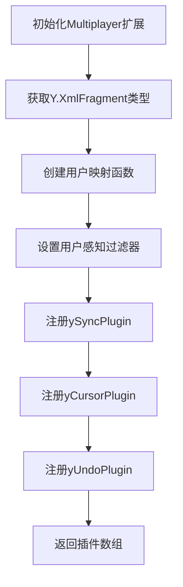
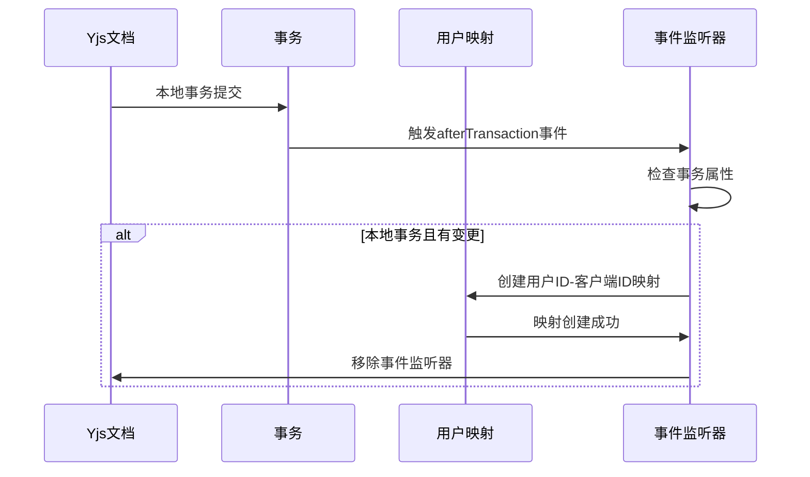

# Yjs与ProseMirror同步机制

<cite>
**Referenced Files in This Document**   
- [Multiplayer.ts](file://app/editor/extensions/Multiplayer.ts)
</cite>

## 目录
1. [简介](#简介)
2. [核心组件](#核心组件)
3. [同步机制分析](#同步机制分析)
4. [事务处理与用户映射](#事务处理与用户映射)
5. [性能优化建议](#性能优化建议)

## 简介
本文档详细分析了Yjs与ProseMirror编辑器之间的双向同步机制，重点探讨了多用户协作环境中文档状态的实时同步实现。文档深入解析了Multiplayer扩展中ySyncPlugin的初始化过程、文档变更监听器的注册机制以及用户ID与客户端ID的映射关系建立。

## 核心组件

本节分析实现Yjs与ProseMirror同步的核心组件及其功能。

**Section sources**
- [Multiplayer.ts](file://app/editor/extensions/Multiplayer.ts#L1-L122)

## 同步机制分析

### ySyncPlugin初始化过程

ySyncPlugin是实现Yjs与ProseMirror双向同步的核心插件。在Multiplayer扩展中，该插件的初始化涉及多个关键步骤：

1. **Y.XmlFragment类型的获取**：通过`doc.get("default", Y.XmlFragment)`方法从Yjs文档中获取默认的XML片段类型，作为ProseMirror文档的同步基础。
2. **同步插件注册**：将ySyncPlugin、yCursorPlugin和yUndoPlugin等Yjs-ProseMirror集成插件添加到编辑器插件列表中。
3. **用户感知设置**：通过`provider.setAwarenessField`方法设置用户感知信息，使协作用户能够看到彼此的光标位置和选择状态。

**Diagram sources**
- [Multiplayer.ts](file://app/editor/extensions/Multiplayer.ts#L25-L30)

### 同步过滤器与选择构建器

系统实现了自定义的感知状态过滤器和选择构建器，以优化多用户协作体验：

- **感知状态过滤器**：通过`awarenessStateFilter`函数，系统能够过滤掉当前用户自身的感知信息，并缓存其他用户的感知状态变化时间。
- **选择构建器**：`selectionBuilder`函数根据用户最近的活动状态动态调整远程用户选择区域的透明度，超过10秒无活动的用户选择区域将自动隐藏。

**Section sources**
- [Multiplayer.ts](file://app/editor/extensions/Multiplayer.ts#L60-L95)

## 事务处理与用户映射

### afterTransaction事件处理

系统通过监听`afterTransaction`事件来建立用户ID与客户端ID的映射关系，这一机制确保了只有实际进行文档修改的客户端才会被记录：

**Diagram sources**
- [Multiplayer.ts](file://app/editor/extensions/Multiplayer.ts#L33-L55)
- [Multiplayer.ts](file://app/editor/extensions/Multiplayer.ts#L98-L99)

### 用户映射逻辑

用户映射的实现包含以下关键逻辑：

1. **条件检查**：仅当事务为本地事务(`tr.local`)、有实际变更(`tr.changed.size > 0`)且客户端ID尚未映射时才执行映射。
2. **永久用户数据**：使用`Y.PermanentUserData`创建持久化的用户数据，确保用户ID与客户端ID的映射关系在会话间保持。
3. **监听器清理**：一旦完成用户映射，立即移除`afterTransaction`事件监听器，避免不必要的性能开销。

**Section sources**
- [Multiplayer.ts](file://app/editor/extensions/Multiplayer.ts#L33-L55)

## 性能优化建议

### 数据一致性调试

为确保数据一致性，建议开发者关注以下方面：

1. **事务监听器管理**：确保在完成用户映射后及时移除事件监听器，防止内存泄漏。
2. **感知状态缓存**：利用`userAwarenessCache`机制减少重复的感知状态比较操作。
3. **选择区域超时**：合理设置`selectionTimeout`参数，平衡用户体验与性能消耗。

### 同步性能优化

1. **延迟映射策略**：采用"仅在用户实际修改文档时才建立映射"的策略，减少不必要的用户ID存储。
2. **选择区域透明度**：通过动态调整远程用户选择区域的透明度，降低视觉干扰同时保持协作感知。
3. **事件过滤优化**：使用`awarenessStateFilter`有效过滤无关的感知状态更新，减少渲染开销。

**Section sources**
- [Multiplayer.ts](file://app/editor/extensions/Multiplayer.ts#L60-L95)