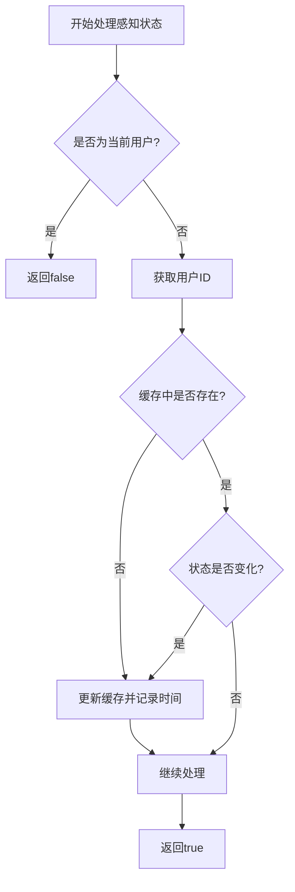
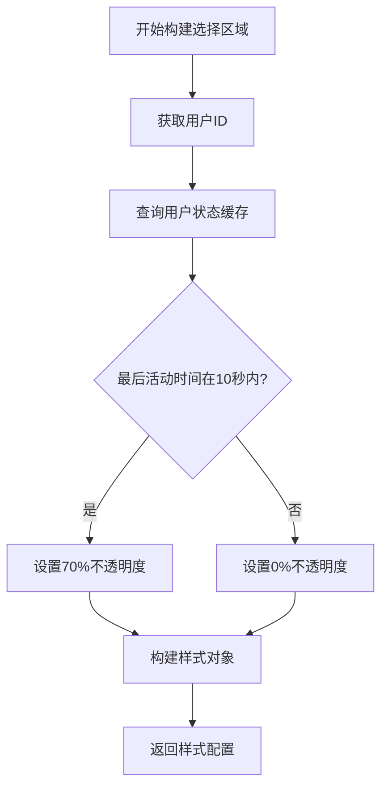
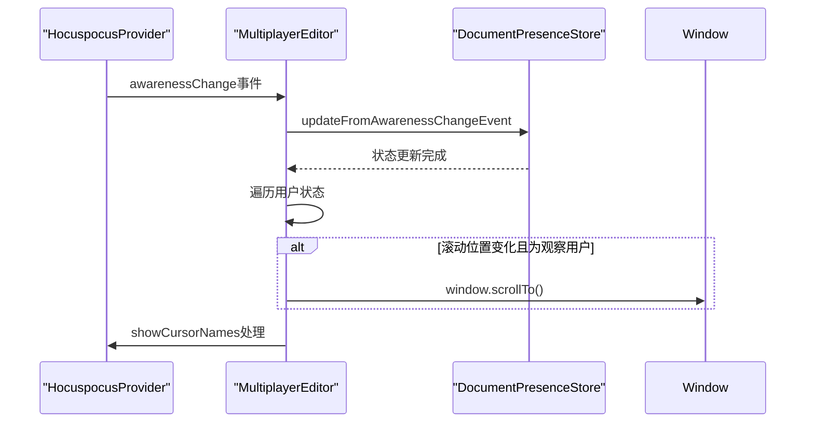

# 光标与在线状态管理

<cite>
**Referenced Files in This Document**  
- [Multiplayer.ts](file://app/editor/extensions/Multiplayer.ts)
- [MultiplayerEditor.tsx](file://app/scenes/Document/components/MultiplayerEditor.tsx)
- [DocumentPresenceStore.ts](file://app/stores/DocumentPresenceStore.ts)
- [Styles.ts](file://shared/editor/components/Styles.ts)
</cite>

## 目录
1. [引言](#引言)
2. [yCursorPlugin配置与使用](#ycursorplugin配置与使用)
3. [awarenessStateFilter状态过滤机制](#awarenessstatefilter状态过滤机制)
4. [selectionBuilder选择区域透明度控制](#selectionbuilder选择区域透明度控制)
5. [MultiplayerEditor感知状态变更监听](#multiplayereditor感知状态变更监听)
6. [光标名称显示与滚动同步](#光标名称显示与滚动同步)
7. [状态缓存与最佳实践](#状态缓存与最佳实践)

## 引言
本文档详细分析了远程用户光标和在线状态管理的实现机制，重点探讨了yCursorPlugin的配置与使用。通过深入研究awarenessStateFilter如何过滤用户感知状态，selectionBuilder如何根据超时策略动态调整选择区域的透明度，以及MultiplayerEditor中awarenessChange事件监听器如何更新用户存在状态和滚动位置，为开发者提供实现高效用户协作体验的最佳实践。

## yCursorPlugin配置与使用

yCursorPlugin是实现多用户协作编辑的核心组件，通过YJS的协同编辑框架提供实时光标和选择区域的可视化功能。该插件在Multiplayer扩展中被配置和初始化，通过provider.awareness实例与YJS的感知层进行交互。

插件的配置主要通过两个关键参数实现：awarenessStateFilter和selectionBuilder。awarenessStateFilter用于过滤和处理用户感知状态的变化，而selectionBuilder则负责构建远程用户选择区域的视觉表现。这种分离的设计模式使得开发者可以灵活地定制用户状态的过滤逻辑和视觉呈现策略。

**Section sources**
- [Multiplayer.ts](file://app/editor/extensions/Multiplayer.ts#L88-L121)

## awarenessStateFilter状态过滤机制

awarenessStateFilter是yCursorPlugin的核心过滤函数，负责决定哪些用户感知状态应该被处理和显示。该函数通过比较当前客户端ID和用户客户端ID，避免处理本地用户的状态变化，从而防止自我感知的循环。

该过滤器还实现了状态缓存机制，通过userAwarenessCache Map存储每个用户的感知状态和最后变更时间。当感知状态发生变化时，缓存会被更新，这为后续的选择区域透明度计算提供了时间戳依据。这种缓存机制不仅提高了性能，还为实现基于时间的状态管理提供了基础。

**Diagram sources**
- [Multiplayer.ts](file://app/editor/extensions/Multiplayer.ts#L59-L77)

**Section sources**
- [Multiplayer.ts](file://app/editor/extensions/Multiplayer.ts#L51-L92)

## selectionBuilder选择区域透明度控制

selectionBuilder函数负责根据超时策略动态调整远程用户选择区域的透明度。该函数通过查询userAwarenessCache中的最后变更时间，判断用户活动是否在指定的超时窗口内（默认10秒）。

如果用户在超时窗口内有活动，选择区域将以70%的不透明度显示；否则，透明度将降为0，实现选择区域的自动隐藏。这种基于时间的动态透明度调整策略有效避免了"幽灵选择"问题，即长时间不活动的用户选择区域仍然可见的情况。

**Diagram sources**
- [Multiplayer.ts](file://app/editor/extensions/Multiplayer.ts#L81-L92)

**Section sources**
- [Multiplayer.ts](file://app/editor/extensions/Multiplayer.ts#L51-L92)

## MultiplayerEditor感知状态变更监听

MultiplayerEditor组件通过监听awarenessChange事件来更新用户存在状态和滚动位置。事件处理程序首先调用presence.updateFromAwarenessChangeEvent方法更新文档存在状态，然后遍历所有状态变化，处理滚动同步逻辑。

当检测到被观察用户的滚动位置变化时，组件会平滑滚动到对应位置，实现跟随查看功能。这种设计使得用户可以实时观察其他协作者的浏览位置，增强了协作体验的直观性。

**Diagram sources**
- [MultiplayerEditor.tsx](file://app/scenes/Document/components/MultiplayerEditor.tsx#L110-L153)

**Section sources**
- [MultiplayerEditor.tsx](file://app/scenes/Document/components/MultiplayerEditor.tsx#L44-L69)

## 光标名称显示与滚动同步

光标名称显示通过CSS类切换机制实现。当awarenessChange事件触发时，组件会临时设置showCursorNames状态为true，并在2秒后重置。这个状态变化会触发Editor组件的className属性更新，从而应用.show-cursor-names CSS规则。

滚动同步机制通过定期将窗口滚动位置同步到感知层实现。syncScrollPosition函数使用throttle进行节流，每250毫秒将当前滚动位置（相对于视口高度的比例）更新到provider的scrollY字段。当其他用户观察当前用户时，他们的客户端会根据这个值进行反向滚动。

**Section sources**
- [MultiplayerEditor.tsx](file://app/scenes/Document/components/MultiplayerEditor.tsx#L297-L331)
- [Styles.ts](file://shared/editor/components/Styles.ts#L395-L469)

## 状态缓存与最佳实践

系统通过多种机制实现高效的状态管理。DocumentPresenceStore使用Map数据结构缓存文档存在状态，并通过setTimeout实现用户离线超时（30秒）。这种基于时间的缓存清理策略平衡了实时性和资源消耗。

最佳实践包括：使用useLayoutEffect初始化Provider避免连接泄漏，通过supportsPassiveListener优化滚动事件性能，以及在React StrictMode下正确处理副作用。这些实践确保了协作功能的稳定性和性能。

**Section sources**
- [DocumentPresenceStore.ts](file://app/stores/DocumentPresenceStore.ts#L0-L53)
- [MultiplayerEditor.tsx](file://app/scenes/Document/components/MultiplayerEditor.tsx#L53-L329)