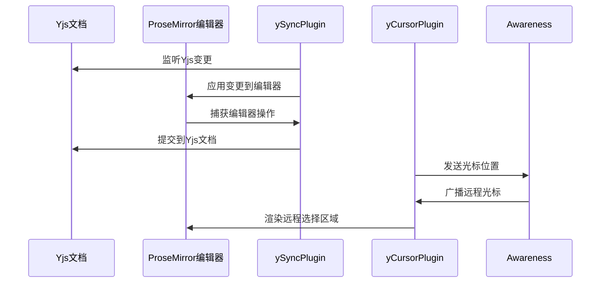
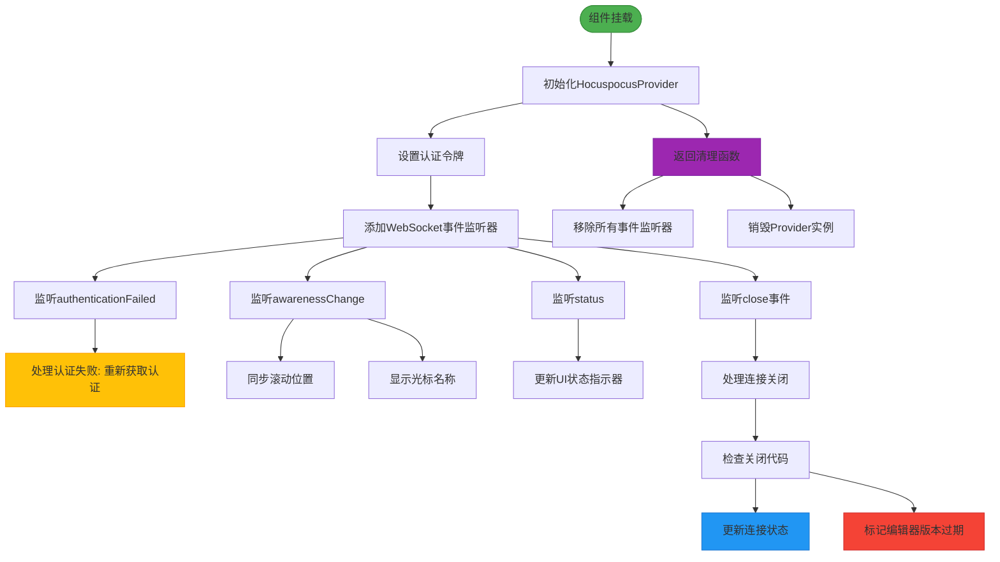
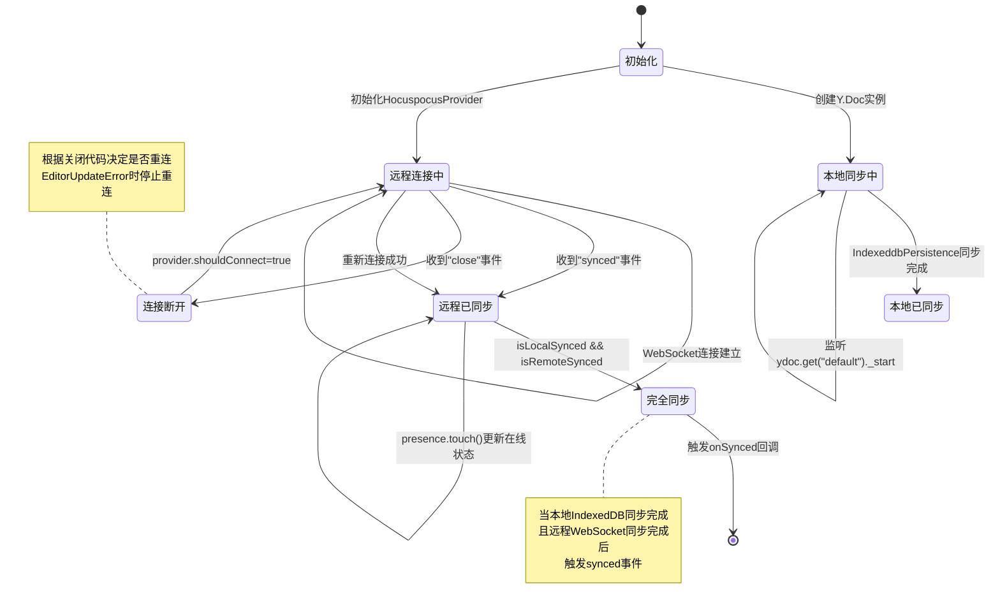
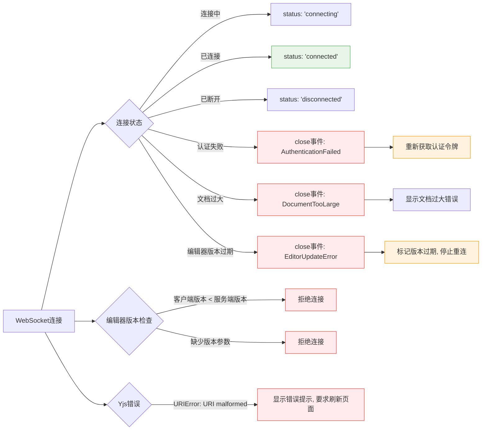

# 状态同步

<cite>
**本文档中引用的文件**  
- [Multiplayer.ts](file://app/editor/extensions/Multiplayer.ts)
- [MultiplayerEditor.tsx](file://app/scenes/Document/components/MultiplayerEditor.tsx)
- [multiplayer.ts](file://shared/editor/lib/multiplayer.ts)
- [EditorVersionExtension.ts](file://server/collaboration/EditorVersionExtension.ts)
</cite>

## 目录
1. [简介](#简介)
2. [核心组件分析](#核心组件分析)
3. [ySyncPlugin与yCursorPlugin机制](#ysyncplugin与ycursorplugin机制)
4. [MultiplayerEditor连接管理](#multiplayereditor连接管理)
5. [同步状态管理与synced事件](#同步状态管理与synced事件)
6. [错误处理与调试指南](#错误处理与调试指南)
7. [性能优化建议](#性能优化建议)

## 简介
baozi项目通过Yjs和ProseMirror的深度集成实现了高效的多人实时协作编辑功能。本系统基于Hocuspocus服务器和y-prosemirror客户端库，构建了一个支持双向同步、光标追踪和版本控制的协同编辑环境。核心机制包括Yjs文档与ProseMirror编辑器的双向绑定、远程用户光标渲染、WebSocket连接管理以及本地与远程状态的同步协调。该架构确保了多用户在编辑同一文档时能够获得实时、一致的编辑体验。

## 核心组件分析

**Section sources**
- [MultiplayerEditor.tsx](file://app/scenes/Document/components/MultiplayerEditor.tsx#L44-L329)
- [Multiplayer.ts](file://app/editor/extensions/Multiplayer.ts#L0-L122)

## ySyncPlugin与yCursorPlugin机制

**Diagram sources**
- [Multiplayer.ts](file://app/editor/extensions/Multiplayer.ts#L88-L121)
- [multiplayer.ts](file://shared/editor/lib/multiplayer.ts#L0-L14)

**Section sources**
- [Multiplayer.ts](file://app/editor/extensions/Multiplayer.ts#L0-L122)

## MultiplayerEditor连接管理

**Diagram sources**
- [MultiplayerEditor.tsx](file://app/scenes/Document/components/MultiplayerEditor.tsx#L110-L153)
- [MultiplayerEditor.tsx](file://app/scenes/Document/components/MultiplayerEditor.tsx#L155-L194)

**Section sources**
- [MultiplayerEditor.tsx](file://app/scenes/Document/components/MultiplayerEditor.tsx#L44-L329)

## 同步状态管理与synced事件

**Diagram sources**
- [MultiplayerEditor.tsx](file://app/scenes/Document/components/MultiplayerEditor.tsx#L110-L153)
- [MultiplayerEditor.tsx](file://app/scenes/Document/components/MultiplayerEditor.tsx#L250-L253)

**Section sources**
- [MultiplayerEditor.tsx](file://app/scenes/Document/components/MultiplayerEditor.tsx#L44-L329)

## 错误处理与调试指南

**Diagram sources**
- [MultiplayerEditor.tsx](file://app/scenes/Document/components/MultiplayerEditor.tsx#L155-L194)
- [EditorVersionExtension.ts](file://server/collaboration/EditorVersionExtension.ts#L0-L46)

**Section sources**
- [MultiplayerEditor.tsx](file://app/scenes/Document/components/MultiplayerEditor.tsx#L44-L329)
- [EditorVersionExtension.ts](file://server/collaboration/EditorVersionExtension.ts#L0-L46)

## 性能优化建议
为确保多人协作编辑的流畅性，建议实施以下优化措施：启用被动事件监听器以提高滚动同步性能，使用节流函数限制滚动位置更新频率，利用IndexeddbPersistence实现本地状态持久化以减少加载时间。在高并发场景下，应监控连接数并实施连接限制策略。对于大型文档，建议实现分块加载机制以避免DocumentTooLarge错误。开发环境中启用调试日志可帮助诊断同步问题，但生产环境应关闭以减少性能开销。

## 结论
baozi项目的状态同步机制通过Yjs、ProseMirror和Hocuspocus的有机结合，构建了一个健壮的多人协作编辑系统。该系统不仅实现了文档内容的实时同步，还提供了光标追踪、版本控制和连接状态管理等高级功能。通过深入理解ySyncPlugin和yCursorPlugin的工作原理，以及MultiplayerEditor组件的连接管理策略，开发者可以有效优化同步性能并快速诊断连接问题。未来可考虑引入更精细的冲突解决策略和离线编辑支持，以进一步提升用户体验。