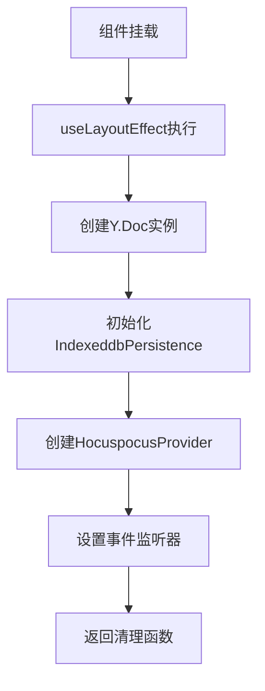
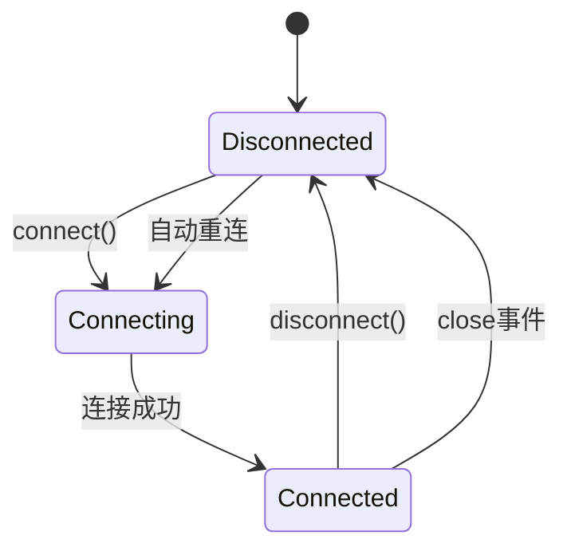
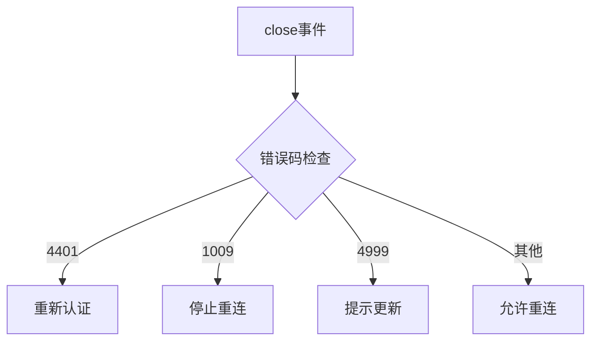
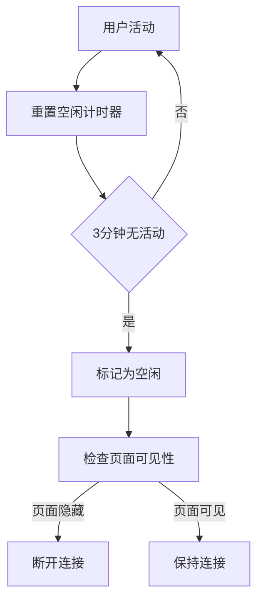
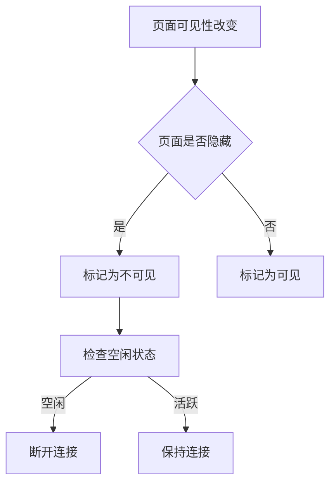
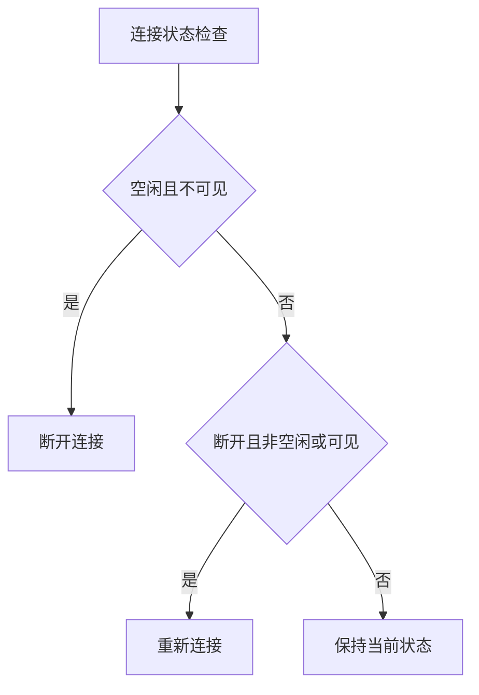
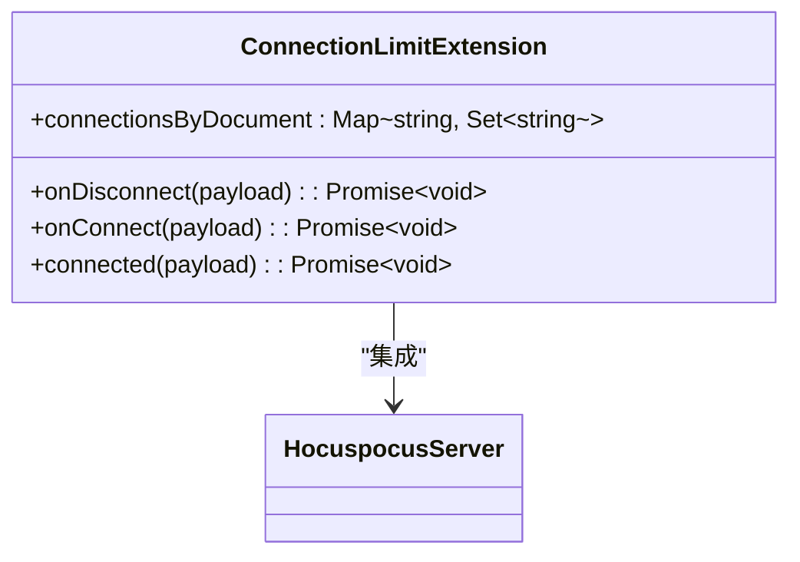
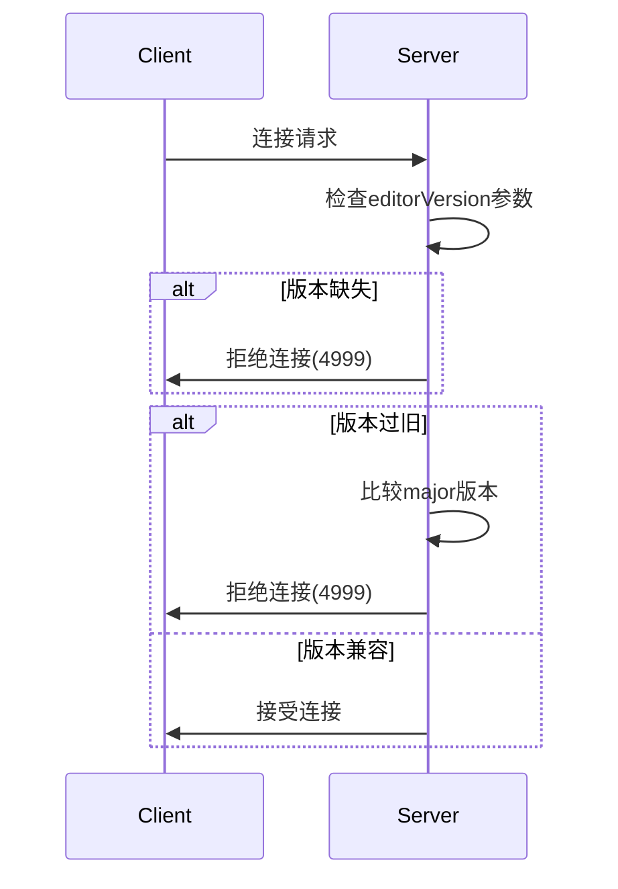

# 连接生命周期管理

<cite>
**Referenced Files in This Document**  
- [MultiplayerEditor.tsx](file://app/scenes/Document/components/MultiplayerEditor.tsx)
- [WebsocketProvider.tsx](file://app/components/WebsocketProvider.tsx)
- [ConnectionLimitExtension.ts](file://server/collaboration/ConnectionLimitExtension.ts)
- [EditorVersionExtension.ts](file://server/collaboration/EditorVersionExtension.ts)
- [CloseEvents.ts](file://shared/collaboration/CloseEvents.ts)
- [usePageVisibility.ts](file://app/hooks/usePageVisibility.ts)
- [useIdle.ts](file://app/hooks/useIdle.ts)
</cite>

## 目录
1. [引言](#引言)
2. [HocuspocusProvider连接机制](#hocuspocusprovider连接机制)
3. [MultiplayerEditor中的连接初始化](#multiplayereditor中的连接初始化)
4. [连接状态与错误处理](#连接状态与错误处理)
5. [节能断开策略](#节能断开策略)
6. [服务器端连接管理](#服务器端连接管理)
7. [总结](#总结)

## 引言
本文档详细分析了协作编辑系统中WebSocket连接的生命周期管理机制，重点阐述了HocuspocusProvider的连接、断开和重连逻辑。通过深入分析MultiplayerEditor组件的实现，揭示了协作提供者的初始化过程、连接状态监听、错误处理以及自动重连机制。文档还解释了在页面不可见或用户空闲时自动断开连接的节能策略，为开发者提供构建稳定协作连接的完整指南。

## HocuspocusProvider连接机制
HocuspocusProvider是协作编辑系统的核心组件，负责管理WebSocket连接的整个生命周期。该组件实现了完整的连接管理功能，包括连接建立、状态监控、错误处理和自动重连。

HocuspocusProvider通过WebSocket协议与服务器建立持久连接，使用`ws`或`wss`协议进行实时通信。连接建立后，客户端与服务器之间保持双向通信通道，允许实时同步文档状态和用户协作信息。

连接管理的关键特性包括：
- 自动重连机制，在网络中断后尝试重新建立连接
- 连接状态监控，实时报告连接状态变化
- 错误处理，对不同类型的连接错误进行分类处理
- 心跳机制，保持连接活跃状态

**Section sources**
- [MultiplayerEditor.tsx](file://app/scenes/Document/components/MultiplayerEditor.tsx#L53-L329)

## MultiplayerEditor中的连接初始化
MultiplayerEditor组件使用`useLayoutEffect`钩子来初始化HocuspocusProvider，确保在React严格模式下不会创建孤立的WebSocket连接。

**Diagram sources**
- [MultiplayerEditor.tsx](file://app/scenes/Document/components/MultiplayerEditor.tsx#L53-L329)

**Section sources**
- [MultiplayerEditor.tsx](file://app/scenes/Document/components/MultiplayerEditor.tsx#L53-L329)

## 连接状态与错误处理
系统通过监听HocuspocusProvider的事件来管理连接状态和处理错误。`status`事件用于更新UI状态，`close`事件处理各种错误情况。

### 连接状态管理

**Diagram sources**
- [MultiplayerEditor.tsx](file://app/scenes/Document/components/MultiplayerEditor.tsx#L53-L329)

### 错误处理机制
系统定义了多种错误码来处理不同的连接问题：

| 错误码 | 错误类型 | 处理方式 |
|-------|--------|--------|
| 4401 | 认证失败 | 重新获取认证信息，重定向到首页 |
| 1009 | 文档过大 | 停止自动重连，显示错误提示 |
| 4999 | 编辑器版本过旧 | 停止自动重连，提示用户更新编辑器 |

**Diagram sources**
- [MultiplayerEditor.tsx](file://app/scenes/Document/components/MultiplayerEditor.tsx#L53-L329)
- [CloseEvents.ts](file://shared/collaboration/CloseEvents.ts)

**Section sources**
- [MultiplayerEditor.tsx](file://app/scenes/Document/components/MultiplayerEditor.tsx#L53-L329)
- [CloseEvents.ts](file://shared/collaboration/CloseEvents.ts)

## 节能断开策略
系统实现了智能的节能策略，在页面不可见或用户空闲时自动断开连接，以节省服务器资源和带宽。

### 空闲检测机制

**Diagram sources**
- [useIdle.ts](file://app/hooks/useIdle.ts)

### 页面可见性检测

**Diagram sources**
- [usePageVisibility.ts](file://app/hooks/usePageVisibility.ts)

### 自动连接管理

**Diagram sources**
- [MultiplayerEditor.tsx](file://app/scenes/Document/components/MultiplayerEditor.tsx#L53-L329)

**Section sources**
- [MultiplayerEditor.tsx](file://app/scenes/Document/components/MultiplayerEditor.tsx#L53-L329)
- [useIdle.ts](file://app/hooks/useIdle.ts)
- [usePageVisibility.ts](file://app/hooks/usePageVisibility.ts)

## 服务器端连接管理
服务器端通过扩展机制管理连接，确保系统稳定性和安全性。

### 连接限制扩展

**Diagram sources**
- [ConnectionLimitExtension.ts](file://server/collaboration/ConnectionLimitExtension.ts)

### 编辑器版本验证

**Diagram sources**
- [EditorVersionExtension.ts](file://server/collaboration/EditorVersionExtension.ts)

**Section sources**
- [ConnectionLimitExtension.ts](file://server/collaboration/ConnectionLimitExtension.ts)
- [EditorVersionExtension.ts](file://server/collaboration/EditorVersionExtension.ts)

## 总结
本文档详细分析了协作编辑系统中WebSocket连接的生命周期管理机制。HocuspocusProvider通过`useLayoutEffect`安全地初始化，避免了React严格模式下的连接问题。系统实现了完善的连接状态管理和错误处理机制，能够根据不同的错误码采取相应的处理策略。

节能策略通过`useIdle`和`usePageVisibility`钩子实现，智能地在用户空闲或页面不可见时断开连接，有效节省资源。服务器端通过扩展机制确保连接的安全性和稳定性，包括连接数限制和编辑器版本验证。

这些机制共同构成了一个稳定、高效的协作编辑系统，为用户提供流畅的实时协作体验，同时确保系统的可扩展性和资源效率。

**Section sources**
- [MultiplayerEditor.tsx](file://app/scenes/Document/components/MultiplayerEditor.tsx#L53-L329)
- [ConnectionLimitExtension.ts](file://server/collaboration/ConnectionLimitExtension.ts)
- [EditorVersionExtension.ts](file://server/collaboration/EditorVersionExtension.ts)