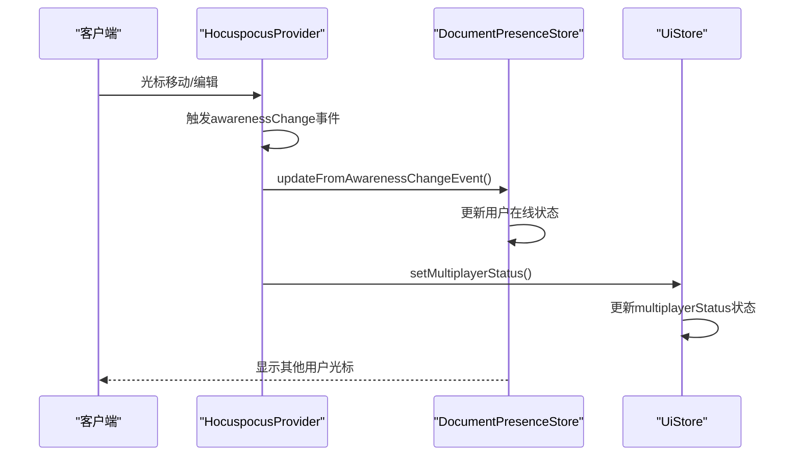
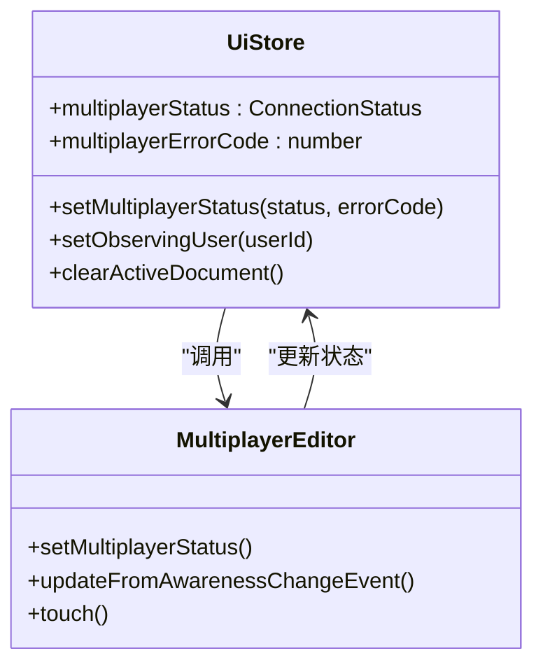
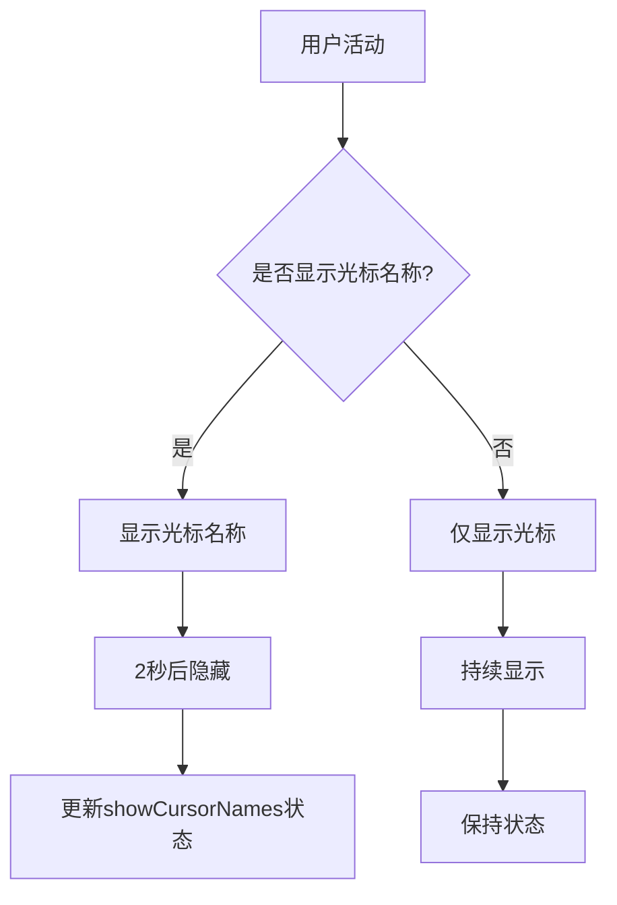
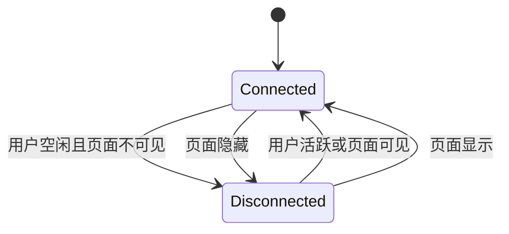
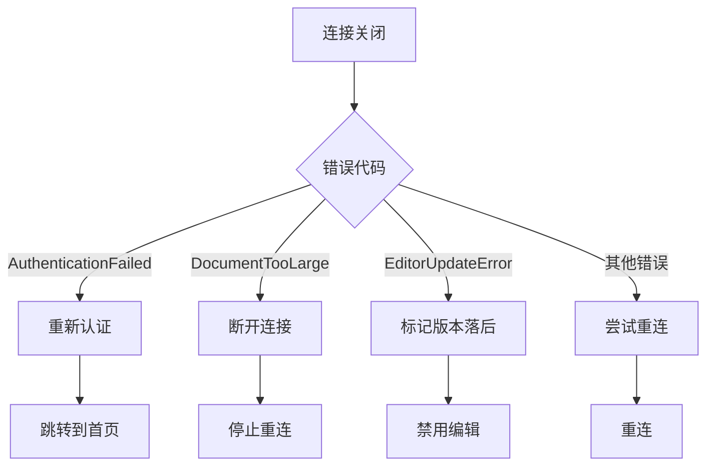

# 在线状态事件处理

<cite>
**Referenced Files in This Document**  
- [MultiplayerEditor.tsx](file://app/scenes/Document/components/MultiplayerEditor.tsx)
- [UiStore.ts](file://app/stores/UiStore.ts)
- [DocumentPresenceStore.ts](file://app/stores/DocumentPresenceStore.ts)
</cite>

## 目录
1. [引言](#引言)
2. [核心组件分析](#核心组件分析)
3. [事件监听与状态同步](#事件监听与状态同步)
4. [用户界面状态管理](#用户界面状态管理)
5. [用户映射与光标显示](#用户映射与光标显示)
6. [空闲断开连接机制](#空闲断开连接机制)
7. [错误处理与恢复](#错误处理与恢复)
8. [结论](#结论)

## 引言
本文档详细分析了协作编辑系统中的在线状态事件处理机制，重点关注MultiplayerEditor组件如何监听awarenessChange事件并更新用户presence状态。文档深入探讨了UiStore中multiplayerStatus的管理机制，包括连接状态、错误处理和用户界面反馈。同时，解释了用户ID到用户名的映射逻辑、光标名称显示策略以及空闲断开连接的实现细节，为开发者提供稳定可靠的协作状态管理方案。

## 核心组件分析

本文档主要分析三个核心组件：MultiplayerEditor、UiStore和DocumentPresenceStore。MultiplayerEditor负责处理协作编辑的实时连接和事件监听，UiStore管理用户界面的全局状态，而DocumentPresenceStore则专门处理文档的用户在线状态。

**Section sources**
- [MultiplayerEditor.tsx](file://app/scenes/Document/components/MultiplayerEditor.tsx#L53-L329)
- [UiStore.ts](file://app/stores/UiStore.ts#L36-L301)
- [DocumentPresenceStore.ts](file://app/stores/DocumentPresenceStore.ts#L0-L53)

## 事件监听与状态同步

MultiplayerEditor组件通过HocuspocusProvider监听awarenessChange事件，实现用户在线状态的实时同步。当用户在文档中移动光标或进行编辑时，系统会触发awarenessChange事件，MultiplayerEditor捕获该事件并更新相关状态。

**Diagram sources**
- [MultiplayerEditor.tsx](file://app/scenes/Document/components/MultiplayerEditor.tsx#L120-L135)
- [DocumentPresenceStore.ts](file://app/stores/DocumentPresenceStore.ts#L42-L69)

**Section sources**
- [MultiplayerEditor.tsx](file://app/scenes/Document/components/MultiplayerEditor.tsx#L120-L135)
- [DocumentPresenceStore.ts](file://app/stores/DocumentPresenceStore.ts#L42-L69)

## 用户界面状态管理

UiStore组件负责管理协作编辑的用户界面状态，特别是multiplayerStatus和multiplayerErrorCode。当连接状态发生变化时，UiStore会更新这些状态，从而触发用户界面的相应反馈。

**Diagram sources**
- [UiStore.ts](file://app/stores/UiStore.ts#L168-L175)
- [MultiplayerEditor.tsx](file://app/scenes/Document/components/MultiplayerEditor.tsx#L177-L182)

**Section sources**
- [UiStore.ts](file://app/stores/UiStore.ts#L168-L175)
- [MultiplayerEditor.tsx](file://app/scenes/Document/components/MultiplayerEditor.tsx#L177-L182)

## 用户映射与光标显示

系统通过用户ID到用户名的映射逻辑，实现协作编辑中的用户识别。当用户在文档中活动时，其光标会显示在相应位置，并可选择性地显示用户名。

**Diagram sources**
- [MultiplayerEditor.tsx](file://app/scenes/Document/components/MultiplayerEditor.tsx#L145-L155)

**Section sources**
- [MultiplayerEditor.tsx](file://app/scenes/Document/components/MultiplayerEditor.tsx#L145-L155)

## 空闲断开连接机制

为了优化资源使用，系统实现了空闲断开连接机制。当用户处于空闲状态或页面不可见时，系统会自动断开实时连接，以节省带宽和服务器资源。

**Diagram sources**
- [MultiplayerEditor.tsx](file://app/scenes/Document/components/MultiplayerEditor.tsx#L245-L265)

**Section sources**
- [MultiplayerEditor.tsx](file://app/scenes/Document/components/MultiplayerEditor.tsx#L245-L265)

## 错误处理与恢复

系统具备完善的错误处理机制，能够处理认证失败、文档过大、编辑器版本错误等常见问题。当发生错误时，系统会根据错误类型采取相应的恢复措施。

**Diagram sources**
- [MultiplayerEditor.tsx](file://app/scenes/Document/components/MultiplayerEditor.tsx#L184-L195)

**Section sources**
- [MultiplayerEditor.tsx](file://app/scenes/Document/components/MultiplayerEditor.tsx#L184-L195)

## 结论
本文档详细分析了协作编辑系统中的在线状态事件处理机制。通过MultiplayerEditor、UiStore和DocumentPresenceStore三个核心组件的协同工作，系统实现了高效的用户在线状态管理。事件监听、状态同步、用户界面反馈、错误处理等机制共同确保了协作编辑的稳定性和可靠性。开发者可以基于此文档理解并优化协作状态管理方案，为用户提供流畅的实时协作体验。