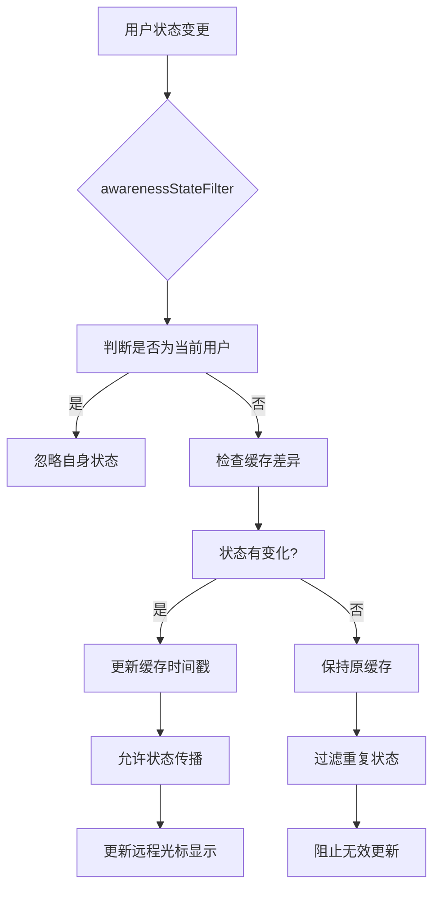
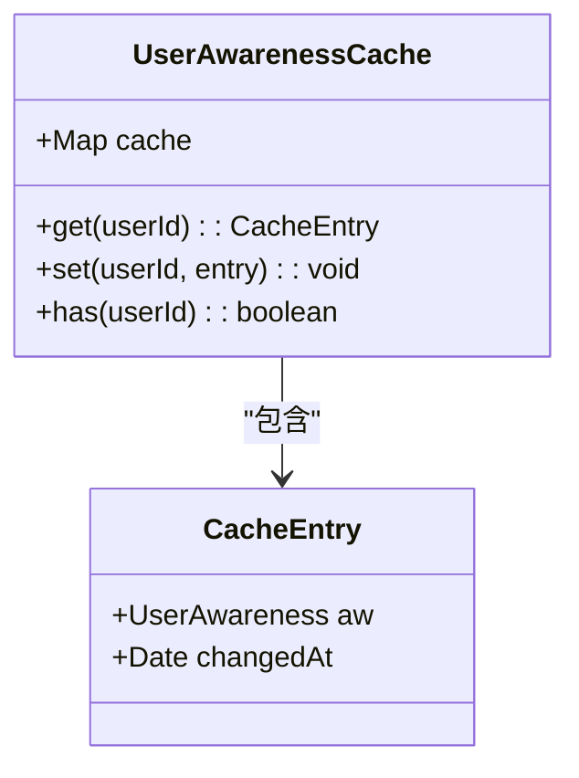
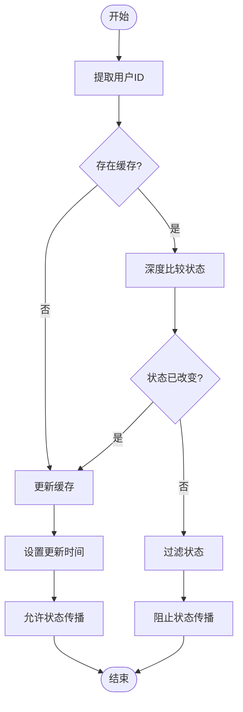
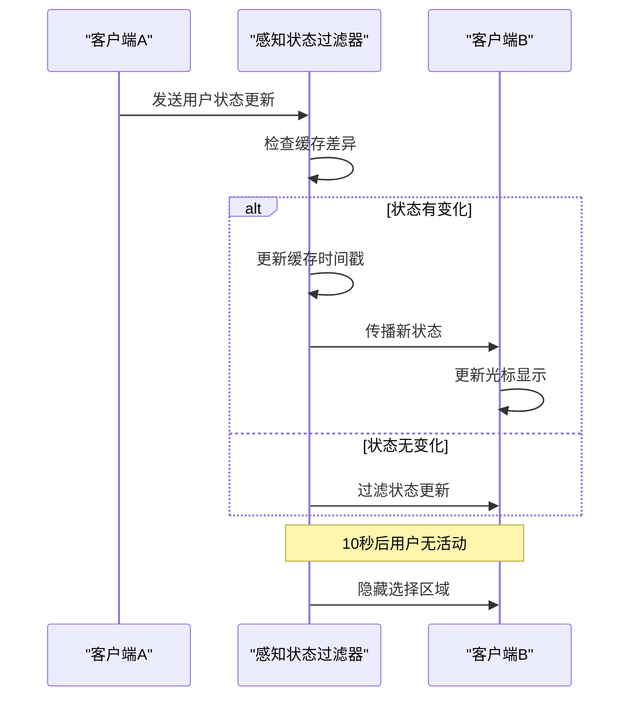

# 感知状态过滤器

<cite>
**本文档中引用的文件**  
- [Multiplayer.ts](file://app/editor/extensions/Multiplayer.ts)
- [time.ts](file://shared/utils/time.ts)
</cite>

## 目录
1. [简介](#简介)
2. [核心机制分析](#核心机制分析)
3. [userAwarenessCache 缓存机制](#userawarenesscache-缓存机制)
4. [状态变更智能去重](#状态变更智能去重)
5. [协作编辑中的状态风暴防护](#协作编辑中的状态风暴防护)
6. [性能优化与最佳实践](#性能优化与最佳实践)

## 简介
感知状态过滤器（awarenessStateFilter）是协作编辑系统中的关键组件，负责拦截和处理用户感知状态的变化。该机制通过智能缓存和去重策略，有效防止高并发场景下的状态风暴，确保多用户协作时的性能稳定和用户体验流畅。

## 核心机制分析
感知状态过滤器作为 y-prosemirror 库中 yCursorPlugin 的一部分，被注入到协作编辑的插件链中。其主要职责是在用户感知状态（awareness）发生变化时进行拦截和处理，决定是否将该状态变更传播给其他客户端。

**Diagram sources**
- [Multiplayer.ts](file://app/editor/extensions/Multiplayer.ts#L59-L77)

**Section sources**
- [Multiplayer.ts](file://app/editor/extensions/Multiplayer.ts#L22-L121)

## userAwarenessCache 缓存机制
系统通过 Map 数据结构实现 userAwarenessCache，为每个用户维护最新的感知状态和对应的时间戳。该缓存结构存储了用户意识对象（UserAwareness）及其最后更新时间（changedAt）。

缓存键值为用户ID，值为包含原始感知状态和时间戳的对象。这种设计使得系统能够快速检索和比较用户状态，避免了频繁的深度比较操作。

**Diagram sources**
- [Multiplayer.ts](file://app/editor/extensions/Multiplayer.ts#L46-L49)

**Section sources**
- [Multiplayer.ts](file://app/editor/extensions/Multiplayer.ts#L46-L58)

## 状态变更智能去重
感知状态过滤器实现了智能去重算法，通过深度比较（使用 lodash/isEqual）来识别真正有意义的状态变更。当接收到新的用户状态时，系统会：

1. 首先排除当前用户自身的状态变更
2. 从缓存中获取该用户的先前状态
3. 使用深度比较判断状态是否真正发生变化
4. 仅在状态有实质性变化时更新缓存和时间戳

这种机制有效过滤了由网络抖动或频繁操作产生的重复状态更新，减少了不必要的渲染和计算开销。

**Diagram sources**
- [Multiplayer.ts](file://app/editor/extensions/Multiplayer.ts#L59-L77)

**Section sources**
- [Multiplayer.ts](file://app/editor/extensions/Multiplayer.ts#L59-L77)

## 协作编辑中的状态风暴防护
在高并发协作场景中，多个用户同时编辑文档会产生大量的状态更新。感知状态过滤器通过以下机制防止状态风暴：

- **时间窗口过滤**：结合 selectionTimeout（10秒）参数，只在用户最近有活动时显示其选择区域
- **选择区域透明度控制**：根据用户最后活动时间动态调整选择区域的透明度
- **过期状态识别**：自动识别并过滤长时间未更新的用户状态

系统设置 selectionTimeout 为 10 * Second.ms，即10秒。超过此时间未更新状态的用户，其选择区域将被隐藏，避免界面混乱。

**Diagram sources**
- [Multiplayer.ts](file://app/editor/extensions/Multiplayer.ts#L81-L92)
- [time.ts](file://shared/utils/time.ts#L0-L3)

**Section sources**
- [Multiplayer.ts](file://app/editor/extensions/Multiplayer.ts#L81-L92)

## 性能优化与最佳实践
为确保高并发场景下的性能稳定，系统采用了多项优化策略：

1. **延迟初始化**：仅在用户实际做出更改后才建立用户ID与客户端ID的映射关系
2. **事件监听清理**：一旦完成用户映射，立即移除 afterTransaction 事件监听器
3. **被动监听器支持**：利用被动事件监听器优化滚动性能
4. **智能连接管理**：在用户空闲或页面不可见时自动断开实时连接

这些优化措施共同确保了系统在大规模协作场景下的响应性和稳定性，为开发者提供了高并发状态同步的最佳实践参考。

**Section sources**
- [Multiplayer.ts](file://app/editor/extensions/Multiplayer.ts#L22-L121)