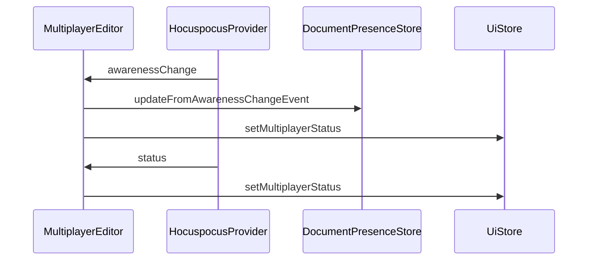

# 用户感知

<cite>
**Referenced Files in This Document**  
- [Multiplayer.ts](file://app/editor/extensions/Multiplayer.ts)
- [DocumentPresenceStore.ts](file://app/stores/DocumentPresenceStore.ts)
- [UiStore.ts](file://app/stores/UiStore.ts)
- [MultiplayerEditor.tsx](file://app/scenes/Document/components/MultiplayerEditor.tsx)
</cite>

## 目录
1. [用户感知状态管理](#用户感知状态管理)
2. [光标选择区域透明度控制](#光标选择区域透明度控制)
3. [多用户编辑器状态监听](#多用户编辑器状态监听)
4. [用户在线状态缓存机制](#用户在线状态缓存机制)
5. [用户ID映射与显示逻辑](#用户id映射与显示逻辑)
6. [空闲断开连接实现](#空闲断开连接实现)

## 用户感知状态管理

`awarenessStateFilter` 函数在 `Multiplayer` 扩展中被用作 YJS 协作系统的感知状态过滤器。该函数通过拦截用户感知状态变化，实现了对用户最后更新时间的跟踪。当检测到当前客户端与用户客户端ID不同时，函数会检查用户ID是否存在，并与 `userAwarenessCache` 缓存中的数据进行比较。如果缓存中不存在该用户的数据或数据已发生变化，则更新缓存中的感知状态和变更时间戳。

这种机制确保了系统能够准确记录每个用户的最后活动时间，为后续的协作功能提供数据支持。通过 `isEqual` 函数进行深度比较，避免了不必要的缓存更新操作，提高了性能效率。

**Section sources**
- [Multiplayer.ts](file://app/editor/extensions/Multiplayer.ts#L59-L77)

## 光标选择区域透明度控制

`selectionBuilder` 函数根据用户最近活动动态调整选择区域的透明度，有效防止了过期光标残留的问题。该函数通过查询 `userAwarenessCache` 获取用户的最后更新时间，并与当前时间进行比较。如果用户在过去10秒内有活动（由 `selectionTimeout` 常量定义），则保持70%的透明度；否则将透明度设置为0，使选择区域不可见。

这种基于时间的动态透明度控制机制确保了协作编辑界面的实时性和准确性，使用户能够清晰地看到其他活跃协作者的光标位置，同时避免了已离线用户光标的视觉干扰。

**Section sources**
- [Multiplayer.ts](file://app/editor/extensions/Multiplayer.ts#L81-L92)

## 多用户编辑器状态监听

`MultiplayerEditor` 组件通过监听 `awarenessChange` 事件来更新用户的在线状态。当感知状态发生变化时，组件会调用 `presence.updateFromAwarenessChangeEvent` 方法更新文档的在线状态，并处理滚动位置同步。如果检测到被观察用户的滚动位置发生变化，系统会平滑滚动到相应位置。

同时，组件还监听连接状态变化，通过 `ui.setMultiplayerStatus` 方法更新多用户状态。当连接关闭时，根据错误代码决定是否重新连接，并在编辑器版本不匹配时设置 `editorVersionBehind` 状态。



**Diagram sources**
- [MultiplayerEditor.tsx](file://app/scenes/Document/components/MultiplayerEditor.tsx#L53-L329)

**Section sources**
- [MultiplayerEditor.tsx](file://app/scenes/Document/components/MultiplayerEditor.tsx#L53-L329)

## 用户在线状态缓存机制

系统通过 `userAwarenessCache` Map 对象实现用户感知状态的缓存。该缓存存储了每个用户的感知状态和最后变更时间，用于判断用户是否处于活跃状态。缓存机制在 `awarenessStateFilter` 函数中被触发，当检测到用户状态变化时更新缓存。

`DocumentPresenceStore` 类负责管理文档的在线用户状态，通过 `touch` 方法更新用户状态并设置超时，30秒无活动后自动移除用户。`updateFromAwarenessChangeEvent` 方法处理来自 YJS 的感知事件，同步更新在线用户列表。

```mermaid
classDiagram
class Multiplayer {
-userAwarenessCache : Map<string, {aw : UserAwareness, changedAt : Date}>
+awarenessStateFilter()
+selectionBuilder()
}
class DocumentPresenceStore {
-data : Map<string, DocumentPresence>
-timeouts : Map<string, Timeout>
+updateFromAwarenessChangeEvent()
+touch()
+leave()
}
class UiStore {
-multiplayerStatus : ConnectionStatus
-multiplayerErrorCode : number
+setMultiplayerStatus()
}
Multiplayer --> DocumentPresenceStore : "updates presence"
Multiplayer --> UiStore : "updates status"
```

**Diagram sources**
- [Multiplayer.ts](file://app/editor/extensions/Multiplayer.ts#L46-L49)
- [DocumentPresenceStore.ts](file://app/stores/DocumentPresenceStore.ts#L0-L132)
- [UiStore.ts](file://app/stores/UiStore.ts#L36-L301)

**Section sources**
- [DocumentPresenceStore.ts](file://app/stores/DocumentPresenceStore.ts#L0-L132)

## 用户ID映射与显示逻辑

系统在用户首次进行文档修改时建立用户ID与客户端ID的映射关系。`assignUser` 函数监听事务事件，当检测到本地事务且客户端ID未映射时，使用 `PermanentUserData` 创建用户映射。这种延迟映射机制避免了为未实际参与编辑的客户端创建不必要的映射。

光标名称显示通过 `showCursorNames` 状态控制，当感知状态变化时临时显示2秒，然后自动隐藏。相关CSS类 `show-cursor-names` 控制光标名称的可见性，提供临时的协作者身份识别。

**Section sources**
- [Multiplayer.ts](file://app/editor/extensions/Multiplayer.ts#L46-L49)
- [MultiplayerEditor.tsx](file://app/scenes/Document/components/MultiplayerEditor.tsx#L53-L329)

## 空闲断开连接实现

系统实现了智能的空闲连接管理机制。通过 `useIdle` 和 `usePageVisibility` 钩子检测用户活动状态和页面可见性，当用户处于空闲状态且页面不可见时，自动断开实时连接以节省资源。当用户恢复活动或页面重新可见时，自动重新连接。

该机制通过 `useEffect` 监听 `remoteProvider`、`isIdle` 和 `isVisible` 状态，根据 WebSocket 连接状态决定是否连接或断开。这种智能连接管理在保证协作实时性的同时，优化了资源使用效率。

**Section sources**
- [MultiplayerEditor.tsx](file://app/scenes/Document/components/MultiplayerEditor.tsx#L53-L329)