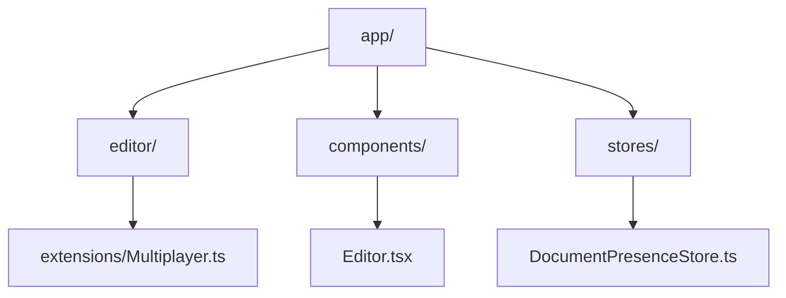
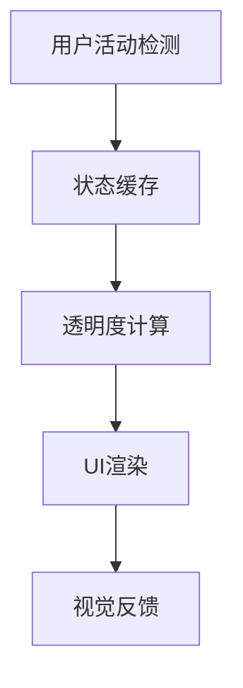
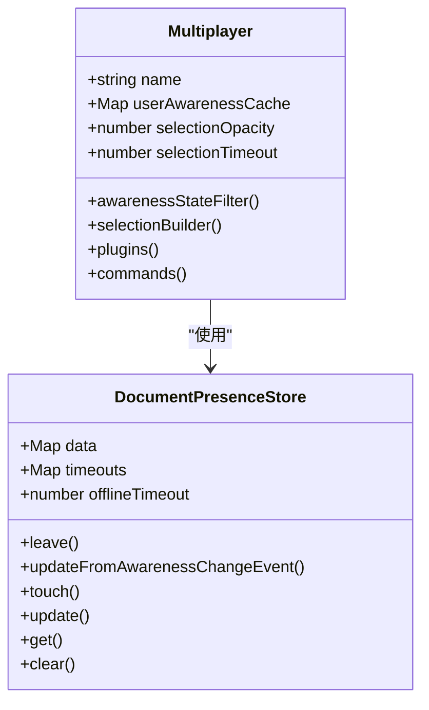
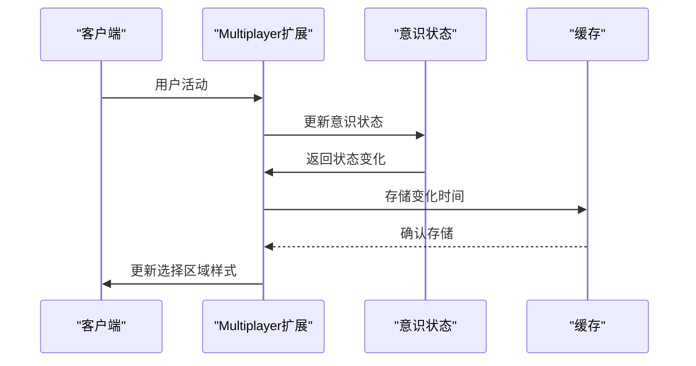
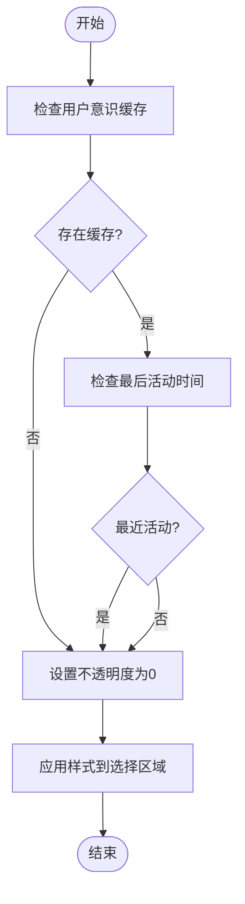
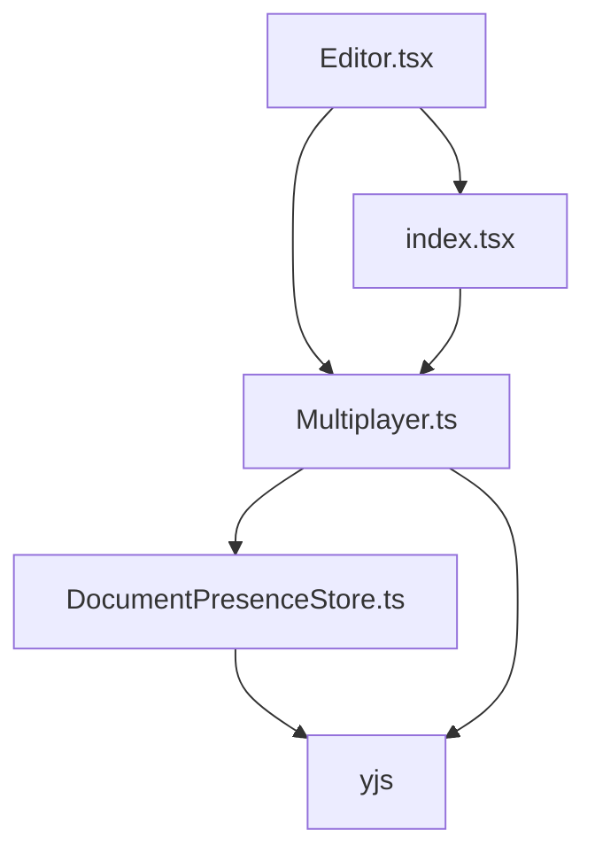

# 选择区域视觉反馈

<cite>
**本文档中引用的文件**  
- [Multiplayer.ts](file://app/editor/extensions/Multiplayer.ts)
- [DocumentPresenceStore.ts](file://app/stores/DocumentPresenceStore.ts)
- [Editor.tsx](file://app/components/Editor.tsx)
- [index.tsx](file://app/editor/index.tsx)
</cite>

## 目录
1. [项目结构](#项目结构)
2. [核心组件](#核心组件)
3. [架构概述](#架构概述)
4. [详细组件分析](#详细组件分析)
5. [依赖分析](#依赖分析)
6. [性能考虑](#性能考虑)
7. [故障排除指南](#故障排除指南)
8. [结论](#结论)

## 项目结构

项目结构展示了核心编辑器功能与协作机制的组织方式，特别是与用户活动状态相关的视觉反馈系统。

**图表来源**  
- [Multiplayer.ts](file://app/editor/extensions/Multiplayer.ts)
- [DocumentPresenceStore.ts](file://app/stores/DocumentPresenceStore.ts)
- [Editor.tsx](file://app/components/Editor.tsx)

**章节来源**  
- [Multiplayer.ts](file://app/editor/extensions/Multiplayer.ts)
- [DocumentPresenceStore.ts](file://app/stores/DocumentPresenceStore.ts)

## 核心组件

该系统的核心是`selectionBuilder`函数，它根据用户的最近活动状态动态调整光标和选择区域的视觉表现。通过计算用户最近活动时间并基于此调整光标透明度和可见性，有效防止了过期光标残留问题。

**章节来源**  
- [Multiplayer.ts](file://app/editor/extensions/Multiplayer.ts#L81-L92)

## 架构概述

系统采用分层架构，将用户状态管理、编辑器渲染和协作功能分离，确保了高内聚低耦合的设计原则。

**图表来源**  
- [Multiplayer.ts](file://app/editor/extensions/Multiplayer.ts)
- [DocumentPresenceStore.ts](file://app/stores/DocumentPresenceStore.ts)

## 详细组件分析

### Multiplayer扩展分析

`Multiplayer`扩展负责处理多人协作中的光标和选择区域视觉反馈。

#### 对象导向组件：

**图表来源**  
- [Multiplayer.ts](file://app/editor/extensions/Multiplayer.ts)
- [DocumentPresenceStore.ts](file://app/stores/DocumentPresenceStore.ts)

#### API/服务组件：

**图表来源**  
- [Multiplayer.ts](file://app/editor/extensions/Multiplayer.ts#L51-L92)

#### 复杂逻辑组件：

**图表来源**  
- [Multiplayer.ts](file://app/editor/extensions/Multiplayer.ts#L81-L92)

**章节来源**  
- [Multiplayer.ts](file://app/editor/extensions/Multiplayer.ts)
- [DocumentPresenceStore.ts](file://app/stores/DocumentPresenceStore.ts)

## 依赖分析

系统依赖关系清晰，各组件之间通过定义良好的接口进行通信。

**图表来源**  
- [Multiplayer.ts](file://app/editor/extensions/Multiplayer.ts)
- [DocumentPresenceStore.ts](file://app/stores/DocumentPresenceStore.ts)
- [Editor.tsx](file://app/components/Editor.tsx)

**章节来源**  
- [Multiplayer.ts](file://app/editor/extensions/Multiplayer.ts)
- [DocumentPresenceStore.ts](file://app/stores/DocumentPresenceStore.ts)
- [Editor.tsx](file://app/components/Editor.tsx)

## 性能考虑

系统在性能方面进行了优化，通过缓存机制减少重复计算，使用节流技术避免频繁的状态更新。

**章节来源**  
- [Multiplayer.ts](file://app/editor/extensions/Multiplayer.ts)
- [DocumentPresenceStore.ts](file://app/stores/DocumentPresenceStore.ts)

## 故障排除指南

当出现光标残留或选择区域显示异常时，应检查以下方面：

**章节来源**  
- [Multiplayer.ts](file://app/editor/extensions/Multiplayer.ts#L51-L92)
- [DocumentPresenceStore.ts](file://app/stores/DocumentPresenceStore.ts)

## 结论

该系统通过精心设计的`selectionBuilder`机制，实现了基于用户活动状态的动态视觉反馈，提升了协作体验。

**章节来源**  
- [Multiplayer.ts](file://app/editor/extensions/Multiplayer.ts)
- [DocumentPresenceStore.ts](file://app/stores/DocumentPresenceStore.ts)