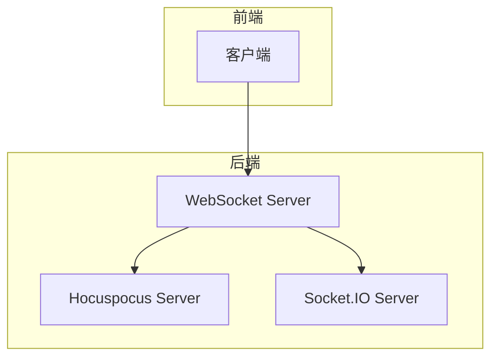
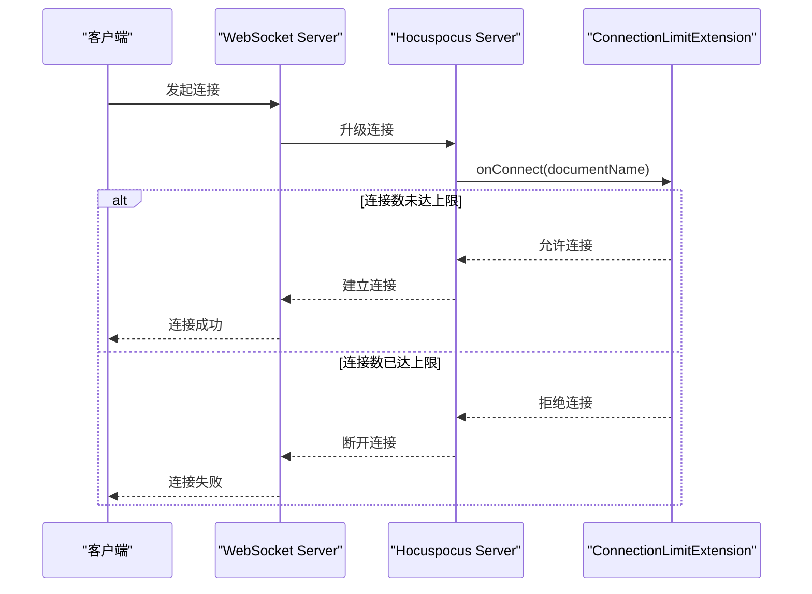
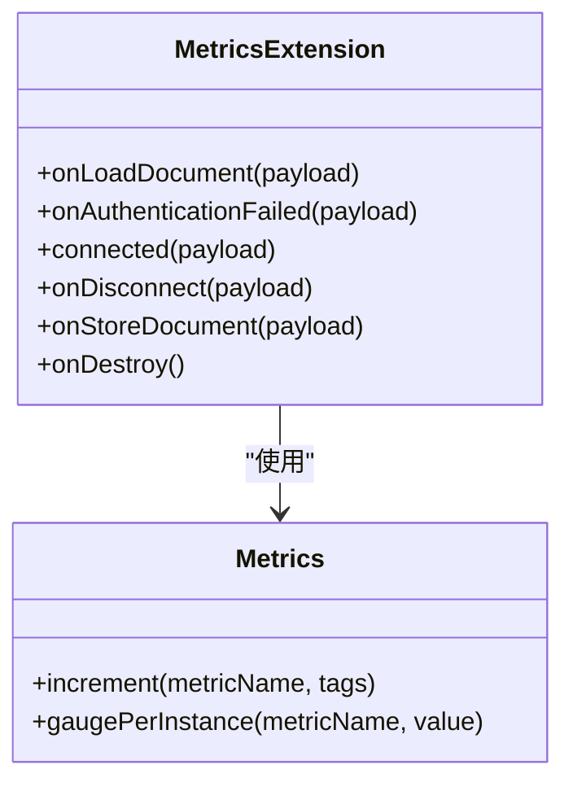
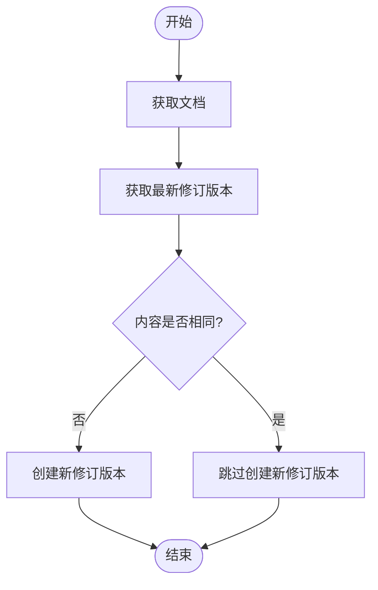
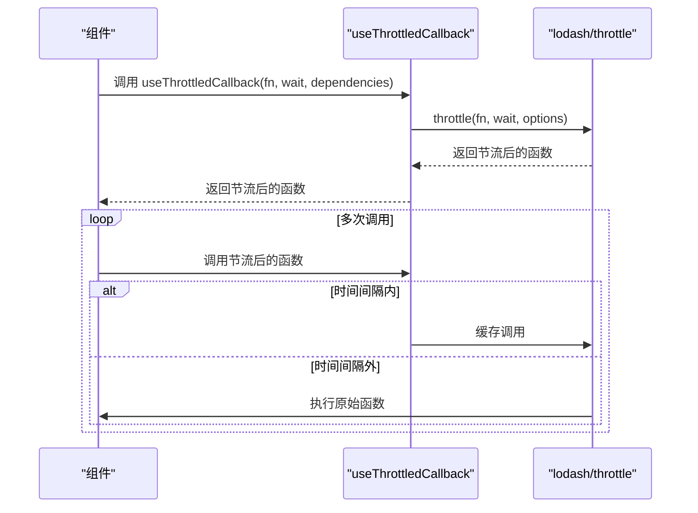

# 实时协作性能优化

<cite>
**本文档中引用的文件**  
- [MetricsExtension.ts](file://server/collaboration/MetricsExtension.ts)
- [RevisionsProcessor.ts](file://server/queues/processors/RevisionsProcessor.ts)
- [useThrottledCallback.ts](file://app/hooks/useThrottledCallback.ts)
- [WebsocketProvider.tsx](file://app/components/WebsocketProvider.tsx)
- [collaboration.ts](file://server/services/collaboration.ts)
- [websockets.ts](file://server/services/websockets.ts)
- [ConnectionLimitExtension.ts](file://server/collaboration/ConnectionLimitExtension.ts)
- [PersistenceExtension.ts](file://server/collaboration/PersistenceExtension.ts)
- [documentCollaborativeUpdater.ts](file://server/commands/documentCollaborativeUpdater.ts)
- [DocumentHelper.tsx](file://server/models/helpers/DocumentHelper.tsx)
</cite>

## 目录
1. [引言](#引言)
2. [系统架构与连接管理](#系统架构与连接管理)
3. 协作会话性能监控
4. 数据库写入性能优化
5. 客户端状态更新优化
6. 性能调优建议
7. 结论

## 引言
baozi项目是一个支持实时协作的文档编辑系统，能够在高并发场景下处理多个用户的同步编辑操作。本文档深入探讨了系统在处理大规模团队协作时所面临的性能挑战，并详细介绍了如何通过MetricsExtension监控协作会话的性能指标、RevisionsProcessor优化数据库写入性能以及useThrottledCallback防止客户端频繁更新导致的性能瓶颈。此外，还将提供一系列实际的性能调优建议，帮助开发者在大规模团队协作场景下保持系统的稳定性和高效性。

## 系统架构与连接管理
baozi项目的实时协作功能依赖于WebSocket和Hocuspocus服务器来实现实时同步。系统通过两个主要的服务——`collaboration` 和 `websockets` 来管理不同的WebSocket连接。

### WebSocket服务分离
- **`/collaboration` 路径**：由 `collaboration` 服务处理，专门用于文档的实时协作编辑。
- **`/realtime` 路径**：由 `websockets` 服务处理，用于事件通知和其他非协作文档的通信。

这种设计允许两个服务共存于同一进程中，同时避免了连接冲突。`websockets` 服务在启动时会移除原有的升级处理器，并重新添加一个检查路径的处理器，确保只有 `/realtime` 路径的请求被处理。

**Diagram sources**
- [collaboration.ts](file://server/services/collaboration.ts#L0-L108)
- [websockets.ts](file://server/services/websockets.ts#L0-L244)

**Section sources**
- [collaboration.ts](file://server/services/collaboration.ts#L0-L108)
- [websockets.ts](file://server/services/websockets.ts#L0-L244)

### 连接限制与认证
为了防止单个文档的连接数过多，系统实现了 `ConnectionLimitExtension` 扩展。该扩展通过 `onConnect` 钩子检查当前文档的连接数，如果超过预设的最大连接数（由环境变量 `COLLABORATION_MAX_CLIENTS_PER_DOCUMENT` 控制），则拒绝新的连接。

**Diagram sources**
- [ConnectionLimitExtension.ts](file://server/collaboration/ConnectionLimitExtension.ts#L47-L100)

**Section sources**
- [ConnectionLimitExtension.ts](file://server/collaboration/ConnectionLimitExtension.ts#L47-L100)

## 协作会话性能监控
MetricsExtension 是一个关键组件，负责监控协作会话的性能指标，包括连接延迟、消息吞吐量和状态同步时间。

### 性能指标监控
MetricsExtension 实现了多个钩子函数，用于在不同事件发生时记录性能指标：

- **`onLoadDocument`**：当文档加载时，增加 `collaboration.load_document` 计数器，并更新文档数量和连接数量的仪表盘。
- **`connected`**：当新连接建立时，增加 `collaboration.connect` 计数器，并更新连接数量和文档数量的仪表盘。
- **`onDisconnect`**：当连接断开时，增加 `collaboration.disconnect` 计数器，并更新连接数量和文档数量的仪表盘。
- **`onStoreDocument`**：当文档发生变化时，增加 `collaboration.change` 计数器。

**Diagram sources**
- [MetricsExtension.ts](file://server/collaboration/MetricsExtension.ts#L10-L71)

**Section sources**
- [MetricsExtension.ts](file://server/collaboration/MetricsExtension.ts#L10-L71)

## 数据库写入性能优化
RevisionsProcessor 通过批量处理修订版本来优化数据库写入性能，减少不必要的数据库操作。

### 批量处理修订版本
RevisionsProcessor 监听特定的事件（如 `documents.publish`, `documents.update`, `documents.update.debounced`），并在事件触发时执行相应的操作。具体流程如下：

1. **获取文档和最新修订版本**：从数据库中获取当前文档和最新的修订版本。
2. **比较内容差异**：使用 `isEqual` 函数比较当前文档内容与最新修订版本的内容。如果内容相同，则跳过创建新修订版本。
3. **创建新修订版本**：如果内容有变化，则调用 `revisionCreator` 创建新的修订版本。

**Diagram sources**
- [RevisionsProcessor.ts](file://server/queues/processors/RevisionsProcessor.ts#L7-L56)

**Section sources**
- [RevisionsProcessor.ts](file://server/queues/processors/RevisionsProcessor.ts#L7-L56)

## 客户端状态更新优化
useThrottledCallback 是一个React Hook，用于防止频繁的状态更新导致的性能瓶颈。

### 防抖动回调
useThrottledCallback 使用 `lodash/throttle` 函数对回调函数进行节流处理，确保在指定的时间间隔内最多只执行一次回调。默认情况下，节流时间为250毫秒，且在时间间隔结束时执行回调（trailing: true）。

**Diagram sources**
- [useThrottledCallback.ts](file://app/hooks/useThrottledCallback.ts#L22-L39)

**Section sources**
- [useThrottledCallback.ts](file://app/hooks/useThrottledCallback.ts#L22-L39)

## 性能调优建议
为了在大规模团队协作场景下保持系统稳定性，以下是一些实际的性能调优建议：

### WebSocket连接管理
- **合理设置最大连接数**：根据服务器资源和预期用户规模，合理设置 `COLLABORATION_MAX_CLIENTS_PER_DOCUMENT` 环境变量，避免单个文档的连接数过多。
- **优化心跳机制**：调整 `pingInterval` 和 `pingTimeout` 参数，确保连接的稳定性和及时性。

### 状态压缩策略
- **启用状态压缩**：在 `PersistenceExtension` 中，使用 `Y.encodeStateAsUpdate` 对Yjs文档状态进行编码，减少存储空间和传输带宽。
- **定期清理旧状态**：定期清理不再需要的旧状态数据，避免数据库膨胀。

### 内存泄漏预防措施
- **及时释放资源**：在组件卸载时，确保取消所有定时器和事件监听器，避免内存泄漏。
- **使用WeakMap**：对于临时数据，考虑使用 `WeakMap` 来存储，以便垃圾回收机制可以自动清理。

## 结论
baozi项目通过MetricsExtension、RevisionsProcessor和useThrottledCallback等机制，有效地解决了高并发编辑场景下的性能挑战。通过合理的连接管理、性能监控、数据库写入优化和客户端状态更新优化，系统能够在大规模团队协作场景下保持高效和稳定。开发者应根据实际情况，结合上述性能调优建议，进一步提升系统的整体性能和用户体验。