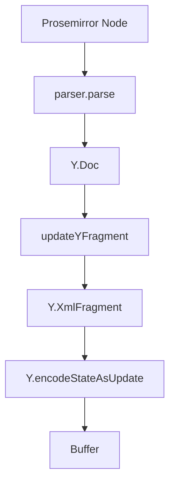
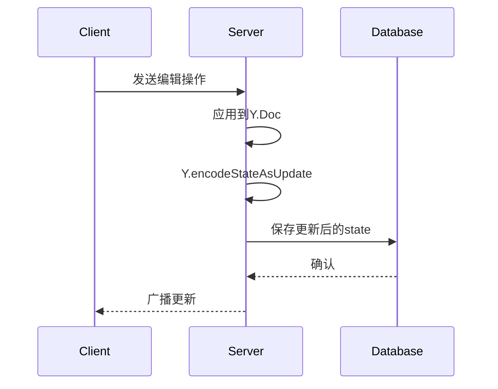

# CRDT理论基础

<cite>
**本文档中引用的文件**  
- [DocumentHelper.tsx](file://server/models/helpers/DocumentHelper.tsx#L494-L541)
- [documentCollaborativeUpdater.ts](file://server/commands/documentCollaborativeUpdater.ts#L0-L114)
- [PersistenceExtension.ts](file://server/collaboration/PersistenceExtension.ts#L0-L89)
- [20221008000000-backfill-crdt.ts](file://server/scripts/20221008000000-backfill-crdt.ts#L0-L84)
- [20231119000000-backfill-document-content.ts](file://server/scripts/20231119000000-backfill-document-content.ts#L0-L65)
- [20221029000000-crdt-to-text.ts](file://server/scripts/20221029000000-crdt-to-text.ts#L0-L72)
- [ProsemirrorHelper.tsx](file://server/models/helpers/ProsemirrorHelper.tsx#66-L116)
- [WebsocketProvider.tsx](file://app/components/WebsocketProvider.tsx#L0-L730)
- [multiplayer.ts](file://shared/editor/lib/multiplayer.ts#L0-L15)
</cite>

## 目录
1. [引言](#引言)
2. [CRDT数学原理与分布式一致性](#crdt数学原理与分布式一致性)
3. [Yjs实现中的可交换、可结合、可幂等结构](#yjs实现中的可交换可结合可幂等结构)
4. [y-document与Prosemirror JSON转换逻辑](#y-document与prosemirror-json转换逻辑)
5. [增量更新机制：Y.encodeStateAsUpdate](#增量更新机制yencodestateasupdate)
6. [初学者直观比喻解释](#初学者直观比喻解释)
7. [时间与空间复杂度优化策略](#时间与空间复杂度优化策略)
8. [结论](#结论)

## 引言
CRDT（无冲突复制数据类型）是分布式系统中实现最终一致性的核心数学工具。在baozi项目中，CRDT通过Yjs库与Prosemirror编辑器深度集成，实现了多用户实时协作编辑的无缝体验。本文将深入解析其理论基础与工程实现，涵盖状态向量时钟、操作转换机制、数据结构转换及性能优化策略。

## CRDT数学原理与分布式一致性
CRDT通过数学上的可交换性、可结合性和幂等性保证分布式环境中数据的一致性。在baozi项目中，Yjs利用这些代数性质，使得任意顺序的操作合并都能达到相同状态。系统采用状态向量时钟跟踪各节点的更新进度，避免了传统锁机制的性能瓶颈。当多个用户同时编辑文档时，操作通过WebSocket实时同步，Yjs的CRDT算法确保所有副本最终收敛到一致状态。

**本节来源**  
- [WebsocketProvider.tsx](file://app/components/WebsocketProvider.tsx#L0-L730)
- [multiplayer.ts](file://shared/editor/lib/multiplayer.ts#L0-L15)

## Yjs实现中的可交换、可结合、可幂等结构
Yjs将Prosemirror文档模型转换为支持CRDT操作的Y.Doc结构。通过`y-prosemirror`库的`updateYFragment`函数，Prosemirror的Node树被映射为Yjs的XmlFragment，实现了可交换、可结合和可幂等的数据结构。每个编辑操作被分解为原子性的CRDT操作，确保在任意网络条件下合并的正确性。`Y.encodeStateAsUpdate`生成的更新包包含所有必要信息，支持增量同步和状态压缩。

**图表来源**  
- [DocumentHelper.tsx](file://server/models/helpers/DocumentHelper.tsx#L494-L541)
- [ProsemirrorHelper.tsx](file://server/models/helpers/ProsemirrorHelper.tsx#66-L116)

**本节来源**  
- [DocumentHelper.tsx](file://server/models/helpers/DocumentHelper.tsx#L494-L541)
- [ProsemirrorHelper.tsx](file://server/models/helpers/ProsemirrorHelper.tsx#66-L116)

## y-document与Prosemirror JSON转换逻辑
在baozi系统中，y-document与Prosemirror JSON的双向转换是协作编辑的核心。服务器端通过`yDocToProsemirrorJSON`函数将Y.Doc转换为Prosemirror兼容的JSON格式，反之则通过`prosemirrorToYDoc`完成转换。`DocumentHelper.toProsemirror`方法优先使用`state`字段中的Yjs状态，若不存在则回退到Markdown解析。这种设计确保了数据的向后兼容性和迁移平滑性。

**图表来源**  
- [DocumentHelper.tsx](file://server/models/helpers/DocumentHelper.tsx#L77-L116)
- [PersistenceExtension.ts](file://server/collaboration/PersistenceExtension.ts#L41-L89)

**本节来源**  
- [DocumentHelper.tsx](file://server/models/helpers/DocumentHelper.tsx#L77-L116)
- [PersistenceExtension.ts](file://server/collaboration/PersistenceExtension.ts#L41-L89)

## 增量更新机制：Y.encodeStateAsUpdate
`Y.encodeStateAsUpdate`是实现高效同步的关键。该函数将Y.Doc的当前状态编码为增量更新包，仅包含自上次同步以来的变更。在`documentCollaborativeUpdater`命令中，每次编辑操作都会生成新的状态更新，并持久化到数据库的`state`字段。服务器通过比较`isEqual(document.content, content)`判断是否需要保存，避免了不必要的I/O操作。这种机制显著降低了网络带宽和存储开销。

**图表来源**  
- [documentCollaborativeUpdater.ts](file://server/commands/documentCollaborativeUpdater.ts#L47-L83)
- [PersistenceExtension.ts](file://server/collaboration/PersistenceExtension.ts#L41-L89)

**本节来源**  
- [documentCollaborativeUpdater.ts](file://server/commands/documentCollaborativeUpdater.ts#L47-L83)
- [PersistenceExtension.ts](file://server/collaboration/PersistenceExtension.ts#L41-L89)

## 初学者直观比喻解释
可以将CRDT系统想象成一个多人协作的白板。每个用户手持不同颜色的笔（代表客户端），在白板上书写或擦除。即使网络延迟导致操作顺序混乱，最终白板内容仍会一致。这是因为每个笔迹都带有唯一ID和时间戳（向量时钟），系统能智能合并所有标记。Yjs就像一个魔法白板，自动解决冲突，确保无论谁先写、谁后写，最终结果都相同。

## 时间与空间复杂度优化策略
baozi项目通过多种策略优化CRDT的性能。在时间复杂度方面，`Y.encodeStateAsUpdate`的增量编码将同步成本从O(n)降低到O(Δn)。空间上，Yjs的二进制编码比JSON更紧凑。服务器采用分页处理（limit=100）避免内存溢出，`backfill-crdt`脚本批量处理历史数据。数据库通过`Buffer.from(state)`存储二进制状态，减少存储空间。协作更新时使用数据库行锁（LOCK.UPDATE）保证原子性，避免竞态条件。

**本节来源**  
- [20221008000000-backfill-crdt.ts](file://server/scripts/20221008000000-backfill-crdt.ts#L0-L84)
- [20231119000000-backfill-document-content.ts](file://server/scripts/20231119000000-backfill-document-content.ts#L0-L65)
- [20221029000000-crdt-to-text.ts](file://server/scripts/20221029000000-crdt-to-text.ts#L0-L72)

## 结论
CRDT在baozi项目中的应用展示了分布式系统设计的先进理念。通过Yjs与Prosemirror的深度集成，系统实现了高可用、低延迟的实时协作。数学原理保证了数据一致性，而工程优化确保了性能可扩展。未来可探索更智能的冲突解决策略和压缩算法，进一步提升用户体验。