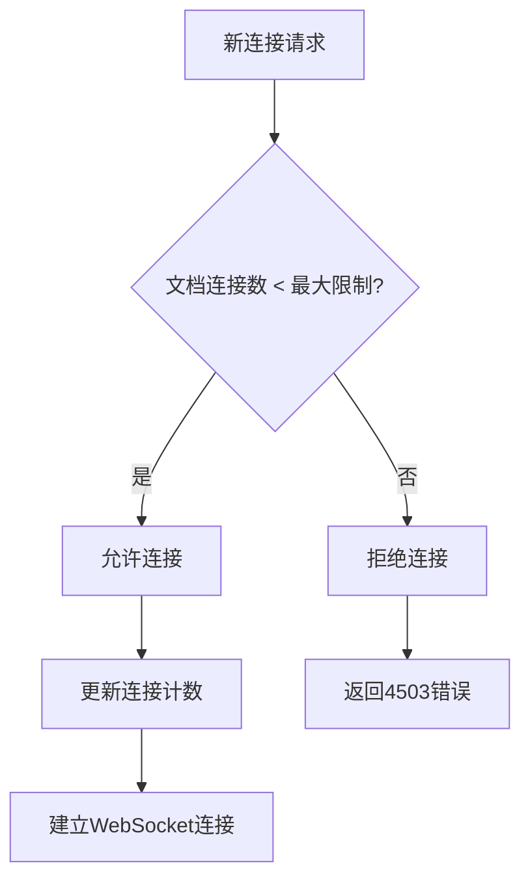

# 冲突解决策略

<cite>
**本文档引用的文件**   
- [ConnectionLimitExtension.ts](file://server/collaboration/ConnectionLimitExtension.ts)
- [documentCollaborativeUpdater.ts](file://server/commands/documentCollaborativeUpdater.ts)
- [Revision.ts](file://server/models/Revision.ts)
- [env.ts](file://server/env.ts)
- [CloseEvents.ts](file://shared/collaboration/CloseEvents.ts)
</cite>

## 目录
1. [引言](#引言)
2. [基于Yjs的冲突解决机制](#基于yjs的冲突解决机制)
3. [连接限制与资源保护](#连接限制与资源保护)
4. [并发编辑合并示例](#并发编辑合并示例)
5. [调试与监控工具](#调试与监控工具)
6. [结论](#结论)

## 引言
baozi项目采用先进的实时协作技术，允许多名用户同时编辑同一文档。本系统通过Yjs库实现基于操作转换（OT）算法的冲突解决机制，确保在高并发场景下数据的一致性和完整性。系统利用客户端ID和时间戳协调多个用户的编辑操作，自动合并更改而不会丢失任何数据。此外，通过ConnectionLimitExtension扩展防止恶意连接和资源滥用，保障系统稳定性。本文将深入解析这些核心机制，并为开发者提供调试和监控工具。

## 基于Yjs的冲突解决机制

baozi项目使用Yjs库实现基于操作转换（OT）算法的分布式协同编辑。Yjs通过维护一个共享的Y.Doc状态对象来同步所有客户端的编辑操作。每个用户的编辑行为被转换为CRDT（Conflict-free Replicated Data Type）操作，并通过WebSocket实时广播给其他参与者。系统利用客户端ID和时间戳来协调并发修改，确保最终一致性。

当文档更新时，`documentCollaborativeUpdater`函数负责将Y.Doc状态持久化到数据库。该函数提取当前协作状态，比较新旧内容差异，并仅在内容发生变化时进行更新。同时，系统会收集所有参与编辑的用户ID，包括通过`Y.PermanentUserData`从文档元数据中提取的协作者，确保修订记录的完整性。

文档修订历史通过`Revision`模型进行管理，每次保存都会创建一个新的修订版本，包含当时的文档标题、内容、图标、颜色以及编辑器版本等信息。这不仅提供了完整的版本控制功能，还支持后续的变更追溯和恢复操作。

**Section sources**
- [documentCollaborativeUpdater.ts](file://server/commands/documentCollaborativeUpdater.ts#L24-L113)
- [Revision.ts](file://server/models/Revision.ts#L170-L214)

## 连接限制与资源保护

为了防止恶意连接和资源滥用，baozi系统实现了`ConnectionLimitExtension`扩展。该扩展通过维护一个`connectionsByDocument`映射表来跟踪每个文档的连接数，确保系统稳定运行。

系统配置了最大客户端连接限制，由环境变量`COLLABORATION_MAX_CLIENTS_PER_DOCUMENT`定义，默认值为100。当新连接建立时，`onConnect`钩子会检查目标文档的当前连接数。如果已达到最大限制，系统将拒绝新的连接请求，并返回"Too Many Connections"错误。

**Diagram sources **
- [ConnectionLimitExtension.ts](file://server/collaboration/ConnectionLimitExtension.ts#L13-L100)
- [CloseEvents.ts](file://shared/collaboration/CloseEvents.ts#L13-L16)

**Section sources**
- [ConnectionLimitExtension.ts](file://server/collaboration/ConnectionLimitExtension.ts#L13-L100)
- [env.ts](file://server/env.ts#L242-L247)

## 并发编辑合并示例

当两个用户同时编辑同一段落时，系统能够自动合并更改而不丢失数据。这一过程通过Yjs的CRDT算法实现，确保所有客户端最终达到一致状态。

假设用户A和用户B同时打开同一文档进行编辑。系统为每个用户分配唯一的客户端ID，并在Y.Doc中记录其编辑范围。当用户A修改文本时，其操作被编码为Yjs更新消息并通过WebSocket广播。用户B的客户端接收此更新并将其应用到本地文档状态，同时将自己的编辑操作广播给其他客户端。

在服务器端，`documentCollaborativeUpdater`函数定期将合并后的状态持久化。该函数会：
1. 获取当前Y.Doc状态并编码为更新消息
2. 将Yjs格式的内容转换为Prosemirror JSON格式
3. 比较新旧内容以确定是否需要更新
4. 收集所有协作者ID（包括session协作者和永久用户数据）
5. 选择最新的编辑器版本号
6. 更新数据库中的文档记录

这种机制确保了即使在网络延迟或断线重连的情况下，所有用户的更改都能被正确合并和保存。

**Section sources**
- [documentCollaborativeUpdater.ts](file://server/commands/documentCollaborativeUpdater.ts#L24-L113)
- [Revision.ts](file://server/models/Revision.ts#L170-L214)

## 调试与监控工具

系统提供了完善的日志记录和监控功能，帮助开发者调试冲突解决过程。`ConnectionLimitExtension`包含详细的日志输出，使用`Logger.debug`和`Logger.info`记录连接状态变化。这些日志信息包括连接数、文档名称以及连接被拒绝的原因。

开发者可以通过以下方式监控系统状态：
- 查看多玩家日志（multiplayer）了解连接情况
- 监控`COLLABORATION_MAX_CLIENTS_PER_DOCUMENT`环境变量的配置
- 使用`getConnections()`方法查询特定文档的当前连接数
- 分析WebSocket连接的生命周期（onConnect、connected、onDisconnect）

测试用例验证了连接限制功能的正确性，包括允许在限制内的连接、拒绝超出限制的连接、处理被其他扩展关闭的连接等情况。这些测试确保了系统在各种边界条件下的稳定性和可靠性。

**Section sources**
- [ConnectionLimitExtension.ts](file://server/collaboration/ConnectionLimitExtension.ts#L13-L100)
- [ConnectionLimitExtension.test.ts](file://server/collaboration/ConnectionLimitExtension.test.ts#L1-L45)

## 结论
baozi项目的冲突解决策略通过Yjs库实现了高效、可靠的实时协作功能。基于操作转换的算法确保了多用户并发编辑时的数据一致性，而连接限制机制有效防止了资源滥用。系统通过详细的日志记录和监控工具为开发者提供了强大的调试能力。这些设计共同保障了系统的稳定性、安全性和可维护性，为用户提供流畅的协作体验。