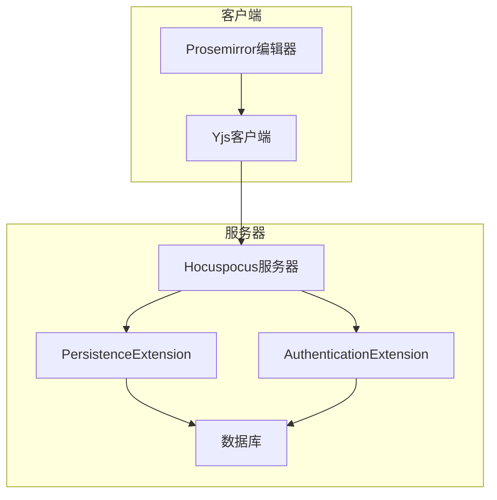
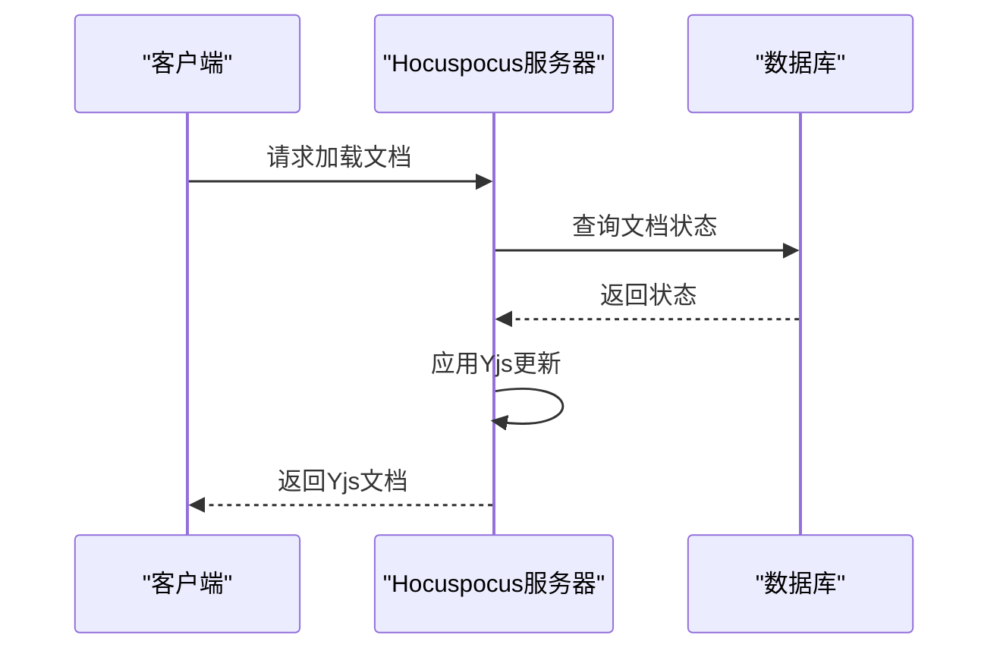
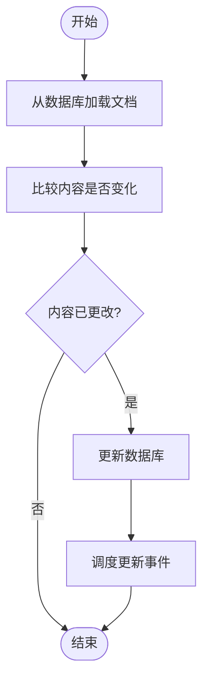
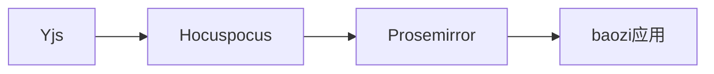

# 实时协作技术原理

<cite>
**本文档中引用的文件**  
- [ProsemirrorHelper.ts](file://shared/utils/ProsemirrorHelper.ts)
- [PersistenceExtension.ts](file://server/collaboration/PersistenceExtension.ts)
- [AuthenticationExtension.ts](file://server/collaboration/AuthenticationExtension.ts)
- [documentCollaborativeUpdater.ts](file://server/commands/documentCollaborativeUpdater.ts)
- [20221008000000-backfill-crdt.ts](file://server/scripts/20221008000000-backfill-crdt.ts)
- [20221029000000-crdt-to-text.ts](file://server/scripts/20221029000000-crdt-to-text.ts)
</cite>

## 目录
1. [引言](#引言)
2. [项目结构](#项目结构)
3. [核心组件](#核心组件)
4. [架构概述](#架构概述)
5. [详细组件分析](#详细组件分析)
6. [依赖分析](#依赖分析)
7. [性能考虑](#性能考虑)
8. [故障排除指南](#故障排除指南)
9. [结论](#结论)

## 引言
本文档深入探讨了baozi项目中基于Yjs和CRDT（无冲突复制数据类型）的实时协作编辑机制。重点分析了Yjs如何通过操作转换（OT）和状态向量时钟解决并发编辑冲突，以及Prosemirror与Yjs的集成方式。文档详细说明了文档状态在客户端和服务器之间的同步过程，包括yDocToProsemirrorJSON转换机制和Y.encodeStateAsUpdate状态编码。通过项目中的实际代码示例（如DocumentHelper中的toJSON方法）说明数据一致性保证机制。为初学者提供CRDT概念的通俗解释，同时为经验丰富的开发者深入分析性能优化策略和内存管理机制。

## 项目结构
baozi项目的协作功能主要分布在server/collaboration目录下，包含多个扩展组件，如PersistenceExtension、AuthenticationExtension等。这些组件通过Hocuspocus服务器与Yjs库协同工作，实现文档的实时同步。共享工具类位于shared/utils/ProsemirrorHelper.ts，负责Prosemirror与Yjs之间的数据转换。服务器端命令处理文档的持久化更新，确保数据一致性。

**Section sources**
- [PersistenceExtension.ts](file://server/collaboration/PersistenceExtension.ts)
- [AuthenticationExtension.ts](file://server/collaboration/AuthenticationExtension.ts)

## 核心组件
核心组件包括PersistenceExtension、AuthenticationExtension和documentCollaborativeUpdater。PersistenceExtension负责文档的加载和存储，AuthenticationExtension处理用户认证和权限控制，documentCollaborativeUpdater则负责将协作状态持久化到数据库。这些组件共同构成了实时协作的基础架构。

**Section sources**
- [PersistenceExtension.ts](file://server/collaboration/PersistenceExtension.ts#L1-L125)
- [AuthenticationExtension.ts](file://server/collaboration/AuthenticationExtension.ts#L1-L47)
- [documentCollaborativeUpdater.ts](file://server/commands/documentCollaborativeUpdater.ts#L1-L115)

## 架构概述
baozi项目的实时协作架构基于Yjs和Hocuspocus构建。客户端使用Prosemirror作为编辑器，通过Yjs将编辑操作转换为CRDT操作。这些操作通过WebSocket连接发送到Hocuspocus服务器，服务器端的扩展组件处理认证、持久化等逻辑。文档状态以Yjs的Update格式存储在数据库中，确保高效同步和冲突解决。

**Diagram sources**
- [PersistenceExtension.ts](file://server/collaboration/PersistenceExtension.ts#L1-L125)
- [AuthenticationExtension.ts](file://server/collaboration/AuthenticationExtension.ts#L1-L47)

## 详细组件分析

### PersistenceExtension分析
PersistenceExtension是负责文档持久化的关键组件。它在文档加载时从数据库读取状态，如果存在则直接应用；否则从内容创建新的Yjs文档。在文档存储时，它将Yjs文档的状态编码为Update格式并保存到数据库。

**Diagram sources**
- [PersistenceExtension.ts](file://server/collaboration/PersistenceExtension.ts#L1-L125)

### AuthenticationExtension分析
AuthenticationExtension处理用户认证和权限控制。它验证JWT令牌，检查用户权限，并根据权限设置连接的只读状态。这确保了只有授权用户才能编辑文档。

**Section sources**
- [AuthenticationExtension.ts](file://server/collaboration/AuthenticationExtension.ts#L1-L47)

### documentCollaborativeUpdater分析
该组件负责将协作状态持久化到数据库。它比较当前内容与数据库内容，仅在有变化时更新。同时更新协作者列表和编辑器版本，确保数据一致性。

**Diagram sources**
- [documentCollaborativeUpdater.ts](file://server/commands/documentCollaborativeUpdater.ts#L1-L115)

## 依赖分析
项目依赖于Yjs、Hocuspocus、Prosemirror等核心库。Yjs提供CRDT实现，Hocuspocus作为协作服务器，Prosemirror作为编辑器。这些库通过TypeScript类型系统紧密集成，确保类型安全。

**Diagram sources**
- [yarn.lock](file://yarn.lock#L15335-L15350)

## 性能考虑
系统通过多种方式优化性能：使用Y.encodeStateAsUpdate高效编码状态，仅在内容变化时更新数据库，利用Redis缓存协作者信息。这些策略减少了数据库负载，提高了响应速度。

## 故障排除指南
常见问题包括认证失败、同步延迟等。检查JWT令牌有效性，确保Redis和数据库连接正常。查看日志中的"multiplayer"和"database"条目，定位具体问题。

**Section sources**
- [PersistenceExtension.ts](file://server/collaboration/PersistenceExtension.ts#L1-L125)
- [AuthenticationExtension.ts](file://server/collaboration/AuthenticationExtension.ts#L1-L47)

## 结论
baozi项目通过Yjs和CRDT实现了高效的实时协作。其架构设计合理，组件职责清晰，性能优化到位。通过深入理解这些机制，开发者可以更好地维护和扩展协作功能。