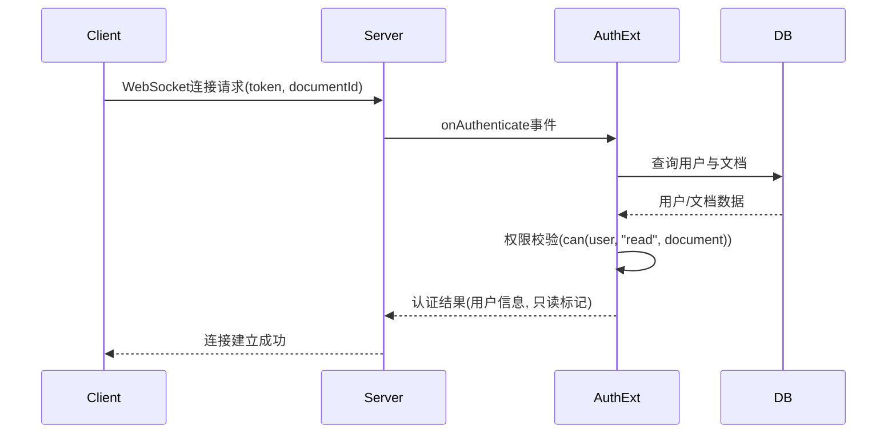
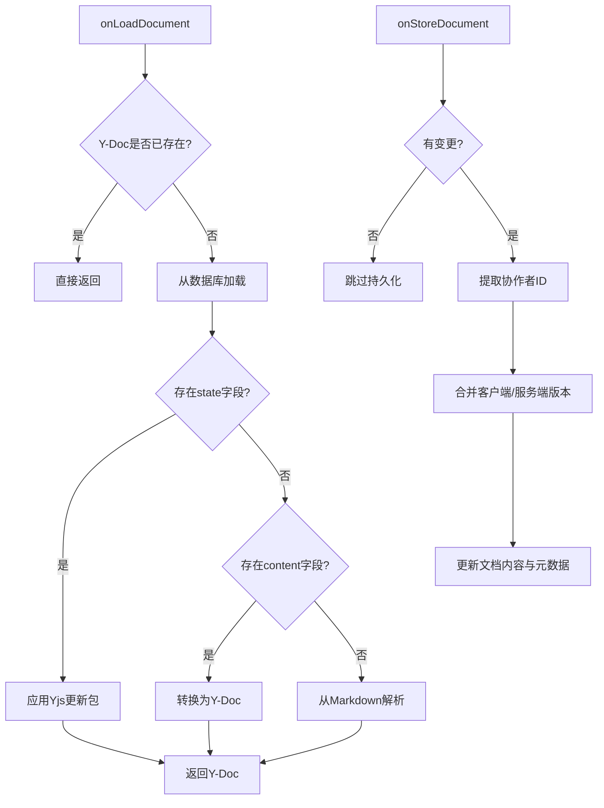
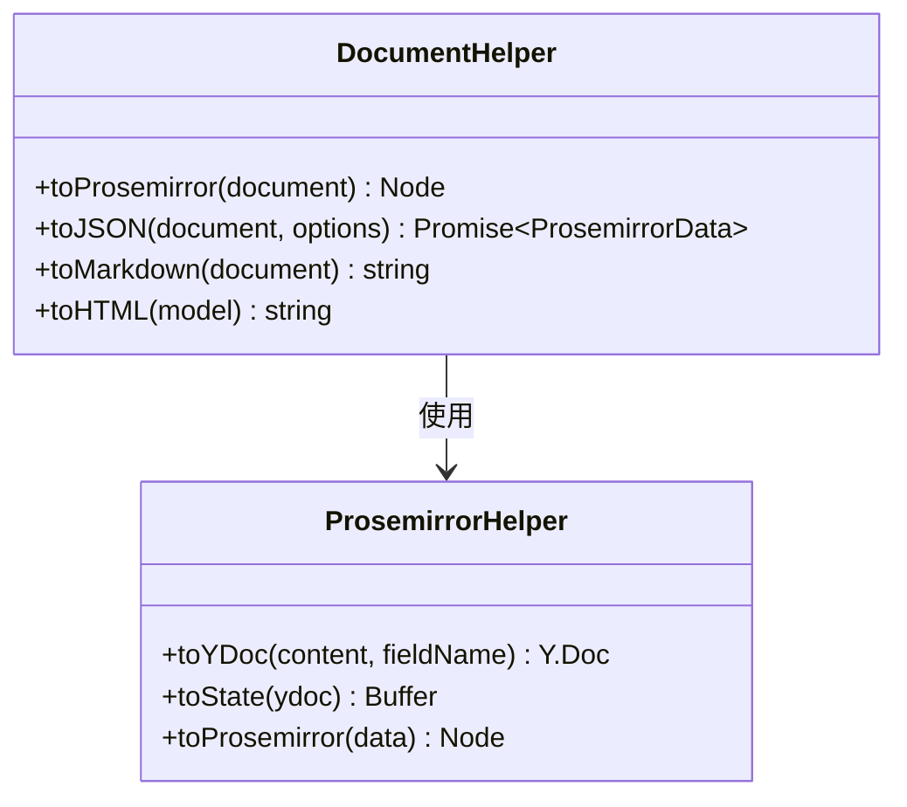

# 数据同步机制

<cite>
**本文档中引用的文件**  
- [multiplayer.ts](file://shared/editor/lib/multiplayer.ts)
- [AuthenticationExtension.ts](file://server/collaboration/AuthenticationExtension.ts)
- [PersistenceExtension.ts](file://server/collaboration/PersistenceExtension.ts)
- [ViewsExtension.ts](file://server/collaboration/ViewsExtension.ts)
- [DocumentHelper.tsx](file://server/models/helpers/DocumentHelper.tsx)
</cite>

## 目录
1. [引言](#引言)
2. [实时同步流程](#实时同步流程)
3. [核心扩展机制](#核心扩展机制)
   - [认证扩展（AuthenticationExtension）](#认证扩展authenticationextension)
   - [持久化扩展（PersistenceExtension）](#持久化扩展persistenceextension)
   - [视图扩展（ViewsExtension）](#视图扩展viewsextension)
4. [文档状态序列化](#文档状态序列化)
5. [协作编辑逻辑](#协作编辑逻辑)
6. [网络异常处理](#网络异常处理)
7. [最终一致性保证](#最终一致性保证)

## 引言
baozi项目采用Yjs与WebSocket结合的实时协作架构，实现多客户端间的文档状态同步。系统通过Hocuspocus服务器扩展机制，构建了包含认证、持久化和视图管理的完整同步链路。本机制确保用户在编辑文档时获得低延迟的协同体验，同时保障数据一致性与安全性。

## 实时同步流程
客户端通过WebSocket连接至Hocuspocus服务器，建立实时通信通道。连接建立后，系统执行三阶段同步：首先通过`AuthenticationExtension`验证用户身份与文档访问权限；随后`PersistenceExtension`从数据库加载Yjs文档状态；最后客户端与服务器通过操作变换（OT）算法同步增量更新。所有变更以二进制更新包形式传输，通过y-prosemirror桥接Prosemirror编辑器与Yjs协作模型。

**Section sources**
- [multiplayer.ts](file://shared/editor/lib/multiplayer.ts#L1-L15)
- [AuthenticationExtension.ts](file://server/collaboration/AuthenticationExtension.ts#L7-L45)

## 核心扩展机制

### 认证扩展（AuthenticationExtension）
该扩展在`onAuthenticate`钩子中验证JWT令牌，解析用户身份并校验文档读写权限。认证通过后将用户信息注入连接上下文，对无更新权限的用户设置只读模式。此机制确保只有授权用户能参与协作编辑，且权限变更实时生效。

**Diagram sources**
- [AuthenticationExtension.ts](file://server/collaboration/AuthenticationExtension.ts#L7-L45)

### 持久化扩展（PersistenceExtension）
该扩展实现文档状态的双向同步：`onLoadDocument`从数据库加载Yjs状态（优先使用`state`字段，降级使用`content`或`text`），`onStoreDocument`将变更持久化。通过Redis临时存储会话协作者ID，结合`documentCollaborativeUpdater`命令批量更新文档内容、版本和协作者信息，减少数据库写入次数。

**Diagram sources**
- [PersistenceExtension.ts](file://server/collaboration/PersistenceExtension.ts#L16-L123)

### 视图扩展（ViewsExtension）
该扩展通过`onChange`钩子跟踪用户活动，利用`lastViewBySocket`映射记录每个socket最后操作时间。当用户变更文档且距上次操作超1分钟时，更新其`viewedAt`时间戳和`lastActiveAt`状态。`onDisconnect`钩子清理socket映射，防止内存泄漏。

**Section sources**
- [ViewsExtension.ts](file://server/collaboration/ViewsExtension.ts#L11-L70)

## 文档状态序列化
`DocumentHelper.toJSON`方法实现文档到JSON的转换：优先使用`content`字段，若不存在则从Yjs状态（`state`）或Markdown文本（`text`）重建。转换过程支持附件URL签名、内部链接重写等选项，确保导出内容的完整性。反向转换通过`ProsemirrorHelper.toYDoc`将Prosemirror JSON映射为Yjs类型。

**Diagram sources**
- [DocumentHelper.tsx](file://server/models/helpers/DocumentHelper.tsx#L38-L75)
- [DocumentHelper.tsx](file://server/models/helpers/DocumentHelper.tsx#L102-L173)

## 协作编辑逻辑
`multiplayer.ts`中的`isRemoteTransaction`函数通过检查`ySyncPluginKey`元数据判断事务来源。客户端扩展`Multiplayer`注入`ySyncPlugin`、`yCursorPlugin`等插件，实现变更同步、光标共享和协同撤销。服务端`documentCollaborativeUpdater`命令合并会话协作者ID，利用`Y.encodeStateAsUpdate`生成增量更新，确保多人编辑的最终一致性。

**Section sources**
- [multiplayer.ts](file://shared/editor/lib/multiplayer.ts#L1-L15)
- [documentCollaborativeUpdater.ts](file://server/commands/documentCollaborativeUpdater.ts#L47-L83)

## 网络异常处理
客户端`WebsocketProvider`监听页面可见性变化，隐藏标签页时断开连接以节省资源。`MultiplayerEditor`组件处理连接状态变更：`ConnectionStatus`显示离线提示，`provider.shouldConnect`根据错误码决定是否重连（如`EditorUpdateError`需用户干预）。重连成功后通过`onSynced`回调通知UI更新同步状态。

**Section sources**
- [WebsocketProvider.tsx](file://app/components/WebsocketProvider.tsx#L42-L89)
- [MultiplayerEditor.tsx](file://app/scenes/Document/components/MultiplayerEditor.tsx#L155-L194)

## 最终一致性保证
系统通过以下机制确保一致性：1) 数据库事务锁定文档记录，防止并发写入冲突；2) Redis集合暂存会话协作者ID，避免遗漏贡献者；3) 永久用户数据（PermanentUserData）映射客户端ID到用户ID；4) 版本号比较（semver.gt）优先采用较新编辑器版本。持久化时合并服务端与客户端版本信息，确保元数据准确。