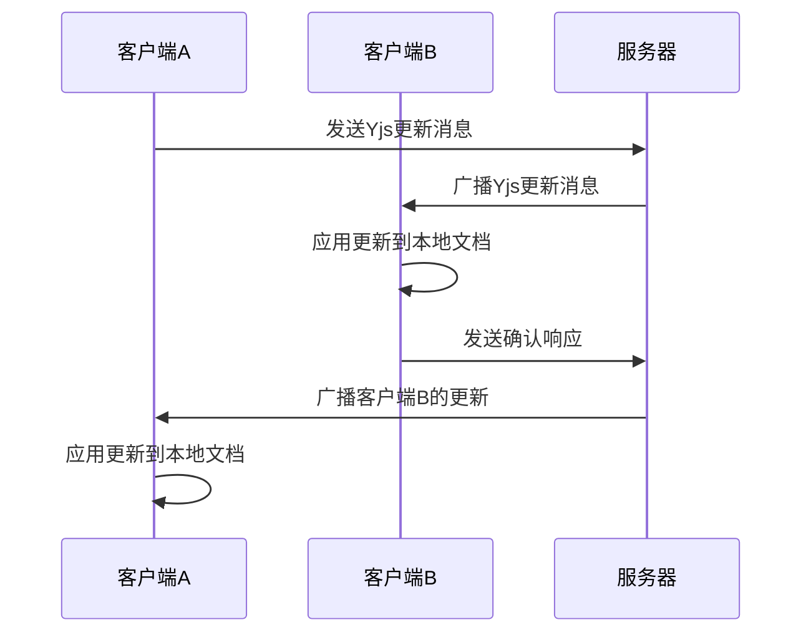
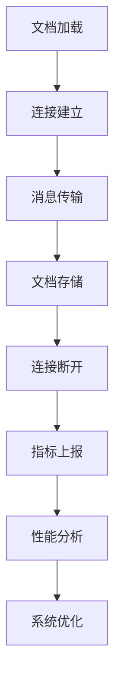

# 消息传输

<cite>
**本文档中引用的文件**  
- [multiplayer.ts](file://shared/editor/lib/multiplayer.ts)
- [websockets.ts](file://server/services/websockets.ts)
- [MetricsExtension.ts](file://server/collaboration/MetricsExtension.ts)
- [WebsocketProvider.tsx](file://app/components/WebsocketProvider.tsx)
- [Multiplayer.ts](file://app/editor/extensions/Multiplayer.ts)
</cite>

## 目录
1. [引言](#引言)
2. [Yjs更新消息传输机制](#yjs更新消息传输机制)
3. [multiplayer.ts中的消息编码与压缩](#multiplayerts中的消息编码与压缩)
4. [MetricsExtension性能监控](#metricsextension性能监控)
5. [WebSocket服务实现与消息路由](#websocket服务实现与消息路由)
6. [错误处理与网络优化](#错误处理与网络优化)
7. [结论](#结论)

## 引言
baozi项目采用Yjs协同编辑框架实现多用户实时协作功能。本系统通过WebSocket建立持久化连接，实现客户端与服务器之间的低延迟消息传输。消息传输机制包含Yjs更新消息的编码、压缩、路由和广播，同时集成性能监控和错误处理策略。系统设计注重网络效率，通过消息批处理和流量控制优化带宽使用，确保在高并发场景下的稳定性和响应性。

**Section sources**
- [multiplayer.ts](file://shared/editor/lib/multiplayer.ts)
- [websockets.ts](file://server/services/websockets.ts)

## Yjs更新消息传输机制
Yjs更新消息传输机制基于CRDT（无冲突复制数据类型）原理，实现多用户对同一文档的并发编辑。客户端通过Prosemirror编辑器捕获用户输入，转换为Yjs事务（Transaction），然后序列化为二进制更新消息。这些更新消息通过WebSocket连接发送到服务器，服务器使用Hocuspocus协作服务器进行消息广播。每个客户端接收远程更新后，应用到本地Yjs文档实例，实现状态同步。该机制确保所有客户端最终达到一致状态，即使在网络延迟或消息乱序的情况下也能正确处理。

**Diagram sources**
- [multiplayer.ts](file://shared/editor/lib/multiplayer.ts#L9-L14)
- [websockets.ts](file://server/services/websockets.ts#L83-L128)

## multiplayer.ts中的消息编码与压缩
`multiplayer.ts`文件实现了Yjs更新消息的编码和压缩逻辑。消息编码使用Yjs内置的`Y.encodeStateAsUpdate`方法将文档状态转换为紧凑的二进制格式。该方法仅编码自上次同步以来的增量变化，显著减少传输数据量。消息压缩通过WebSocket的二进制传输模式实现，避免了JSON序列化的开销。`isRemoteTransaction`函数用于区分本地和远程事务，确保正确处理消息来源。增量更新的生成基于Yjs的事务机制，每次用户输入触发一个事务，包含操作类型、位置和内容等元数据。

**Section sources**
- [multiplayer.ts](file://shared/editor/lib/multiplayer.ts#L9-L14)
- [Multiplayer.ts](file://app/editor/extensions/Multiplayer.ts#L0-L52)

## MetricsExtension性能监控
MetricsExtension负责监控消息传输的性能和延迟指标。该扩展实现了Hocuspocus服务器的多个钩子方法，包括`onLoadDocument`、`connected`、`onDisconnect`和`onStoreDocument`。这些钩子收集文档加载、连接建立、断开和存储等关键事件的指标。性能数据通过Metrics服务上报，包括连接数、文档数和变更频率等。延迟指标通过测量事件处理时间来计算，帮助识别系统瓶颈。监控数据用于优化服务器资源配置和调整消息处理策略，确保系统在高负载下的稳定性。

**Diagram sources**
- [MetricsExtension.ts](file://server/collaboration/MetricsExtension.ts#L0-L72)

## WebSocket服务实现与消息路由
WebSocket服务通过Socket.IO库实现，提供可靠的消息传输通道。服务器在`/realtime`路径上监听WebSocket连接，使用Redis适配器实现集群环境下的消息广播。消息路由基于房间（Room）机制，每个团队、用户、集合和组都有独立的房间。客户端通过`join`和`leave`事件动态加入或离开房间，实现细粒度的消息订阅。消息广播机制确保只有相关客户端接收到更新，减少不必要的网络流量。服务器还实现了连接认证，通过JWT验证客户端身份，确保消息传输的安全性。

**Section sources**
- [websockets.ts](file://server/services/websockets.ts#L47-L86)
- [WebsocketProvider.tsx](file://app/components/WebsocketProvider.tsx#L42-L89)

## 错误处理与网络优化
系统实现了全面的错误处理和网络优化策略。对于消息丢失、乱序和重复等场景，Yjs的CRDT算法天然具备容错能力，确保最终一致性。网络优化包括消息批处理和流量控制，减少小消息的频繁传输。服务器设置合理的ping间隔和超时时间，及时检测和清理无效连接。客户端实现连接重试机制，在网络中断后自动恢复。流量控制通过限制消息发送速率实现，防止突发流量导致服务器过载。这些策略共同确保系统在各种网络条件下的可靠性和性能。

**Section sources**
- [websockets.ts](file://server/services/websockets.ts#L126-L175)
- [WebsocketProvider.tsx](file://app/components/WebsocketProvider.tsx#L685-L729)

## 结论
baozi项目的消息传输机制通过Yjs、WebSocket和Redis的组合，实现了高效、可靠的多用户协同编辑。系统设计充分考虑了实时性、一致性和可扩展性，通过增量更新、消息压缩和性能监控等技术优化网络传输。错误处理和网络优化策略确保了系统在复杂网络环境下的稳定性。未来可进一步优化消息编码算法和引入更智能的流量控制策略，提升系统性能和用户体验。