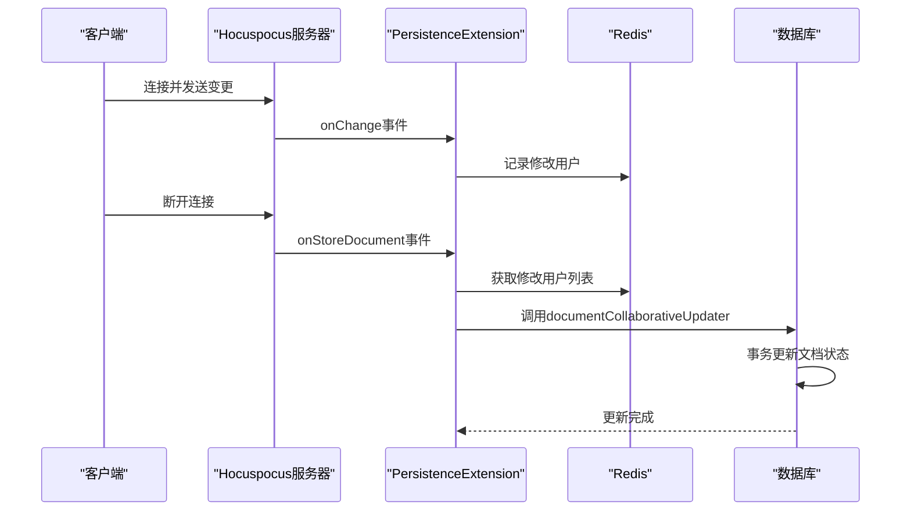
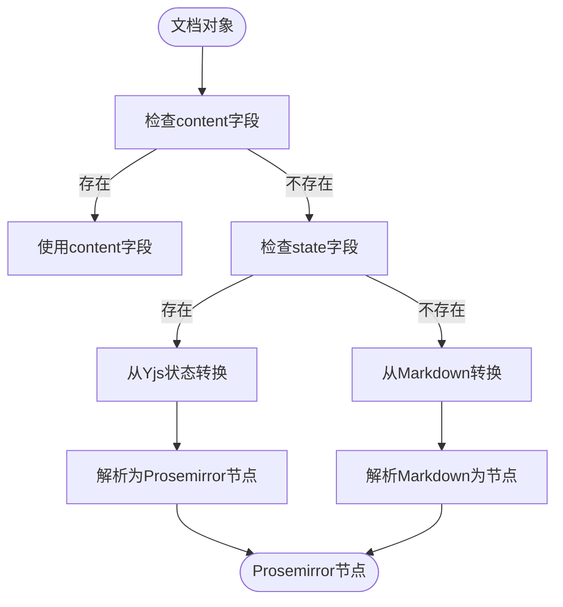

# 状态持久化

<cite>
**本文档引用的文件 **   
- [PersistenceExtension.ts](file://server/collaboration/PersistenceExtension.ts)
- [documentCollaborativeUpdater.ts](file://server/commands/documentCollaborativeUpdater.ts)
- [DocumentHelper.tsx](file://server/models/helpers/DocumentHelper.tsx)
- [Document.ts](file://server/models/Document.ts)
</cite>

## 目录
1. [引言](#引言)
2. [Yjs文档状态持久化机制](#yjs文档状态持久化机制)
3. [PersistenceExtension同步机制](#persistenceextension同步机制)
4. [文档序列化与反序列化](#文档序列化与反序列化)
5. [协作编辑数据一致性](#协作编辑数据一致性)
6. [性能优化策略](#性能优化策略)

## 引言
本文档详细阐述了baozi项目中Yjs文档状态的持久化机制。系统通过PersistenceExtension将Yjs文档变更同步到Sequelize模型，利用Redis进行临时状态管理，并通过documentCollaborativeUpdater确保数据一致性。文档状态通过DocumentHelper的toJSON和fromYdoc方法实现序列化和反序列化，保证了协作编辑场景下的数据完整性。

## Yjs文档状态持久化机制
系统采用Yjs作为实时协作编辑的核心技术，通过将Yjs文档状态持久化到数据库来实现数据的长期存储。Yjs文档状态以二进制格式存储在数据库的state字段中，同时维护一个JSON格式的内容快照作为备用。当文档首次加载时，系统优先从数据库的state字段恢复Yjs文档状态，若不存在则从content字段或Markdown文本重建。

文档状态的持久化流程始于客户端连接时的onLoadDocument事件。系统检查文档名称获取文档ID，然后查询数据库获取文档记录。如果文档已存在Yjs状态，则直接应用该状态；否则，从content或text字段创建新的Yjs文档。这种设计确保了文档状态的完整性和一致性，同时支持从不同数据源恢复文档。

**Section sources**
- [PersistenceExtension.ts](file://server/collaboration/PersistenceExtension.ts#L16-L45)
- [Document.ts](file://server/models/Document.ts#L94-L1314)

## PersistenceExtension同步机制
PersistenceExtension是连接Yjs协作状态与数据库持久化的关键组件。该扩展实现了Hocuspocus服务器的Extension接口，通过onLoadDocument、onChange和onStoreDocument三个核心方法管理文档状态的生命周期。

在文档存储阶段，onStoreDocument方法负责将Yjs文档的变更持久化到数据库。系统首先从Redis获取会话期间修改文档的用户ID列表，然后调用documentCollaborativeUpdater进行实际的数据库更新。这一过程包含完整的事务管理，确保数据更新的原子性。系统还实现了冲突解决策略，通过比较客户端和服务器的编辑器版本号，保留较新版本的编辑器信息。

**Diagram sources **
- [PersistenceExtension.ts](file://server/collaboration/PersistenceExtension.ts#L16-L123)

**Section sources**
- [PersistenceExtension.ts](file://server/collaboration/PersistenceExtension.ts#L16-L123)
- [documentCollaborativeUpdater.ts](file://server/commands/documentCollaborativeUpdater.ts#L24-L113)

## 文档序列化与反序列化
DocumentHelper类提供了文档状态序列化和反序列化的核心功能。toJSON方法将文档对象转换为标准的JSON格式，支持多种选项如签名附件URL、移除特定标记和替换内部链接。该方法优先使用content字段，若不存在则从Yjs状态或Markdown文本转换。

反序列化过程通过toProsemirror方法实现，将JSON数据转换为Prosemirror节点。系统首先尝试直接解析JSON，若失败则回退到Yjs状态或Markdown文本。这种多层回退机制确保了文档数据的可靠恢复，即使在数据损坏的情况下也能最大限度地保留内容。

**Diagram sources **
- [DocumentHelper.tsx](file://server/models/helpers/DocumentHelper.tsx#L38-L116)

**Section sources**
- [DocumentHelper.tsx](file://server/models/helpers/DocumentHelper.tsx#L38-L580)

## 协作编辑数据一致性
documentCollaborativeUpdater确保了协作编辑场景下的数据一致性。该函数在数据库事务中执行，首先锁定目标文档以防止并发修改。系统比较当前Yjs文档内容与数据库中的内容，仅在检测到实际变更时才执行更新，这有效减少了不必要的数据库写入。

在更新过程中，系统整合了多种来源的协作者信息：包括文档原有的协作者、会话期间修改文档的用户，以及Yjs文档中永久用户数据记录的用户。这种全面的协作者跟踪机制确保了所有参与编辑的用户都被正确记录。版本控制方面，系统采用语义化版本比较，优先保留较新的编辑器版本号。

**Section sources**
- [documentCollaborativeUpdater.ts](file://server/commands/documentCollaborativeUpdater.ts#L24-L113)
- [Document.ts](file://server/models/Document.ts#L94-L1314)

## 性能优化策略
系统通过多种策略优化数据库读写性能。首先，采用分层存储策略：频繁访问的content字段以JSON格式存储，而完整的Yjs状态仅在必要时才从state字段读取。其次，利用Redis作为临时状态缓存，避免在用户编辑期间频繁访问数据库。

对于大规模文档，系统实现了增量更新机制。只有在Yjs文档内容与数据库内容存在差异时才执行更新操作，这显著减少了数据库负载。事务管理方面，所有更新操作都在单个数据库事务中完成，确保了数据的一致性和完整性。此外，系统通过合理的数据库索引和查询优化，提高了文档加载和搜索的性能。

**Section sources**
- [PersistenceExtension.ts](file://server/collaboration/PersistenceExtension.ts#L16-L123)
- [documentCollaborativeUpdater.ts](file://server/commands/documentCollaborativeUpdater.ts#L24-L113)
- [Document.ts](file://server/models/Document.ts#L94-L1314)