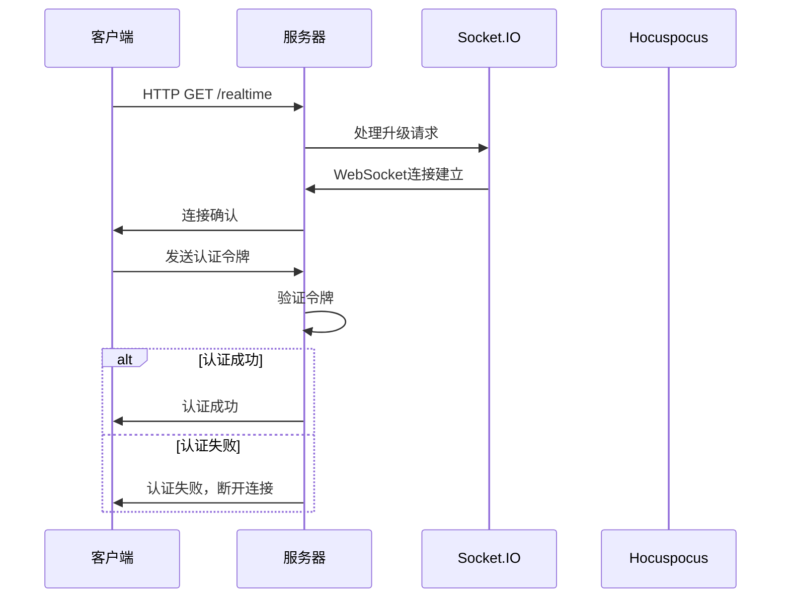
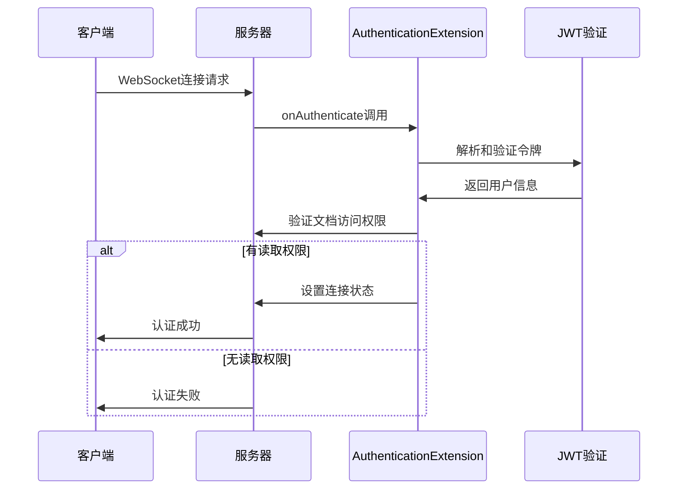
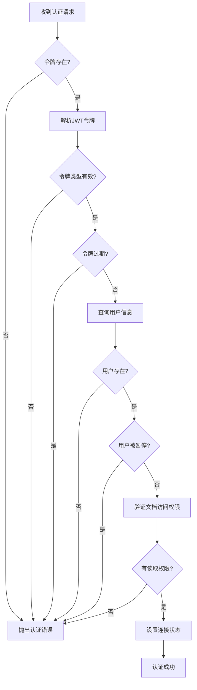
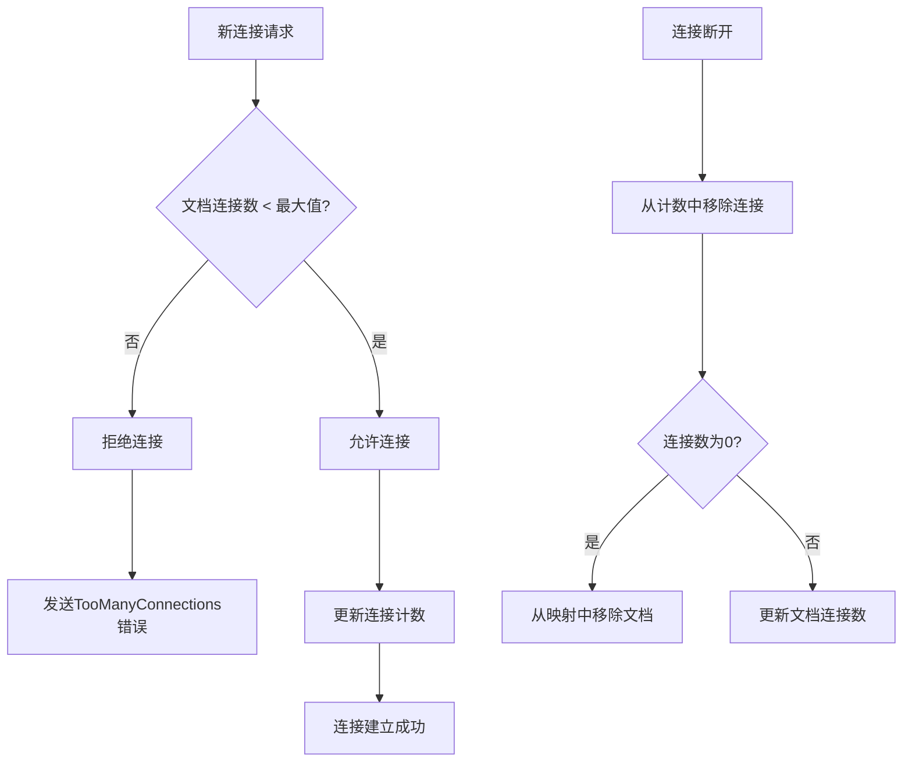
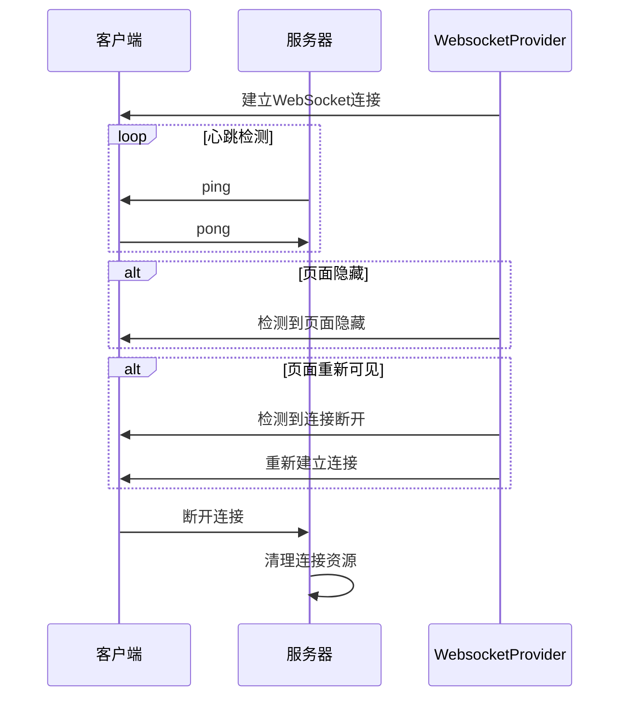
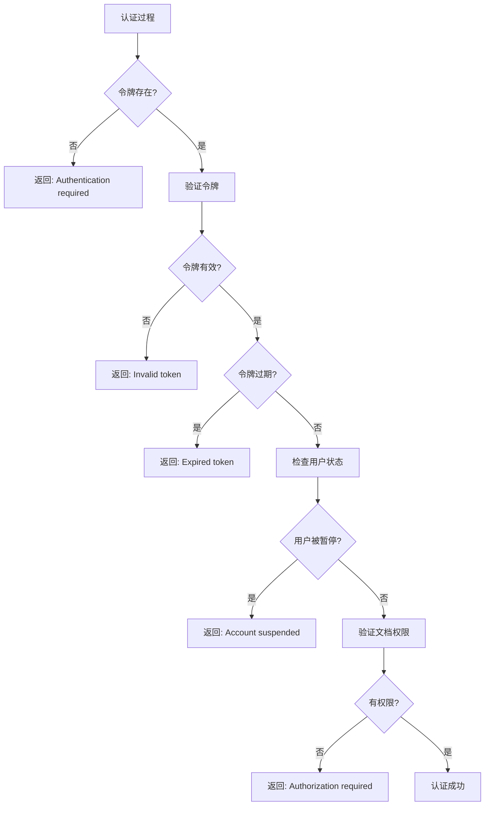

# 连接管理

<cite>
**本文档中引用的文件**   
- [authentication.ts](file://server/middlewares/authentication.ts)
- [AuthenticationExtension.ts](file://server/collaboration/AuthenticationExtension.ts)
- [ConnectionLimitExtension.ts](file://server/collaboration/ConnectionLimitExtension.ts)
- [WebsocketProvider.tsx](file://app/components/WebsocketProvider.tsx)
- [websockets.ts](file://server/services/websockets.ts)
- [collaboration.ts](file://server/services/collaboration.ts)
- [jwt.ts](file://server/utils/jwt.ts)
- [Document.ts](file://server/models/Document.ts)
</cite>

## 目录
1. [WebSocket连接建立](#websocket连接建立)
2. [认证机制](#认证机制)
3. [会话管理](#会话管理)
4. [连接限制](#连接限制)
5. [连接生命周期管理](#连接生命周期管理)
6. [错误处理](#错误处理)

## WebSocket连接建立

WebSocket连接的建立通过两个主要服务实现：实时通信服务（`/realtime`）和协作服务（`/collaboration`）。系统使用Socket.IO作为WebSocket框架，通过HTTP升级机制建立持久连接。

在服务器启动时，系统会注册WebSocket处理程序，通过`upgrade`事件监听器来处理WebSocket连接请求。对于实时通信服务，路径为`/realtime`，使用Socket.IO进行连接管理；对于协作服务，路径为`/collaboration`，使用Hocuspocus（基于Yjs的协作框架）处理实时协作连接。

客户端通过`WebsocketProvider`组件建立连接，该组件封装了Socket.IO客户端，配置了适当的连接选项，包括路径、传输方式和重连策略。连接建立后，客户端会立即尝试认证，确保连接的安全性。

**Diagram sources**
- [websockets.ts](file://server/services/websockets.ts#L47-L86)
- [collaboration.ts](file://server/services/collaboration.ts#L47-L71)
- [WebsocketProvider.tsx](file://app/components/WebsocketProvider.tsx#L42-L89)

**Section sources**
- [websockets.ts](file://server/services/websockets.ts#L1-L245)
- [collaboration.ts](file://server/services/collaboration.ts#L1-L109)
- [WebsocketProvider.tsx](file://app/components/WebsocketProvider.tsx#L1-L731)

## 认证机制

认证机制通过中间件和扩展组件实现，确保只有经过身份验证的用户才能建立WebSocket连接。系统支持多种认证方式，包括会话令牌、API密钥和OAuth令牌。

`AuthenticationExtension`是Hocuspocus框架的扩展，负责处理协作连接的认证。当客户端尝试连接时，`onAuthenticate`方法会被调用，验证提供的JWT令牌。令牌验证通过`getUserForJWT`函数完成，该函数解析令牌并验证其有效性，包括检查令牌类型、过期时间和用户状态。

**Diagram sources**
- [AuthenticationExtension.ts](file://server/collaboration/AuthenticationExtension.ts#L7-L45)
- [jwt.ts](file://server/utils/jwt.ts#L26-L75)

**Section sources**
- [AuthenticationExtension.ts](file://server/collaboration/AuthenticationExtension.ts#L7-L45)
- [jwt.ts](file://server/utils/jwt.ts#L7-L143)

## 会话管理

会话管理通过JWT令牌实现，确保用户会话的安全性和有效性。系统使用`getUserForJWT`函数验证令牌，该函数检查令牌的类型、过期时间，并从数据库中获取对应的用户信息。

当用户成功认证后，系统会更新用户的最后活动时间，这对于跟踪用户在线状态和会话管理至关重要。如果用户被暂停，系统会立即拒绝认证请求，确保被暂停用户的连接无法建立。

对于文档协作，系统还会检查用户对特定文档的访问权限。如果用户有读取权限但无更新权限，连接将被设置为只读模式，防止未经授权的修改同步到其他客户端。

**Diagram sources**
- [AuthenticationExtension.ts](file://server/collaboration/AuthenticationExtension.ts#L7-L45)
- [jwt.ts](file://server/utils/jwt.ts#L26-L75)

**Section sources**
- [AuthenticationExtension.ts](file://server/collaboration/AuthenticationExtension.ts#L7-L45)
- [jwt.ts](file://server/utils/jwt.ts#L7-L143)

## 连接限制

连接限制通过`ConnectionLimitExtension`实现，防止单个文档的并发连接数过多，从而保护服务器资源。该扩展维护一个`connectionsByDocument`映射，记录每个文档的当前连接数。

当新连接尝试建立时，`onConnect`钩子会被调用，检查目标文档的当前连接数是否已达到`COLLABORATION_MAX_CLIENTS_PER_DOCUMENT`环境变量设置的最大值。如果已达到上限，连接将被拒绝，客户端会收到`TooManyConnections`错误。

当连接断开时，`onDisconnect`钩子会更新连接计数，确保计数器的准确性。当最后一个连接断开时，对应的文档条目将从映射中移除，释放内存资源。

**Diagram sources**
- [ConnectionLimitExtension.ts](file://server/collaboration/ConnectionLimitExtension.ts#L13-L100)

**Section sources**
- [ConnectionLimitExtension.ts](file://server/collaboration/ConnectionLimitExtension.ts#L13-L100)

## 连接生命周期管理

连接生命周期管理涉及连接的建立、保持活动状态、断线检测和重连机制。系统通过多种机制确保连接的稳定性和可靠性。

在客户端，`WebsocketProvider`组件负责管理连接生命周期。当页面可见性改变时，组件会检查连接状态，如果连接已断开且页面重新可见，则尝试重新建立连接。这种机制确保了在用户切换标签页或最小化浏览器后，连接能够自动恢复。

在服务器端，Socket.IO配置了心跳机制（pingInterval和pingTimeout），定期检查连接的活跃状态。如果在指定时间内未收到客户端的响应，连接将被视为断开。

**Diagram sources**
- [WebsocketProvider.tsx](file://app/components/WebsocketProvider.tsx#L42-L145)
- [websockets.ts](file://server/services/websockets.ts#L1-L245)

**Section sources**
- [WebsocketProvider.tsx](file://app/components/WebsocketProvider.tsx#L1-L731)
- [websockets.ts](file://server/services/websockets.ts#L1-L245)

## 错误处理

错误处理机制确保系统在认证失败、会话过期或资源滥用等情况下能够优雅地处理异常情况。

当认证失败时，系统会向客户端发送详细的错误信息，包括"Authentication required"（需要认证）、"Invalid token"（无效令牌）、"Account suspended"（账户已暂停）等。客户端接收到这些错误后，通常会显示相应的错误提示并可能触发重新登录流程。

对于会话过期场景，系统会检查JWT令牌中的`expiresAt`字段，如果当前时间已超过该时间，会立即拒绝认证请求。这种机制确保了令牌的安全性，防止过期令牌被继续使用。

在资源滥用情况下，如连接数超过限制，系统会返回`TooManyConnections`错误，客户端需要等待其他用户断开连接后才能重新尝试连接。

**Diagram sources**
- [AuthenticationExtension.ts](file://server/collaboration/AuthenticationExtension.ts#L7-L45)
- [authentication.ts](file://server/middlewares/authentication.ts#L1-L280)

**Section sources**
- [AuthenticationExtension.ts](file://server/collaboration/AuthenticationExtension.ts#L7-L45)
- [authentication.ts](file://server/middlewares/authentication.ts#L1-L280)