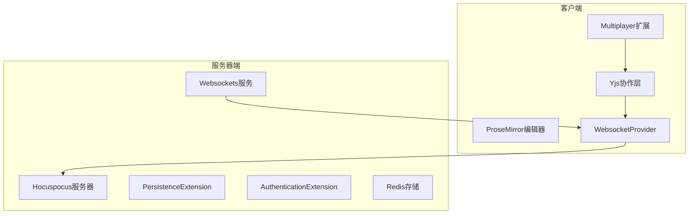
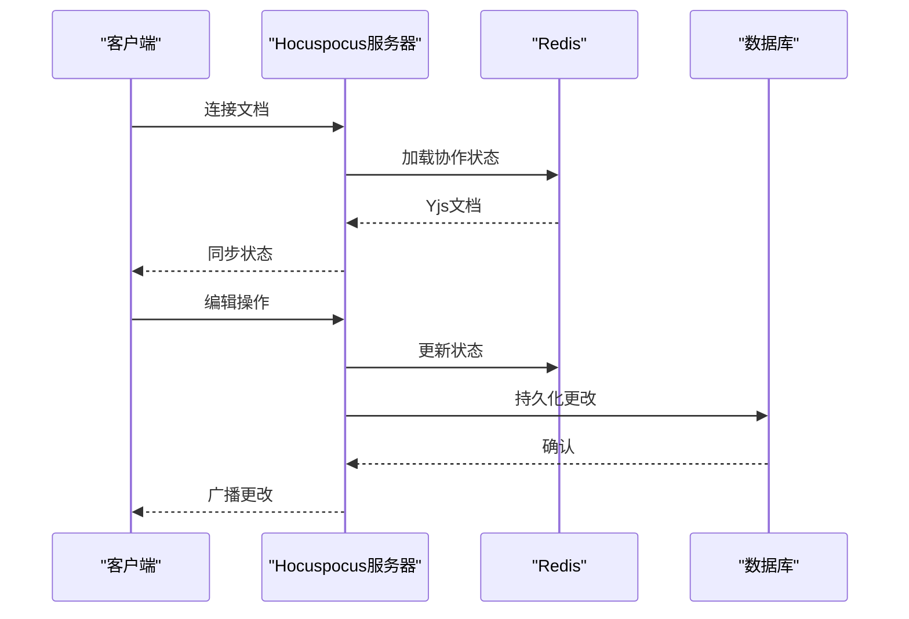
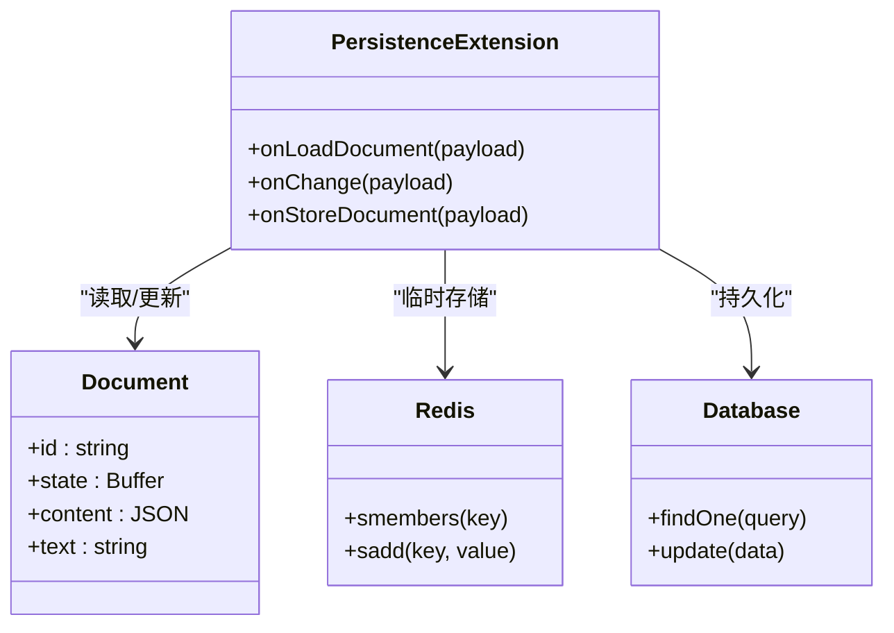
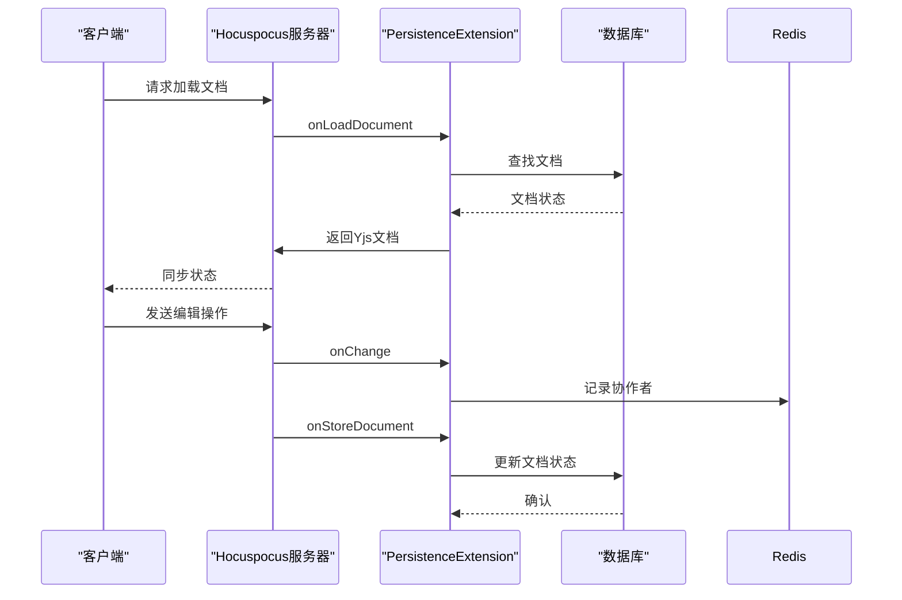
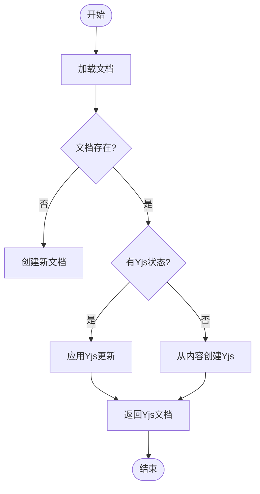
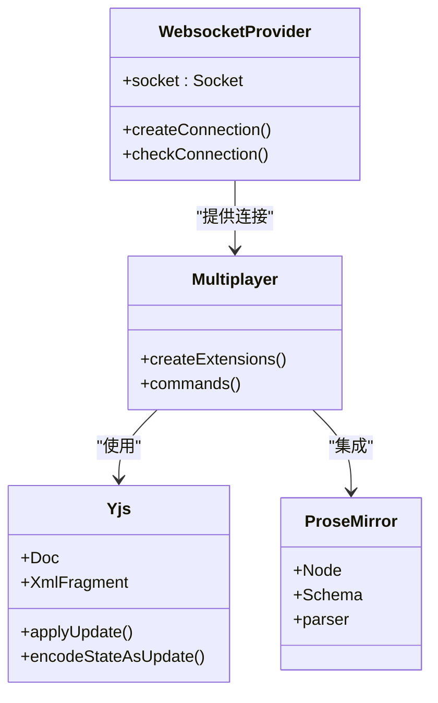
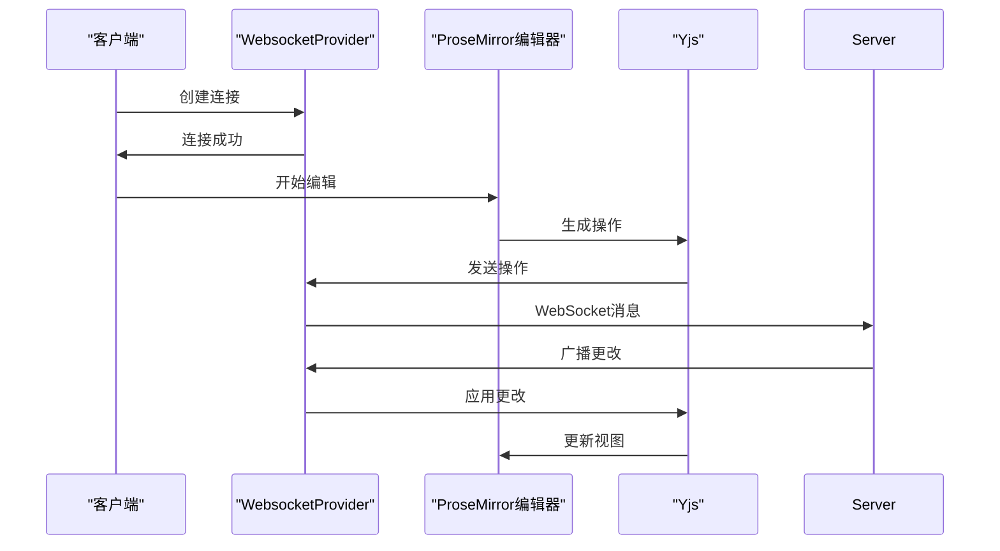
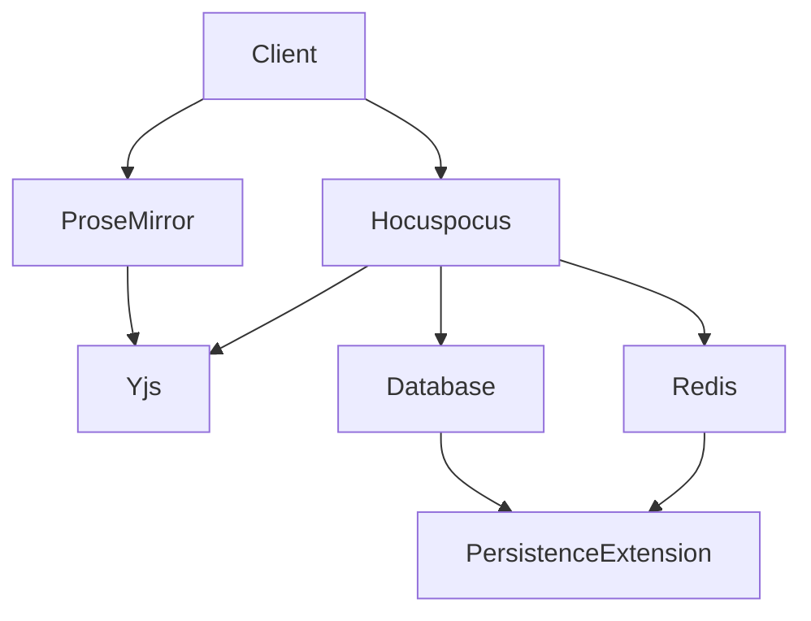

# 实时协作机制

<cite>
**本文档中引用的文件**  
- [collaboration.ts](file://server/services/collaboration.ts)
- [PersistenceExtension.ts](file://server/collaboration/PersistenceExtension.ts)
- [documentCollaborativeUpdater.ts](file://server/commands/documentCollaborativeUpdater.ts)
- [WebsocketProvider.tsx](file://app/components/WebsocketProvider.tsx)
- [Multiplayer.ts](file://app/editor/extensions/Multiplayer.ts)
- [MultiplayerEditor.tsx](file://app/scenes/Document/components/MultiplayerEditor.tsx)
- [WebsocketsProcessor.ts](file://server/queues/processors/WebsocketsProcessor.ts)
</cite>

## 目录
1. [简介](#简介)
2. [项目结构](#项目结构)
3. [核心组件](#核心组件)
4. [架构概述](#架构概述)
5. [详细组件分析](#详细组件分析)
6. [依赖分析](#依赖分析)
7. [性能考虑](#性能考虑)
8. [故障排除指南](#故障排除指南)
9. [结论](#结论)
10. [附录](#附录)（如有必要）

## 简介
baozi项目实现了基于Yjs和ProseMirror的实时协作编辑功能，通过WebSockets与服务器通信，确保多用户同时编辑文档时的数据一致性。系统利用CRDT（无冲突复制数据类型）解决并发冲突，并通过Hocuspocus服务器管理协作状态。客户端与服务器之间的消息传递经过精心设计，以最小化延迟并确保操作的最终一致性。

## 项目结构
项目结构清晰地分离了客户端和服务器端的协作逻辑。服务器端的协作功能主要由`server/collaboration`目录下的扩展类实现，而客户端则通过`app/editor/extensions/Multiplayer.ts`集成Yjs和ProseMirror。WebSockets服务在`server/services/websockets.ts`中初始化，处理实时事件的广播。

**Diagram sources**
- [collaboration.ts](file://server/services/collaboration.ts#L1-L108)
- [WebsocketProvider.tsx](file://app/components/WebsocketProvider.tsx#L1-L731)

**Section sources**
- [collaboration.ts](file://server/services/collaboration.ts#L1-L108)
- [WebsocketProvider.tsx](file://app/components/WebsocketProvider.tsx#L1-L731)

## 核心组件
实时协作机制的核心在于Yjs与ProseMirror的集成，以及通过WebSockets实现的实时通信。服务器端的`PersistenceExtension`负责将协作状态持久化到数据库，而`AuthenticationExtension`确保只有授权用户才能参与协作。客户端的`Multiplayer`扩展管理编辑器的协作功能，包括光标共享和撤销/重做操作。

**Section sources**
- [PersistenceExtension.ts](file://server/collaboration/PersistenceExtension.ts#L1-L125)
- [Multiplayer.ts](file://app/editor/extensions/Multiplayer.ts#L1-L121)

## 架构概述
baozi项目的实时协作架构采用客户端-服务器模型，其中Hocuspocus服务器作为协作状态的协调者。客户端通过WebSockets连接到服务器，所有编辑操作都通过Yjs的CRDT算法进行同步。服务器端使用Redis作为临时存储，确保在高并发场景下的性能和可靠性。

**Diagram sources**
- [collaboration.ts](file://server/services/collaboration.ts#L32-L69)
- [PersistenceExtension.ts](file://server/collaboration/PersistenceExtension.ts#L41-L89)

## 详细组件分析

### 协作扩展分析
`PersistenceExtension`是服务器端协作功能的核心，负责在文档加载和存储时与数据库交互。当文档首次加载时，它从数据库中检索Yjs状态，如果不存在则从Markdown内容创建。当文档被修改时，它将最新的Yjs状态保存回数据库。

#### 对于对象导向的组件：

**Diagram sources**
- [PersistenceExtension.ts](file://server/collaboration/PersistenceExtension.ts#L1-L125)
- [documentCollaborativeUpdater.ts](file://server/commands/documentCollaborativeUpdater.ts#L1-L83)

#### 对于API/服务组件：

**Diagram sources**
- [PersistenceExtension.ts](file://server/collaboration/PersistenceExtension.ts#L41-L123)
- [documentCollaborativeUpdater.ts](file://server/commands/documentCollaborativeUpdater.ts#L47-L83)

#### 对于复杂逻辑组件：

**Diagram sources**
- [PersistenceExtension.ts](file://server/collaboration/PersistenceExtension.ts#L41-L89)
- [documentCollaborativeUpdater.ts](file://server/commands/documentCollaborativeUpdater.ts#L47-L83)

**Section sources**
- [PersistenceExtension.ts](file://server/collaboration/PersistenceExtension.ts#L1-L125)
- [documentCollaborativeUpdater.ts](file://server/commands/documentCollaborativeUpdater.ts#L1-L83)

### 客户端协作分析
客户端的协作功能由`Multiplayer`扩展和`WebsocketProvider`组件共同实现。`Multiplayer`扩展负责集成Yjs和ProseMirror，而`WebsocketProvider`管理与服务器的WebSocket连接。

#### 对于对象导向的组件：

**Diagram sources**
- [Multiplayer.ts](file://app/editor/extensions/Multiplayer.ts#L1-L121)
- [WebsocketProvider.tsx](file://app/components/WebsocketProvider.tsx#L1-L731)

#### 对于API/服务组件：

**Diagram sources**
- [MultiplayerEditor.tsx](file://app/scenes/Document/components/MultiplayerEditor.tsx#L155-L295)
- [WebsocketProvider.tsx](file://app/components/WebsocketProvider.tsx#L408-L463)

**Section sources**
- [Multiplayer.ts](file://app/editor/extensions/Multiplayer.ts#L1-L121)
- [WebsocketProvider.tsx](file://app/components/WebsocketProvider.tsx#L1-L731)

## 依赖分析
实时协作机制依赖于多个关键组件和服务。Hocuspocus服务器作为协作状态的协调者，Yjs提供CRDT算法支持，ProseMirror作为富文本编辑器，Redis用于临时存储协作状态，而PostgreSQL数据库用于持久化文档内容。

**Diagram sources**
- [collaboration.ts](file://server/services/collaboration.ts#L32-L69)
- [PersistenceExtension.ts](file://server/collaboration/PersistenceExtension.ts#L1-L125)

**Section sources**
- [collaboration.ts](file://server/services/collaboration.ts#L1-L108)
- [PersistenceExtension.ts](file://server/collaboration/PersistenceExtension.ts#L1-L125)

## 性能考虑
为了优化实时协作的性能，系统采用了多种策略。首先，通过Redis缓存协作状态，减少了数据库的直接访问。其次，Hocuspocus服务器的`debounce`和`maxDebounce`配置确保了在高频率编辑场景下的性能稳定。此外，`Throttle`扩展限制了客户端的请求速率，防止滥用。

## 故障排除指南
当实时协作功能出现问题时，可以检查以下几个方面：首先确认WebSocket连接是否正常，其次检查Redis服务是否可用，然后验证数据库中的文档状态是否正确。常见的错误包括连接超时、认证失败和状态同步问题。

**Section sources**
- [MultiplayerEditor.tsx](file://app/scenes/Document/components/MultiplayerEditor.tsx#L155-L194)
- [WebsocketsProcessor.ts](file://server/queues/processors/WebsocketsProcessor.ts#L126-L175)

## 结论
baozi项目的实时协作机制通过Yjs和ProseMirror的深度集成，实现了高效、可靠的多用户协同编辑功能。服务器端的Hocuspocus扩展和客户端的精心设计确保了数据的一致性和操作的实时性。未来可以进一步优化冲突解决算法和网络传输效率，以提升用户体验。