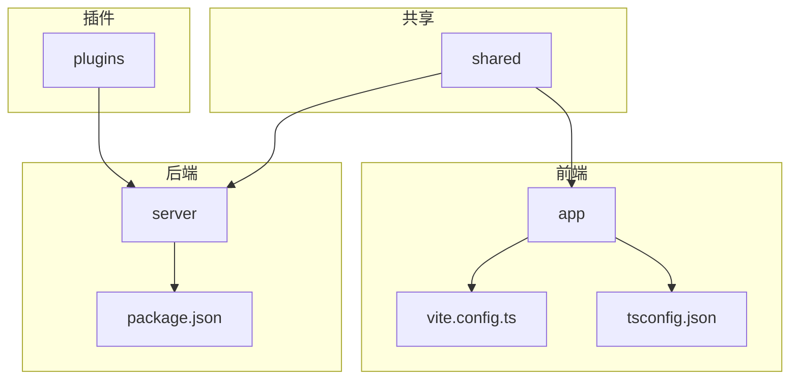
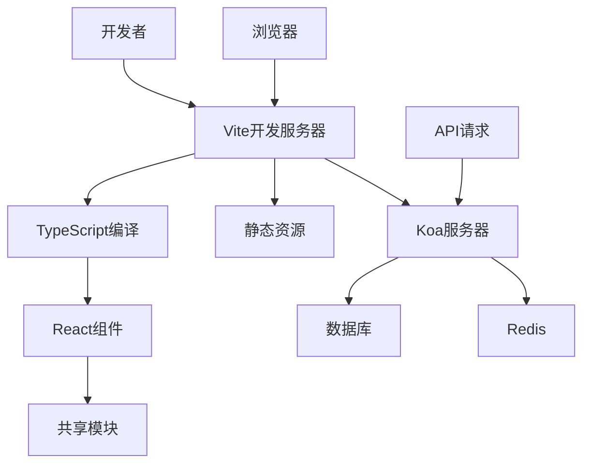
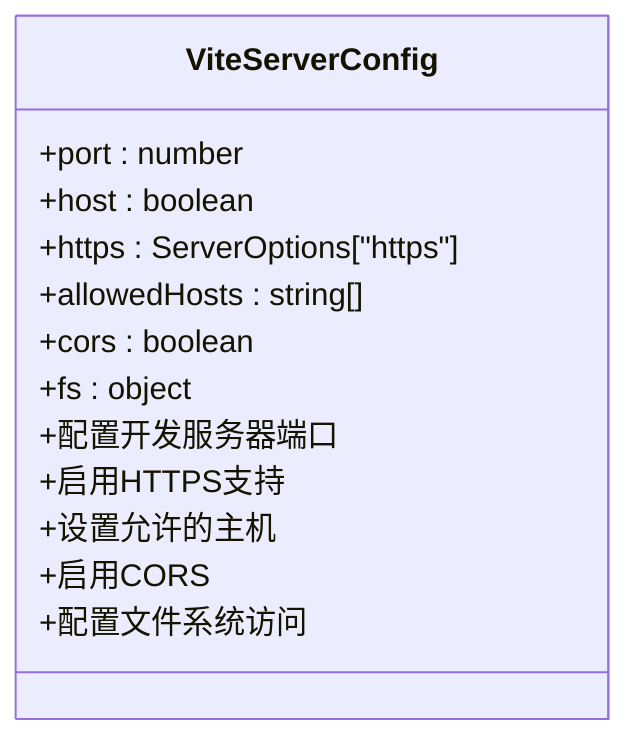
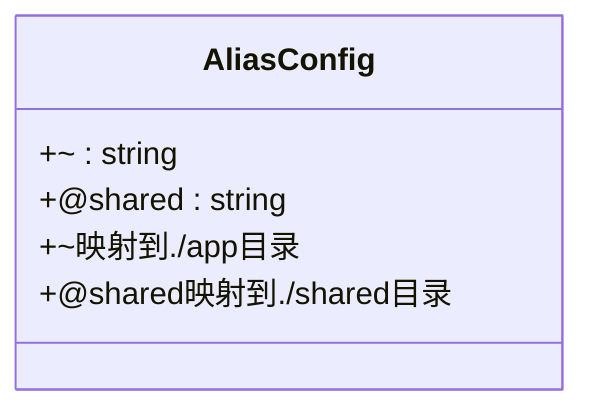
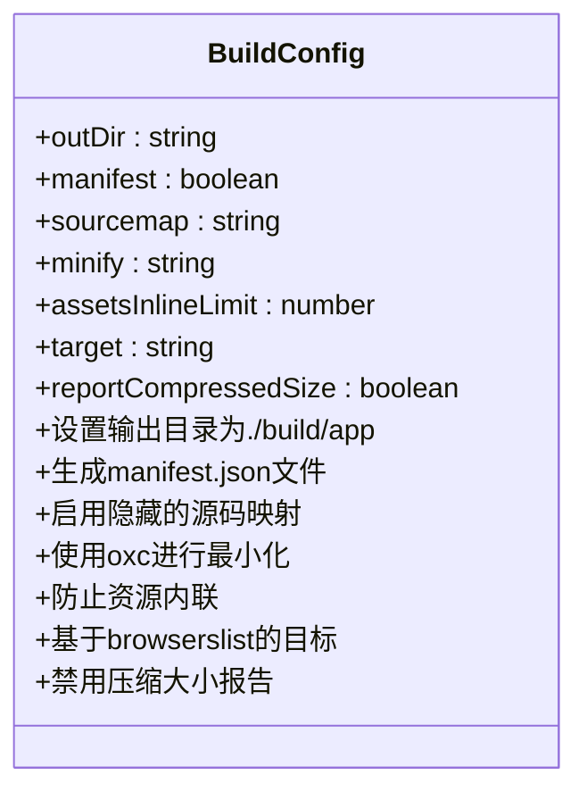
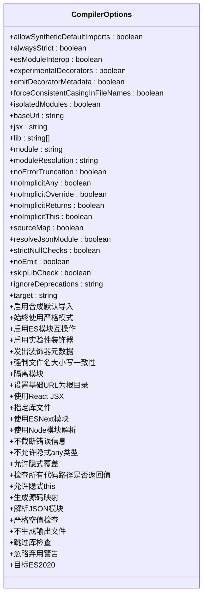
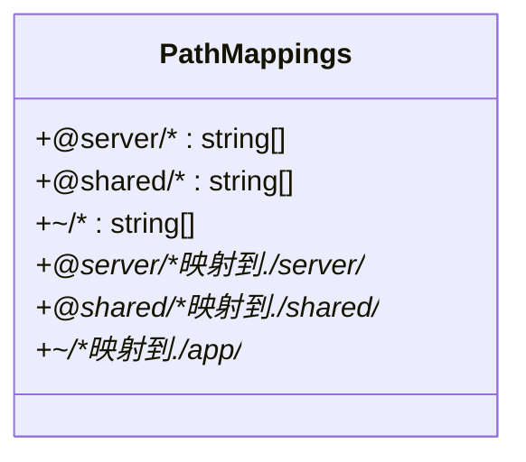
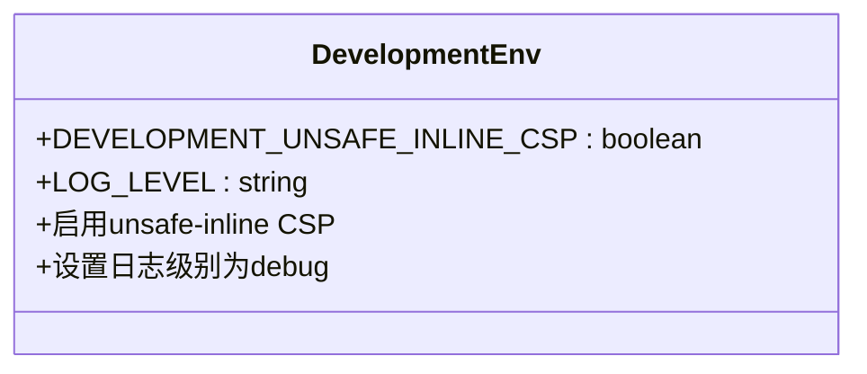
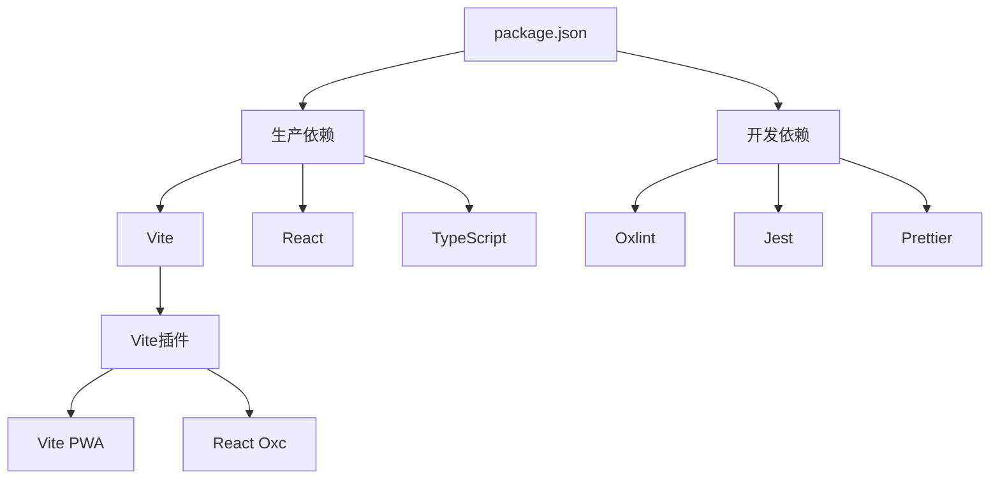

# 开发环境配置

<cite>
**本文档中引用的文件**  
- [vite.config.ts](file://vite.config.ts)
- [tsconfig.json](file://tsconfig.json)
- [.env.development](file://.env.development)
- [package.json](file://package.json)
</cite>

## 目录
1. [简介](#简介)
2. [项目结构](#项目结构)
3. [核心组件](#核心组件)
4. [架构概述](#架构概述)
5. [详细组件分析](#详细组件分析)
6. [依赖分析](#依赖分析)
7. [性能考虑](#性能考虑)
8. [故障排除指南](#故障排除指南)
9. [结论](#结论)
10. [附录](#附录)（如有必要）

## 简介
本文档详细介绍了baozi项目的本地开发环境配置过程。重点涵盖Vite开发服务器配置、HTTPS设置、环境变量管理以及TypeScript编译选项。通过分析vite.config.ts和tsconfig.json中的实际配置，解释关键配置项如别名解析（~和@shared）、构建输出路径、源码映射和模块解析策略。同时提供开发服务器启动步骤、端口配置和本地SSL证书的设置方法，为初学者和经验丰富的开发者分别提供环境准备指南和高级配置建议。

## 项目结构
baozi项目采用模块化结构，主要分为app、server、shared和plugins四个核心目录。app目录包含前端应用的所有组件、钩子和路由；server目录负责后端服务和API；shared目录存放前后端共享的代码；plugins目录管理各种插件扩展。此外，项目根目录包含Vite和TypeScript的配置文件，以及环境变量配置文件。

**图示来源**
- [vite.config.ts](file://vite.config.ts#L1-L166)
- [tsconfig.json](file://tsconfig.json#L1-L34)
- [package.json](file://package.json#L1-L387)

**本节来源**
- [vite.config.ts](file://vite.config.ts#L1-L166)
- [tsconfig.json](file://tsconfig.json#L1-L34)

## 核心组件
本项目的核心组件包括Vite开发服务器、TypeScript编译器和环境变量管理系统。Vite配置文件(vite.config.ts)定义了开发服务器的行为，包括端口、HTTPS设置和别名解析。TypeScript配置文件(tsconfig.json)管理编译选项，如模块解析策略和路径映射。环境变量通过.env.development文件进行管理，支持开发环境的特定配置。

**本节来源**
- [vite.config.ts](file://vite.config.ts#L1-L166)
- [tsconfig.json](file://tsconfig.json#L1-L34)
- [.env.development](file://.env.development#L1-L13)

## 架构概述
baozi项目采用前后端分离的架构，前端使用React框架，通过Vite进行开发和构建，后端使用Koa框架提供API服务。开发环境通过Vite的热模块替换(HMR)功能实现快速迭代，生产环境通过Vite的构建功能生成优化的静态资源。TypeScript为整个项目提供类型安全，通过路径别名简化模块导入。

**图示来源**
- [vite.config.ts](file://vite.config.ts#L1-L166)
- [package.json](file://package.json#L1-L387)

## 详细组件分析

### Vite配置分析
Vite配置文件(vite.config.ts)是开发环境的核心，它定义了开发服务器的行为和构建过程。

#### 开发服务器配置

**图示来源**
- [vite.config.ts](file://vite.config.ts#L26-L71)

#### 别名解析配置

**图示来源**
- [vite.config.ts](file://vite.config.ts#L147-L165)
- [tsconfig.json](file://tsconfig.json#L29-L33)

#### 构建配置

**图示来源**
- [vite.config.ts](file://vite.config.ts#L111-L145)

**本节来源**
- [vite.config.ts](file://vite.config.ts#L1-L166)

### TypeScript配置分析
TypeScript配置文件(tsconfig.json)管理项目的编译选项和类型检查。

#### 编译器选项分析

**图示来源**
- [tsconfig.json](file://tsconfig.json#L2-L28)

#### 路径映射配置

**图示来源**
- [tsconfig.json](file://tsconfig.json#L29-L33)

**本节来源**
- [tsconfig.json](file://tsconfig.json#L1-L34)

### 环境变量管理
环境变量通过.env.development文件进行管理，支持开发环境的特定配置。

#### 开发环境变量

**图示来源**
- [.env.development](file://.env.development#L1-L13)

**本节来源**
- [.env.development](file://.env.development#L1-L13)

## 依赖分析
项目依赖通过package.json文件管理，包含开发依赖和生产依赖。

**图示来源**
- [package.json](file://package.json#L1-L387)

**本节来源**
- [package.json](file://package.json#L1-L387)

## 性能考虑
在开发环境中，性能优化主要通过Vite的配置实现。构建过程禁用压缩大小报告以提高构建速度，使用oxc进行最小化以优化构建性能。源码映射设置为"hidden"模式，在开发环境中提供调试信息的同时不影响性能。资产内联限制设置为0，防止资源内联以符合CSP规则。

**本节来源**
- [vite.config.ts](file://vite.config.ts#L111-L145)

## 故障排除指南
### 常见问题及解决方案
1. **SSL证书问题**：如果开发环境中没有找到本地SSL证书，Vite会显示警告但继续运行。可以通过运行`yarn install-local-ssl`命令生成本地SSL证书。
2. **环境变量未加载**：确保.env.development文件存在且格式正确，环境变量名称和值之间使用等号分隔。
3. **端口冲突**：如果3001端口已被占用，可以修改vite.config.ts中的server.port配置。
4. **类型检查错误**：如果TypeScript类型检查失败，检查tsconfig.json配置是否正确，特别是paths和exclude选项。

**本节来源**
- [vite.config.ts](file://vite.config.ts#L1-L166)
- [tsconfig.json](file://tsconfig.json#L1-L34)
- [.env.development](file://.env.development#L1-L13)

## 结论
baozi项目的开发环境配置通过Vite和TypeScript的协同工作实现了高效的开发体验。Vite提供快速的开发服务器和优化的构建过程，TypeScript确保代码的类型安全。通过合理的配置，项目支持HTTPS开发、别名导入和环境变量管理，为开发者提供了灵活且强大的开发环境。建议开发者熟悉vite.config.ts和tsconfig.json中的关键配置项，以便根据需要进行定制和优化。