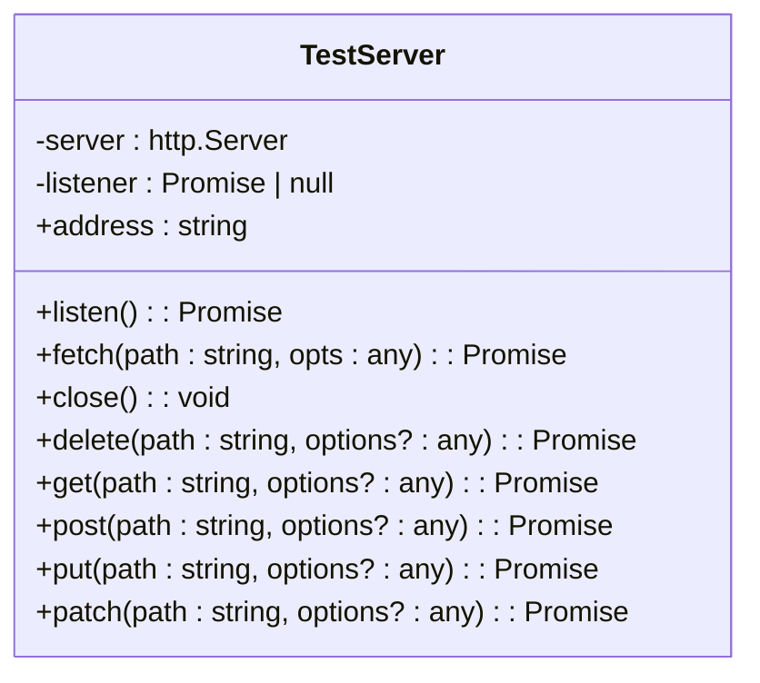
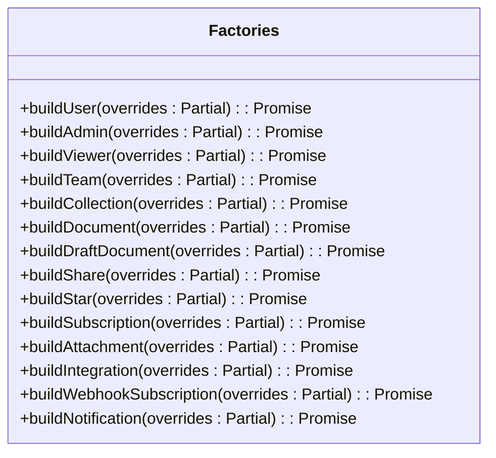
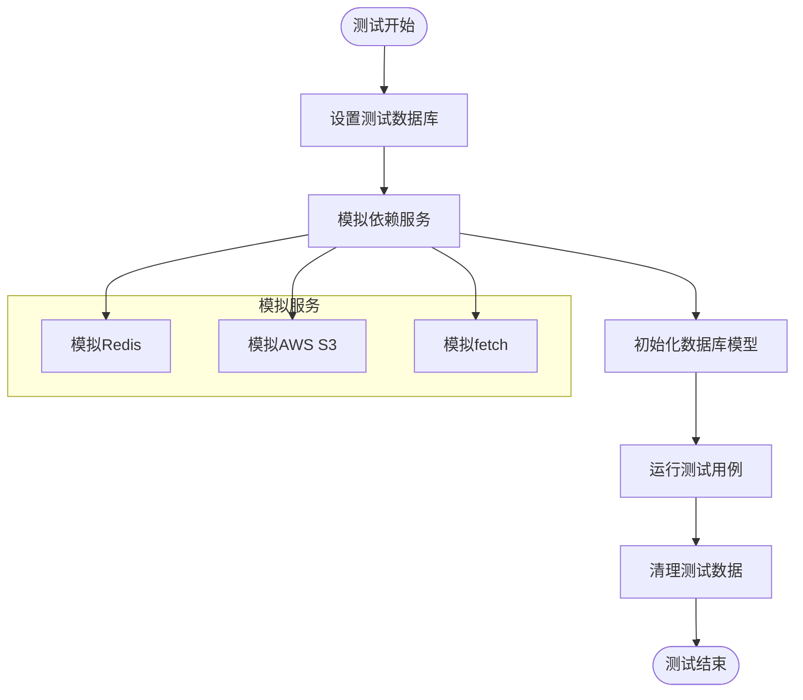
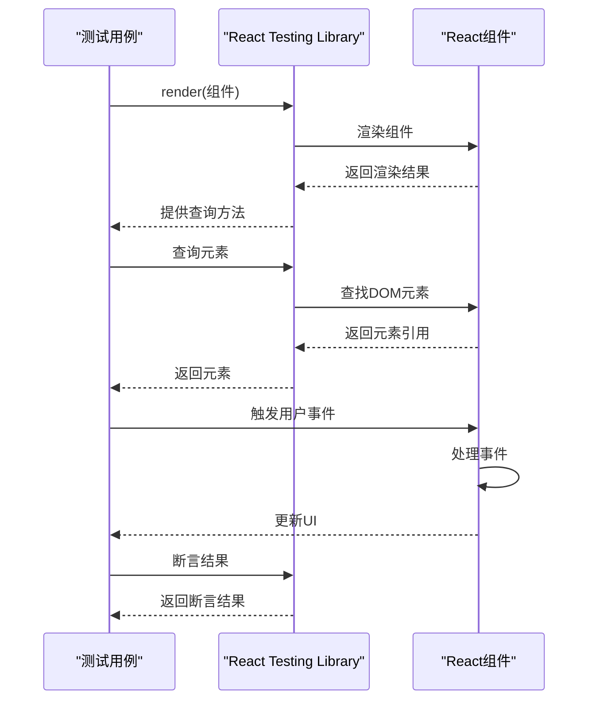
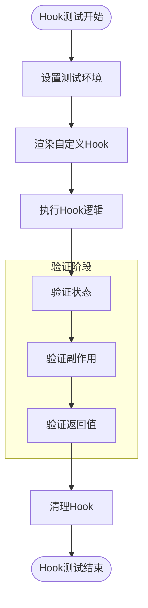
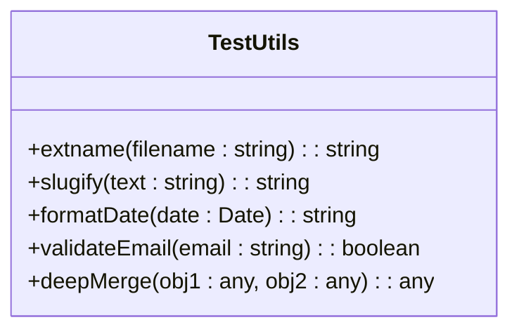
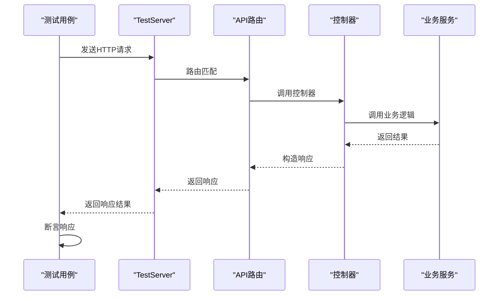
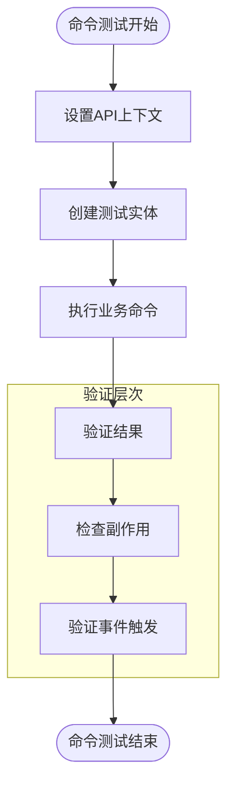
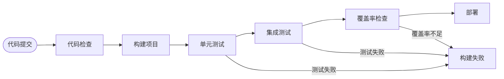

# 测试策略

<cite>
**本文档中引用的文件**  
- [setup.ts](file://app/test/setup.ts)
- [support.ts](file://app/test/support.ts)
- [TestServer.ts](file://server/test/TestServer.ts)
- [factories.ts](file://server/test/factories.ts)
- [setup.ts](file://server/test/setup.ts)
- [support.ts](file://server/test/support.ts)
- [setup.ts](file://shared/test/setup.ts)
- [files.test.ts](file://app/utils/files.test.ts)
- [i18n.test.ts](file://app/utils/i18n.test.ts)
- [routeHelpers.test.ts](file://app/utils/routeHelpers.test.ts)
- [urls.test.ts](file://app/utils/urls.test.ts)
- [ApiKey.test.ts](file://server/models/ApiKey.test.ts)
- [Collection.test.ts](file://server/models/Collection.test.ts)
- [Document.test.ts](file://server/models/Document.test.ts)
- [GroupMembership.test.ts](file://server/models/GroupMembership.test.ts)
- [Notification.test.ts](file://server/models/Notification.test.ts)
- [Revision.test.ts](file://server/models/Revision.test.ts)
- [Team.test.ts](file://server/models/Team.test.ts)
- [TeamDomain.test.ts](file://server/models/TeamDomain.test.ts)
- [User.test.ts](file://server/models/User.test.ts)
- [UserMembership.test.ts](file://server/models/UserMembership.test.ts)
- [View.test.ts](file://server/models/View.test.ts)
- [accountProvisioner.test.ts](file://server/commands/accountProvisioner.test.ts)
- [documentCreator.test.ts](file://server/commands/documentCreator.test.ts)
- [documentDuplicator.test.ts](file://server/commands/documentDuplicator.test.ts)
- [documentImporter.test.ts](file://server/commands/documentImporter.test.ts)
- [documentMover.test.ts](file://server/commands/documentMover.test.ts)
- [documentPermanentDeleter.test.ts](file://server/commands/documentPermanentDeleter.test.ts)
- [documentUpdater.test.ts](file://server/commands/documentUpdater.test.ts)
- [pinCreator.test.ts](file://server/commands/pinCreator.test.ts)
- [revisionCreator.test.ts](file://server/commands/revisionCreator.test.ts)
- [shareLoader.test.ts](file://server/commands/shareLoader.test.ts)
- [starCreator.test.ts](file://server/commands/starCreator.test.ts)
- [subscriptionCreator.test.ts](file://server/commands/subscriptionCreator.test.ts)
- [teamPermanentDeleter.test.ts](file://server/commands/teamPermanentDeleter.test.ts)
- [teamProvisioner.test.ts](file://server/commands/teamProvisioner.test.ts)
- [userInviter.test.ts](file://server/commands/userInviter.test.ts)
- [userProvisioner.test.ts](file://server/commands/userProvisioner.test.ts)
- [Collection.test.ts](file://app/models/Collection.test.ts)
- [errors.test.ts](file://server/routes/errors.test.ts)
- [index.test.ts](file://server/routes/index.test.ts)
</cite>

## 目录
1. [简介](#简介)
2. [测试环境配置](#测试环境配置)
3. [前端测试策略](#前端测试策略)
4. [后端测试策略](#后端测试策略)
5. [测试运行与持续集成](#测试运行与持续集成)

## 简介
baozi项目采用全面的测试策略，涵盖单元测试、集成测试和端到端测试三个层次，确保代码质量和功能稳定性。测试体系覆盖前端React组件、自定义hooks、后端API路由、数据库模型和核心业务逻辑。项目通过TestServer实现API测试环境的隔离，使用测试数据工厂快速构建测试数据，并通过Jest框架提供完整的测试支持。测试策略强调可维护性和可扩展性，为开发者提供可靠的测试套件来验证功能正确性。

## 测试环境配置

### TestServer配置
TestServer是后端测试的核心组件，用于创建隔离的HTTP服务器环境进行API测试。它基于Koa框架构建，能够在测试期间启动独立的服务器实例，避免测试之间的相互影响。



**图示来源**
- [TestServer.ts](file://server/test/TestServer.ts#L1-L82)

TestServer的主要特性包括：
- 自动分配端口：通过`listen()`方法在随机端口上启动服务器，避免端口冲突
- 便捷的HTTP方法封装：提供`get`、`post`、`put`、`delete`等常用HTTP方法的封装
- JSON自动序列化：当请求体为对象且未指定Content-Type时，自动设置为application/json并序列化
- 资源清理：通过`close()`方法关闭所有连接，确保测试后资源正确释放

### 测试数据工厂
测试数据工厂（factories）是构建测试数据的核心工具，位于`server/test/factories.ts`文件中。它提供了一系列工厂函数，用于快速创建各种类型的测试实体，如用户、团队、文档、集合等。



**图示来源**
- [factories.ts](file://server/test/factories.ts#L0-L799)

测试数据工厂的关键优势：
- **依赖自动处理**：创建文档时自动创建关联的团队和用户，减少样板代码
- **可定制性**：通过`overrides`参数允许覆盖默认属性，满足特定测试场景需求
- **一致性**：使用Faker库生成真实感的数据，确保测试数据的一致性和可预测性
- **关系完整性**：自动维护实体间的关系，如创建文档时自动添加到集合结构中

### 测试数据库管理
测试数据库通过Sequelize ORM进行管理，测试期间使用独立的数据库实例，确保测试的隔离性。测试设置文件`server/test/setup.ts`负责初始化数据库连接和配置测试环境。



**图示来源**
- [setup.ts](file://server/test/setup.ts#L0-L48)

测试数据库管理的关键特性：
- **服务模拟**：使用jest.mock模拟Redis、AWS S3等外部服务，避免测试对外部系统的依赖
- **数据隔离**：每个测试用例后通过`afterEach`钩子清理Redis缓存，确保测试独立性
- **环境配置**：在`beforeEach`钩子中设置统一的URL环境变量，确保测试环境一致性
- **模型初始化**：加载数据库模型，为测试提供数据访问能力

**测试环境来源**
- [TestServer.ts](file://server/test/TestServer.ts#L1-L82)
- [factories.ts](file://server/test/factories.ts#L0-L799)
- [setup.ts](file://server/test/setup.ts#L0-L48)

## 前端测试策略

### React组件测试
前端组件测试主要针对app/components目录下的React组件，使用Jest和React Testing Library进行测试。测试重点包括组件渲染、用户交互和状态管理。



**图示来源**
- [support.ts](file://app/test/support.ts)
- [setup.ts](file://app/test/setup.ts)

组件测试的最佳实践：
- **浅渲染**：使用`render`函数进行组件渲染，避免完整DOM树的开销
- **可访问性查询**：优先使用`getByRole`、`getByLabelText`等可访问性查询方法
- **用户行为模拟**：通过`fireEvent`模拟用户交互，如点击、输入等
- **异步处理**：使用`waitFor`处理异步操作，确保测试的可靠性

### 自定义Hooks测试
自定义hooks测试使用`@testing-library/react-hooks`库，专门用于测试React hooks的行为。测试关注hooks的状态管理、副作用和返回值。



**图示来源**
- [setup.ts](file://app/test/setup.ts#L0-L12)
- [support.ts](file://app/test/support.ts)

自定义hooks测试的关键点：
- **环境初始化**：在`setup.ts`中初始化i18n国际化支持和localStorage模拟
- **状态验证**：测试hooks返回的状态值是否符合预期
- **副作用验证**：验证useEffect等副作用是否正确执行
- **依赖变化**：测试当依赖项变化时，hooks是否正确重新执行

### 工具函数测试
工具函数测试位于app/utils目录下，主要测试纯函数的逻辑正确性。这些测试通常是简单的单元测试，验证输入输出的对应关系。



**图示来源**
- [files.test.ts](file://app/utils/files.test.ts#L0-L12)
- [i18n.test.ts](file://app/utils/i18n.test.ts)
- [routeHelpers.test.ts](file://app/utils/routeHelpers.test.ts)
- [urls.test.ts](file://app/utils/urls.test.ts)

工具函数测试示例（文件扩展名提取）：
```typescript
describe("#extname", () => {
  test("should extract file extension from string", () => {
    expect(extname("one.doc")).toBe(".doc");
    expect(extname("one.test.ts")).toBe(".ts");
    expect(extname(".DS_Store")).toBe("");
    expect(extname("directory/one.pdf")).toBe(".pdf");
  });
});
```

**前端测试来源**
- [setup.ts](file://app/test/setup.ts#L0-L12)
- [support.ts](file://app/test/support.ts)
- [files.test.ts](file://app/utils/files.test.ts#L0-L12)
- [i18n.test.ts](file://app/utils/i18n.test.ts)
- [routeHelpers.test.ts](file://app/utils/routeHelpers.test.ts)
- [urls.test.ts](file://app/utils/urls.test.ts)

## 后端测试策略

### API路由测试
API路由测试验证后端HTTP接口的正确性，包括请求处理、响应格式和错误处理。测试使用TestServer发送HTTP请求并验证响应。



**图示来源**
- [TestServer.ts](file://server/test/TestServer.ts#L1-L82)
- [errors.test.ts](file://server/routes/errors.test.ts)
- [index.test.ts](file://server/routes/index.test.ts)

API测试的关键方面：
- **状态码验证**：确保返回正确的HTTP状态码（200、404、500等）
- **响应体验证**：验证JSON响应的结构和内容
- **错误处理**：测试异常情况下的错误响应格式
- **认证授权**：验证不同用户角色的访问权限

### 数据库模型测试
数据库模型测试验证Sequelize模型的定义、关联关系和业务逻辑方法。测试位于server/models目录下，以.test.ts结尾。

```mermaid
classDiagram
class DocumentModel {
+getSummary() : string
+delete(user : User) : Promise<void>
+save() : Promise<void>
+findAllChildDocumentIds() : Promise<string[]>
+findByPk(id : string) : Promise<Document>
+findByIds(ids : string[]) : Promise<Document[]>
+tasks : {completed : number, total : number}
}
class CollectionModel {
+addDocumentToStructure(doc : Document, index : number) : Promise<void>
+removeDocumentFromStructure(doc : Document) : Promise<void>
+getDocumentTree() : Promise<DocumentNode[]>
}
class UserModel {
+isViewer() : boolean
+isAdmin() : boolean
+getTeam() : Promise<Team>
+getMemberships() : Promise<UserMembership[]>
}
DocumentModel --> CollectionModel : "belongsTo"
DocumentModel --> UserModel : "createdBy/lastModifiedBy"
UserModel --> TeamModel : "belongsTo"
UserMembership --> UserModel : "belongsTo"
UserMembership --> CollectionModel : "belongsTo"
```

**图示来源**
- [Document.test.ts](file://server/models/Document.test.ts#L0-L366)
- [Collection.test.ts](file://server/models/Collection.test.ts)
- [User.test.ts](file://server/models/User.test.ts)
- [Team.test.ts](file://server/models/Team.test.ts)
- [GroupMembership.test.ts](file://server/models/GroupMembership.test.ts)
- [Notification.test.ts](file://server/models/Notification.test.ts)
- [Revision.test.ts](file://server/models/Revision.test.ts)
- [View.test.ts](file://server/models/View.test.ts)
- [TeamDomain.test.ts](file://server/models/TeamDomain.test.ts)
- [ApiKey.test.ts](file://server/models/ApiKey.test.ts)

模型测试的重点：
- **方法逻辑**：测试模型实例方法的正确性，如`getSummary`、`delete`等
- **关联查询**：验证模型间的关联关系和查询功能
- **数据验证**：测试模型的数据验证规则和约束
- **生命周期钩子**：验证beforeSave、afterCreate等生命周期方法

### 业务逻辑命令测试
业务逻辑命令测试验证核心业务操作的正确性，位于server/commands目录下。这些测试通常涉及多个模型的交互和复杂的业务规则。



**图示来源**
- [documentCreator.test.ts](file://server/commands/documentCreator.test.ts#L0-L377)
- [accountProvisioner.test.ts](file://server/commands/accountProvisioner.test.ts)
- [documentDuplicator.test.ts](file://server/commands/documentDuplicator.test.ts)
- [documentImporter.test.ts](file://server/commands/documentImporter.test.ts)
- [documentMover.test.ts](file://server/commands/documentMover.test.ts)
- [documentPermanentDeleter.test.ts](file://server/commands/documentPermanentDeleter.test.ts)
- [documentUpdater.test.ts](file://server/commands/documentUpdater.test.ts)
- [pinCreator.test.ts](file://server/commands/pinCreator.test.ts)
- [revisionCreator.test.ts](file://server/commands/revisionCreator.test.ts)
- [shareLoader.test.ts](file://server/commands/shareLoader.test.ts)
- [starCreator.test.ts](file://server/commands/starCreator.test.ts)
- [subscriptionCreator.test.ts](file://server/commands/subscriptionCreator.test.ts)
- [teamPermanentDeleter.test.ts](file://server/commands/teamPermanentDeleter.test.ts)
- [teamProvisioner.test.ts](file://server/commands/teamProvisioner.test.ts)
- [userInviter.test.ts](file://server/commands/userInviter.test.ts)
- [userProvisioner.test.ts](file://server/commands/userProvisioner.test.ts)

业务命令测试示例（文档创建）：
```typescript
describe("documentCreator", () => {
  describe("content vs text priority", () => {
    it("should prioritize content over text when both are provided", async () => {
      const user = await buildUser();
      const collection = await buildCollection({
        userId: user.id,
        teamId: user.teamId,
      });

      const testText = "This is plain text";
      const testContent = ProsemirrorHelper.toProsemirror(
        "This is rich content"
      ).toJSON();

      const document = await withAPIContext(user, (ctx) =>
        documentCreator({
          title: "Test Document",
          text: testText,
          content: testContent,
          collectionId: collection.id,
          user,
          ctx,
        })
      );

      expect(document.content).toEqual(testContent);
      expect(document.text).toContain("This is rich content");
      expect(document.text).not.toContain("This is plain text");
    });
  });
});
```

**后端测试来源**
- [Document.test.ts](file://server/models/Document.test.ts#L0-L366)
- [Collection.test.ts](file://server/models/Collection.test.ts)
- [User.test.ts](file://server/models/User.test.ts)
- [Team.test.ts](file://server/models/Team.test.ts)
- [GroupMembership.test.ts](file://server/models/GroupMembership.test.ts)
- [Notification.test.ts](file://server/models/Notification.test.ts)
- [Revision.test.ts](file://server/models/Revision.test.ts)
- [View.test.ts](file://server/models/View.test.ts)
- [TeamDomain.test.ts](file://server/models/TeamDomain.test.ts)
- [ApiKey.test.ts](file://server/models/ApiKey.test.ts)
- [documentCreator.test.ts](file://server/commands/documentCreator.test.ts#L0-L377)
- [accountProvisioner.test.ts](file://server/commands/accountProvisioner.test.ts)
- [documentDuplicator.test.ts](file://server/commands/documentDuplicator.test.ts)
- [documentImporter.test.ts](file://server/commands/documentImporter.test.ts)
- [documentMover.test.ts](file://server/commands/documentMover.test.ts)
- [documentPermanentDeleter.test.ts](file://server/commands/documentPermanentDeleter.test.ts)
- [documentUpdater.test.ts](file://server/commands/documentUpdater.test.ts)
- [pinCreator.test.ts](file://server/commands/pinCreator.test.ts)
- [revisionCreator.test.ts](file://server/commands/revisionCreator.test.ts)
- [shareLoader.test.ts](file://server/commands/shareLoader.test.ts)
- [starCreator.test.ts](file://server/commands/starCreator.test.ts)
- [subscriptionCreator.test.ts](file://server/commands/subscriptionCreator.test.ts)
- [teamPermanentDeleter.test.ts](file://server/commands/teamPermanentDeleter.test.ts)
- [teamProvisioner.test.ts](file://server/commands/teamProvisioner.test.ts)
- [userInviter.test.ts](file://server/commands/userInviter.test.ts)
- [userProvisioner.test.ts](file://server/commands/userProvisioner.test.ts)
- [errors.test.ts](file://server/routes/errors.test.ts)
- [index.test.ts](file://server/routes/index.test.ts)

## 测试运行与持续集成

### 测试运行命令
项目提供了一系列npm脚本用于运行不同类型的测试：

```bash
# 运行所有测试
npm test

# 运行前端测试
npm run test:frontend

# 运行后端测试
npm run test:backend

# 运行特定目录的测试
npm run test:models
npm run test:commands
npm run test:routes

# 以监视模式运行测试
npm run test:watch

# 运行测试并生成覆盖率报告
npm run test:coverage
```

### 覆盖率报告生成
测试覆盖率通过Istanbul/nyc工具生成，配置在package.json的jest部分。覆盖率报告帮助识别未测试的代码路径。

```json
"jest": {
  "collectCoverageFrom": [
    "app/**/*.{js,ts,tsx}",
    "server/**/*.{js,ts}",
    "!**/node_modules/**",
    "!**/vendor/**"
  ],
  "coverageThreshold": {
    "global": {
      "branches": 80,
      "functions": 85,
      "lines": 90,
      "statements": 90
    }
  },
  "coverageDirectory": "coverage",
  "testPathIgnorePatterns": [
    "/node_modules/",
    "/dist/"
  ]
}
```

覆盖率报告包含以下指标：
- **语句覆盖率**：执行的语句占总语句的比例
- **分支覆盖率**：执行的分支（if/else）占总分支的比例
- **函数覆盖率**：调用的函数占总函数的比例
- **行覆盖率**：执行的代码行占总代码行的比例

### 持续集成中的测试执行
在CI/CD管道中，测试作为构建流程的关键环节执行。典型的CI流程包括：



CI配置要点：
- **并行执行**：将前端和后端测试并行执行，减少构建时间
- **缓存策略**：缓存node_modules和测试结果，加速后续构建
- **失败快速反馈**：配置测试失败时立即终止构建，快速反馈问题
- **环境隔离**：为每个构建创建独立的测试数据库，避免干扰

**测试执行来源**
- [package.json](file://package.json)
- [setup.ts](file://server/test/setup.ts#L0-L48)
- [setup.ts](file://app/test/setup.ts#L0-L12)
- [setup.ts](file://shared/test/setup.ts#L0-L3)