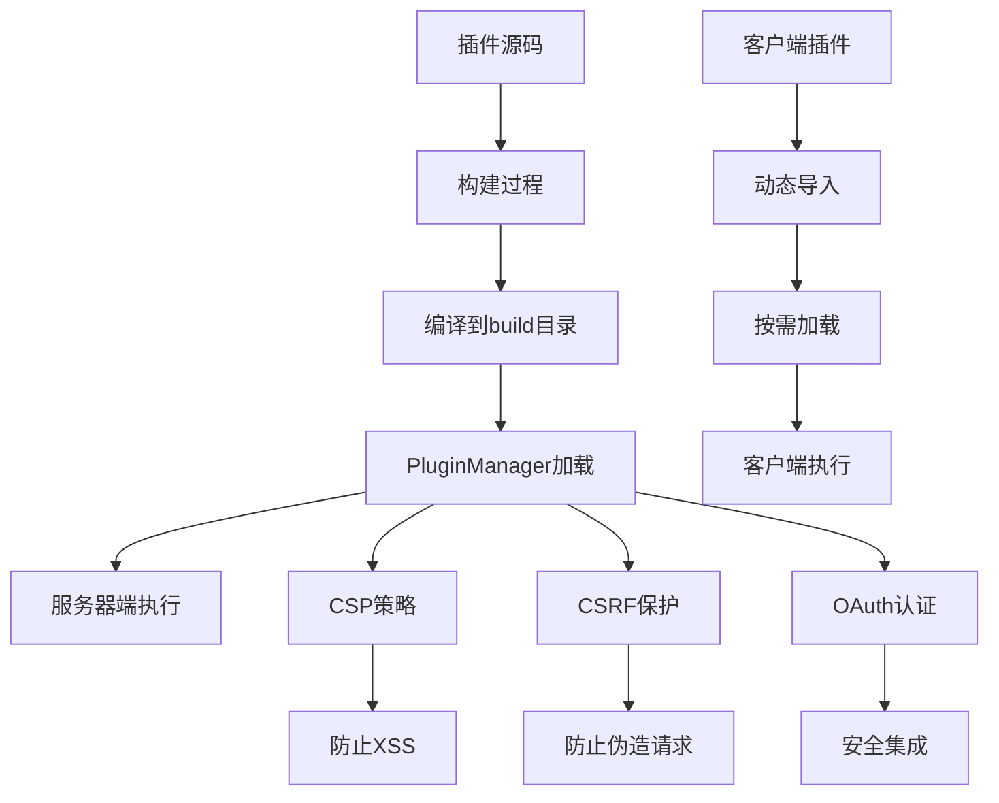
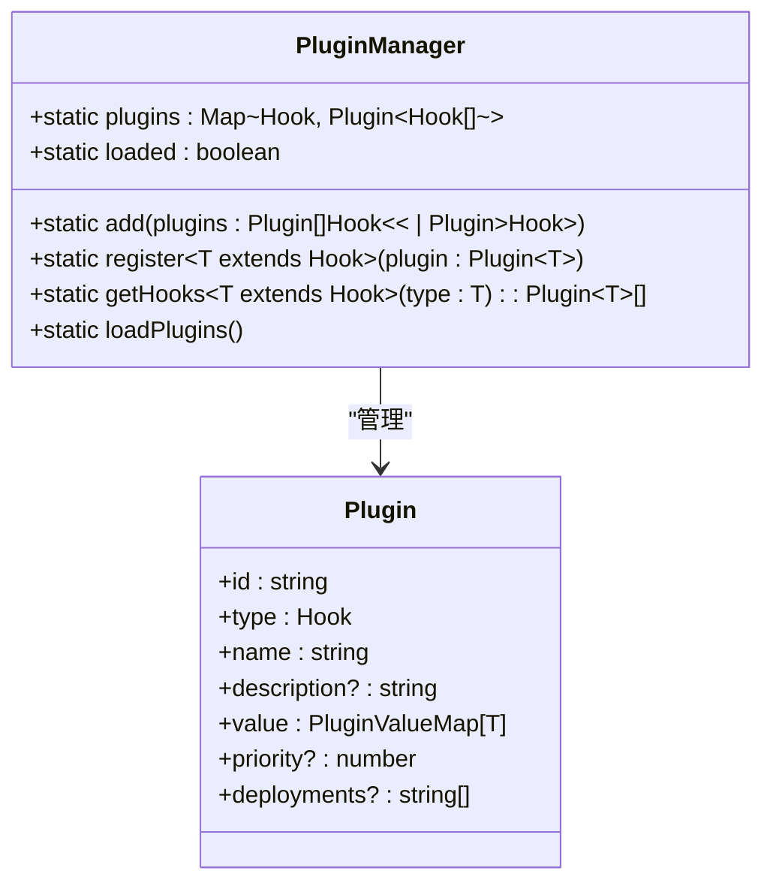
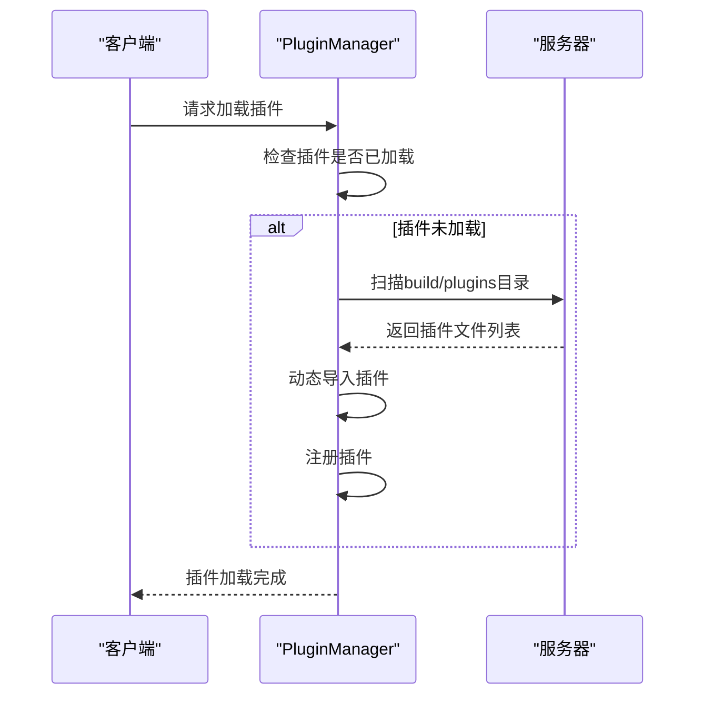
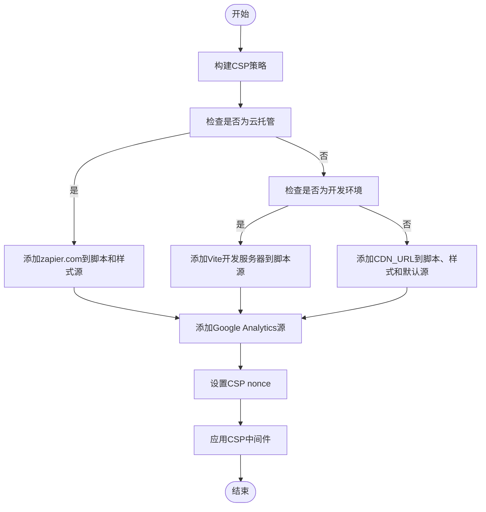

# 插件安全机制

<cite>
**本文档引用的文件**   
- [PluginManager.ts](file://app/utils/PluginManager.ts)
- [PluginManager.ts](file://server/utils/PluginManager.ts)
- [csp.ts](file://server/middlewares/csp.ts)
- [env.ts](file://server/env.ts)
- [plugin.json](file://plugins/github/plugin.json)
- [oidcDiscovery.ts](file://plugins/oidc/server/oidcDiscovery.ts)
- [oauth.ts](file://server/utils/oauth/OAuthInterface.ts)
- [csrf.ts](file://server/utils/csrf.ts)
- [validation.test.ts](file://server/validation.test.ts)
</cite>

## 目录
1. [引言](#引言)
2. [项目结构](#项目结构)
3. [核心组件](#核心组件)
4. [架构概述](#架构概述)
5. [详细组件分析](#详细组件分析)
6. [依赖分析](#依赖分析)
7. [性能考虑](#性能考虑)
8. [故障排除指南](#故障排除指南)
9. [结论](#结论)
10. [附录](#附录)（如有必要）

## 引言
本文档全面介绍了baozi插件系统的安全机制，重点阐述了插件的安全隔离策略、权限控制和风险防范措施。文档详细说明了插件执行环境的沙箱机制、代码注入防护、API访问限制和数据隐私保护方案。通过分析实际代码，解释了如何通过签名验证确保插件来源可信，以及如何管理插件的敏感权限（如用户数据访问、Webhook发送等）。为开发者提供了安全编码指南，并为系统管理员提供了安全审计和监控建议。

## 项目结构
baozi插件系统采用模块化设计，插件分为客户端和服务器端两部分，分别位于`plugins`目录下的`client`和`server`子目录中。每个插件都有一个`plugin.json`文件，定义了插件的基本信息和配置。服务器端插件通过`PluginManager`进行加载和管理，客户端插件则通过动态导入的方式加载。

```mermaid
graph TB
subgraph "插件目录"
plugins[plugins/]
plugins --> azure[azure/]
plugins --> discord[discord/]
plugins --> github[github/]
plugins --> slack[slack/]
plugins --> webhooks[webhooks/]
end
subgraph "插件结构"
azure --> client[client/]
azure --> server[server/]
azure --> pluginjson[plugin.json]
end
subgraph "核心管理"
server[server/]
server --> PluginManager[PluginManager.ts]
PluginManager --> loadPlugins[loadPlugins()]
end
PluginManager --> plugins
```

**图表来源**
- [PluginManager.ts](file://server/utils/PluginManager.ts#L66-L132)
- [plugin.json](file://plugins/github/plugin.json)

**章节来源**
- [server/utils/PluginManager.ts](file://server/utils/PluginManager.ts#L66-L132)
- [plugins/github/plugin.json](file://plugins/github/plugin.json)

## 核心组件
插件安全机制的核心组件包括插件管理器、内容安全策略（CSP）、OAuth认证接口和CSRF保护。插件管理器负责加载和注册插件，CSP防止跨站脚本攻击，OAuth认证接口确保第三方服务的安全集成，CSRF保护防止跨站请求伪造。

**章节来源**
- [server/utils/PluginManager.ts](file://server/utils/PluginManager.ts#L66-L132)
- [server/middlewares/csp.ts](file://server/middlewares/csp.ts#L1-L64)
- [server/utils/oauth/OAuthInterface.ts](file://server/utils/oauth/OAuthInterface.ts#L232-L291)
- [server/utils/csrf.ts](file://server/utils/csrf.ts#L1-L54)

## 架构概述
baozi插件系统的安全架构采用分层设计，从插件加载、执行到通信都实施了严格的安全控制。服务器端插件在构建时被编译到`build`目录，通过`glob`模式匹配加载，确保只有合法的插件文件被加载。客户端插件通过动态导入的方式按需加载，减少了潜在的安全风险。



**图表来源**
- [build.js](file://build.js#L1-L90)
- [server/utils/PluginManager.ts](file://server/utils/PluginManager.ts#L66-L132)
- [server/middlewares/csp.ts](file://server/middlewares/csp.ts#L1-L64)
- [server/utils/csrf.ts](file://server/utils/csrf.ts#L1-L54)
- [server/utils/oauth/OAuthInterface.ts](file://server/utils/oauth/OAuthInterface.ts#L232-L291)

## 详细组件分析
### 插件管理器分析
插件管理器是插件系统的核心，负责插件的注册、加载和执行。服务器端和客户端分别有独立的插件管理器，确保插件在不同环境下的安全隔离。

#### 对象导向组件：


**图表来源**
- [server/utils/PluginManager.ts](file://server/utils/PluginManager.ts#L66-L132)
- [app/utils/PluginManager.ts](file://app/utils/PluginManager.ts#L50-L102)

#### API/服务组件：


**图表来源**
- [server/utils/PluginManager.ts](file://server/utils/PluginManager.ts#L66-L132)
- [app/utils/PluginManager.ts](file://app/utils/PluginManager.ts#L50-L102)

### 内容安全策略分析
内容安全策略（CSP）是防止跨站脚本攻击（XSS）的重要手段。baozi系统通过`koa-helmet`中间件实现CSP，严格限制脚本、样式、媒体等资源的来源。

#### 复杂逻辑组件：


**图表来源**
- [server/middlewares/csp.ts](file://server/middlewares/csp.ts#L1-L64)

**章节来源**
- [server/middlewares/csp.ts](file://server/middlewares/csp.ts#L1-L64)

## 依赖分析
插件系统依赖于多个核心模块，包括`koa`、`lodash`、`glob`等。这些依赖通过`yarn`包管理器进行管理，确保版本一致性和安全性。服务器端插件依赖于`@server`命名空间下的模块，客户端插件依赖于`@shared`命名空间下的模块，实现了前后端的依赖隔离。

```mermaid
graph TD
A[插件系统] --> B[koa]
A --> C[lodash]
A --> D[glob]
A --> E[@server模块]
A --> F[@shared模块]
B --> G[Web服务器]
C --> H[工具函数]
D --> I[文件匹配]
E --> J[服务器功能]
F --> K[共享功能]
```

**图表来源**
- [package.json](file://package.json)
- [server/utils/PluginManager.ts](file://server/utils/PluginManager.ts#L1-L10)
- [app/utils/PluginManager.ts](file://app/utils/PluginManager.ts#L1-L10)

**章节来源**
- [package.json](file://package.json)
- [server/utils/PluginManager.ts](file://server/utils/PluginManager.ts#L1-L10)
- [app/utils/PluginManager.ts](file://app/utils/PluginManager.ts#L1-L10)

## 性能考虑
插件系统的性能主要受插件加载和执行的影响。通过将插件编译到`build`目录，减少了运行时的文件扫描开销。客户端插件采用动态导入，按需加载，避免了不必要的资源消耗。服务器端插件在应用启动时一次性加载，减少了运行时的性能开销。

## 故障排除指南
### 插件加载失败
1. 检查插件目录结构是否正确，确保`client`和`server`目录存在。
2. 检查`plugin.json`文件是否正确配置。
3. 检查构建过程是否成功，确保插件文件被正确编译到`build`目录。
4. 查看服务器日志，确认插件注册是否成功。

### CSP策略问题
1. 检查环境变量配置，确保`CDN_URL`、`GOOGLE_ANALYTICS_ID`等正确设置。
2. 检查开发环境配置，确保`DEVELOPMENT_UNSAFE_INLINE_CSP`正确设置。
3. 查看浏览器控制台，确认CSP错误信息。

**章节来源**
- [server/utils/PluginManager.ts](file://server/utils/PluginManager.ts#L66-L132)
- [server/middlewares/csp.ts](file://server/middlewares/csp.ts#L1-L64)

## 结论
baozi插件系统通过多层次的安全机制，确保了插件的隔离性、权限控制和风险防范。从插件加载、执行到通信，每个环节都实施了严格的安全控制。通过CSP、CSRF保护、OAuth认证等技术，有效防止了常见的安全威胁。为开发者提供了安全的插件开发环境，为系统管理员提供了可靠的安全审计和监控手段。