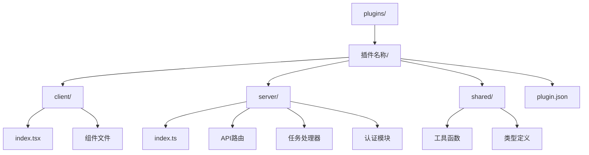
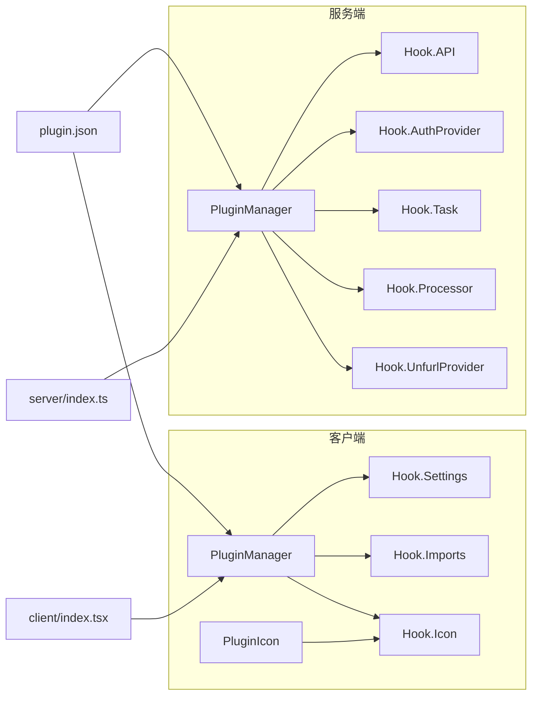
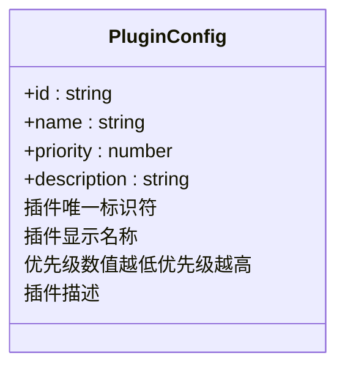
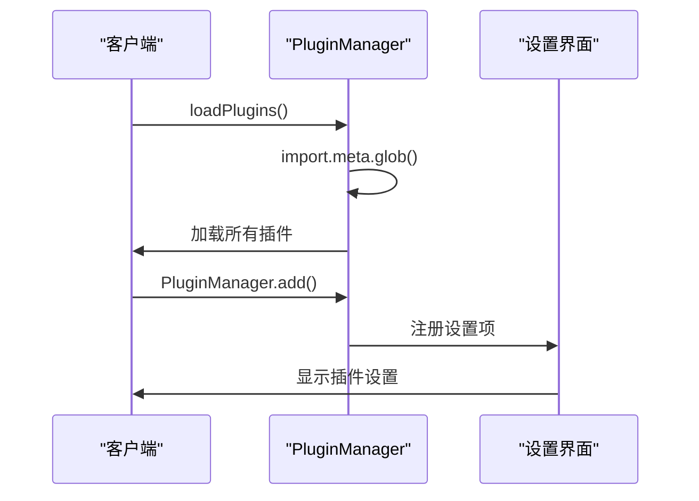
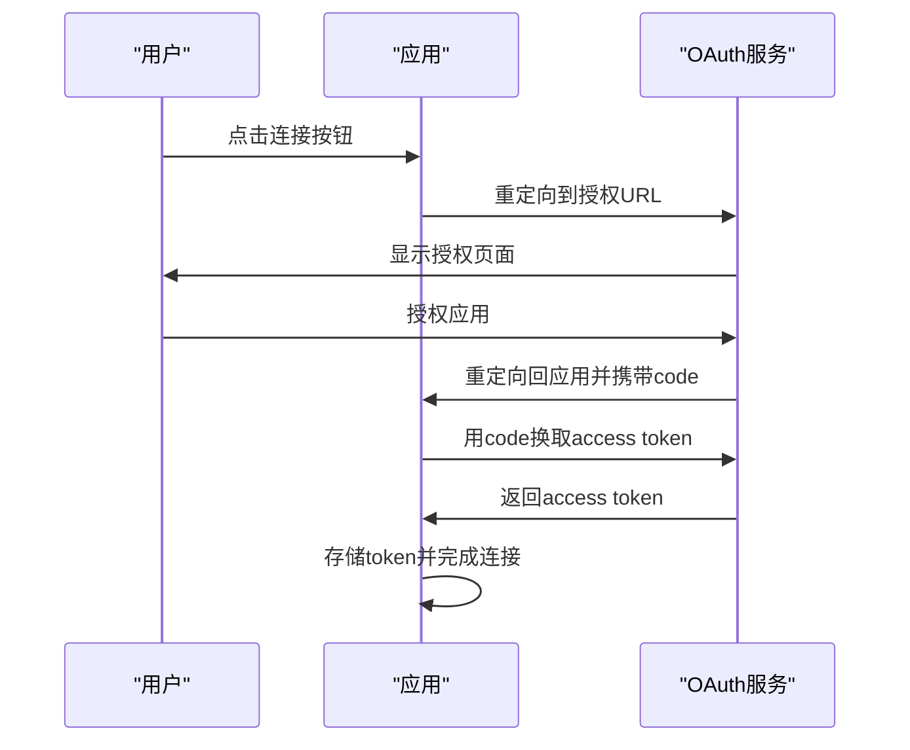
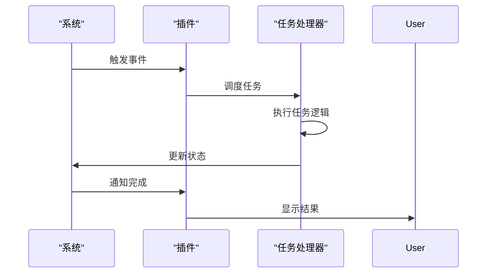
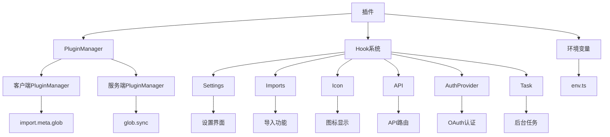

# 插件开发指南

<cite>
**本文档中引用的文件**  
- [plugin.json](file://plugins/github/plugin.json)
- [client/index.tsx](file://plugins/github/client/index.tsx)
- [server/index.ts](file://plugins/github/server/index.ts)
- [server/github.ts](file://plugins/github/server/github.ts)
- [server/api/github.ts](file://plugins/github/server/api/github.ts)
- [shared/GitHubUtils.ts](file://plugins/github/shared/GitHubUtils.ts)
- [server/env.ts](file://plugins/github/server/env.ts)
- [client/Settings.tsx](file://plugins/github/client/Settings.tsx)
- [server/tasks/GitHubWebhookTask.ts](file://plugins/github/server/tasks/GitHubWebhookTask.ts)
- [server/uninstall.ts](file://plugins/github/server/uninstall.ts)
- [server/PluginManager.ts](file://app/utils/PluginManager.ts)
- [server/PluginManager.ts](file://server/utils/PluginManager.ts)
</cite>

## 目录
1. [简介](#简介)
2. [项目结构](#项目结构)
3. [核心组件](#核心组件)
4. [架构概述](#架构概述)
5. [详细组件分析](#详细组件分析)
6. [依赖分析](#依赖分析)
7. [性能考虑](#性能考虑)
8. [故障排除指南](#故障排除指南)
9. [结论](#结论)
10. [附录](#附录)（如有必要）

## 简介
本文档旨在为baozi项目提供全面的插件开发指南，重点介绍如何创建自定义插件。通过分析GitHub、Slack和Notion等现有插件的实际代码，详细说明前端和后端插件的开发流程、接口规范和最佳实践。涵盖OAuth认证集成、API路由扩展、UI组件注入、事件监听等常见开发场景。提供从创建plugin.json到实现前后端逻辑的完整步骤，包括环境变量配置、错误处理和测试方法。针对初学者提供简单示例，同时为经验开发者提供高级技巧，如性能优化、安全性加固和调试策略。

## 项目结构
baozi项目的插件系统采用前后端分离的架构设计，插件代码主要存放在`plugins/`目录下。每个插件都有独立的目录结构，包含客户端、服务端和共享代码三个主要部分。



**Diagram sources**
- [plugins/github](file://plugins/github)
- [plugins/slack](file://plugins/slack)
- [plugins/notion](file://plugins/notion)

**Section sources**
- [plugins](file://plugins)
- [plugins/github](file://plugins/github)

## 核心组件
插件系统的核心组件包括插件管理器、钩子系统、配置文件和生命周期管理。插件管理器负责加载和注册插件，钩子系统定义了插件可以扩展的功能点，配置文件提供了插件的基本信息，生命周期管理确保插件在正确的时间点执行。

**Section sources**
- [app/utils/PluginManager.ts](file://app/utils/PluginManager.ts#L50-L102)
- [server/utils/PluginManager.ts](file://server/utils/PluginManager.ts#L35-L85)
- [plugins/github/plugin.json](file://plugins/github/plugin.json)

## 架构概述
baozi插件系统采用模块化设计，通过前后端插件管理器分别处理客户端和服务端的插件扩展。客户端插件主要用于UI扩展和用户交互，服务端插件则负责API扩展、认证集成和后台任务处理。



**Diagram sources**
- [app/utils/PluginManager.ts](file://app/utils/PluginManager.ts#L70-L152)
- [server/utils/PluginManager.ts](file://server/utils/PluginManager.ts#L66-L132)

## 详细组件分析

### 插件配置分析
插件配置文件`plugin.json`是插件的元数据描述文件，包含插件的基本信息和配置参数。



**Diagram sources**
- [plugins/github/plugin.json](file://plugins/github/plugin.json#L1-L7)
- [plugins/slack/plugin.json](file://plugins/slack/plugin.json#L1-L7)
- [plugins/notion/plugin.json](file://plugins/notion/plugin.json#L1-L6)

**Section sources**
- [plugins/github/plugin.json](file://plugins/github/plugin.json)
- [plugins/slack/plugin.json](file://plugins/slack/plugin.json)
- [plugins/notion/plugin.json](file://plugins/notion/plugin.json)

### 客户端插件分析
客户端插件通过`client/index.tsx`文件注册，主要扩展UI功能和用户交互。



**Diagram sources**
- [app/utils/PluginManager.ts](file://app/utils/PluginManager.ts#L147-L162)
- [plugins/github/client/index.tsx](file://plugins/github/client/index.tsx#L1-L18)

**Section sources**
- [app/utils/PluginManager.ts](file://app/utils/PluginManager.ts#L147-L162)
- [plugins/github/client/index.tsx](file://plugins/github/client/index.tsx)

### 服务端插件分析
服务端插件通过`server/index.ts`文件注册，主要扩展API功能和后台服务。

```mermaid
flowchart TD
A[server/index.ts] --> B{插件是否启用?}
B --> |是| C[PluginManager.add()]
B --> |否| D[跳过]
C --> E[注册API路由]
C --> F[注册任务处理器]
C --> G[注册认证提供者]
C --> H[注册卸载钩子]
E --> I[API路由处理]
F --> J[后台任务执行]
G --> K[OAuth认证]
H --> L[插件卸载清理]
```

**Diagram sources**
- [server/utils/PluginManager.ts](file://server/utils/PluginManager.ts#L82-L101)
- [plugins/github/server/index.ts](file://plugins/github/server/index.ts#L1-L42)

**Section sources**
- [server/utils/PluginManager.ts](file://server/utils/PluginManager.ts#L82-L101)
- [plugins/github/server/index.ts](file://plugins/github/server/index.ts)

### OAuth认证集成分析
OAuth认证集成是插件开发的重要组成部分，用于连接第三方服务。



**Diagram sources**
- [plugins/github/server/github.ts](file://plugins/github/server/github.ts#L1-L307)
- [plugins/github/server/api/github.ts](file://plugins/github/server/api/github.ts#L1-L129)

**Section sources**
- [plugins/github/server/github.ts](file://plugins/github/server/github.ts)
- [plugins/github/server/api/github.ts](file://plugins/github/server/api/github.ts)

### API路由扩展分析
API路由扩展允许插件添加自定义的API端点。

```mermaid
flowchart TD
A[server/index.ts] --> B[PluginManager.add()]
B --> C[注册API钩子]
C --> D[server/api/github.ts]
D --> E[定义路由]
E --> F[添加中间件]
F --> G[处理请求]
G --> H[返回响应]
C --> I[server/routes/api/index.ts]
I --> J[注册所有插件API]
J --> K[处理请求]
```

**Diagram sources**
- [server/utils/PluginManager.ts](file://server/utils/PluginManager.ts#L117-L129)
- [server/routes/api/index.ts](file://server/routes/api/index.ts#L29-L77)
- [plugins/github/server/api/github.ts](file://plugins/github/server/api/github.ts)

**Section sources**
- [server/utils/PluginManager.ts](file://server/utils/PluginManager.ts#L117-L129)
- [server/routes/api/index.ts](file://server/routes/api/index.ts#L29-L77)
- [plugins/github/server/api/github.ts](file://plugins/github/server/api/github.ts)

### UI组件注入分析
UI组件注入允许插件在应用界面中添加自定义组件。

```mermaid
flowchart TD
A[client/index.tsx] --> B[PluginManager.add()]
B --> C[注册Settings钩子]
C --> D[定义组件]
D --> E[createLazyComponent]
E --> F[动态导入]
F --> G[注册到设置界面]
G --> H[用户访问设置]
H --> I[加载插件组件]
I --> J[显示插件界面]
```

**Diagram sources**
- [app/utils/PluginManager.ts](file://app/utils/PluginManager.ts#L76-L82)
- [plugins/github/client/index.tsx](file://plugins/github/client/index.tsx#L1-L18)

**Section sources**
- [app/utils/PluginManager.ts](file://app/utils/PluginManager.ts#L76-L82)
- [plugins/github/client/index.tsx](file://plugins/github/client/index.tsx)

### 事件监听分析
事件监听允许插件响应系统事件和用户操作。



**Diagram sources**
- [plugins/github/server/index.ts](file://plugins/github/server/index.ts#L1-L42)
- [plugins/github/server/tasks/GitHubWebhookTask.ts](file://plugins/github/server/tasks/GitHubWebhookTask.ts)

**Section sources**
- [plugins/github/server/index.ts](file://plugins/github/server/index.ts)
- [plugins/github/server/tasks/GitHubWebhookTask.ts](file://plugins/github/server/tasks/GitHubWebhookTask.ts)

## 依赖分析
插件系统依赖于多个核心模块和第三方库，这些依赖关系确保了插件功能的完整性和稳定性。



**Diagram sources**
- [app/utils/PluginManager.ts](file://app/utils/PluginManager.ts)
- [server/utils/PluginManager.ts](file://server/utils/PluginManager.ts)
- [server/env.ts](file://server/env.ts)

**Section sources**
- [app/utils/PluginManager.ts](file://app/utils/PluginManager.ts)
- [server/utils/PluginManager.ts](file://server/utils/PluginManager.ts)
- [server/env.ts](file://server/env.ts)

## 性能考虑
插件开发需要考虑性能影响，避免对主应用造成性能瓶颈。

**Section sources**
- [plugins/github/server/github.ts](file://plugins/github/server/github.ts#L1-L307)
- [plugins/notion/server/notion.ts](file://plugins/notion/server/notion.ts#L1-L423)

## 故障排除指南
插件开发过程中可能会遇到各种问题，以下是一些常见问题的解决方案。

**Section sources**
- [server/errors.ts](file://server/errors.ts)
- [app/utils/Logger.ts](file://app/utils/Logger.ts)

## 结论
本文档详细介绍了baozi项目的插件开发流程，涵盖了从基础配置到高级功能的各个方面。通过分析现有插件的实现，为开发者提供了清晰的开发指南和最佳实践。插件系统的设计充分考虑了可扩展性、安全性和性能，为第三方开发者提供了强大的扩展能力。