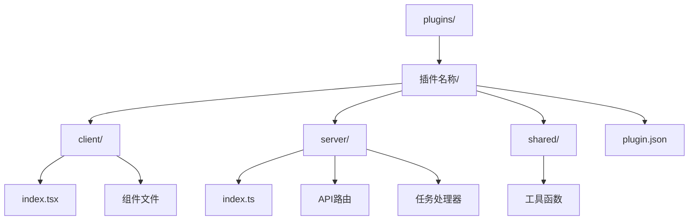
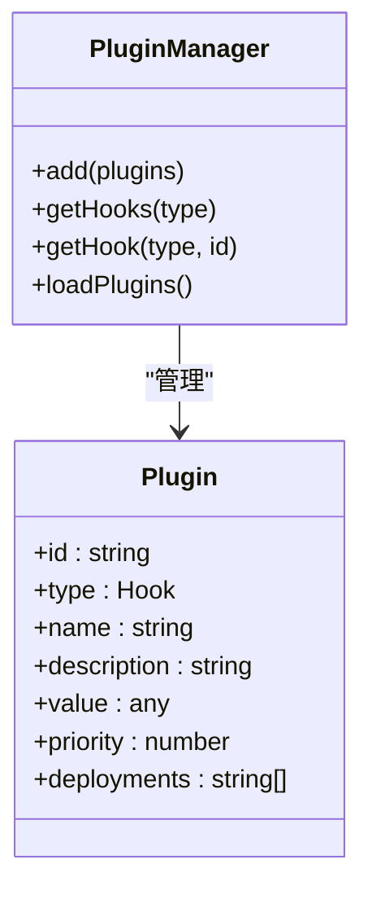
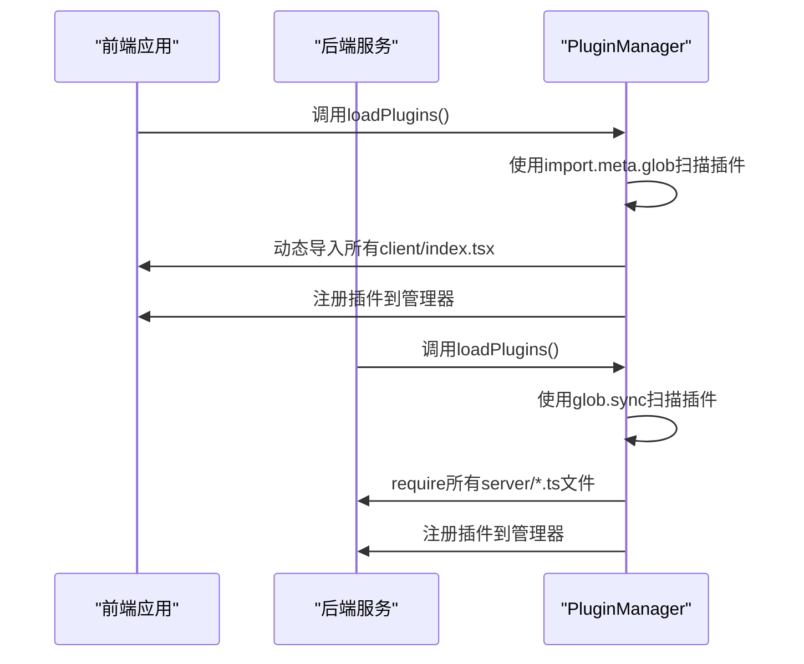
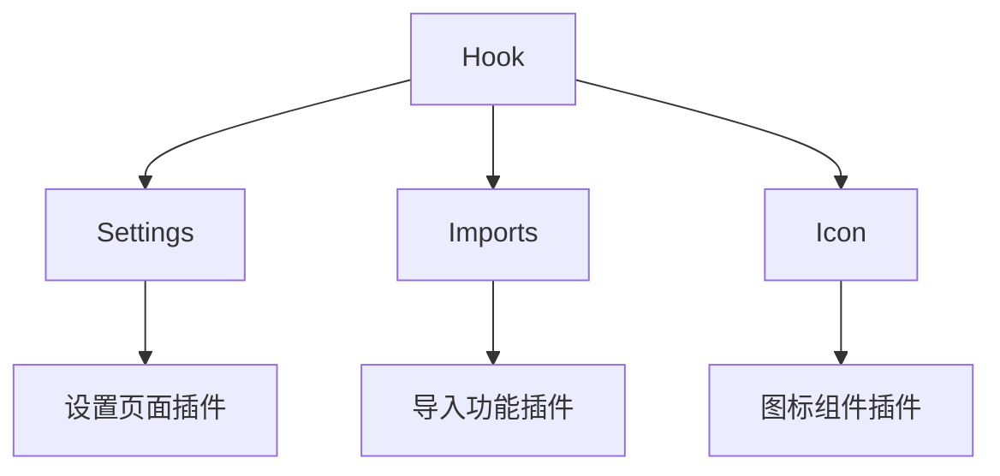
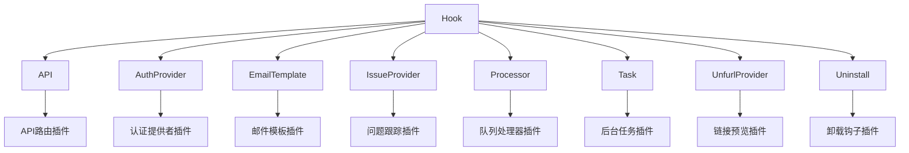
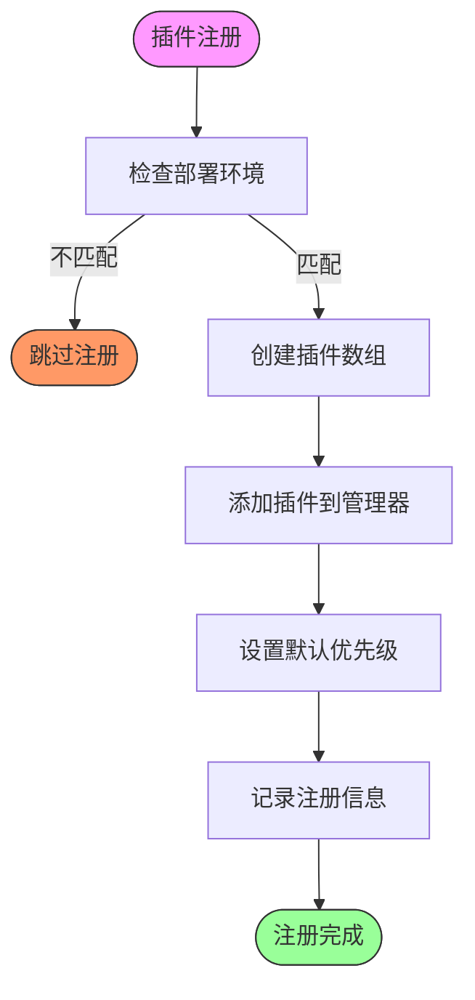
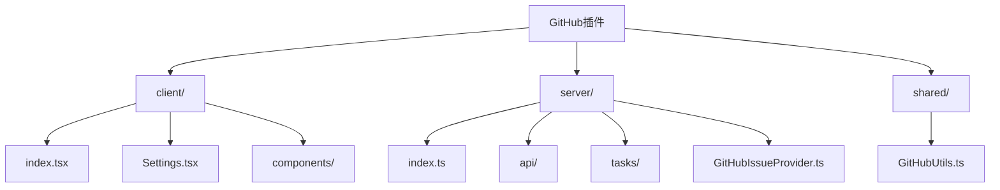
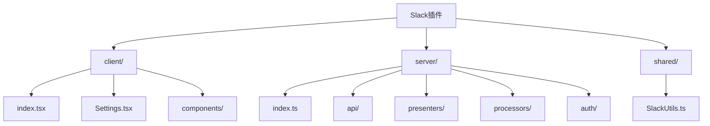
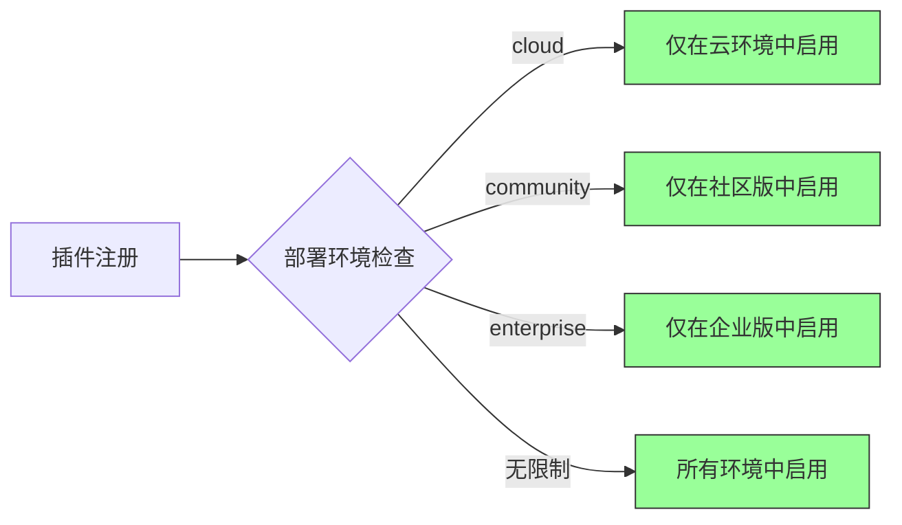

# 插件架构设计

<cite>
**本文档中引用的文件**  
- [PluginManager.ts](file://app/utils/PluginManager.ts)
- [PluginManager.ts](file://server/utils/PluginManager.ts)
- [plugin.json](file://plugins/github/plugin.json)
- [plugin.json](file://plugins/slack/plugin.json)
- [index.tsx](file://plugins/github/client/index.tsx)
- [index.tsx](file://plugins/slack/client/index.tsx)
- [index.ts](file://plugins/github/server/index.ts)
- [index.ts](file://plugins/slack/server/index.ts)
- [Icon.tsx](file://app/components/PluginIcon.tsx)
</cite>

## 目录
1. [项目结构](#项目结构)
2. [核心组件](#核心组件)
3. [插件加载与初始化流程](#插件加载与初始化流程)
4. [前后端插件管理机制](#前后端插件管理机制)
5. [插件生命周期管理](#插件生命周期管理)
6. [插件配置文件规范](#插件配置文件规范)
7. [实际插件案例分析](#实际插件案例分析)
8. [安全权限控制](#安全权限控制)

## 项目结构

baozi项目的插件系统采用前后端分离的设计模式，插件目录位于根目录下的`plugins/`文件夹中。每个插件都有独立的子目录，包含前端、后端和共享代码三个主要部分。

**Diagram sources**
- [plugins/github](file://plugins/github)
- [plugins/slack](file://plugins/slack)

**Section sources**
- [plugins](file://plugins)

## 核心组件

插件系统的核心是`PluginManager`类，它在前后端分别实现了插件的注册、管理和调用机制。前端插件管理器位于`app/utils/PluginManager.ts`，后端插件管理器位于`server/utils/PluginManager.ts`。

**Diagram sources**
- [app/utils/PluginManager.ts](file://app/utils/PluginManager.ts#L50-L65)
- [server/utils/PluginManager.ts](file://server/utils/PluginManager.ts#L50-L61)

**Section sources**
- [app/utils/PluginManager.ts](file://app/utils/PluginManager.ts#L70-L152)
- [server/utils/PluginManager.ts](file://server/utils/PluginManager.ts#L66-L132)

## 插件加载与初始化流程

插件系统的加载流程分为前端和后端两个独立的路径，确保前后端插件的隔离性和安全性。

**Diagram sources**
- [app/utils/PluginManager.ts](file://app/utils/PluginManager.ts#L130-L140)
- [server/utils/PluginManager.ts](file://server/utils/PluginManager.ts#L110-L120)

**Section sources**
- [app/utils/PluginManager.ts](file://app/utils/PluginManager.ts#L130-L147)
- [server/utils/PluginManager.ts](file://server/utils/PluginManager.ts#L110-L125)

## 前后端插件管理机制

插件管理器在前后端分别实现了不同的插件类型和管理策略，以适应不同的运行环境和功能需求。

### 前端插件类型

**Diagram sources**
- [app/utils/PluginManager.ts](file://app/utils/PluginManager.ts#L13-L17)

### 后端插件类型

**Diagram sources**
- [server/utils/PluginManager.ts](file://server/utils/PluginManager.ts#L24-L33)

**Section sources**
- [app/utils/PluginManager.ts](file://app/utils/PluginManager.ts#L13-L17)
- [server/utils/PluginManager.ts](file://server/utils/PluginManager.ts#L24-L33)

## 插件生命周期管理

插件管理器通过优先级机制和部署环境控制来管理插件的生命周期，确保插件按正确的顺序加载和执行。

**Diagram sources**
- [app/utils/PluginManager.ts](file://app/utils/PluginManager.ts#L80-L100)
- [server/utils/PluginManager.ts](file://server/utils/PluginManager.ts#L80-L100)

**Section sources**
- [app/utils/PluginManager.ts](file://app/utils/PluginManager.ts#L75-L110)
- [server/utils/PluginManager.ts](file://server/utils/PluginManager.ts#L75-L110)

## 插件配置文件规范

每个插件都必须包含一个`plugin.json`配置文件，定义插件的基本信息和元数据。

### 配置文件字段定义

| 字段 | 类型 | 必需 | 说明 |
|------|------|------|------|
| id | string | 是 | 插件的唯一标识符 |
| name | string | 是 | 插件的显示名称 |
| priority | number | 否 | 插件优先级，数值越小优先级越高 |
| description | string | 否 | 插件的简要描述 |
| deployments | array | 否 | 插件支持的部署环境 |

**Section sources**
- [plugins/github/plugin.json](file://plugins/github/plugin.json)
- [plugins/slack/plugin.json](file://plugins/slack/plugin.json)

## 实际插件案例分析

通过分析GitHub和Slack插件的实现，可以深入了解插件与核心系统的集成方式。

### GitHub插件分析

**Diagram sources**
- [plugins/github](file://plugins/github)

### Slack插件分析

**Diagram sources**
- [plugins/slack](file://plugins/slack)

**Section sources**
- [plugins/github](file://plugins/github)
- [plugins/slack](file://plugins/slack)

## 安全权限控制

插件系统通过部署环境限制和优先级机制来实现安全权限控制，确保插件只能在允许的环境中运行。

**Diagram sources**
- [app/utils/PluginManager.ts](file://app/utils/PluginManager.ts#L80-L90)

**Section sources**
- [app/utils/PluginManager.ts](file://app/utils/PluginManager.ts#L80-L95)