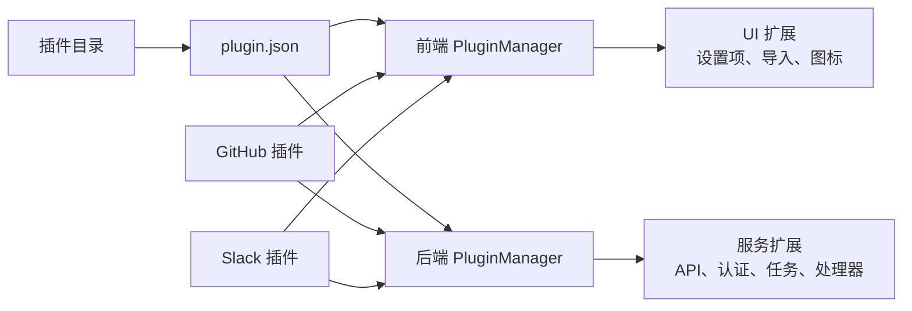
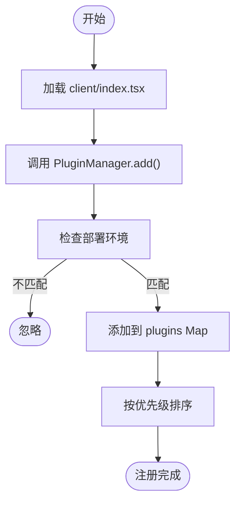
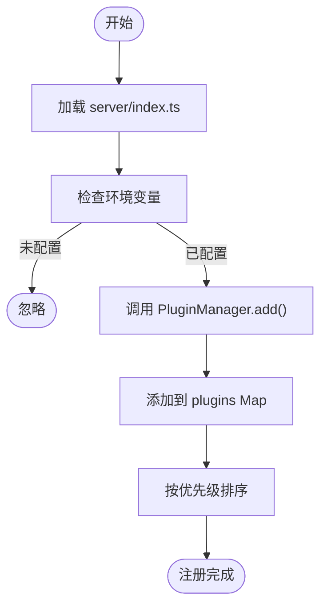
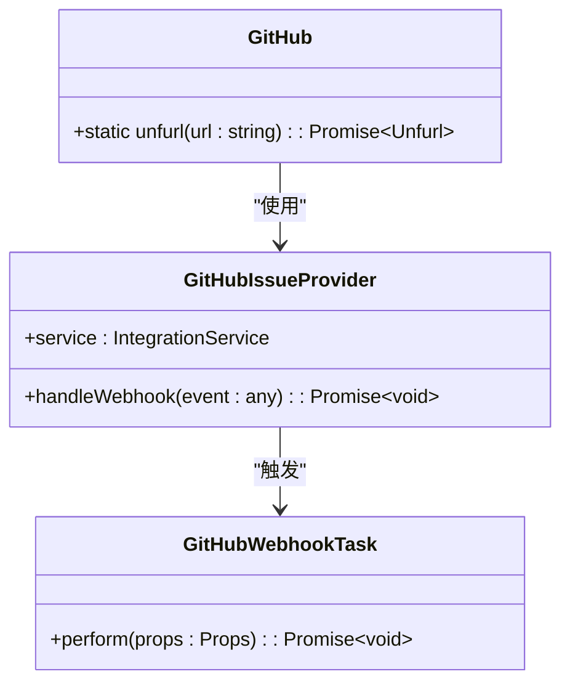
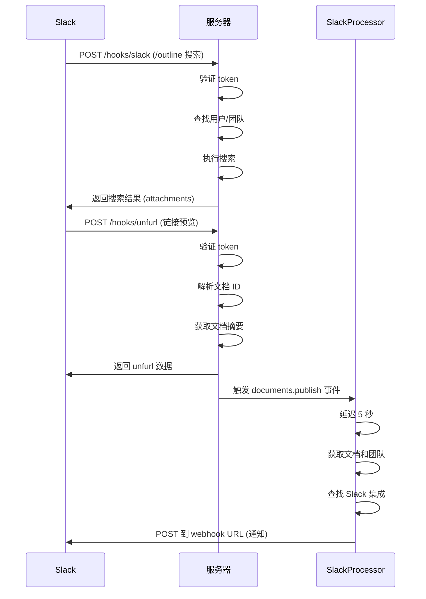
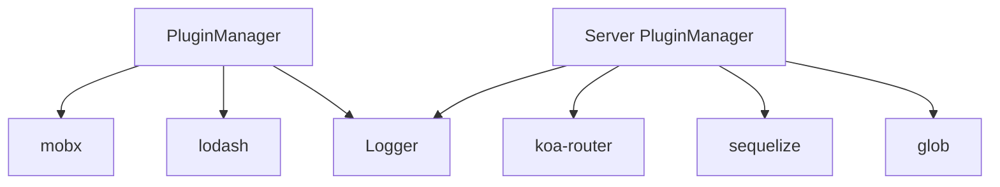

# 插件系统

<cite>
**本文档中引用的文件**  
- [PluginManager.ts](file://app/utils/PluginManager.ts)
- [PluginManager.ts](file://server/utils/PluginManager.ts)
- [plugin.json](file://plugins/github/plugin.json)
- [plugin.json](file://plugins/slack/plugin.json)
- [index.tsx](file://plugins/github/client/index.tsx)
- [index.ts](file://plugins/github/server/index.ts)
- [index.tsx](file://plugins/slack/client/index.tsx)
- [index.ts](file://plugins/slack/server/index.ts)
- [github.ts](file://plugins/github/server/github.ts)
- [slack.ts](file://plugins/slack/server/slack.ts)
- [GitHubIssueProvider.ts](file://plugins/github/server/GitHubIssueProvider.ts)
- [SlackProcessor.ts](file://plugins/slack/server/processors/SlackProcessor.ts)
- [GitHubWebhookTask.ts](file://plugins/github/server/tasks/GitHubWebhookTask.ts)
- [schema.ts](file://plugins/slack/server/api/schema.ts)
- [hooks.ts](file://plugins/slack/server/api/hooks.ts)
- [github.ts](file://plugins/github/server/api/github.ts)
</cite>

## 目录
1. [简介](#简介)
2. [项目结构](#项目结构)
3. [核心组件](#核心组件)
4. [架构概述](#架构概述)
5. [详细组件分析](#详细组件分析)
6. [依赖分析](#依赖分析)
7. [性能考虑](#性能考虑)
8. [故障排除指南](#故障排除指南)
9. [结论](#结论)

## 简介
baozi 项目采用模块化插件架构，支持前后端功能扩展。该系统允许通过插件机制集成第三方服务（如 GitHub、Slack），实现 OAuth 认证、分析集成、链接预览、自动化通知等功能。插件系统由前端和后端两个 PluginManager 统一管理，通过 `plugin.json` 配置文件定义元数据，并通过标准化的生命周期进行加载和注册。本文档深入解析插件系统的目录结构、配置规范、加载机制及实际应用示例。

## 项目结构

插件系统位于 `plugins/` 目录下，每个插件拥有独立的子目录，包含前端（`client/`）、后端（`server/`）和共享（`shared/`）代码。插件通过 `plugin.json` 文件声明其元信息，并通过 `PluginManager` 进行注册和调用。

```mermaid
graph TB
subgraph "插件目录 plugins/"
GitHub[github/]
Slack[slack/]
Linear[linear/]
Notion[notion/]
Webhooks[webhooks/]
Others[...]
GitHub --> ClientG[client/]
GitHub --> ServerG[server/]
GitHub --> SharedG[shared/]
GitHub --> ConfigG[plugin.json]
Slack --> ClientS[client/]
Slack --> ServerS[server/]
Slack --> SharedS[shared/]
Slack --> ConfigS[plugin.json]
end
ClientG --> LoadClient[PluginManager.loadPlugins()]
ServerG --> LoadServer[PluginManager.loadPlugins()]
ConfigG --> Register[PluginManager.add()]
ConfigS --> Register
```

**Diagram sources**
- [plugin.json](file://plugins/github/plugin.json#L1-L7)
- [plugin.json](file://plugins/slack/plugin.json#L1-L7)

**Section sources**
- [app/utils/PluginManager.ts](file://app/utils/PluginManager.ts#L70-L152)
- [server/utils/PluginManager.ts](file://server/utils/PluginManager.ts#L66-L132)

## 核心组件

插件系统的核心是前后端各自的 `PluginManager` 类，负责插件的注册、加载和调用。前端 `PluginManager` 管理 UI 扩展（如设置项、导入功能），后端 `PluginManager` 管理服务集成（如 API 路由、认证提供者、后台任务）。插件通过 `plugin.json` 提供基础信息，并在 `client/index.tsx` 和 `server/index.ts` 中向对应的 `PluginManager` 注册具体功能。

**Section sources**
- [app/utils/PluginManager.ts](file://app/utils/PluginManager.ts#L70-L152)
- [server/utils/PluginManager.ts](file://server/utils/PluginManager.ts#L66-L132)

## 架构概述

baozi 的插件系统采用前后端分离的注册机制，但通过统一的 Hook 类型实现功能扩展。前端插件主要扩展用户界面，而后端插件扩展服务能力和自动化流程。



**Diagram sources**
- [app/utils/PluginManager.ts](file://app/utils/PluginManager.ts#L13-L17)
- [server/utils/PluginManager.ts](file://server/utils/PluginManager.ts#L24-L33)

## 详细组件分析

### 插件配置与注册机制

每个插件必须包含 `plugin.json` 文件，定义其唯一 ID、名称、优先级和描述。该文件被 `client/index.tsx` 和 `server/index.ts` 导入，并作为配置基础传递给 `PluginManager.add()` 方法。

#### 插件配置文件 (plugin.json)
```json
{
  "id": "github",
  "name": "GitHub",
  "priority": 10,
  "description": "Adds a GitHub integration for link unfurling."
}
```

#### 前端插件注册流程
前端插件通过 `app/utils/PluginManager.ts` 中的 `Hook` 枚举定义扩展点，如 `Settings`（设置项）、`Imports`（导入功能）、`Icon`（图标）。



**Diagram sources**
- [plugin.json](file://plugins/github/plugin.json#L1-L7)
- [index.tsx](file://plugins/github/client/index.tsx#L1-L18)

**Section sources**
- [app/utils/PluginManager.ts](file://app/utils/PluginManager.ts#L70-L152)

#### 后端插件注册流程
后端插件通过 `server/utils/PluginManager.ts` 中的 `Hook` 枚举定义扩展点，如 `API`（API 路由）、`AuthProvider`（认证提供者）、`Task`（后台任务）、`Processor`（事件处理器）。



**Diagram sources**
- [index.ts](file://plugins/github/server/index.ts#L1-L42)
- [server/utils/PluginManager.ts](file://server/utils/PluginManager.ts#L66-L132)

**Section sources**
- [server/utils/PluginManager.ts](file://server/utils/PluginManager.ts#L66-L132)

### 实际插件示例分析

#### GitHub 插件分析
GitHub 插件展示了如何实现链接预览（Unfurling）和问题跟踪集成。



**Diagram sources**
- [github.ts](file://plugins/github/server/github.ts)
- [GitHubIssueProvider.ts](file://plugins/github/server/GitHubIssueProvider.ts)
- [GitHubWebhookTask.ts](file://plugins/github/server/tasks/GitHubWebhookTask.ts)

**Section sources**
- [index.ts](file://plugins/github/server/index.ts#L1-L42)

#### Slack 插件分析
Slack 插件展示了如何实现认证、/outline 命令、链接预览和自动化通知。



**Diagram sources**
- [hooks.ts](file://plugins/slack/server/api/hooks.ts)
- [SlackProcessor.ts](file://plugins/slack/server/processors/SlackProcessor.ts)

**Section sources**
- [index.ts](file://plugins/slack/server/index.ts#L1-L27)

## 依赖分析

插件系统依赖于 Node.js 的模块加载机制和 TypeScript 的类型系统。前后端 `PluginManager` 分别依赖于 `mobx`（前端状态管理）和 `koa-router`、`sequelize`（后端路由和 ORM）。插件本身通过 `package.json` 声明其依赖，但核心机制不依赖外部包管理器进行插件发现。



**Diagram sources**
- [app/utils/PluginManager.ts](file://app/utils/PluginManager.ts#L70-L152)
- [server/utils/PluginManager.ts](file://server/utils/PluginManager.ts#L66-L132)

**Section sources**
- [package.json](file://package.json)

## 性能考虑

插件系统的性能关键在于：
1. **延迟加载**：前端插件通过 `import.meta.glob` 实现按需加载，避免初始包体积过大。
2. **条件注册**：通过 `deployments` 字段和环境变量检查，避免在不适用的环境中加载插件。
3. **事件驱动**：使用 `Processor` 和 `Task` 处理异步操作，避免阻塞主请求流程。
4. **缓存机制**：如 GitHub 插件的 `cacheExpiry` 设置，减少重复的外部 API 调用。

## 故障排除指南

常见问题及解决方案：
- **插件未加载**：检查 `plugin.json` 是否存在，`server/index.ts` 中的环境变量检查是否通过，`loadPlugins` 是否被调用。
- **API 路由 404**：确认 `server/index.ts` 中 `PluginManager.add()` 是否注册了 `Hook.API` 类型的插件。
- **UI 项未显示**：确认 `client/index.tsx` 中 `PluginManager.add()` 是否注册了正确的 `Hook` 类型，且 `enabled` 条件满足。
- **后台任务未执行**：检查 `Processor` 或 `Task` 是否正确注册，并确认事件触发机制正常。

**Section sources**
- [server/utils/PluginManager.ts](file://server/utils/PluginManager.ts#L66-L132)
- [app/utils/PluginManager.ts](file://app/utils/PluginManager.ts#L70-L152)

## 结论

baozi 的插件系统提供了一个强大而灵活的扩展框架，通过清晰的目录结构、标准化的配置文件和统一的 `PluginManager` 接口，实现了前后端功能的无缝集成。开发者可以遵循现有插件的模式，轻松创建新的集成。该系统强调环境感知、按需加载和事件驱动，确保了可扩展性与性能的平衡。通过 GitHub 和 Slack 等实际插件的分析，展示了从 OAuth 认证到复杂自动化工作流的完整实现路径。