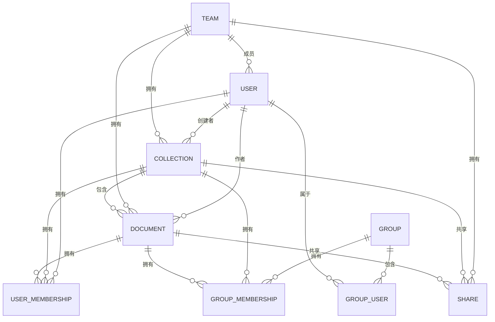
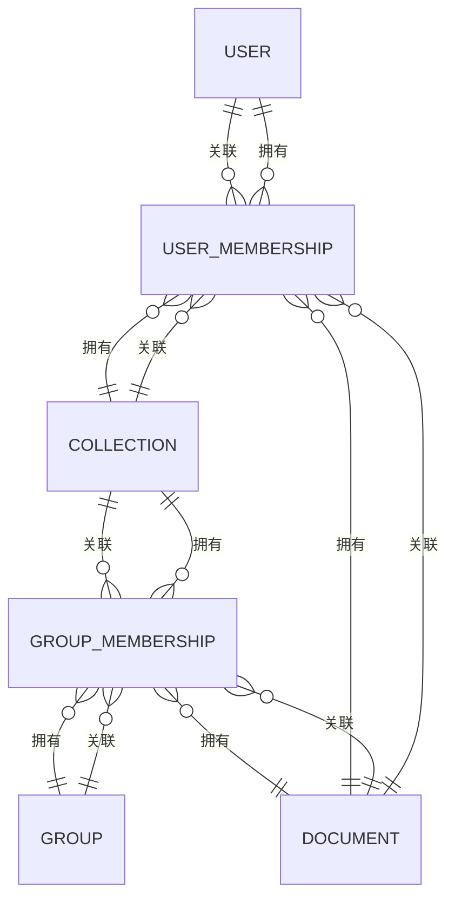
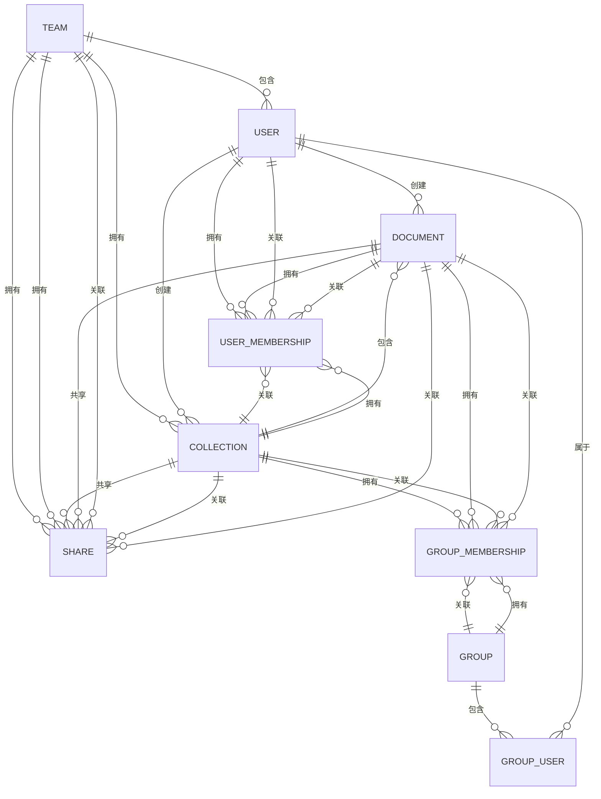

# 数据库设计

<cite>
**本文档引用的文件**
- [database.js](file://server/config/database.js)
- [User.ts](file://server/models/User.ts)
- [Collection.ts](file://server/models/Collection.ts)
- [Document.ts](file://server/models/Document.ts)
- [Team.ts](file://server/models/Team.ts)
- [Share.ts](file://server/models/Share.ts)
- [UserMembership.ts](file://server/models/UserMembership.ts)
- [GroupMembership.ts](file://server/models/GroupMembership.ts)
- [Group.ts](file://server/models/Group.ts)
</cite>

## 目录
1. [简介](#简介)
2. [数据库配置](#数据库配置)
3. [核心实体模型](#核心实体模型)
4. [实体关系与数据模型](#实体关系与数据模型)
5. [数据验证与业务逻辑](#数据验证与业务逻辑)
6. [迁移脚本与数据完整性](#迁移脚本与数据完整性)
7. [性能优化策略](#性能优化策略)
8. [数据库模式图](#数据库模式图)

## 简介
baozi项目采用PostgreSQL作为其核心数据库，设计了一套复杂而灵活的数据模型来支持其文档协作和知识管理功能。本文档旨在全面解析该项目的数据库设计，重点介绍其核心实体（如用户、团队、文档、集合等）的关系、字段定义、索引和约束。通过分析项目中的实际模型文件，我们将深入探讨数据验证规则、业务逻辑和关联关系，为初学者提供概念性概述，同时为经验丰富的开发者提供技术细节。

## 数据库配置
baozi项目的数据库配置位于`server/config/database.js`文件中，明确指定了使用PostgreSQL作为数据库方言。配置文件定义了开发、测试和生产环境的共享数据库连接参数，并为生产环境启用了SSL连接选项以确保数据传输的安全性。

**Diagram sources**
- [database.js](file://server/config/database.js#L1-L23)

**Section sources**
- [database.js](file://server/config/database.js#L1-L23)

## 核心实体模型
baozi项目的核心数据模型围绕几个关键实体构建：用户（User）、团队（Team）、集合（Collection）、文档（Document）、共享（Share）、用户成员资格（UserMembership）和组（Group）。这些实体通过复杂的关联关系相互连接，形成了一个支持精细权限控制和协作功能的系统。

### 用户模型 (User)
用户模型是系统的基础，存储了用户的身份信息、偏好设置和权限角色。每个用户都属于一个团队，并可以拥有多个身份验证提供者。

**Section sources**
- [User.ts](file://server/models/User.ts#L81-L856)

### 团队模型 (Team)
团队模型代表一个组织或工作区，是所有其他实体的顶级容器。团队可以配置子域名、自定义域名和各种行为偏好。

**Section sources**
- [Team.ts](file://server/models/Team.ts#L54-L473)

### 集合模型 (Collection)
集合是文档的逻辑分组，类似于文件夹。集合可以设置权限、排序方式和是否允许共享。文档在集合中的结构通过`documentStructure`字段以JSON数组的形式存储。

**Section sources**
- [Collection.ts](file://server/models/Collection.ts#L87-L1007)

### 文档模型 (Document)
文档是系统的核心内容单元。每个文档都属于一个集合（或作为模板），并可以有父文档，形成树状结构。文档内容以Prosemirror JSON格式存储在`content`字段中。

**Section sources**
- [Document.ts](file://server/models/Document.ts#L94-L1314)

### 共享模型 (Share)
共享模型允许将集合或文档公开给外部用户，而无需他们拥有账户。它通过`published`字段控制可见性，并支持自定义域名和URL。

**Section sources**
- [Share.ts](file://server/models/Share.ts#L32-L240)

### 用户成员资格模型 (UserMembership)
用户成员资格模型实现了细粒度的权限控制。它允许将特定用户添加到集合或文档中，并授予读取、写入或管理权限。

**Section sources**
- [UserMembership.ts](file://server/models/UserMembership.ts#L38-L410)

### 组模型 (Group)
组模型用于管理用户组，可以将整个组添加到集合或文档中，简化权限管理。组可以有外部ID，便于与外部身份提供商集成。

**Section sources**
- [Group.ts](file://server/models/Group.ts#L21-L106)

## 实体关系与数据模型
baozi项目的数据库设计采用了关系型数据库的最佳实践，通过外键和关联表来管理复杂的实体关系。核心关系包括：

- **一对多关系**：一个团队拥有多个用户、集合和文档。
- **多对多关系**：通过`UserMembership`和`GroupMembership`表实现用户/组与集合/文档之间的多对多关系。
- **树状结构**：文档通过`parentDocumentId`字段形成父子关系，构成文档树。

**Diagram sources**
- [UserMembership.ts](file://server/models/UserMembership.ts#L38-L410)
- [GroupMembership.ts](file://server/models/GroupMembership.ts#L39-L430)

**Section sources**
- [UserMembership.ts](file://server/models/UserMembership.ts#L38-L410)
- [GroupMembership.ts](file://server/models/GroupMembership.ts#L39-L430)

## 数据验证与业务逻辑
baozi项目在模型层实现了严格的数据验证和业务逻辑，确保数据的完整性和一致性。

### 数据验证
模型使用Sequelize的验证装饰器来强制执行数据约束。例如，`User`模型中的`email`字段使用`@IsEmail`装饰器确保其格式正确，`name`字段使用`@Length`装饰器限制长度。

### 业务逻辑
业务逻辑主要通过模型的钩子（hooks）实现。例如：
- `User`模型的`@BeforeDestroy`钩子确保团队中至少有一个用户和一个管理员。
- `Collection`模型的`@BeforeDestroy`钩子确保团队中至少有一个集合。
- `Document`模型的`@BeforeUpdate`钩子防止文档与其子文档形成无限循环。

**Section sources**
- [User.ts](file://server/models/User.ts#L81-L856)
- [Collection.ts](file://server/models/Collection.ts#L87-L1007)
- [Document.ts](file://server/models/Document.ts#L94-L1314)

## 迁移脚本与数据完整性
项目使用Sequelize的迁移系统来管理数据库模式的演进。迁移脚本位于`server/migrations/`目录下，按时间顺序命名，确保数据库模式可以安全地升级和降级。

### 数据完整性保证
- **外键约束**：所有外键都定义了引用完整性，确保关联记录的存在。
- **软删除**：大多数模型实现了软删除（通过`deletedAt`字段），而不是物理删除，以保留历史数据。
- **事务处理**：关键操作（如删除集合）在事务中执行，确保相关文档的删除操作原子性。

**Section sources**
- [migrations](file://server/migrations)
- [User.ts](file://server/models/User.ts#L81-L856)
- [Collection.ts](file://server/models/Collection.ts#L87-L1007)

## 性能优化策略
baozi项目采用了多种策略来优化数据库性能。

### 索引
关键字段上定义了索引以加速查询：
- `User`表的`email`和`teamId`字段。
- `Document`表的`collectionId`、`publishedAt`和`parentDocumentId`字段。
- `Collection`表的`teamId`和`index`字段。

### 查询优化
- **作用域（Scopes）**：模型定义了多个作用域（如`withMembership`），用于预加载常用关联，减少N+1查询问题。
- **延迟加载**：非必要字段（如`content`）在默认作用域中被排除，仅在需要时显式加载。

**Section sources**
- [User.ts](file://server/models/User.ts#L81-L856)
- [Collection.ts](file://server/models/Collection.ts#L87-L1007)
- [Document.ts](file://server/models/Document.ts#L94-L1314)

## 数据库模式图
下图展示了baozi项目核心实体之间的关系。

**Diagram sources**
- [User.ts](file://server/models/User.ts#L81-L856)
- [Team.ts](file://server/models/Team.ts#L54-L473)
- [Collection.ts](file://server/models/Collection.ts#L87-L1007)
- [Document.ts](file://server/models/Document.ts#L94-L1314)
- [Share.ts](file://server/models/Share.ts#L32-L240)
- [UserMembership.ts](file://server/models/UserMembership.ts#L38-L410)
- [GroupMembership.ts](file://server/models/GroupMembership.ts#L39-L430)
- [Group.ts](file://server/models/Group.ts#L21-L106)