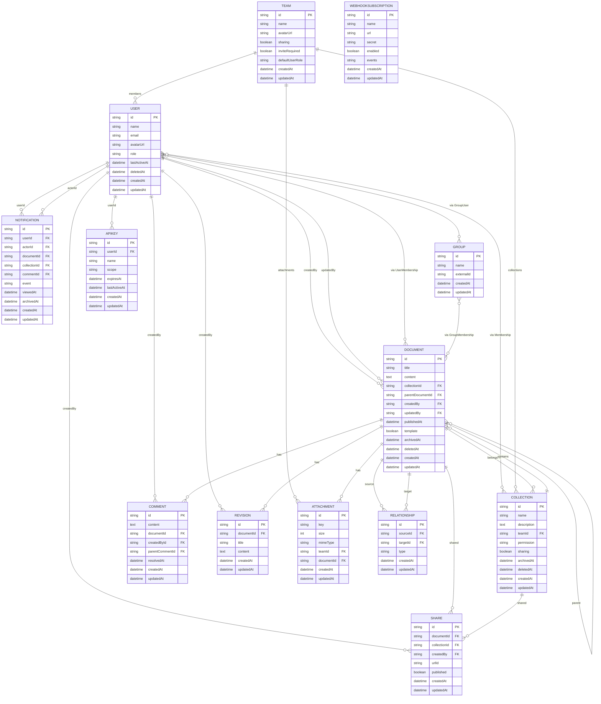

# 数据模型

<cite>
**本文档中引用的文件**  
- [User.ts](file://app/models/User.ts)
- [Team.ts](file://app/models/Team.ts)
- [Document.ts](file://app/models/Document.ts)
- [Collection.ts](file://app/models/Collection.ts)
- [Comment.ts](file://app/models/Comment.ts)
- [Revision.ts](file://app/models/Revision.ts)
- [Share.ts](file://app/models/Share.ts)
- [Notification.ts](file://app/models/Notification.ts)
- [Group.ts](file://app/models/Group.ts)
- [ApiKey.ts](file://app/models/ApiKey.ts)
- [WebhookSubscription.ts](file://app/models/WebhookSubscription.ts)
- [Integration.ts](file://app/models/Integration.ts)
- [Attachment.ts](file://server/models/Attachment.ts)
- [Relationship.ts](file://server/models/Relationship.ts)
- [Model.ts](file://app/models/base/Model.ts)
- [IdModel.ts](file://server/models/base/IdModel.ts)
- [ParanoidModel.ts](file://app/models/base/ParanoidModel.ts)
- [ArchivableModel.ts](file://app/models/base/ArchivableModel.ts)
- [Encrypted.ts](file://server/models/decorators/Encrypted.ts)
- [CounterCache.ts](file://server/models/decorators/CounterCache.ts)
- [Changeset.ts](file://server/models/decorators/Changeset.ts)
</cite>

## 目录
1. [简介](#简介)
2. [核心模型与继承结构](#核心模型与继承结构)
3. [核心实体模型详解](#核心实体模型详解)
   - [用户 (User)](#用户-user)
   - [团队 (Team)](#团队-team)
   - [文档 (Document)](#文档-document)
   - [集合 (Collection)](#集合-collection)
   - [评论 (Comment)](#评论-comment)
   - [版本 (Revision)](#版本-revision)
   - [分享 (Share)](#分享-share)
   - [通知 (Notification)](#通知-notification)
   - [分组 (Group)](#分组-group)
   - [API密钥 (ApiKey)](#api密钥-apikey)
   - [Webhook订阅 (WebhookSubscription)](#webhook订阅-webhooksubscription)
   - [集成 (Integration)](#集成-integration)
   - [附件 (Attachment)](#附件-attachment)
   - [关系 (Relationship)](#关系-relationship)
4. [高级特性](#高级特性)
5. [实体关系图 (ERD)](#实体关系图-erd)
6. [数据完整性与性能优化](#数据完整性与性能优化)
7. [总结](#总结)

## 简介

本文档全面介绍了baozi项目的数据模型，重点阐述了其基于Sequelize的ORM实现。文档详细说明了核心实体如用户、团队、文档、集合、评论、版本、分享、通知、分组、API密钥、Webhook订阅、集成、附件和关系等的模型定义。通过分析项目中的实际模型文件，解释了数据验证规则、业务逻辑、关联关系以及继承结构（如Model、IdModel、ParanoidModel、ArchivableModel）。特别说明了加密字段、计数缓存、变更集等高级特性。为初学者提供概念性概述，同时为经验丰富的开发者提供技术细节，包括模型间的关系、数据完整性保证、性能优化策略和常见查询模式。

**Section sources**
- [User.ts](file://app/models/User.ts#L1-L249)
- [Team.ts](file://app/models/Team.ts#L1-L125)
- [Document.ts](file://app/models/Document.ts#L1-L705)

## 核心模型与继承结构

baozi项目的数据模型建立在一套清晰的继承体系之上，通过基础模型类和装饰器实现代码复用和功能扩展。

### 基础模型类

- **Model**: 所有模型的基类，定义了基本的属性如`id`、`createdAt`、`updatedAt`，并提供了`save`、`delete`、`fetch`等通用方法。
- **IdModel**: 服务器端模型的基础类，使用Sequelize装饰器定义了`id`为主键UUID，以及`createdAt`和`updatedAt`时间戳。
- **ParanoidModel**: 继承自Model，增加了`deletedAt`字段，实现了软删除功能。
- **ArchivableModel**: 继承自ParanoidModel，增加了`archivedAt`字段，支持文档的归档功能。

### 装饰器

- **@Field**: 标记模型中需要同步到服务器的属性。
- **@Relation**: 定义模型间的关联关系，支持`onDelete`等选项。
- **@Encrypted**: 用于加密存储敏感数据，如附件密钥。
- **@CounterCache**: 用于缓存关联模型的数量，提高查询性能。
- **@SkipChangeset**: 用于标记在变更集中应被忽略的属性。

**Section sources**
- [Model.ts](file://app/models/base/Model.ts#L1-L255)
- [IdModel.ts](file://server/models/base/IdModel.ts#L1-L30)
- [ParanoidModel.ts](file://app/models/base/ParanoidModel.ts#L1-L13)
- [ArchivableModel.ts](file://app/models/base/ArchivableModel.ts#L1-L8)

## 核心实体模型详解

### 用户 (User)

用户模型是系统的核心，代表了系统的使用者。

**字段与属性**
- `id`: 唯一标识符
- `name`: 用户名
- `email`: 邮箱地址
- `avatarUrl`: 头像URL
- `role`: 用户角色（管理员、成员、访客等）
- `lastActiveAt`: 最后活跃时间
- `preferences`: 用户偏好设置
- `notificationSettings`: 通知设置

**业务逻辑**
- `isInvited`: 判断用户是否仅被邀请但未登录
- `isAdmin`, `isMember`, `isViewer`, `isGuest`: 根据角色判断用户类型
- `isRecentlyActive`: 判断用户是否在最近5分钟内活跃
- `separateEditMode`: 判断用户是否使用分离的编辑模式

**关联关系**
- 与`Document`、`Collection`等模型通过`UserMembership`建立多对多关系
- 与`Group`通过`GroupUser`建立多对多关系
- 与`ApiKey`建立一对多关系

**Section sources**
- [User.ts](file://app/models/User.ts#L1-L249)

### 团队 (Team)

团队模型代表了一个组织或工作空间。

**字段与属性**
- `name`: 团队名称
- `description`: 团队描述
- `avatarUrl`: 团队头像
- `sharing`: 是否允许分享
- `inviteRequired`: 是否需要邀请才能加入
- `defaultUserRole`: 新成员的默认角色
- `preferences`: 团队偏好设置

**业务逻辑**
- `getPreference`: 获取团队偏好设置，支持默认值
- `setPreference`: 设置团队偏好

**关联关系**
- 与`User`建立一对多关系
- 与`Collection`建立一对多关系
- 与`Domain`建立一对多关系

**Section sources**
- [Team.ts](file://app/models/Team.ts#L1-L125)

### 文档 (Document)

文档模型是内容的核心载体。

**字段与属性**
- `title`: 文档标题
- `content`: 文档内容（Prosemirror格式）
- `collectionId`: 所属集合ID
- `parentDocumentId`: 父文档ID
- `publishedAt`: 发布时间
- `template`: 是否为模板
- `fullWidth`: 是否全宽布局
- `insightsEnabled`: 是否启用洞察

**业务逻辑**
- `isPubliclyShared`: 判断文档是否公开分享
- `isDraft`: 判断是否为草稿
- `isArchived`: 判断是否已归档
- `isDeleted`: 判断是否已删除
- `path`: 生成文档的URL路径

**关联关系**
- 与`Collection`建立多对一关系
- 与`User`建立多对一关系（创建者、更新者）
- 与`Document`建立自引用的父子关系
- 与`Revision`建立一对多关系
- 与`Comment`建立一对多关系
- 与`Share`建立一对一关系

**Section sources**
- [Document.ts](file://app/models/Document.ts#L1-L705)

### 集合 (Collection)

集合模型用于组织和管理文档。

**字段与属性**
- `name`: 集合名称
- `data`: 集合描述（Prosemirror格式）
- `permission`: 默认权限
- `sharing`: 是否允许分享
- `sort`: 排序规则

**业务逻辑**
- `isPrivate`: 判断集合是否为私有
- `isEmpty`: 判断集合是否为空
- `sortedDocuments`: 获取排序后的文档列表

**关联关系**
- 与`Document`建立一对多关系
- 与`User`建立多对多关系（通过`Membership`）
- 与`Group`建立多对多关系（通过`GroupMembership`）
- 与`Share`建立一对一关系

**Section sources**
- [Collection.ts](file://app/models/Collection.ts#L1-L457)

### 评论 (Comment)

评论模型用于文档的讨论和反馈。

**字段与属性**
- `data`: 评论内容
- `parentCommentId`: 父评论ID
- `documentId`: 关联文档ID
- `resolvedAt`: 解决时间
- `reactions`: 反应（点赞等）

**业务逻辑**
- `isResolved`: 判断评论是否已解决
- `isReply`: 判断是否为回复
- `resolve`, `unresolve`: 解决/取消解决评论
- `addReaction`, `removeReaction`: 添加/移除反应

**关联关系**
- 与`Document`建立多对一关系
- 与`User`建立多对一关系（创建者、解决者）
- 与`Comment`建立自引用的父子关系

**Section sources**
- [Comment.ts](file://app/models/Comment.ts#L1-L279)

### 版本 (Revision)

版本模型用于记录文档的历史变更。

**字段与属性**
- `documentId`: 关联文档ID
- `title`: 文档标题（创建时）
- `data`: 文档内容（创建时）
- `html`: HTML格式的差异

**关联关系**
- 与`Document`建立多对一关系
- 与`User`建立多对多关系（协作者）

**Section sources**
- [Revision.ts](file://app/models/Revision.ts#L1-L71)

### 分享 (Share)

分享模型用于管理文档和集合的公开分享。

**字段与属性**
- `published`: 是否已发布
- `includeChildDocuments`: 是否包含子文档
- `documentId`/`collectionId`: 分享的文档或集合ID
- `urlId`: 分享链接的ID
- `allowIndexing`: 是否允许搜索引擎索引

**关联关系**
- 与`Document`或`Collection`建立多对一关系
- 与`User`建立多对一关系（创建者）

**Section sources**
- [Share.ts](file://app/models/Share.ts#L1-L133)

### 通知 (Notification)

通知模型用于向用户发送系统消息。

**字段与属性**
- `viewedAt`: 已读时间
- `archivedAt`: 归档时间
- `event`: 事件类型
- `data`: 附加数据

**业务逻辑**
- `eventText`: 根据事件类型生成描述文本
- `toggleRead`, `markAsRead`: 标记为已读/未读

**关联关系**
- 与`User`建立多对一关系（接收者）
- 与`User`建立多对一关系（触发者）
- 与`Document`、`Collection`、`Comment`建立可选的多对一关系

**Section sources**
- [Notification.ts](file://app/models/Notification.ts#L1-L214)

### 分组 (Group)

分组模型用于管理用户组。

**字段与属性**
- `name`: 分组名称
- `externalId`: 外部ID
- `disableMentions`: 是否禁用提及

**关联关系**
- 与`User`建立多对多关系（通过`GroupUser`）
- 与`Document`建立多对多关系（通过`GroupMembership`）

**Section sources**
- [Group.ts](file://app/models/Group.ts#L1-L89)

### API密钥 (ApiKey)

API密钥模型用于API访问认证。

**字段与属性**
- `name`: 密钥名称
- `scope`: 访问范围
- `expiresAt`: 过期时间
- `lastActiveAt`: 最后使用时间
- `value`: 密钥值（仅创建时可见）
- `last4`: 密钥后四位

**业务逻辑**
- `isExpired`: 判断密钥是否已过期
- `obfuscatedValue`: 获取脱敏后的密钥值

**关联关系**
- 与`User`建立多对一关系

**Section sources**
- [ApiKey.ts](file://app/models/ApiKey.ts#L1-L59)

### Webhook订阅 (WebhookSubscription)

Webhook订阅模型用于外部系统集成。

**字段与属性**
- `name`: 订阅名称
- `url`: 回调URL
- `secret`: 签名密钥
- `enabled`: 是否启用
- `events`: 订阅的事件类型

**Section sources**
- [WebhookSubscription.ts](file://app/models/WebhookSubscription.ts#L1-L30)

### 集成 (Integration)

集成模型用于管理第三方服务集成。

**字段与属性**
- `type`: 集成类型
- `service`: 服务名称
- `collectionId`: 关联集合ID
- `events`: 触发的事件
- `settings`: 集成设置

**关联关系**
- 与`User`建立多对一关系
- 与`Collection`建立多对一关系

**Section sources**
- [Integration.ts](file://app/models/Integration.ts#L1-L35)

### 附件 (Attachment)

附件模型用于管理上传的文件。

**字段与属性**
- `key`: 存储密钥
- `size`: 文件大小
- `mimeType`: MIME类型
- `createdAt`: 创建时间
- `updatedAt`: 更新时间
- `teamId`: 所属团队ID
- `documentId`: 关联文档ID

**高级特性**
- `@Encrypted`: `key`字段被加密存储
- `@CounterCache`: 缓存团队的附件数量

**关联关系**
- 与`Team`建立多对一关系
- 与`Document`建立多对一关系

**Section sources**
- [Attachment.ts](file://server/models/Attachment.ts#L1-L50)

### 关系 (Relationship)

关系模型用于管理文档间的引用关系。

**字段与属性**
- `sourceId`: 源文档ID
- `targetId`: 目标文档ID
- `type`: 关系类型

**关联关系**
- 与`Document`建立多对一关系（源文档）
- 与`Document`建立多对一关系（目标文档）

**Section sources**
- [Relationship.ts](file://server/models/Relationship.ts#L1-L30)

## 高级特性

### 加密字段 (@Encrypted)

`@Encrypted`装饰器用于加密存储敏感数据。它利用环境变量`SECRET_KEY`作为加密密钥，确保数据在数据库中以密文形式存储。该装饰器通常与`@Column(DataType.BLOB)`一起使用，将加密后的数据存储为二进制大对象。

**应用场景**
- 附件的存储密钥
- API密钥的明文值

**实现原理**
- 在设置值时，先加密再存储
- 在获取值时，先解密再返回
- 使用`vaults()`获取加密服务实例

**Section sources**
- [Encrypted.ts](file://server/models/decorators/Encrypted.ts#L1-L76)

### 计数缓存 (@CounterCache)

`@CounterCache`装饰器用于缓存关联模型的数量，避免频繁的数据库查询。它通过Redis等缓存系统存储计数，并在关联模型创建或删除时自动更新缓存。

**应用场景**
- 缓存团队的附件数量
- 缓存文档的评论数量

**实现原理**
- 在模型类上添加`afterCreate`和`afterDestroy`钩子
- 钩子函数更新缓存中的计数
- 获取计数时优先从缓存读取，未命中则查询数据库并更新缓存

**Section sources**
- [CounterCache.ts](file://server/models/decorators/CounterCache.ts#L1-L84)

### 变更集 (@SkipChangeset)

`@SkipChangeset`装饰器用于标记在变更集中应被忽略的属性。这在处理某些不需要记录变更历史的字段时非常有用。

**应用场景**
- `lastActiveAt`等频繁更新的统计字段
- 临时状态字段

**实现原理**
- 使用`Reflect.defineMetadata`存储被忽略的属性名
- 在生成变更集时，检查属性是否被标记为忽略

**Section sources**
- [Changeset.ts](file://server/models/decorators/Changeset.ts#L1-L24)

**Diagram sources**
- [User.ts](file://app/models/User.ts#L1-L249)
- [Team.ts](file://app/models/Team.ts#L1-L125)
- [Document.ts](file://app/models/Document.ts#L1-L705)
- [Collection.ts](file://app/models/Collection.ts#L1-L457)
- [Comment.ts](file://app/models/Comment.ts#L1-L279)
- [Revision.ts](file://app/models/Revision.ts#L1-L71)
- [Share.ts](file://app/models/Share.ts#L1-L133)
- [Notification.ts](file://app/models/Notification.ts#L1-L214)
- [Group.ts](file://app/models/Group.ts#L1-L89)
- [ApiKey.ts](file://app/models/ApiKey.ts#L1-L59)
- [WebhookSubscription.ts](file://app/models/WebhookSubscription.ts#L1-L30)
- [Attachment.ts](file://server/models/Attachment.ts#L1-L50)
- [Relationship.ts](file://server/models/Relationship.ts#L1-L30)

## 数据完整性与性能优化

### 数据完整性

- **外键约束**: 通过Sequelize的`@ForeignKey`和`@BelongsTo`等装饰器确保数据引用的完整性。
- **软删除**: 使用`ParanoidModel`实现软删除，通过`deletedAt`字段标记删除状态，而非物理删除。
- **级联操作**: 在`@Relation`装饰器中配置`onDelete`选项，实现级联删除或置空。
- **唯一约束**: 在数据库迁移中定义唯一索引，防止重复数据。

### 性能优化

- **计数缓存**: 使用`@CounterCache`装饰器缓存频繁查询的计数，减少数据库压力。
- **索引优化**: 在常用查询字段上创建数据库索引，如`userId`、`documentId`等。
- **懒加载**: 对于大型关联数据，采用懒加载策略，按需加载。
- **数据分页**: 对于大型列表，使用分页查询，避免一次性加载过多数据。

**Section sources**
- [CounterCache.ts](file://server/models/decorators/CounterCache.ts#L1-L84)
- [ParanoidModel.ts](file://app/models/base/ParanoidModel.ts#L1-L13)

## 总结

baozi项目的数据模型设计精良，通过清晰的继承结构和丰富的装饰器实现了高度的代码复用和功能扩展。核心实体模型涵盖了用户、团队、文档、集合等关键业务对象，通过复杂的关联关系构建了一个完整的知识管理系统。高级特性如加密字段、计数缓存和变更集处理，进一步提升了系统的安全性和性能。实体关系图清晰地展示了各模型间的关联，为开发者理解和维护系统提供了有力支持。整体设计既满足了业务需求，又兼顾了数据完整性和系统性能。