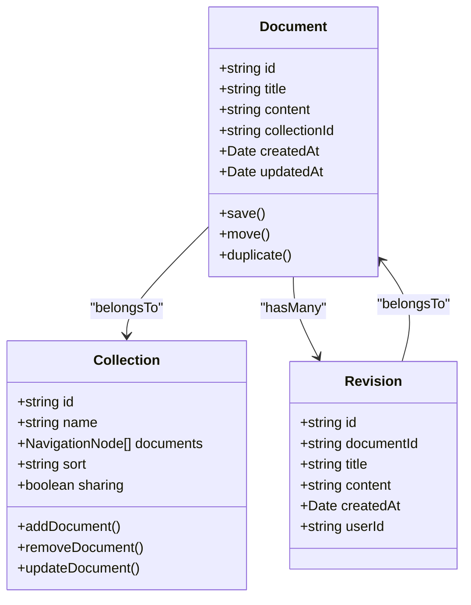
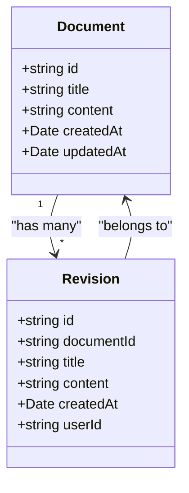
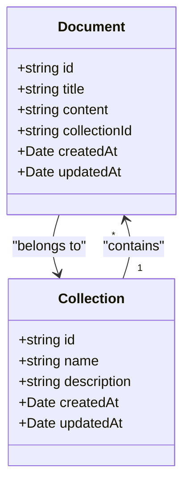
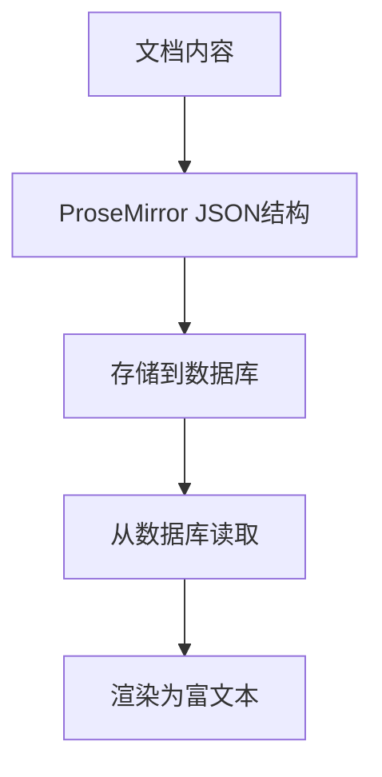
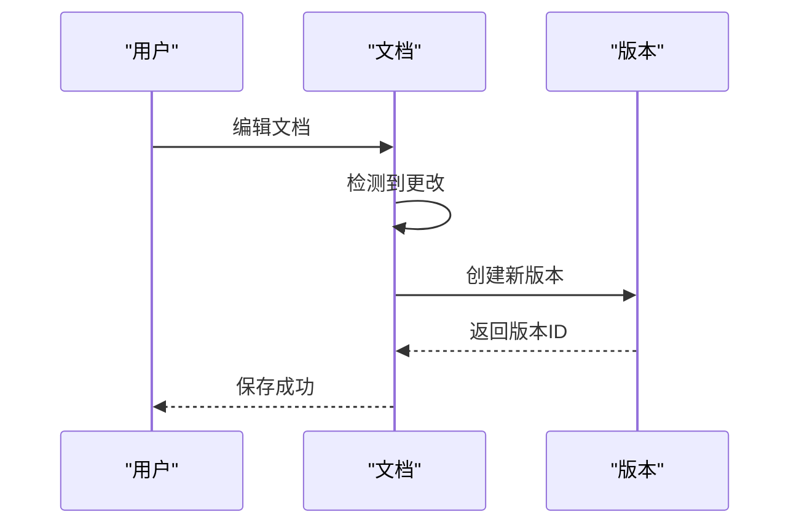
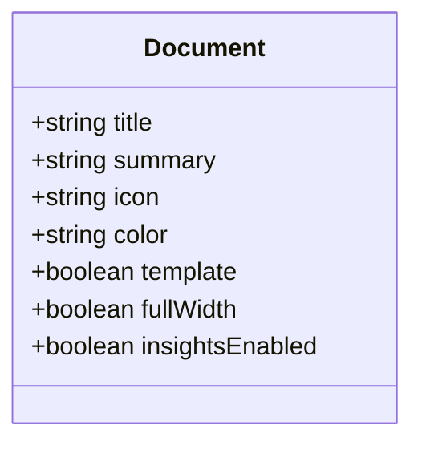
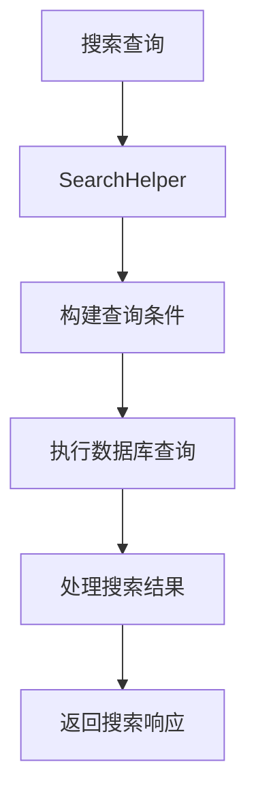
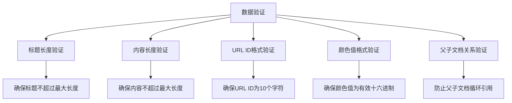
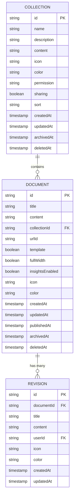

# 文档与版本模型

<cite>
**本文档中引用的文件**  
- [Document.ts](file://app/models/Document.ts)
- [Revision.ts](file://app/models/Revision.ts)
- [Collection.ts](file://app/models/Collection.ts)
- [Document.ts](file://server/models/Document.ts)
- [Revision.ts](file://server/models/Revision.ts)
- [Collection.ts](file://server/models/Collection.ts)
- [SearchHelper.ts](file://server/models/helpers/SearchHelper.ts)
</cite>

## 目录
1. [简介](#简介)
2. [核心数据模型](#核心数据模型)
3. [文档与版本关系](#文档与版本关系)
4. [文档与集合关系](#文档与集合关系)
5. [文档内容存储机制](#文档内容存储机制)
6. [版本控制实现](#版本控制实现)
7. [元数据管理](#元数据管理)
8. [集合功能](#集合功能)
9. [搜索索引构建](#搜索索引构建)
10. [内容处理逻辑](#内容处理逻辑)
11. [验证规则](#验证规则)
12. [实体关系图](#实体关系图)

## 简介
本文档详细介绍了文档、版本和集合数据模型的实现。重点阐述了文档与版本之间的一对多关系，文档与集合之间的多对一关系。解释了文档内容的存储机制（使用ProseMirror格式），版本控制的实现方式，以及文档标题、摘要、图标等元数据的管理。描述了集合（Collection）作为文档容器的作用，包括其排序、权限和内容管理功能。使用实际代码示例说明了文档搜索索引的构建（SearchHelper）、内容处理逻辑（DocumentHelper）和验证规则。

**Section sources**
- [Document.ts](file://app/models/Document.ts#L39-L703)
- [Revision.ts](file://app/models/Revision.ts#L9-L67)
- [Collection.ts](file://app/models/Collection.ts#L19-L455)

## 核心数据模型
文档、版本和集合是系统中的三个核心数据模型。文档模型（Document）代表单个文档实体，包含文档的所有内容和元数据。版本模型（Revision）记录文档的历史版本，实现版本控制功能。集合模型（Collection）作为文档的容器，用于组织和管理文档。



**Diagram sources**
- [Document.ts](file://app/models/Document.ts#L39-L703)
- [Revision.ts](file://app/models/Revision.ts#L9-L67)
- [Collection.ts](file://app/models/Collection.ts#L19-L455)

**Section sources**
- [Document.ts](file://app/models/Document.ts#L39-L703)
- [Revision.ts](file://app/models/Revision.ts#L9-L67)
- [Collection.ts](file://app/models/Collection.ts#L19-L455)

## 文档与版本关系
文档与版本之间存在一对多的关系。每个文档可以有多个版本，但每个版本只属于一个文档。这种关系通过文档ID在版本模型中的外键实现。



**Diagram sources**
- [Document.ts](file://app/models/Document.ts#L39-L703)
- [Revision.ts](file://app/models/Revision.ts#L9-L67)

**Section sources**
- [Document.ts](file://app/models/Document.ts#L39-L703)
- [Revision.ts](file://app/models/Revision.ts#L9-L67)

## 文档与集合关系
文档与集合之间存在多对一的关系。多个文档可以属于同一个集合，但每个文档只能属于一个集合。这种关系通过集合ID在文档模型中的外键实现。



**Diagram sources**
- [Document.ts](file://app/models/Document.ts#L39-L703)
- [Collection.ts](file://app/models/Collection.ts#L19-L455)

**Section sources**
- [Document.ts](file://app/models/Document.ts#L39-L703)
- [Collection.ts](file://app/models/Collection.ts#L19-L455)

## 文档内容存储机制
文档内容使用ProseMirror格式进行存储。ProseMirror是一种用于构建富文本编辑器的工具包，它将文档内容表示为JSON格式的树结构。



**Diagram sources**
- [Document.ts](file://app/models/Document.ts#L39-L703)
- [server/models/Document.ts](file://server/models/Document.ts#L94-L1314)

**Section sources**
- [Document.ts](file://app/models/Document.ts#L39-L703)
- [server/models/Document.ts](file://server/models/Document.ts#L94-L1314)

## 版本控制实现
版本控制通过Revision模型实现。每次文档更新时，系统会创建一个新的版本记录，保存当时的文档状态。



**Diagram sources**
- [Revision.ts](file://app/models/Revision.ts#L9-L67)
- [server/models/Revision.ts](file://server/models/Revision.ts#L23-L232)

**Section sources**
- [Revision.ts](file://app/models/Revision.ts#L9-L67)
- [server/models/Revision.ts](file://server/models/Revision.ts#L23-L232)

## 元数据管理
文档的元数据包括标题、摘要、图标、颜色等信息，这些信息在文档模型中作为独立字段进行管理。



**Diagram sources**
- [Document.ts](file://app/models/Document.ts#L39-L703)

**Section sources**
- [Document.ts](file://app/models/Document.ts#L39-L703)

## 集合功能
集合作为文档的容器，提供了文档组织、排序、权限管理和内容管理等功能。

```mermaid
classDiagram
class Collection {
+string name
+ProsemirrorData data
+string icon
+string color
+CollectionPermission permission
+boolean sharing
+sort : {field : string, direction : "asc"|"desc"}
+documents : NavigationNode[]
+fetchDocuments()
+updateDocument()
+removeDocument()
+addDocument()
}
```

**Diagram sources**
- [Collection.ts](file://app/models/Collection.ts#L19-L455)

**Section sources**
- [Collection.ts](file://app/models/Collection.ts#L19-L455)

## 搜索索引构建
文档搜索索引通过SearchHelper类构建，支持全文搜索和高级搜索功能。



**Diagram sources**
- [SearchHelper.ts](file://server/models/helpers/SearchHelper.ts)

**Section sources**
- [SearchHelper.ts](file://server/models/helpers/SearchHelper.ts)

## 内容处理逻辑
文档内容处理逻辑通过DocumentHelper类实现，包括内容转换、任务统计等功能。

```mermaid
classDiagram
class DocumentHelper {
+static toProsemirror(document : Document) : ProsemirrorData
+static toPlainText(document : Document) : string
+static getTasksSummary(document : Document) : {completed : number, total : number}
+static toJSON(document : Document) : ProsemirrorData
}
```

**Diagram sources**
- [server/models/helpers/DocumentHelper.tsx](file://server/models/helpers/DocumentHelper.tsx#L38-L580)

**Section sources**
- [server/models/helpers/DocumentHelper.tsx](file://server/models/helpers/DocumentHelper.tsx#L38-L580)

## 验证规则
系统实现了多种验证规则，确保数据的完整性和一致性。



**Diagram sources**
- [server/models/Document.ts](file://server/models/Document.ts#L94-L1314)
- [server/models/validators/Length.ts](file://server/models/validators/Length.ts)
- [server/models/validators/IsHexColor.ts](file://server/models/validators/IsHexColor.ts)

**Section sources**
- [server/models/Document.ts](file://server/models/Document.ts#L94-L1314)
- [server/models/validators/Length.ts](file://server/models/validators/Length.ts)
- [server/models/validators/IsHexColor.ts](file://server/models/validators/IsHexColor.ts)

## 实体关系图
以下实体关系图展示了文档、版本和集合之间的关系。



**Diagram sources**
- [Document.ts](file://app/models/Document.ts#L39-L703)
- [Revision.ts](file://app/models/Revision.ts#L9-L67)
- [Collection.ts](file://app/models/Collection.ts#L19-L455)

**Section sources**
- [Document.ts](file://app/models/Document.ts#L39-L703)
- [Revision.ts](file://app/models/Revision.ts#L9-L67)
- [Collection.ts](file://app/models/Collection.ts#L19-L455)