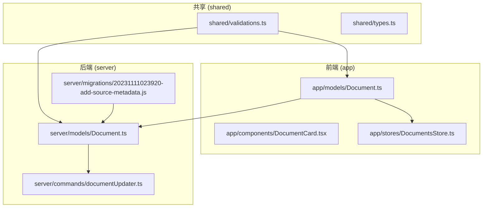
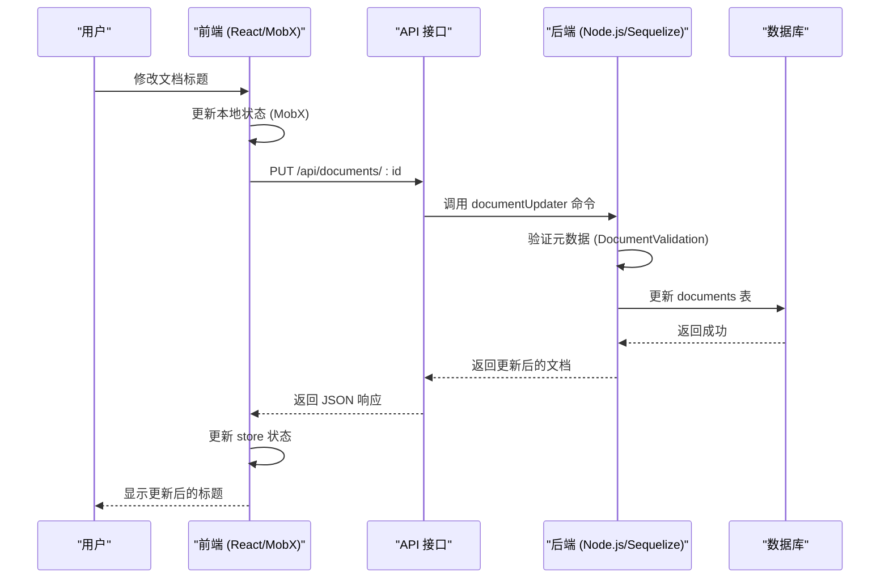
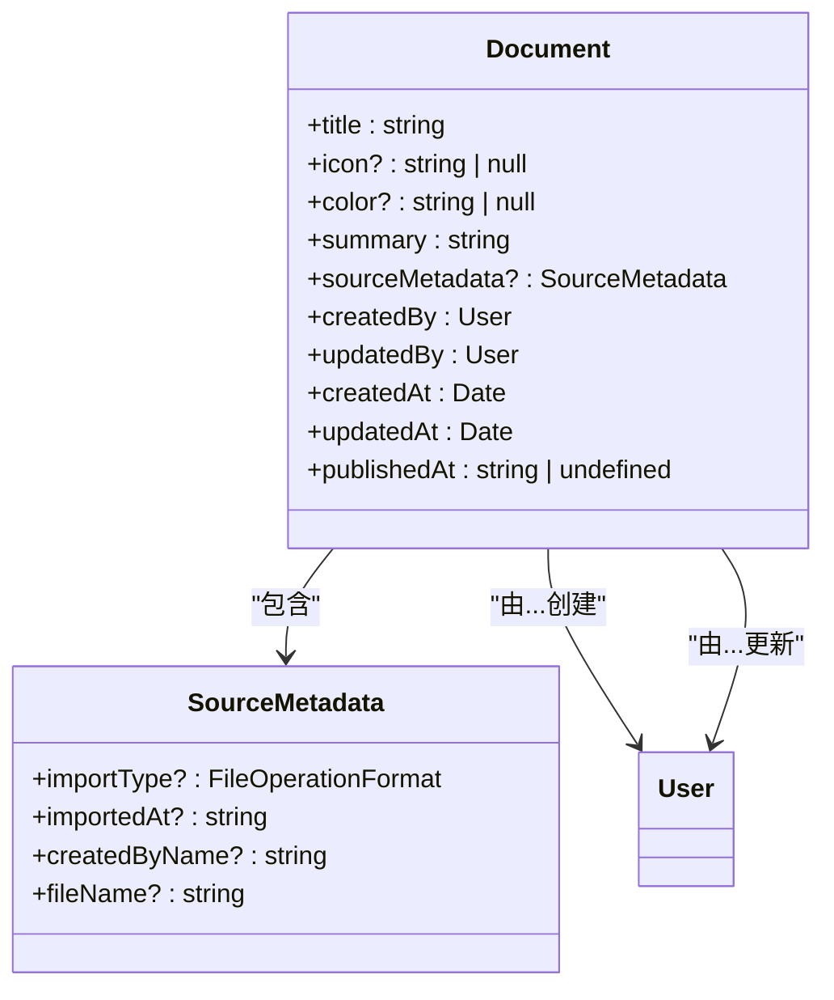
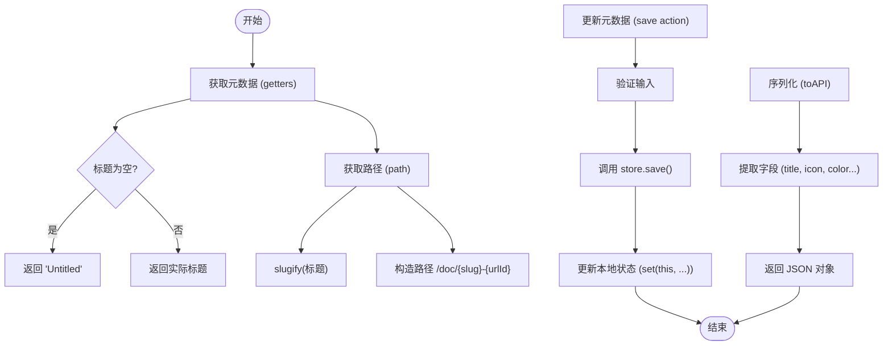
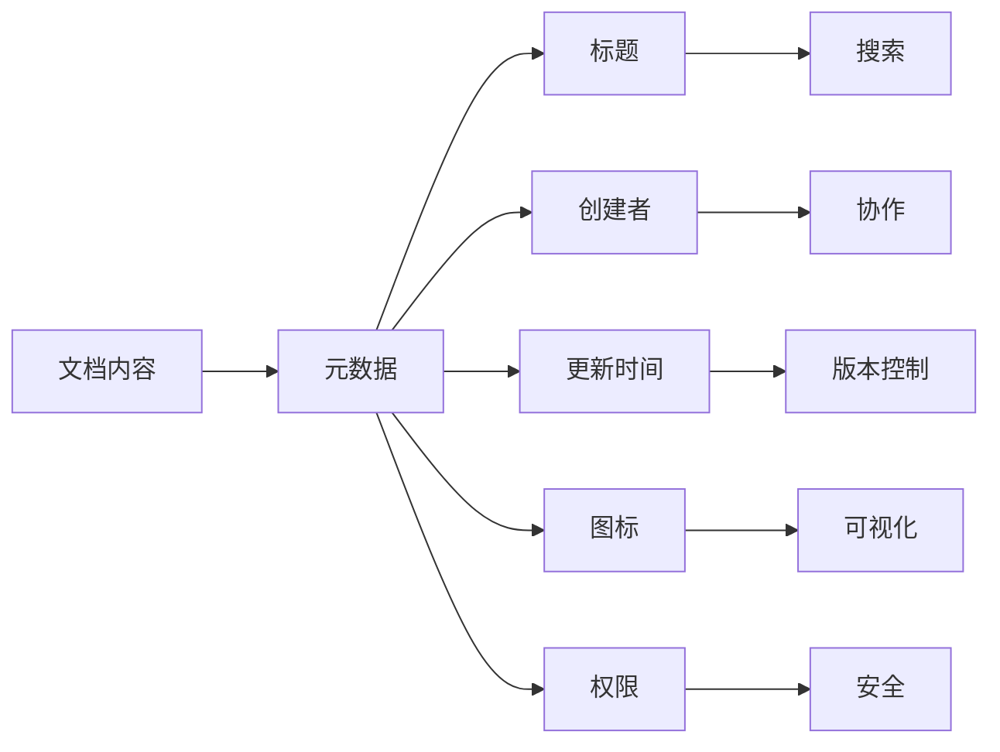
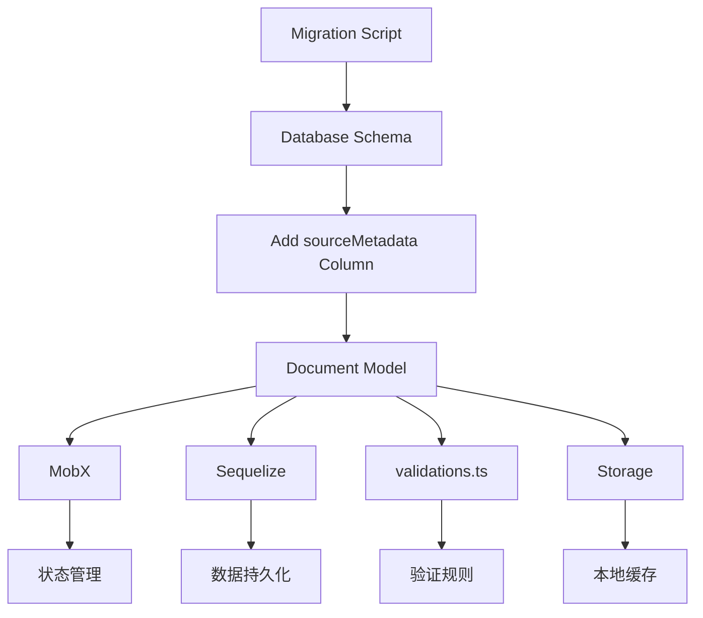

# 文档元数据管理

<cite>
**本文档中引用的文件**  
- [Document.ts](file://app/models/Document.ts)
- [Document.ts](file://server/models/Document.ts)
- [validations.ts](file://shared/validations.ts)
- [20231111023920-add-source-metadata.js](file://server/migrations/20231111023920-add-source-metadata.js)
</cite>

## 目录
1. [简介](#简介)
2. [项目结构](#项目结构)
3. [核心组件](#核心组件)
4. [架构概述](#架构概述)
5. [详细组件分析](#详细组件分析)
6. [依赖分析](#依赖分析)
7. [性能考虑](#性能考虑)
8. [故障排除指南](#故障排除指南)
9. [结论](#结论)
10. [附录](#附录)（如有必要）

## 简介
本文档详细介绍了文档元数据管理的实现，重点分析了Document模型中的元数据属性设计与实现。文档涵盖了文档标题、摘要、图标、权限、创建者、更新时间等核心元数据字段的定义、验证规则和默认值设置。通过实际代码示例说明了元数据的获取、更新和序列化过程，并为初学者提供了直观理解，同时为经验丰富的开发者提供了技术细节，包括元数据索引优化、缓存策略和性能影响。

## 项目结构
项目结构清晰地组织了前端、后端和共享代码。文档元数据管理的核心逻辑分布在`app/models/Document.ts`（前端模型）和`server/models/Document.ts`（后端模型）中。前端模型主要负责状态管理和用户界面交互，而后端模型则处理数据持久化、验证和业务逻辑。`shared/validations.ts`文件定义了跨平台的验证规则，确保数据一致性。

**Diagram sources**
- [app/models/Document.ts](file://app/models/Document.ts)
- [server/models/Document.ts](file://server/models/Document.ts)
- [shared/validations.ts](file://shared/validations.ts)
- [server/migrations/20231111023920-add-source-metadata.js](file://server/migrations/20231111023920-add-source-metadata.js)

**Section sources**
- [app/models/Document.ts](file://app/models/Document.ts)
- [server/models/Document.ts](file://server/models/Document.ts)

## 核心组件
文档元数据管理的核心是`Document`类，它在前端和后端都有实现。前端`Document`模型继承自`ArchivableModel`，实现了`Searchable`接口，包含了所有与用户界面交互相关的元数据属性和计算属性。后端`Document`模型继承自Sequelize的`ArchivableModel`，定义了数据库表结构、验证规则和数据持久化逻辑。两个模型通过API进行通信，确保数据同步。

**Section sources**
- [app/models/Document.ts](file://app/models/Document.ts#L39-L703)
- [server/models/Document.ts](file://server/models/Document.ts#L94-L1314)

## 架构概述
文档元数据管理采用前后端分离的架构。前端负责展示和用户交互，使用MobX进行状态管理。后端使用Node.js和Sequelize ORM处理数据存储和业务逻辑。元数据的生命周期包括创建、更新、验证、持久化和检索。当用户在前端修改文档元数据时，变更会通过API发送到后端，后端进行验证后更新数据库，并将结果返回给前端。

**Diagram sources**
- [app/models/Document.ts](file://app/models/Document.ts)
- [server/models/Document.ts](file://server/models/Document.ts)
- [server/commands/documentUpdater.ts](file://server/commands/documentUpdater.ts)

## 详细组件分析
### Document模型元数据属性分析
`Document`模型定义了丰富的元数据属性，这些属性可以分为基本属性、状态属性和关系属性。

#### 基本元数据属性
基本元数据属性构成了文档的核心信息，包括标题、图标、颜色等。

**Diagram sources**
- [app/models/Document.ts](file://app/models/Document.ts#L39-L703)
- [server/models/Document.ts](file://server/models/Document.ts#L94-L1314)
- [shared/types.ts](file://shared/types.ts)

**Section sources**
- [app/models/Document.ts](file://app/models/Document.ts#L39-L703)
- [server/models/Document.ts](file://server/models/Document.ts#L94-L1314)

#### 元数据验证规则和默认值
元数据的完整性和一致性通过严格的验证规则来保证。这些规则在前后端都有实现，确保数据质量。

| 元数据字段 | 验证规则 | 默认值 | 实现位置 |
| :--- | :--- | :--- | :--- |
| **标题 (title)** | 最大长度100字符 | "Untitled" | `DocumentValidation.maxTitleLength`, `titleWithDefault()` |
| **摘要 (summary)** | 最大长度1000字符 | 自动生成 | `DocumentValidation.maxSummaryLength`, `getSummary()` |
| **图标 (icon)** | 最大长度50字符 | null | `Length` 装饰器 |
| **颜色 (color)** | 必须是十六进制颜色 | null | `IsHexColor` 验证器 |
| **文档状态** | 协作状态最大1.5MB | null | `DocumentValidation.maxStateLength` |

**Section sources**
- [shared/validations.ts](file://shared/validations.ts#L42-L54)
- [server/models/Document.ts](file://server/models/Document.ts#L94-L1314)
- [app/models/Document.ts](file://app/models/Document.ts#L39-L703)

#### 元数据获取、更新和序列化
元数据的获取、更新和序列化是文档管理的核心操作。前端通过MobX的`@computed`和`@action`装饰器实现响应式更新。

**Diagram sources**
- [app/models/Document.ts](file://app/models/Document.ts#L39-L703)
- [server/models/Document.ts](file://server/models/Document.ts#L94-L1314)

**Section sources**
- [app/models/Document.ts](file://app/models/Document.ts#L39-L703)

### 概念概述
文档元数据是描述文档本身信息的数据，它使得文档系统能够高效地组织、搜索和管理内容。对于初学者而言，可以将元数据想象成图书馆中书籍的目录卡，上面记录了书名、作者、出版日期等关键信息。这种设计模式极大地提升了用户体验和系统性能。

## 依赖分析
文档元数据管理依赖于多个核心组件和外部库。前端依赖MobX进行状态管理，依赖Sequelize进行数据建模。后端依赖Sequelize ORM与数据库交互，依赖各种验证库确保数据质量。`sourceMetadata`字段的引入通过数据库迁移脚本实现，确保了数据结构的平滑演进。

**Diagram sources**
- [app/models/Document.ts](file://app/models/Document.ts)
- [server/models/Document.ts](file://server/models/Document.ts)
- [server/migrations/20231111023920-add-source-metadata.js](file://server/migrations/20231111023920-add-source-metadata.js)

**Section sources**
- [app/models/Document.ts](file://app/models/Document.ts)
- [server/models/Document.ts](file://server/models/Document.ts)
- [server/migrations/20231111023920-add-source-metadata.js](file://server/migrations/20231111023920-add-source-metadata.js)

## 性能考虑
文档元数据的设计充分考虑了性能因素。`sourceMetadata`字段使用JSONB类型存储，支持高效的查询和索引。`title`字段有长度限制，防止过长的标题影响数据库性能和搜索效率。`getSummary`方法通过截取文档内容的前几块来生成摘要，避免了对整个文档内容的处理。此外，系统使用Redis缓存文档的协作状态，显著提升了实时协作的性能。

## 故障排除指南
在文档元数据管理中，常见的问题包括元数据验证失败、更新不同步和性能瓶颈。当遇到验证错误时，应首先检查`shared/validations.ts`中的规则定义。如果前端和后端状态不同步，需要检查API调用和`save`方法的实现。对于性能问题，应关注数据库查询的执行计划，确保关键字段（如`title`、`urlId`）有适当的索引。

**Section sources**
- [shared/validations.ts](file://shared/validations.ts)
- [app/models/Document.ts](file://app/models/Document.ts)
- [server/models/Document.ts](file://server/models/Document.ts)

## 结论
本文档全面介绍了文档元数据管理的实现细节。通过分析`Document`模型的元数据属性、验证规则和操作流程，展示了系统如何高效地管理文档信息。该设计既满足了初学者对直观理解的需求，也为高级开发者提供了深入的技术细节。未来可以进一步优化元数据的索引策略，并探索更智能的摘要生成算法。