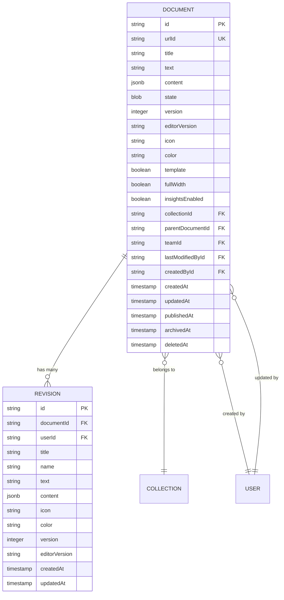
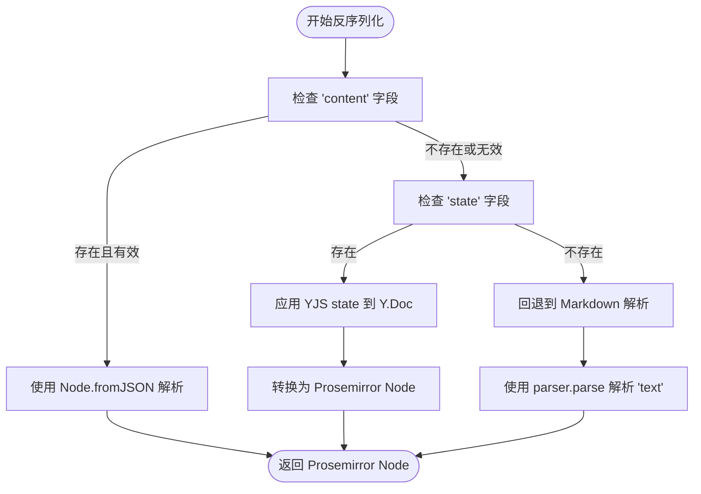
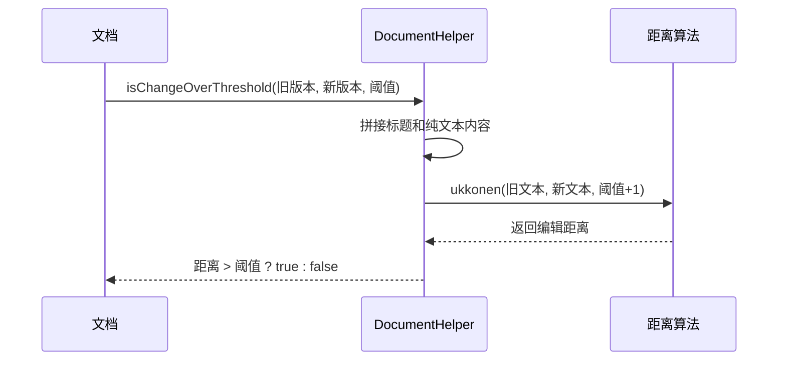
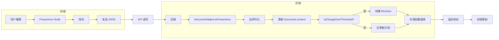

# 文档内容存储

<cite>
**本文档引用的文件**
- [Document.ts](file://app/models/Document.ts)
- [Revision.ts](file://app/models/Revision.ts)
- [DocumentHelper.tsx](file://server/models/helpers/DocumentHelper.tsx)
- [ProsemirrorHelper.tsx](file://server/models/helpers/ProsemirrorHelper.tsx)
- [Document.ts](file://server/models/Document.ts)
- [Revision.ts](file://server/models/Revision.ts)
- [20231118195149-add-content-to-documents.js](file://server/migrations/20231118195149-add-content-to-documents.js)
- [20231119000000-backfill-document-content.ts](file://server/scripts/20231119000000-backfill-document-content.ts)
- [20231119000000-backfill-revision-content.ts](file://server/scripts/20231119000000-backfill-revision-content.ts)
</cite>

## 目录
1. [简介](#简介)
2. [内容存储结构](#内容存储结构)
3. [序列化与反序列化](#序列化与反序列化)
4. [内容分段与嵌入元素](#内容分段与嵌入元素)
5. [版本控制与差异计算](#版本控制与差异计算)
6. [解析、渲染与编辑流程](#解析渲染与编辑流程)
7. [性能优化与错误恢复](#性能优化与错误恢复)
8. [数据流图](#数据流图)

## 简介
本文档详细介绍了文档内容的存储机制，重点阐述了基于 ProseMirror 格式的文档内容序列化与反序列化过程。文档内容以 ProseMirror JSON 格式进行存储，该格式能够精确地表示富文本内容，包括文本、格式、嵌入元素等。系统通过维护文档的协作状态（YJS state）和内容快照（content）来实现高效的内容存储和版本控制。当文档被创建或更新时，系统会生成新的版本记录（Revision），并利用差异计算算法来确定是否需要创建新的版本。此外，文档还支持内容压缩和性能优化策略，以确保在大规模使用场景下的稳定性和响应速度。

## 内容存储结构

文档内容的存储结构主要由 `Document` 和 `Revision` 两个核心模型构成。`Document` 模型代表一个文档实例，而 `Revision` 模型则记录了文档在特定时间点的状态。这种设计使得系统能够有效地追踪文档的历史变更，并支持版本回滚和差异比较。

### 核心数据模型

文档内容的存储依赖于数据库中的 `documents` 和 `revisions` 表。`Document` 模型定义了文档的主要属性，包括标题、内容、创建者、更新者等。`Revision` 模型则用于存储文档的历史版本，每个版本都包含当时的内容快照和元数据。

**Diagram sources**
- [Document.ts](file://server/models/Document.ts#L94-L1314)
- [Revision.ts](file://server/models/Revision.ts#L23-L232)

**Section sources**
- [Document.ts](file://server/models/Document.ts#L94-L1314)
- [Revision.ts](file://server/models/Revision.ts#L23-L232)

### 存储字段说明

文档内容的存储涉及多个关键字段，这些字段共同构成了文档的完整状态。

- **`content` (JSONB)**: 这是文档内容的核心存储字段，以 ProseMirror JSON 格式保存。它是一个快照，代表了文档在最后一次保存时的结构化内容。该字段是 `documents` 和 `revisions` 表中的主要数据源。
- **`state` (BLOB)**: 该字段存储了文档的 YJS 协作状态。YJS 是一个用于实时协作的库，`state` 字段包含了文档的完整操作历史，允许系统在需要时重建任何历史版本。对于较旧的文档，如果 `content` 字段为空，则会回退到此字段进行反序列化。
- **`text` (TEXT)**: 这是一个遗留字段，存储了文档的 Markdown 格式内容。随着系统向 ProseMirror 的迁移，该字段已不再被写入，仅作为 `content` 字段为空时的降级回退方案。
- **`version` (SMALLINT)**: 记录了文档的版本号，用于标识文档的结构或存储格式是否发生了重大变更。
- **`editorVersion` (STRING)**: 记录了最后一次编辑文档时所使用的编辑器版本，有助于处理不同版本编辑器之间的兼容性问题。

### 存储演进

文档内容的存储机制经历了多次演进，以适应功能需求和性能优化。

- **2023年11月**: 通过迁移脚本 `20231118195149-add-content-to-documents.js` 向 `documents` 和 `revisions` 表中添加了 `content` (JSONB) 字段。这标志着系统正式采用 ProseMirror JSON 作为主要的内容存储格式。
- **2023年11月**: 随后，系统执行了两个重要的回填脚本：`20231119000000-backfill-document-content.ts` 和 `20231119000000-backfill-revision-content.ts`。这些脚本遍历所有现有文档和修订，将 `text` 字段中的 Markdown 内容解析为 ProseMirror JSON，并填充到新的 `content` 字段中。对于具有 `state` 字段的文档，脚本会直接从 YJS 状态生成 JSON 内容。
- **2020年5月**: 之前，系统曾使用 `backup` (TEXT) 字段来存储内容备份，但该字段在 `20210730044247-remove-backup-column.js` 迁移中被移除，以简化数据模型。

**Section sources**
- [20231118195149-add-content-to-documents.js](file://server/migrations/20231118195149-add-content-to-documents.js#L0-L18)
- [20231119000000-backfill-document-content.ts](file://server/scripts/20231119000000-backfill-document-content.ts#L0-L49)
- [20231119000000-backfill-revision-content.ts](file://server/scripts/20231119000000-backfill-revision-content.ts#L0-L51)

## 序列化与反序列化

文档内容的序列化与反序列化是系统的核心功能，它确保了富文本内容能够在内存、数据库和网络之间高效、准确地传输和存储。

### 反序列化流程

反序列化是指将存储在数据库中的数据（如 JSON 或 YJS state）转换为内存中的 ProseMirror Node 对象的过程。`DocumentHelper.toProsemirror` 是处理此流程的核心方法。

**Diagram sources**
- [DocumentHelper.tsx](file://server/models/helpers/DocumentHelper.tsx#L38-L75)

**Section sources**
- [DocumentHelper.tsx](file://server/models/helpers/DocumentHelper.tsx#L38-L75)

该流程遵循一个明确的优先级：
1.  **首选 `content`**: 系统首先尝试使用 `content` 字段中的 JSON 数据，通过 `Node.fromJSON(schema, data)` 直接构建 Prosemirror Node。这是最快、最直接的方式。
2.  **次选 `state`**: 如果 `content` 不可用，则尝试使用 `state` 字段。系统会创建一个 Y.Doc 实例，并应用存储的 YJS 状态更新。然后，使用 `yDocToProsemirrorJSON` 将 Y.Doc 转换为 Prosemirror JSON，最后再构建 Node。
3.  **降级回退 `text`**: 如果以上两种方式都失败（例如，对于非常老的文档），系统会将 `text` 字段中的 Markdown 内容通过 `parser.parse` 方法解析为 Prosemirror Node。

### 序列化流程

序列化是指将内存中的 ProseMirror Node 对象转换为可存储或传输的格式（如 JSON 或 Markdown）的过程。`DocumentHelper.toJSON` 和 `DocumentHelper.toMarkdown` 是两个关键方法。

- **`toJSON`**: 该方法将文档转换为纯 JSON 对象。它会根据文档的 `content` 或 `state` 字段生成 JSON，并支持在序列化过程中进行一些转换，例如替换内部链接的基路径或移除特定的格式标记。
- **`toMarkdown`**: 该方法将文档转换为 Markdown 字符串。这是一个有损转换，主要用于文档导出。它首先调用 `toProsemirror` 获取 Node，然后使用 ProseMirror 的序列化器将其转换为 Markdown。

**Section sources**
- [DocumentHelper.tsx](file://server/models/helpers/DocumentHelper.tsx#L162-L185)

## 内部分段与嵌入元素

文档内容的分段和嵌入元素处理是其富文本能力的基础。ProseMirror 的文档模型本质上是一个树状结构，其中包含多种类型的节点。

### 内容分段

文档内容被组织成一系列的“块”（block nodes），这些块构成了文档的结构。常见的块节点包括：
- **段落 (paragraph)**: 最基本的文本容器。
- **标题 (heading)**: 用于定义文档的层级结构。
- **列表 (list)**: 包括有序和无序列表。
- **表格 (table)**: 用于组织数据。

这些块节点在 `content` 字段的 JSON 数组中按顺序排列。`ProsemirrorHelper.getHeadings` 方法可以遍历整个文档树，提取所有标题节点及其级别，用于生成目录。

### 嵌入元素

嵌入元素是文档中非文本内容的统称，它们作为特殊的节点被插入到文档流中。系统通过 `ProsemirrorHelper` 类中的专门方法来处理这些元素。

- **附件 (attachment)**: 代表文件附件。`ProsemirrorHelper.getAttachments` 方法可以遍历文档并收集所有附件节点。
- **图片 (image)**: 代表内联图片。`ProsemirrorHelper.getImages` 方法用于提取所有图片节点。
- **视频 (video)**: 代表内联视频。`ProsemirrorHelper.getVideos` 方法用于提取所有视频节点。
- **提及 (mention)**: 代表对用户、文档或其他实体的引用。`ProsemirrorHelper.parseMentions` 方法可以解析文档中的所有提及。

这些嵌入元素的处理确保了文档的完整性和交互性。例如，当文档被导出为 HTML 时，`ProsemirrorHelper.toHTML` 方法会正确地渲染这些元素。

**Section sources**
- [ProsemirrorHelper.tsx](file://server/models/helpers/ProsemirrorHelper.tsx#L495-L528)

## 版本控制与差异计算

系统的版本控制机制通过 `Revision` 模型实现，它记录了文档在不同时间点的状态。差异计算是决定何时创建新版本的关键。

### 版本创建机制

每当文档被保存时，系统会检查本次变更是否足够大，以证明创建一个新版本是合理的。`DocumentHelper.isChangeOverThreshold` 方法负责执行此检查。

**Diagram sources**
- [DocumentHelper.tsx](file://server/models/helpers/DocumentHelper.tsx#L536-L580)

该方法的工作流程如下：
1.  将旧版本和新版本的标题与纯文本内容拼接起来。
2.  使用 `ukkonen` 算法计算这两个字符串之间的编辑距离。
3.  如果编辑距离大于预设的阈值，则返回 `true`，表示变化显著，需要创建新版本。

这种方法避免了为微小的更改（如错别字修正）创建大量版本，从而保持了版本历史的清晰和可管理性。

### 差异计算与合并

当需要比较两个版本时，系统会生成一个可视化的差异（diff）。`DocumentHelper.diff` 方法负责此功能。它首先将两个版本的文档分别转换为 HTML，然后使用 `htmldiff.js` 库来计算并标记出 HTML 内容的差异。生成的 HTML diff 可以在用户界面中高亮显示变更，帮助用户快速理解文档的演变过程。

**Section sources**
- [DocumentHelper.tsx](file://server/models/helpers/DocumentHelper.tsx#L536-L580)

## 解析、渲染与编辑流程

文档的解析、渲染和编辑是用户与系统交互的核心流程。

### 解析流程

解析流程已在“序列化与反序列化”部分详细描述。当用户打开一个文档时，前端会通过 API 请求获取文档数据。后端调用 `DocumentHelper.toProsemirror` 完成反序列化，然后将结果返回给前端。

### 渲染流程

前端收到文档数据后，使用 ProseMirror 库在浏览器中渲染出可编辑的富文本编辑器。编辑器的初始状态由反序列化得到的 Prosemirror Node 决定。

### 编辑流程

用户的编辑操作会实时更新内存中的 Prosemirror Node。当用户保存文档时，前端会将当前的 Node 对象（通过 `toJSON()` 方法）发送到后端。后端接收到数据后，会更新 `Document` 模型的 `content` 字段，并根据差异计算的结果决定是否创建一个新的 `Revision`。

**Section sources**
- [Document.ts](file://app/models/Document.ts#L39-L703)
- [Revision.ts](file://app/models/Revision.ts#L9-L67)

## 性能优化与错误恢复

系统在设计时充分考虑了性能和可靠性。

### 性能优化

- **缓存**: `DocumentHelper.toJSON` 方法在没有转换需求时会直接返回 `content` 字段，避免了不必要的解析和序列化开销。
- **批量操作**: 回填脚本 (`backfill-document-content.ts`) 使用分页（`limit` 和 `offset`）来处理大量数据，防止内存溢出。

### 错误恢复

系统内置了强大的错误恢复机制，以应对数据损坏或解析失败的情况。
- **多级回退**: 如反序列化流程图所示，系统有明确的回退路径：`content` -> `state` -> `text`。如果一个路径失败，系统会自动尝试下一个。
- **日志记录**: 当解析 `content` 或 `state` 失败时，系统会记录警告日志（`Logger.warn`），然后安全地回退到 Markdown 解析，确保用户始终能看到文档内容，尽管可能丢失一些格式。

**Section sources**
- [DocumentHelper.tsx](file://server/models/helpers/DocumentHelper.tsx#L38-L75)

## 数据流图

下图总结了文档内容从创建、编辑到存储和版本化的完整数据流。

**Diagram sources**
- [DocumentHelper.tsx](file://server/models/helpers/DocumentHelper.tsx#L38-L75)
- [DocumentHelper.tsx](file://server/models/helpers/DocumentHelper.tsx#L536-L580)