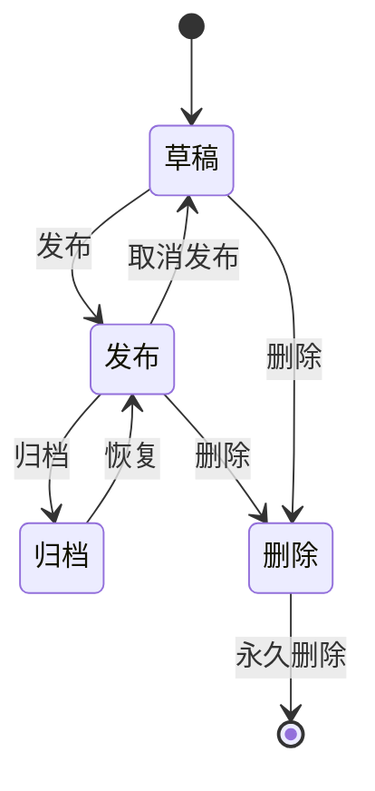
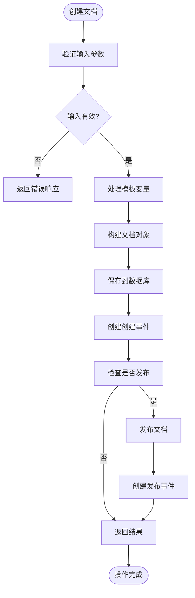
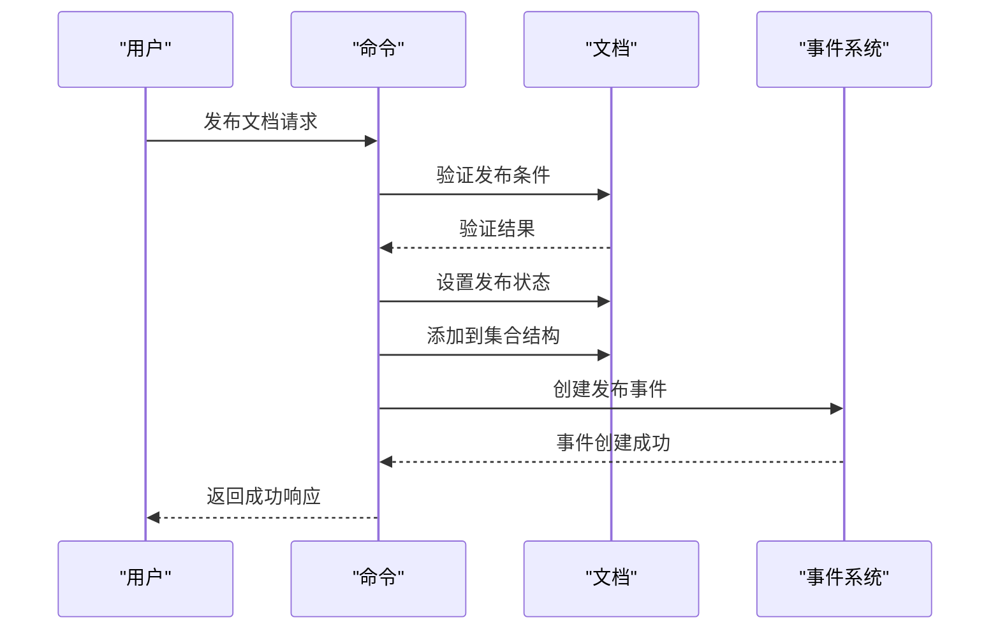

# 文档生命周期管理

<cite>
**本文档中引用的文件**   
- [Document.ts](file://app/models/Document.ts)
- [documentCreator.ts](file://server/commands/documentCreator.ts)
- [documentUpdater.ts](file://server/commands/documentUpdater.ts)
- [documentMover.ts](file://server/commands/documentMover.ts)
- [documentPermanentDeleter.ts](file://server/commands/documentPermanentDeleter.ts)
- [Lifecycle.ts](file://app/models/decorators/Lifecycle.ts)
- [DocumentsStore.ts](file://app/stores/DocumentsStore.ts)
</cite>

## 目录
1. [简介](#简介)
2. [文档生命周期阶段](#文档生命周期阶段)
3. [核心操作实现](#核心操作实现)
4. [状态转换流程](#状态转换流程)
5. [权限控制与业务规则](#权限控制与业务规则)
6. [事件与审计日志](#事件与审计日志)
7. [命令模式应用](#命令模式应用)
8. [事务管理](#事务管理)
9. [结论](#结论)

## 简介
文档生命周期管理是文档协作系统的核心功能，涵盖了文档从创建到最终删除的完整过程。本系统实现了文档的创建、更新、移动、发布、归档和永久删除等关键操作，确保文档在整个生命周期中的状态转换符合业务规则。系统通过命令模式封装操作，利用事务保证数据一致性，并通过事件机制记录审计日志。

**Section sources**
- [Document.ts](file://app/models/Document.ts#L39-L703)

## 文档生命周期阶段
文档在其生命周期中经历多个状态，每个状态代表文档的不同阶段和可见性。系统通过数据库字段和计算属性来跟踪和管理这些状态。

### 草稿状态
文档最初创建时处于草稿状态，此时文档未发布，仅对创建者和明确共享的用户可见。草稿状态的文档可以自由编辑和修改。

### 发布状态
当文档被发布到集合中时，它进入发布状态。发布后的文档对集合中的所有成员可见，并出现在集合的文档结构中。发布操作会记录文档的发布时间和发布者。

### 归档状态
归档状态用于管理不再活跃但需要保留的文档。归档的文档从集合结构中移除，但仍保留在系统中，可以通过归档视图访问。归档操作会保留文档的所有历史记录和元数据。

### 删除状态
删除状态表示文档已被用户标记为删除。删除的文档进入回收站，可以在一定时间内恢复。系统为删除的文档设置了30天的保留期，之后将被永久删除。

**Diagram sources**
- [Document.ts](file://app/models/Document.ts#L39-L703)
- [documentUpdater.ts](file://server/commands/documentUpdater.ts#L36-L97)

## 核心操作实现
文档生命周期的核心操作通过专门的命令函数实现，每个操作都封装了业务逻辑和数据一致性检查。

### 文档创建
文档创建操作通过`documentCreator`命令实现。该命令负责初始化新文档的所有属性，包括标题、内容、图标和颜色。创建过程中会处理模板变量替换，并根据需要发布文档。

**Diagram sources**
- [documentCreator.ts](file://server/commands/documentCreator.ts#L0-L196)

### 文档更新
文档更新操作由`documentUpdater`命令处理。该命令支持多种属性的更新，包括标题、内容、图标、颜色等。更新操作会自动增加修订计数，并记录最后修改者。

**Section sources**
- [documentUpdater.ts](file://server/commands/documentUpdater.ts#L36-L97)

### 文档移动
文档移动操作通过`documentMover`命令实现。该命令处理文档在集合间的移动，包括更新文档结构、调整子文档的集合ID，以及处理相关的固定项。

**Section sources**
- [documentMover.ts](file://server/commands/documentMover.ts#L0-L247)

### 文档永久删除
文档永久删除操作由`documentPermanentDeleter`命令处理。该命令首先检查文档是否已在回收站中，然后清理相关的附件和引用，最后从数据库中彻底删除文档。

**Section sources**
- [documentPermanentDeleter.ts](file://server/commands/documentPermanentDeleter.ts#L0-L100)

## 状态转换流程
文档状态转换遵循严格的业务流程，确保数据的一致性和完整性。

### 发布流程
文档发布流程包括以下步骤：
1. 验证文档是否已发布
2. 设置文档的发布时间和发布者
3. 将文档添加到目标集合的文档结构中
4. 复制父文档的权限设置
5. 记录发布事件

### 取消发布流程
取消发布流程包括以下步骤：
1. 从集合结构中移除文档
2. 更新文档的发布状态
3. 如果需要，将文档从集合中分离
4. 记录取消发布事件

### 归档流程
归档流程包括以下步骤：
1. 从集合结构中移除文档
2. 递归归档所有子文档
3. 设置文档的归档时间
4. 记录归档事件

### 恢复流程
恢复流程包括以下步骤：
1. 验证目标集合是否有效
2. 递归恢复所有子文档
3. 将文档添加回集合结构
4. 清除归档时间
5. 记录恢复事件

**Diagram sources**
- [documentUpdater.ts](file://server/commands/documentUpdater.ts#L36-L97)
- [Document.ts](file://server/models/Document.ts#L94-L1314)

## 权限控制与业务规则
系统实施严格的权限控制和业务规则，确保文档操作的安全性和合规性。

### 权限检查
每个文档操作都会进行权限检查，确保执行者具有相应的权限。权限检查基于用户角色、集合权限和文档权限。

### 业务规则
系统实施以下关键业务规则：
- 防止文档与其子文档形成无限循环嵌套
- 确保文档在移动时保持数据一致性
- 在删除文档时清理相关附件
- 在发布文档时验证集合ID

**Section sources**
- [Document.ts](file://server/models/Document.ts#L94-L1314)
- [Lifecycle.ts](file://app/models/decorators/Lifecycle.ts#L0-L78)

## 事件与审计日志
系统通过事件机制记录所有文档操作，提供完整的审计日志功能。

### 事件类型
系统记录以下主要事件类型：
- 文档创建
- 文档更新
- 文档发布
- 文档移动
- 文档删除

### 审计日志
每个事件都包含以下审计信息：
- 操作者ID
- 操作时间
- IP地址
- 操作详情
- 相关文档和集合ID

**Section sources**
- [documentCreator.ts](file://server/commands/documentCreator.ts#L0-L196)
- [documentUpdater.ts](file://server/commands/documentUpdater.ts#L36-L97)

## 命令模式应用
系统广泛使用命令模式来封装文档操作，提供一致的接口和错误处理机制。

### 命令结构
每个命令函数都遵循以下结构：
- 接收上下文和参数
- 执行业务逻辑
- 处理事务
- 返回结果或抛出异常

### 命令优势
使用命令模式的优势包括：
- 代码复用性高
- 事务管理简单
- 错误处理一致
- 测试容易

**Section sources**
- [documentCreator.ts](file://server/commands/documentCreator.ts#L0-L196)
- [documentUpdater.ts](file://server/commands/documentUpdater.ts#L36-L97)

## 事务管理
所有文档操作都在数据库事务中执行，确保数据的一致性和完整性。

### 事务范围
事务覆盖整个操作流程，包括：
- 数据库操作
- 事件记录
- 缓存更新

### 事务回滚
如果操作过程中发生错误，事务会自动回滚，确保系统状态的一致性。

**Section sources**
- [documentMover.ts](file://server/commands/documentMover.ts#L0-L247)
- [documentPermanentDeleter.ts](file://server/commands/documentPermanentDeleter.ts#L0-L100)

## 结论
文档生命周期管理系统通过精心设计的状态转换流程、严格的权限控制和完善的审计机制，确保了文档在整个生命周期中的安全性和一致性。系统采用命令模式和事务管理，提供了可靠的操作保障。未来可以进一步优化性能，增加更多的自动化规则和工作流支持。