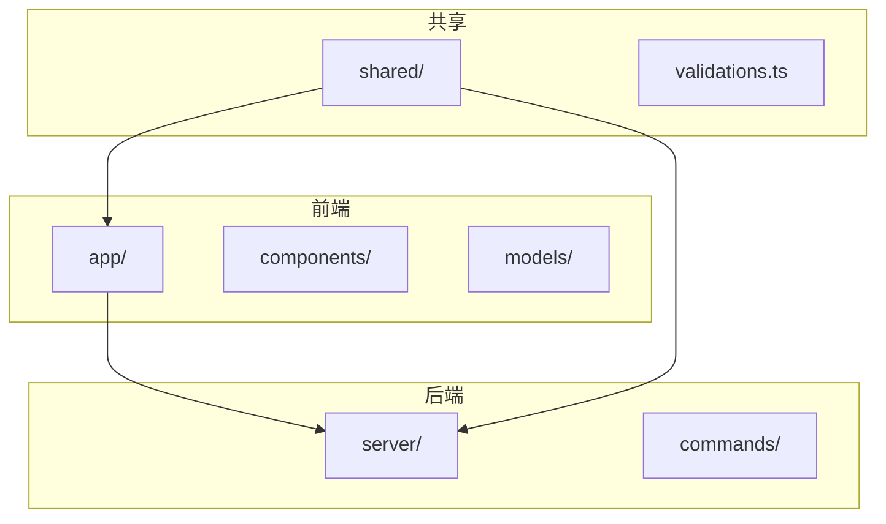
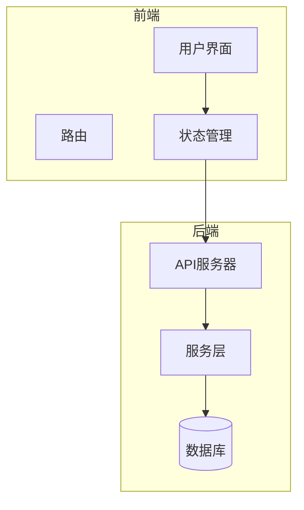
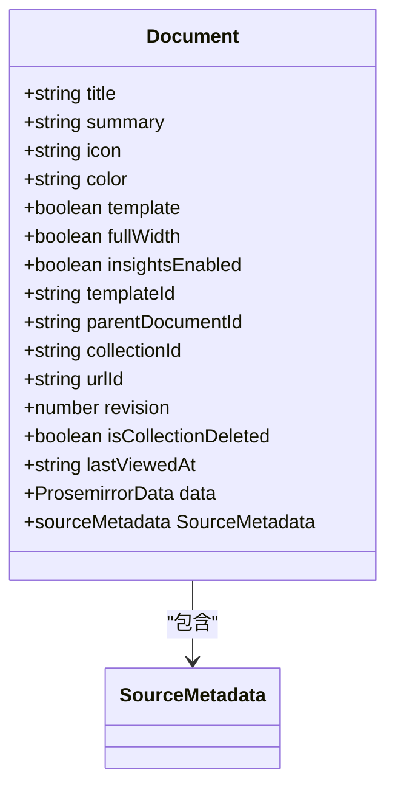
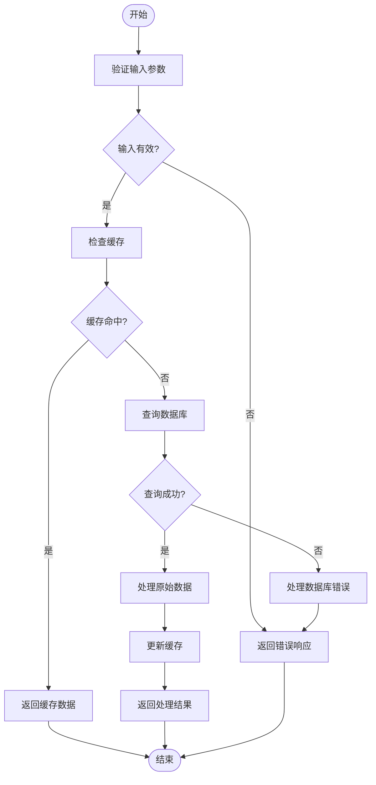
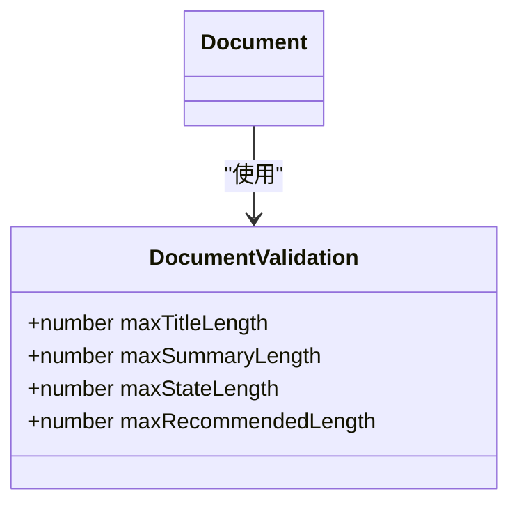
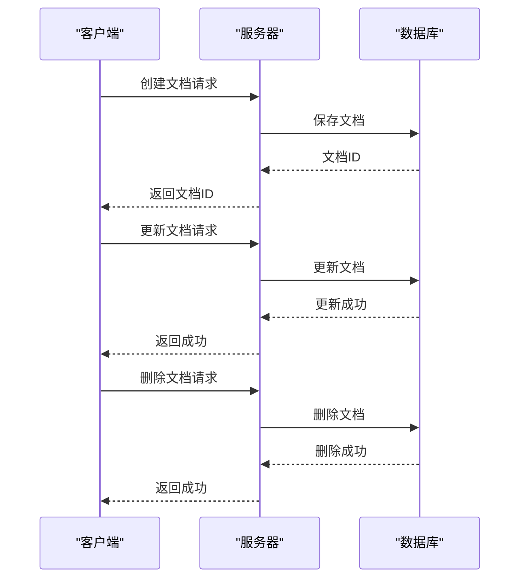
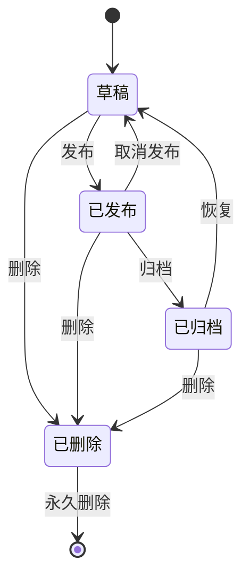
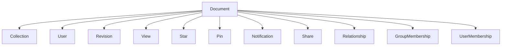

# 文档管理

<cite>
**本文档中引用的文件**  
- [Document.ts](file://app/models/Document.ts)
- [Document.ts](file://server/models/Document.ts)
- [validations.ts](file://shared/validations.ts)
- [documentCreator.ts](file://server/commands/documentCreator.ts)
- [documentUpdater.ts](file://server/commands/documentUpdater.ts)
- [DocumentMeta.tsx](file://app/components/DocumentMeta.tsx)
- [Revision.ts](file://server/models/Revision.ts)
</cite>

## 目录
1. [简介](#简介)
2. [项目结构](#项目结构)
3. [核心组件](#核心组件)
4. [架构概述](#架构概述)
5. [详细组件分析](#详细组件分析)
6. [依赖分析](#依赖分析)
7. [性能考虑](#性能考虑)
8. [故障排除指南](#故障排除指南)
9. [结论](#结论)

## 简介
本文档详细介绍了文档管理功能的实现，重点是Document模型。文档涵盖了元数据管理、内容存储机制、验证规则以及文档的生命周期管理。通过实际代码示例和详细的解释，本文档旨在为初学者提供概念性理解，同时为经验丰富的开发者提供技术细节。

## 项目结构
项目结构清晰地组织了各个组件和模块，确保了代码的可维护性和可扩展性。主要目录包括`app`、`server`、`shared`等，每个目录下都有具体的子目录和文件。

**图表来源**
- [app/models/Document.ts](file://app/models/Document.ts#L39-L703)
- [server/models/Document.ts](file://server/models/Document.ts#L94-L1314)

**章节来源**
- [app/models/Document.ts](file://app/models/Document.ts#L39-L703)
- [server/models/Document.ts](file://server/models/Document.ts#L94-L1314)

## 核心组件
核心组件包括Document模型、元数据管理、内容存储机制、验证规则和生命周期管理。这些组件共同构成了文档管理功能的基础。

**章节来源**
- [app/models/Document.ts](file://app/models/Document.ts#L39-L703)
- [server/models/Document.ts](file://server/models/Document.ts#L94-L1314)

## 架构概述
系统架构分为前端和后端两部分，前端负责用户界面和交互，后端负责数据处理和业务逻辑。共享模块包含跨平台使用的工具和验证规则。

**图表来源**
- [app/models/Document.ts](file://app/models/Document.ts#L39-L703)
- [server/models/Document.ts](file://server/models/Document.ts#L94-L1314)

## 详细组件分析
### Document模型分析
Document模型是文档管理功能的核心，包含了文档的各种属性和方法。

#### 元数据管理
Document模型通过`@Field`和`@observable`装饰器管理文档的元数据，包括标题、摘要、图标、权限等属性。

**图表来源**
- [app/models/Document.ts](file://app/models/Document.ts#L39-L703)
- [server/models/Document.ts](file://server/models/Document.ts#L94-L1314)

#### 内容存储机制
文档内容使用ProseMirror格式进行序列化与反序列化，确保内容的灵活性和可编辑性。

**图表来源**
- [app/models/Document.ts](file://app/models/Document.ts#L39-L703)
- [server/models/Document.ts](file://server/models/Document.ts#L94-L1314)

#### 验证规则
文档验证规则通过`@Length`和`@IsNumeric`等装饰器实现，确保标题长度、内容长度等约束条件。

**图表来源**
- [shared/validations.ts](file://shared/validations.ts#L0-L126)

#### 生命周期管理
文档的创建、更新、删除等生命周期管理通过`documentCreator`和`documentUpdater`等命令实现。

**图表来源**
- [server/commands/documentCreator.ts](file://server/commands/documentCreator.ts#L0-L196)
- [server/commands/documentUpdater.ts](file://server/commands/documentUpdater.ts#L0-L154)

**章节来源**
- [app/models/Document.ts](file://app/models/Document.ts#L39-L703)
- [server/models/Document.ts](file://server/models/Document.ts#L94-L1314)

### 概念概述
文档状态转换的概念性理解对于初学者非常重要。文档可以处于不同的状态，如草稿、已发布、已归档等，每种状态都有特定的行为和权限。

[无来源，因为此图表显示的是概念性工作流，而不是实际代码结构]

[无来源，因为此部分不分析特定文件]

## 依赖分析
组件之间的依赖关系通过`@Relation`和`@BelongsTo`等装饰器管理，确保了数据的一致性和完整性。

**图表来源**
- [app/models/Document.ts](file://app/models/Document.ts#L39-L703)
- [server/models/Document.ts](file://server/models/Document.ts#L94-L1314)

**章节来源**
- [app/models/Document.ts](file://app/models/Document.ts#L39-L703)
- [server/models/Document.ts](file://server/models/Document.ts#L94-L1314)

## 性能考虑
性能优化策略包括缓存机制、数据库索引和异步处理。这些策略确保了系统的高效运行和良好的用户体验。

[无来源，因为此部分提供一般性指导]

## 故障排除指南
故障排除指南包括常见的错误处理和调试技巧，帮助开发者快速定位和解决问题。

**章节来源**
- [app/components/DocumentMeta.tsx](file://app/components/DocumentMeta.tsx#L0-L239)
- [server/models/Revision.ts](file://server/models/Revision.ts#L0-L235)

## 结论
本文档详细介绍了文档管理功能的实现，涵盖了从元数据管理到生命周期管理的各个方面。通过实际代码示例和详细的解释，本文档为初学者和经验丰富的开发者提供了全面的指导。

[无来源，因为此部分总结而不分析特定文件]