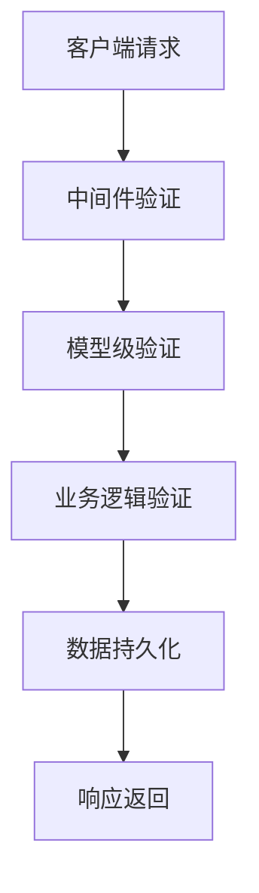
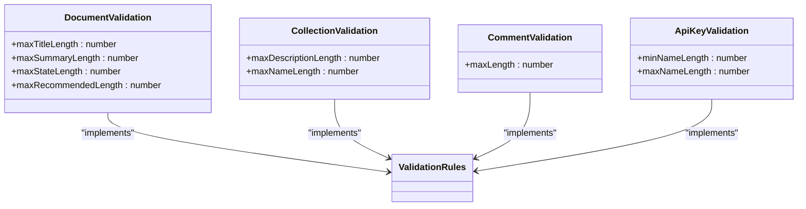
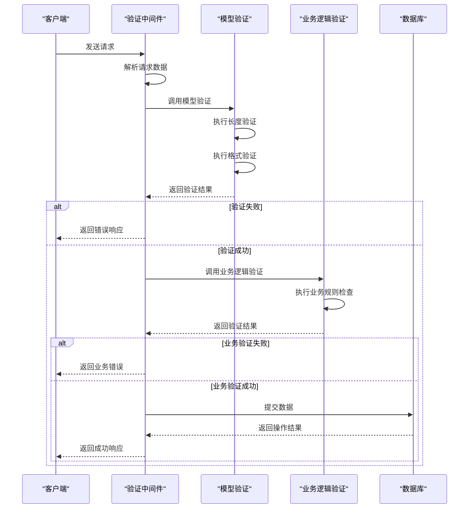
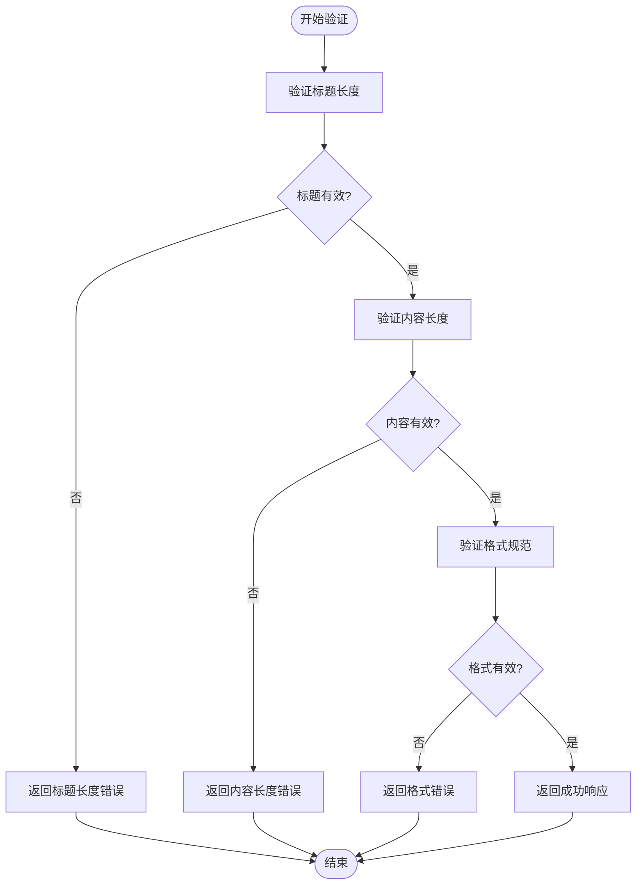

# 文档验证规则

<cite>
**本文档中引用的文件**   
- [validations.ts](file://shared/validations.ts)
- [validation.ts](file://server/validation.ts)
- [Document.ts](file://server/models/Document.ts)
- [validate.ts](file://server/middlewares/validate.ts)
- [Length.ts](file://server/models/validators/Length.ts)
</cite>

## 目录
1. [简介](#简介)
2. [验证规则分层结构](#验证规则分层结构)
3. [核心验证规则](#核心验证规则)
4. [验证流程与执行顺序](#验证流程与执行顺序)
5. [错误处理与用户反馈](#错误处理与用户反馈)
6. [性能优化与扩展性](#性能优化与扩展性)
7. [国际化支持](#国际化支持)
8. [结论](#结论)

## 简介
本文档详细介绍了文档创建和更新过程中的数据验证机制。系统实现了多层次的验证体系，确保文档数据的完整性、一致性和安全性。验证规则涵盖了标题长度、内容长度、特殊字符等多个方面，通过模型级验证和业务逻辑验证相结合的方式，为用户提供清晰的反馈和指导。

**Section sources**
- [validations.ts](file://shared/validations.ts#L0-L126)

## 验证规则分层结构
文档验证系统采用分层架构设计，包含两个主要层次：模型级验证和业务逻辑验证。模型级验证在数据持久化前进行，确保数据符合预定义的格式和约束。业务逻辑验证则在服务层执行，处理更复杂的业务规则和上下文相关的验证需求。

**Diagram sources **
- [validate.ts](file://server/middlewares/validate.ts#L5-L23)
- [Document.ts](file://server/models/Document.ts#L94-L1314)

**Section sources**
- [validation.ts](file://server/validation.ts#L0-L273)
- [Document.ts](file://server/models/Document.ts#L94-L1314)

## 核心验证规则
系统定义了多种核心验证规则，确保文档数据的质量和一致性。这些规则包括但不限于标题长度限制、内容长度限制、特殊字符检测等。验证规则通过常量定义在共享配置中，便于维护和更新。

**Diagram sources **
- [validations.ts](file://shared/validations.ts#L0-L126)

**Section sources**
- [validations.ts](file://shared/validations.ts#L0-L126)

## 验证流程与执行顺序
文档验证流程遵循严格的执行顺序，确保每个验证步骤都能正确执行。流程从客户端请求开始，经过中间件验证、模型级验证，最后到业务逻辑验证。每个步骤都有明确的职责和错误处理机制。

**Diagram sources **
- [validate.ts](file://server/middlewares/validate.ts#L5-L23)
- [validation.ts](file://server/validation.ts#L0-L273)

**Section sources**
- [validate.ts](file://server/middlewares/validate.ts#L5-L23)
- [validation.ts](file://server/validation.ts#L0-L273)

## 错误处理与用户反馈
系统提供了完善的错误处理机制，确保用户能够及时了解验证失败的原因并进行相应调整。错误信息经过精心设计，既包含技术细节又易于理解，帮助用户快速定位和解决问题。

**Diagram sources **
- [validation.ts](file://server/validation.ts#L0-L273)

**Section sources**
- [validation.ts](file://server/validation.ts#L0-L273)

## 性能优化与扩展性
为了确保验证系统的高性能和可扩展性，系统采用了多种优化策略。包括验证规则的缓存、异步验证处理、批量验证等。同时，系统设计支持自定义验证规则的扩展，便于根据业务需求添加新的验证逻辑。

**Section sources**
- [Length.ts](file://server/models/validators/Length.ts#L0-L27)
- [validation.ts](file://server/validation.ts#L0-L273)

## 国际化支持
系统内置了完整的国际化支持，确保验证错误信息能够以用户首选语言显示。通过集成i18n框架，系统能够自动检测用户语言偏好，并提供相应的本地化错误消息。

**Section sources**
- [validations.ts](file://shared/validations.ts#L0-L126)

## 结论
本文档全面介绍了文档验证规则的实现机制。通过分层验证架构、核心验证规则、严格的执行流程、完善的错误处理、性能优化策略和国际化支持，系统确保了文档数据的高质量和用户体验的流畅性。开发者可以根据本文档深入了解验证系统的内部工作原理，并在此基础上进行定制和扩展。