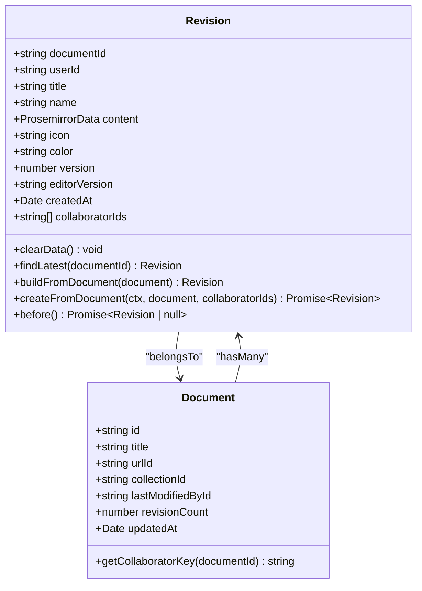
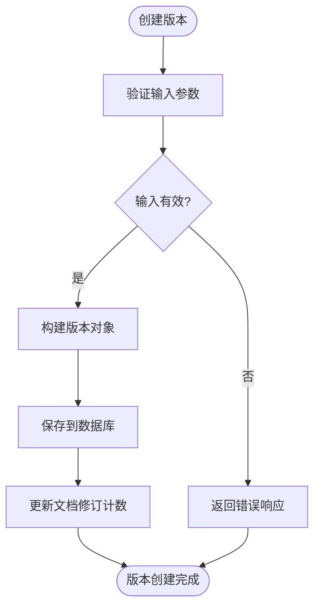
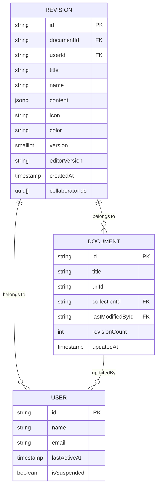

# 版本元数据

<cite>
**本文档中引用的文件**  
- [Revision.ts](file://server/models/Revision.ts)
- [Document.ts](file://server/models/Document.ts)
- [revisionCreator.ts](file://server/commands/revisionCreator.ts)
- [validations.ts](file://shared/validations.ts)
</cite>

## 目录
1. [简介](#简介)
2. [元数据结构设计](#元数据结构设计)
3. [核心字段说明](#核心字段说明)
4. [验证规则与业务逻辑](#验证规则与业务逻辑)
5. [生成、更新与查询实现](#生成更新与查询实现)
6. [实体关系图](#实体关系图)
7. [索引优化与查询性能](#索引优化与查询性能)
8. [数据隐私考虑](#数据隐私考虑)

## 简介
版本元数据是系统中用于记录文档历史变更的关键组成部分。它不仅保存了文档在特定时间点的状态快照，还包含了创建者、创建时间、版本说明和变更摘要等重要信息。通过版本元数据，用户可以追溯文档的演变过程，恢复到任意历史版本，并了解每次变更的具体内容。本文档将深入探讨版本元数据的结构设计、管理机制以及其在系统中的应用，为初学者提供概念性理解，同时为经验丰富的开发者提供技术细节。

## 元数据结构设计
版本元数据的设计基于`Revision`模型，该模型与`Document`模型存在一对多的关系。每个`Revision`实例代表文档的一个历史版本，包含文档标题、内容、图标、颜色等属性的快照。此外，`Revision`模型还记录了版本号、编辑器版本、创建者ID和创建时间等元数据字段。这种设计确保了即使原始文档被修改或删除，其历史版本仍然可以被完整地恢复和查看。

**图示来源**
- [Revision.ts](file://server/models/Revision.ts#L23-L232)
- [Document.ts](file://server/models/Document.ts#L94-L1314)

## 核心字段说明
版本元数据的核心字段包括创建者、创建时间、版本说明和变更摘要。创建者字段（`userId`）记录了生成该版本的用户ID，确保了责任可追溯。创建时间字段（`createdAt`）精确到毫秒，提供了版本的时间戳。版本说明字段（`name`）允许用户为特定版本添加描述性名称，便于识别和管理。变更摘要字段虽然未直接体现在`Revision`模型中，但可以通过比较相邻版本的内容差异来生成，帮助用户快速了解变更内容。

**章节来源**
- [Revision.ts](file://server/models/Revision.ts#L42-L50)

## 验证规则与业务逻辑
为了确保版本元数据的完整性和一致性，系统实施了一系列验证规则和业务逻辑。例如，`Revision`模型中的`title`字段受到`Length`验证器的约束，最大长度不得超过100个字符。同样，`name`字段的最大长度限制为255个字符。这些规则定义在`shared/validations.ts`文件中，确保了数据的一致性和可靠性。此外，`Revision`模型的`beforeDestroy`钩子会在删除操作前清除敏感数据，如内容和文本字段，以保护用户隐私。

**图示来源**
- [Revision.ts](file://server/models/Revision.ts#L100-L120)
- [validations.ts](file://shared/validations.ts#L44-L44)

## 生成、更新与查询实现
版本元数据的生成、更新和查询主要通过`Revision`模型的静态方法实现。`buildFromDocument`方法从`Document`模型构建一个`Revision`实例，复制文档的当前状态。`createFromDocument`方法则在此基础上，将新构建的`Revision`实例保存到数据库中。查询最新版本的功能由`findLatest`方法提供，它根据`documentId`查找最新的`Revision`记录。这些方法的实现确保了版本管理的高效性和可靠性。

**章节来源**
- [Revision.ts](file://server/models/Revision.ts#L100-L140)

## 实体关系图
版本元数据与其他系统组件之间的关系可以通过实体关系图来清晰地展示。`Revision`实体与`Document`实体之间存在外键关系，`documentId`字段作为连接点。此外，`Revision`实体还与`User`实体关联，通过`userId`字段记录创建者信息。这种设计不仅支持复杂的查询操作，还保证了数据的完整性和一致性。

**图示来源**
- [Revision.ts](file://server/models/Revision.ts#L23-L232)
- [Document.ts](file://server/models/Document.ts#L94-L1314)
- [User.ts](file://server/models/User.ts#L81-L856)

## 索引优化与查询性能
为了提高查询性能，系统对关键字段进行了索引优化。例如，`Revision`表的`documentId`和`createdAt`字段都建立了索引，这使得按文档ID和创建时间排序的查询操作更加高效。此外，`Document`表的`urlId`字段也建立了唯一索引，确保了URL的唯一性。这些索引策略显著提升了系统的响应速度，特别是在处理大量数据时。

**章节来源**
- [Revision.ts](file://server/models/Revision.ts#L30-L35)
- [Document.ts](file://server/models/Document.ts#L150-L155)

## 数据隐私考虑
在设计版本元数据管理系统时，数据隐私是一个重要的考虑因素。系统通过多种方式保护用户数据的隐私。首先，`Revision`模型的`beforeDestroy`钩子会在删除操作前清除敏感数据，防止数据泄露。其次，系统使用`ParanoidModel`基类，实现了软删除功能，即删除操作实际上只是将`deletedAt`字段设置为当前时间，而不是物理删除记录。这为数据恢复提供了可能，同时也减少了意外删除的风险。

**章节来源**
- [Revision.ts](file://server/models/Revision.ts#L80-L85)
- [Document.ts](file://server/models/Document.ts#L344-L345)