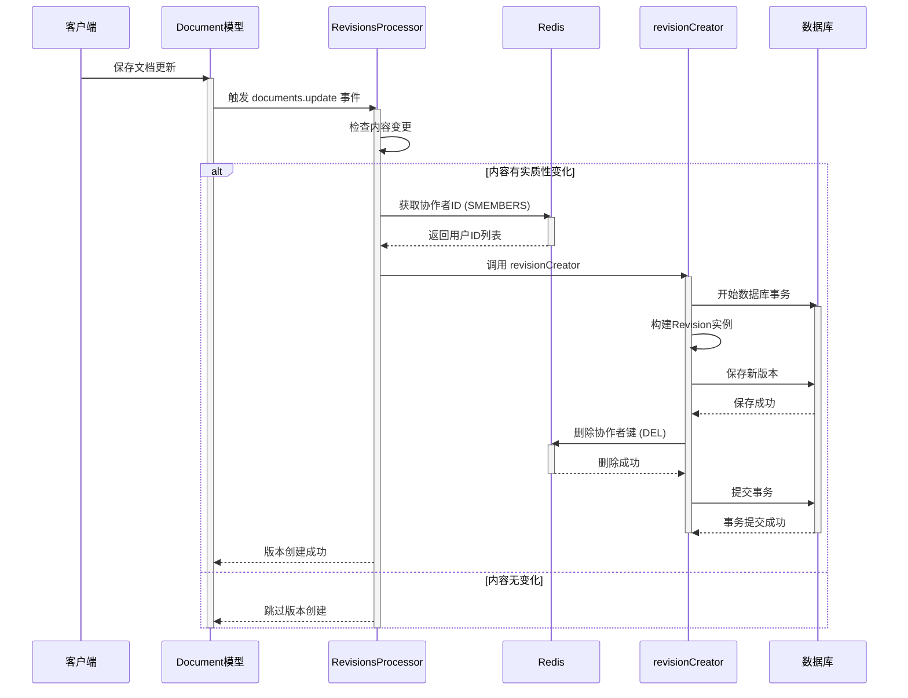

# 版本创建

<cite>
**本文档引用的文件**  
- [Revision.ts](file://server/models/Revision.ts)
- [Document.ts](file://server/models/Document.ts)
- [revisionCreator.ts](file://server/commands/revisionCreator.ts)
- [RevisionsProcessor.ts](file://server/queues/processors/RevisionsProcessor.ts)
- [RevisionCreatedNotificationsTask.ts](file://server/queues/tasks/RevisionCreatedNotificationsTask.ts)
- [revisions.ts](file://server/routes/api/revisions/revisions.ts)
</cite>

## 目录
1. [简介](#简介)
2. [版本创建机制](#版本创建机制)
3. [Revision模型与Document模型的关系](#revision模型与document模型的关系)
4. [版本创建的触发条件](#版本创建的触发条件)
5. [版本数据的存储结构](#版本数据的存储结构)
6. [版本创建流程](#版本创建流程)
7. [性能优化与大文档处理](#性能优化与大文档处理)
8. [事务处理与数据一致性](#事务处理与数据一致性)
9. [序列图：版本创建完整流程](#序列图版本创建完整流程)
10. [结论](#结论)

## 简介
本文档详细介绍了系统中版本创建机制的实现。重点阐述了`Revision`模型的设计及其与`Document`模型的关系。文档解释了版本创建的触发条件（文档更新时自动创建版本）、版本数据的存储结构（包括标题、内容、摘要等快照），以及版本创建的完整流程。同时，文档还涵盖了性能优化策略、事务处理和数据一致性保证，为初学者提供概念性理解，并为经验丰富的开发者提供技术细节。

**Section sources**
- [Revision.ts](file://server/models/Revision.ts#L23-L232)
- [Document.ts](file://server/models/Document.ts#L94-L1314)

## 版本创建机制
版本创建机制是系统中用于追踪文档历史变更的核心功能。每当文档内容或元数据发生更新时，系统会自动创建一个`Revision`（版本）记录，该记录捕获了文档在特定时间点的完整状态快照。这种机制确保了文档变更的可追溯性，允许用户回溯到任意历史版本。

版本创建由事件驱动，主要由`RevisionsProcessor`处理器监听文档相关的事件（如`documents.update`、`documents.publish`）来触发。当检测到符合条件的事件时，处理器会调用`revisionCreator`命令来创建新的版本。

**Section sources**
- [RevisionsProcessor.ts](file://server/queues/processors/RevisionsProcessor.ts#L14-L55)
- [revisionCreator.ts](file://server/commands/revisionCreator.ts#L6-L32)

## Revision模型与Document模型的关系
`Revision`模型与`Document`模型之间存在紧密的关联。`Revision`模型通过外键`documentId`与`Document`模型建立`BelongsTo`（属于）关系，表示一个版本属于一个特定的文档。

### Revision模型属性
`Revision`模型存储了文档在创建版本时的完整快照，其主要属性包括：
- `documentId`: 关联的文档ID。
- `title`: 创建版本时的文档标题。
- `name`: 版本的可选名称。
- `content`: 以JSON格式存储的Prosemirror内容快照。
- `icon`: 创建版本时的文档图标。
- `color`: 图标的颜色。
- `html`: 与前一个版本相比的HTML格式差异。
- `userId`: 创建此版本的用户ID。
- `collaboratorIds`: 协作此版本的用户ID数组。
- `createdAt`: 版本创建的时间戳。

### Document模型属性
`Document`模型是文档的主模型，其关键属性与版本创建相关：
- `revisionCount`: 记录文档的版本总数，每次更新时递增。
- `lastModifiedById`: 最后修改文档的用户ID，用于确定版本的创建者。
- `collaboratorIds`: 协作此文档的用户ID数组，在每次更新时更新。

**Section sources**
- [Revision.ts](file://server/models/Revision.ts#L23-L232)
- [Document.ts](file://server/models/Document.ts#L94-L1314)

## 版本创建的触发条件
版本创建主要在以下两种情况下被触发：
1. **文档更新**：当文档内容或元数据（如标题、图标）被保存时，会触发`documents.update`事件。`RevisionsProcessor`会监听此事件，并在更新完成后创建一个新版本。
2. **文档发布**：当一个草稿文档被发布到集合中时，会触发`documents.publish`事件，同样会创建一个初始版本。

值得注意的是，系统会进行智能判断以避免创建冗余版本。`RevisionsProcessor`在创建新版本前，会检查当前文档状态与最新版本的`content`和`title`是否完全相同。如果内容没有实质性变化，则不会创建新版本，从而优化性能和存储。

**Section sources**
- [RevisionsProcessor.ts](file://server/queues/processors/RevisionsProcessor.ts#L14-L55)
- [Document.ts](file://server/models/Document.ts#L94-L1314)

## 版本数据的存储结构
版本数据的存储结构旨在高效地保存文档的历史状态。`Revision`模型使用以下字段来存储快照：
- **内容存储**：`content`字段使用`JSONB`类型存储Prosemirror的JSON数据，这是内容的主要表示形式。`text`字段（已弃用）曾用于存储Markdown，但未来将被移除。
- **元数据存储**：`title`、`icon`、`color`等字段直接存储文档的元数据快照。
- **性能优化**：`html`字段存储了与前一版本的差异，这使得在UI中展示变更历史时无需实时计算，提升了用户体验。

这种结构确保了每个版本都是一个独立、完整的文档状态快照，不依赖于其他版本即可恢复文档。

**Section sources**
- [Revision.ts](file://server/models/Revision.ts#L23-L232)

## 版本创建流程
版本创建的完整流程如下：

1. **事件触发**：用户更新文档，触发`documents.update`事件。
2. **事件处理**：`RevisionsProcessor`监听到事件。
3. **变更检测**：处理器获取当前文档和最新版本，使用`fast-deep-equal`库进行深度比较，判断内容是否有实质性变化。
4. **协作ID获取**：从Redis中获取自上一个版本以来所有协作此文档的用户ID。
5. **事务开始**：启动一个数据库事务以保证数据一致性。
6. **构建版本**：调用`Revision.buildFromDocument()`方法，从当前`Document`模型的属性构建一个新的`Revision`模型实例。
7. **保存版本**：调用`Revision.createFromDocument()`方法，将新版本保存到数据库。
8. **清理Redis**：删除用于存储协作ID的Redis键。
9. **事务提交**：如果所有步骤成功，提交事务。

**Section sources**
- [revisionCreator.ts](file://server/commands/revisionCreator.ts#L6-L32)
- [Revision.ts](file://server/models/Revision.ts#L170-L214)

## 性能优化与大文档处理
系统通过多种策略来优化版本创建的性能，特别是针对大文档：

1. **变更阈值检测**：在创建版本前，系统会比较当前文档与最新版本的内容。只有当变更超过一定阈值时才会创建新版本，避免了对微小编辑（如空格调整）创建版本。
2. **Redis缓存协作信息**：使用Redis临时存储文档的协作用户ID，避免了在高并发编辑场景下频繁查询数据库。
3. **异步处理**：版本创建过程（如`DocumentUpdateTextTask`）被设计为异步任务，避免阻塞主更新流程。
4. **预计算差异**：`html`字段在版本创建时就计算好与前一版本的差异，避免了在用户查看历史时进行实时计算。

**Section sources**
- [RevisionsProcessor.ts](file://server/queues/processors/RevisionsProcessor.ts#L14-L55)
- [RevisionCreatedNotificationsTask.ts](file://server/queues/tasks/RevisionCreatedNotificationsTask.ts#L21-L229)

## 事务处理与数据一致性
数据一致性通过数据库事务得到严格保证。`revisionCreator`函数使用`sequelize.transaction`包装整个创建过程。这意味着，从获取协作ID、构建版本到最终保存，所有操作都在同一个事务中执行。如果其中任何一步失败（例如数据库连接中断），整个事务将被回滚，确保数据库不会处于不一致的状态。

**Diagram sources**
- [revisionCreator.ts](file://server/commands/revisionCreator.ts#L6-L32)
- [RevisionsProcessor.ts](file://server/queues/processors/RevisionsProcessor.ts#L14-L55)
- [Revision.ts](file://server/models/Revision.ts#L23-L232)

## 序列图：版本创建完整流程
上述序列图详细展示了从用户保存文档到新版本成功创建的完整流程。它清晰地描绘了客户端、文档模型、处理器、Redis和数据库之间的交互，以及事务和条件判断的执行逻辑。

**Section sources**
- [revisionCreator.ts](file://server/commands/revisionCreator.ts#L6-L32)
- [RevisionsProcessor.ts](file://server/queues/processors/RevisionsProcessor.ts#L14-L55)

## 结论
本文档全面解析了系统的版本创建机制。通过`Revision`模型对`Document`模型的快照式存储，系统实现了强大的文档历史追踪功能。该机制由事件驱动，通过智能的变更检测和Redis缓存优化了性能，并利用数据库事务确保了数据的一致性。对于开发者而言，理解这一流程有助于进行故障排查和功能扩展；对于所有用户而言，这一机制提供了安全、可靠的文档版本管理体验。