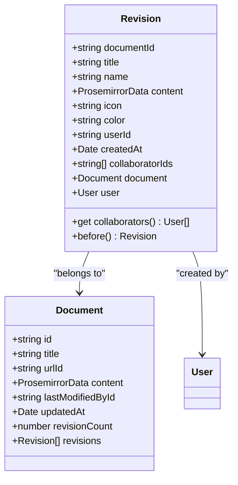
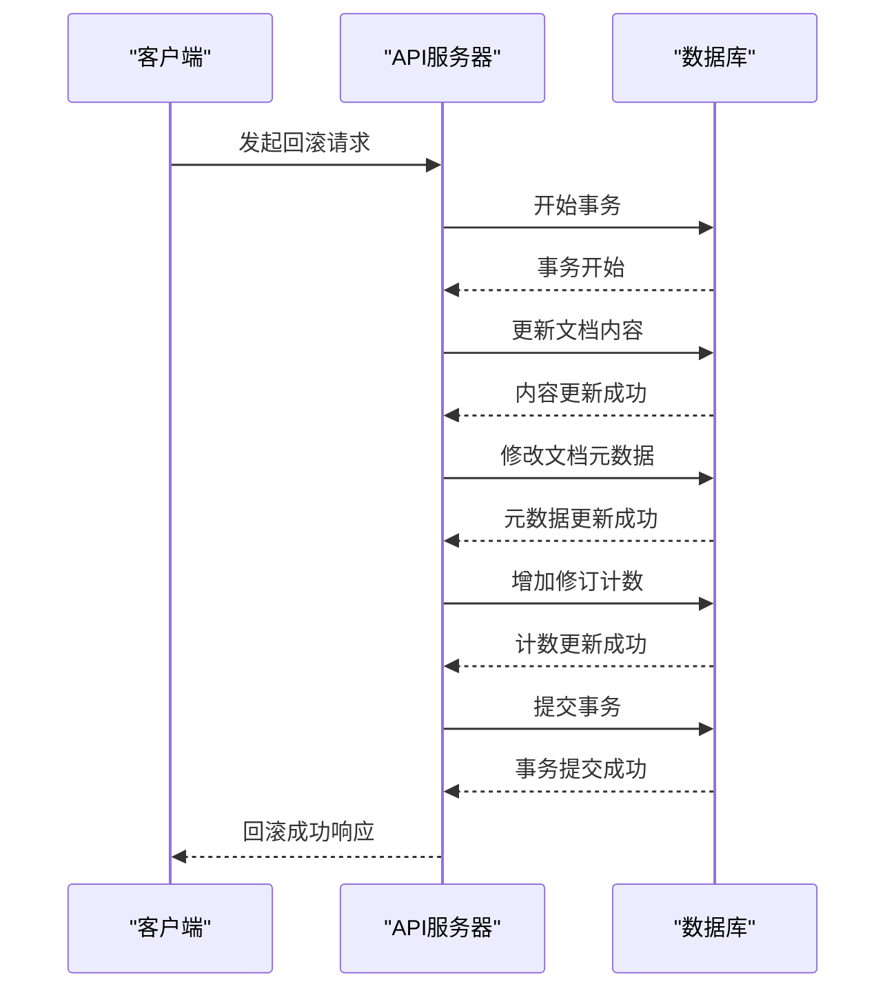
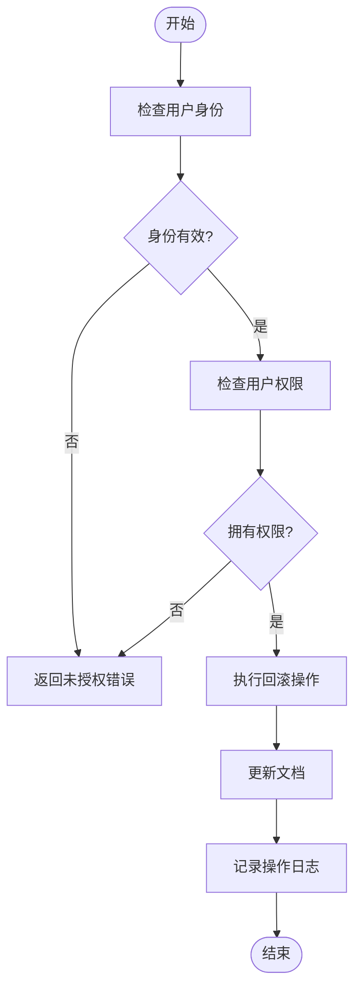
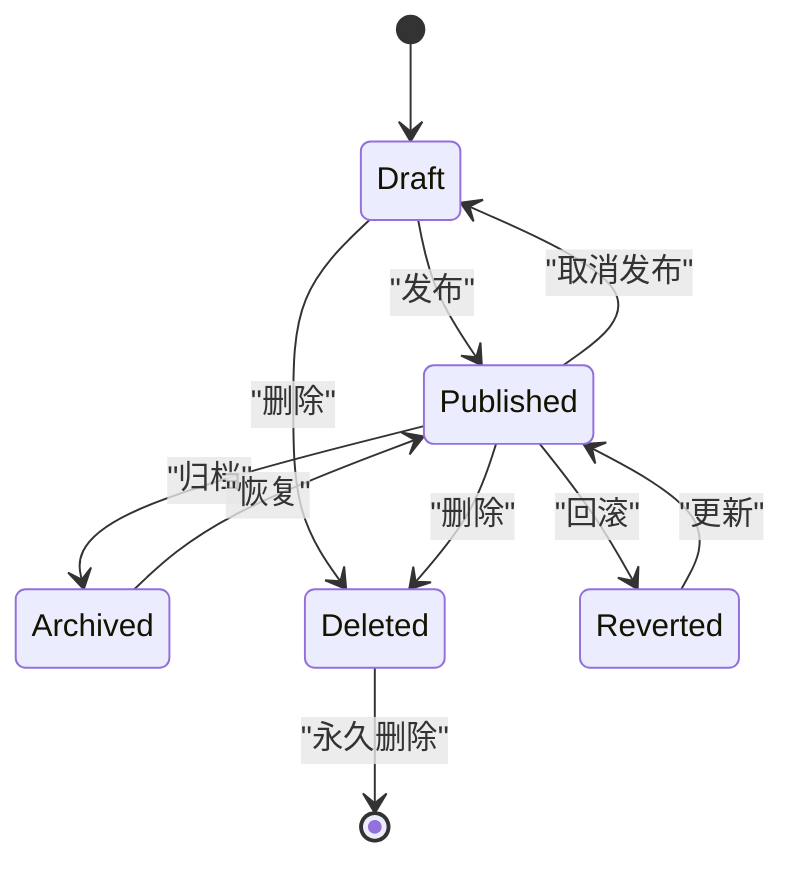

# 版本回滚

<cite>
**本文档中引用的文件**   
- [Revision.ts](file://server/models/Revision.ts)
- [revisionCreator.ts](file://server/commands/revisionCreator.ts)
- [Document.ts](file://server/models/Document.ts)
- [revisions.ts](file://server/routes/api/revisions/revisions.ts)
- [RevisionsStore.ts](file://app/stores/RevisionsStore.ts)
- [RevisionMenu.tsx](file://app/menus/RevisionMenu.tsx)
</cite>

## 目录
1. [简介](#简介)
2. [版本回滚机制](#版本回滚机制)
3. [事务处理与数据一致性](#事务处理与数据一致性)
4. [权限验证机制](#权限验证机制)
5. [审计日志记录](#审计日志记录)
6. [前端调用与API处理](#前端调用与api处理)
7. [后端持久化实现](#后端持久化实现)
8. [错误处理与并发冲突解决](#错误处理与并发冲突解决)
9. [性能优化策略](#性能优化策略)
10. [状态转换图](#状态转换图)

## 简介
版本回滚功能允许用户将文档恢复到先前的版本，确保文档历史的可追溯性和数据的安全性。该功能通过创建文档的快照（即修订版本）来实现，每个快照都包含文档在特定时间点的内容、标题、图标和颜色等信息。当用户执行回滚操作时，系统会将文档恢复到指定的修订版本，同时记录此次操作的详细信息。

**Section sources**
- [Revision.ts](file://server/models/Revision.ts#L23-L232)
- [Document.ts](file://server/models/Document.ts#L94-L1314)

## 版本回滚机制
版本回滚的核心是修订版本（Revision）的管理。每当文档被更新时，系统会自动创建一个新的修订版本，并将其与原始文档关联。修订版本不仅保存了文档的内容，还记录了创建该版本的用户、创建时间以及协作编辑者的信息。用户可以通过界面选择任意一个历史版本进行回滚，系统将根据所选版本的数据恢复文档。

**Diagram sources **
- [Revision.ts](file://server/models/Revision.ts#L23-L232)
- [Document.ts](file://server/models/Document.ts#L94-L1314)

**Section sources**
- [Revision.ts](file://server/models/Revision.ts#L23-L232)
- [Document.ts](file://server/models/Document.ts#L94-L1314)

## 事务处理与数据一致性
为了确保回滚操作的原子性和数据一致性，系统采用了数据库事务机制。当用户发起回滚请求时，服务器会在一个事务中执行所有必要的操作，包括更新文档内容、修改文档元数据以及增加修订计数。如果在事务执行过程中发生任何错误，整个事务将被回滚，从而保证数据的一致性。

**Diagram sources **
- [revisions.ts](file://server/routes/api/revisions/revisions.ts#L131-L183)
- [Document.ts](file://server/models/Document.ts#L94-L1314)

**Section sources**
- [revisions.ts](file://server/routes/api/revisions/revisions.ts#L131-L183)
- [Document.ts](file://server/models/Document.ts#L94-L1314)

## 权限验证机制
为了防止未经授权的用户执行回滚操作，系统实施了严格的权限验证机制。只有具有相应权限的用户才能访问和操作文档的修订版本。具体来说，用户必须具备“listRevisions”和“update”权限才能查看和恢复文档的历史版本。这些权限由系统的策略引擎（Policy Engine）动态计算并应用于每个请求。

**Diagram sources **
- [revisions.ts](file://server/routes/api/revisions/revisions.ts#L131-L183)
- [Document.ts](file://server/models/Document.ts#L94-L1314)

**Section sources**
- [revisions.ts](file://server/routes/api/revisions/revisions.ts#L131-L183)
- [Document.ts](file://server/models/Document.ts#L94-L1314)

## 审计日志记录
每次回滚操作都会被详细记录在审计日志中，以便后续追踪和审查。日志条目包含了操作的时间戳、执行用户的ID、目标文档的ID以及回滚前后的版本信息。这些信息对于维护系统的安全性和合规性至关重要。

**Section sources**
- [revisions.ts](file://server/routes/api/revisions/revisions.ts#L131-L183)
- [Document.ts](file://server/models/Document.ts#L94-L1314)

## 前端调用与API处理
前端通过调用API接口来触发回滚操作。用户在界面上选择要恢复的版本后，前端会发送一个POST请求到`/revisions.info`端点，携带文档ID或修订版本ID作为参数。API服务器接收到请求后，会验证用户权限并返回相应的修订版本信息。随后，前端可以使用这些信息来预览或确认回滚操作。

**Section sources**
- [revisions.ts](file://server/routes/api/revisions/revisions.ts#L24-L64)
- [RevisionsStore.ts](file://app/stores/RevisionsStore.ts#L5-L28)

## 后端持久化实现
后端通过Sequelize ORM框架与数据库交互，实现了修订版本的持久化存储。每当文档被更新时，`revisionCreator`命令会被调用，它负责创建新的修订版本并将其实体保存到数据库中。此外，系统还利用Redis缓存协作编辑者的ID，以提高性能和响应速度。

**Section sources**
- [revisionCreator.ts](file://server/commands/revisionCreator.ts#L6-L32)
- [Revision.ts](file://server/models/Revision.ts#L23-L232)

## 错误处理与并发冲突解决
在处理回滚请求时，系统会捕获并妥善处理各种可能的错误，如网络中断、数据库连接失败等。对于并发冲突，系统采用乐观锁机制来避免数据覆盖问题。当多个用户同时尝试修改同一文档时，后提交的更改将被拒绝，并提示用户重新加载最新版本后再进行编辑。

**Section sources**
- [revisions.ts](file://server/routes/api/revisions/revisions.ts#L131-L183)
- [Document.ts](file://server/models/Document.ts#L94-L1314)

## 性能优化策略
为了提升用户体验，系统采取了一系列性能优化措施。例如，通过分页查询减少单次请求的数据量；利用缓存技术加速频繁访问的数据读取；以及异步处理耗时较长的操作，确保主线程的流畅运行。此外，系统还会定期清理过期的修订版本，以释放存储空间。

**Section sources**
- [revisions.ts](file://server/routes/api/revisions/revisions.ts#L131-L183)
- [Document.ts](file://server/models/Document.ts#L94-L1314)

## 状态转换图
以下状态图展示了文档在不同操作下的状态转换过程，包括创建、更新、回滚和删除等关键事件。

**Diagram sources **
- [Document.ts](file://server/models/Document.ts#L94-L1314)

**Section sources**
- [Document.ts](file://server/models/Document.ts#L94-L1314)