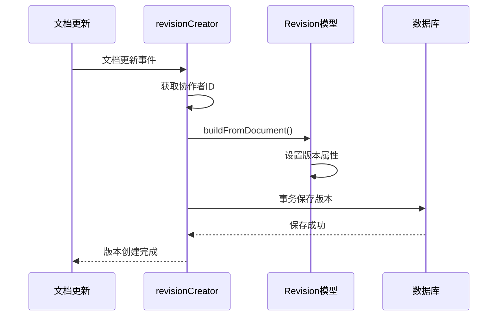
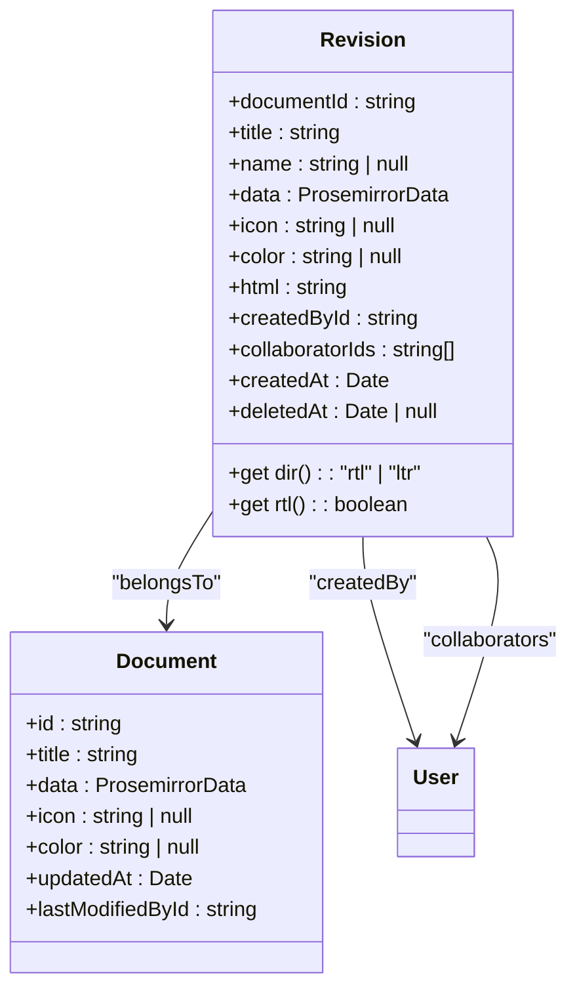
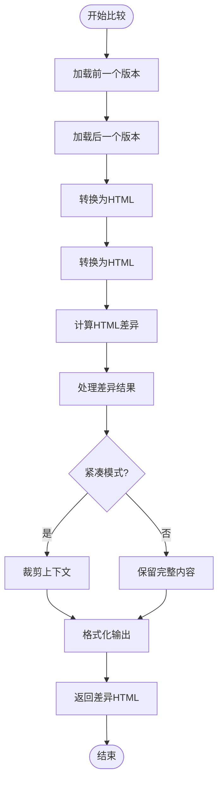

# 版本控制

<cite>
**本文档中引用的文件**   
- [Revision.ts](file://app/models/Revision.ts)
- [Document.ts](file://app/models/Document.ts)
- [revisionCreator.ts](file://server/commands/revisionCreator.ts)
- [revisions.ts](file://server/routes/api/revisions/revisions.ts)
- [DocumentHelper.tsx](file://server/models/helpers/DocumentHelper.tsx)
- [RevisionsStore.ts](file://app/stores/RevisionsStore.ts)
- [RevisionListItem.tsx](file://app/components/RevisionListItem.tsx)
- [History.tsx](file://app/scenes/Document/components/History.tsx)
</cite>

## 目录
1. [简介](#简介)
2. [核心组件](#核心组件)
3. [版本创建流程](#版本创建流程)
4. [版本数据结构](#版本数据结构)
5. [版本比较算法](#版本比较算法)
6. [版本元数据管理](#版本元数据管理)
7. [版本回滚与历史查看](#版本回滚与历史查看)
8. [性能与数据一致性](#性能与数据一致性)
9. [结论](#结论)

## 简介
版本控制功能为文档提供完整的变更历史记录，允许用户追踪文档的演变过程。系统在文档更新时自动创建版本快照，存储文档标题、内容、图标等关键信息。每个版本都包含丰富的元数据，如创建者、创建时间、协作成员等。通过版本比较功能，用户可以直观地查看文档内容的差异。系统还支持版本回滚操作，使用户能够恢复到任意历史状态。本文档详细介绍了版本控制功能的实现机制和技术细节。

## 核心组件

版本控制功能主要由以下几个核心组件构成：Revision模型、Document模型、版本创建命令、版本存储库和API路由。Revision模型定义了版本数据的结构和行为，Document模型与版本系统紧密集成，版本创建命令负责在文档更新时触发版本创建，版本存储库管理客户端的版本数据，API路由提供版本相关的REST接口。

**Section sources**
- [Revision.ts](file://app/models/Revision.ts#L9-L67)
- [Document.ts](file://app/models/Document.ts#L39-L703)
- [revisionCreator.ts](file://server/commands/revisionCreator.ts#L15-L31)
- [RevisionsStore.ts](file://app/stores/RevisionsStore.ts#L5-L28)

## 版本创建流程

版本创建流程在文档更新时自动触发，确保每次变更都被记录。当文档内容发生变化时，系统会调用版本创建命令，生成新的版本快照。这个过程通过事务处理保证数据一致性，并在后台异步执行以提高性能。

**Diagram sources**
- [revisionCreator.ts](file://server/commands/revisionCreator.ts#L15-L31)
- [Revision.ts](file://server/models/Revision.ts#L23-L219)

**Section sources**
- [revisionCreator.ts](file://server/commands/revisionCreator.ts#L15-L31)
- [Revision.ts](file://server/models/Revision.ts#L23-L219)

## 版本数据结构

版本数据结构设计用于存储文档在特定时间点的完整快照。每个版本记录了文档的关键属性，包括标题、内容、图标、颜色等。版本还包含HTML格式的差异表示，用于快速显示与前一版本的变更。系统使用Prosemirror数据格式存储内容，确保富文本信息的完整保留。

**Diagram sources**
- [Revision.ts](file://app/models/Revision.ts#L9-L67)
- [Document.ts](file://app/models/Document.ts#L39-L703)

**Section sources**
- [Revision.ts](file://app/models/Revision.ts#L9-L67)
- [Document.ts](file://app/models/Document.ts#L39-L703)

## 版本比较算法

版本比较算法通过生成HTML差异来可视化文档变更。系统首先将两个版本的内容转换为HTML格式，然后使用差异算法计算变更。结果以标准的差异标记（插入、删除）呈现，使用户能够清晰地识别修改内容。算法还支持紧凑模式，只显示变更部分和上下文，提高可读性。

**Diagram sources**
- [DocumentHelper.tsx](file://server/models/helpers/DocumentHelper.tsx#L379-L497)
- [revisions.ts](file://server/routes/api/revisions/revisions.ts#L131-L183)

**Section sources**
- [DocumentHelper.tsx](file://server/models/helpers/DocumentHelper.tsx#L379-L497)
- [revisions.ts](file://server/routes/api/revisions/revisions.ts#L131-L183)

## 版本元数据管理

版本元数据管理包括创建者、创建时间、版本说明等信息的存储和访问。每个版本都关联到创建它的用户，并记录精确的时间戳。系统还支持可选的版本名称，便于用户识别重要版本。协作者列表记录了参与该版本修改的所有用户，提供完整的协作历史。

**Section sources**
- [Revision.ts](file://app/models/Revision.ts#L9-L67)
- [Revision.ts](file://server/models/Revision.ts#L23-L219)
- [presenters/revision.ts](file://server/presenters/revision.ts#L6-L27)

## 版本回滚与历史查看

版本回滚与历史查看功能允许用户浏览文档的完整历史并恢复到任意版本。历史查看界面整合了版本和事件，按时间倒序排列。版本回滚通过创建新版本实现，将文档状态恢复到指定历史版本的内容，同时保留完整的变更历史。

**Section sources**
- [RevisionsStore.ts](file://app/stores/RevisionsStore.ts#L5-L28)
- [RevisionListItem.tsx](file://app/components/RevisionListItem.tsx#L24-L27)
- [History.tsx](file://app/scenes/Document/components/History.tsx#L93-L126)

## 性能与数据一致性

系统通过多种机制确保版本控制的性能和数据一致性。版本创建在事务中执行，保证原子性。协作者ID通过Redis临时存储，在版本创建时批量获取，减少数据库查询。系统还实现了智能加载策略，只在需要时获取版本内容，优化前端性能。

**Section sources**
- [revisionCreator.ts](file://server/commands/revisionCreator.ts#L15-L31)
- [DocumentHelper.tsx](file://server/models/helpers/DocumentHelper.tsx#L379-L497)
- [RevisionsStore.ts](file://app/stores/RevisionsStore.ts#L5-L28)

## 结论
版本控制功能为文档协作提供了强大的历史追踪能力。通过自动化的版本创建、高效的差异计算和直观的历史浏览界面，用户可以轻松管理文档的演变过程。系统的架构设计平衡了功能完整性与性能要求，确保在大规模使用场景下的稳定性和响应速度。未来可以考虑增加版本分支、合并等功能，进一步增强版本控制能力。